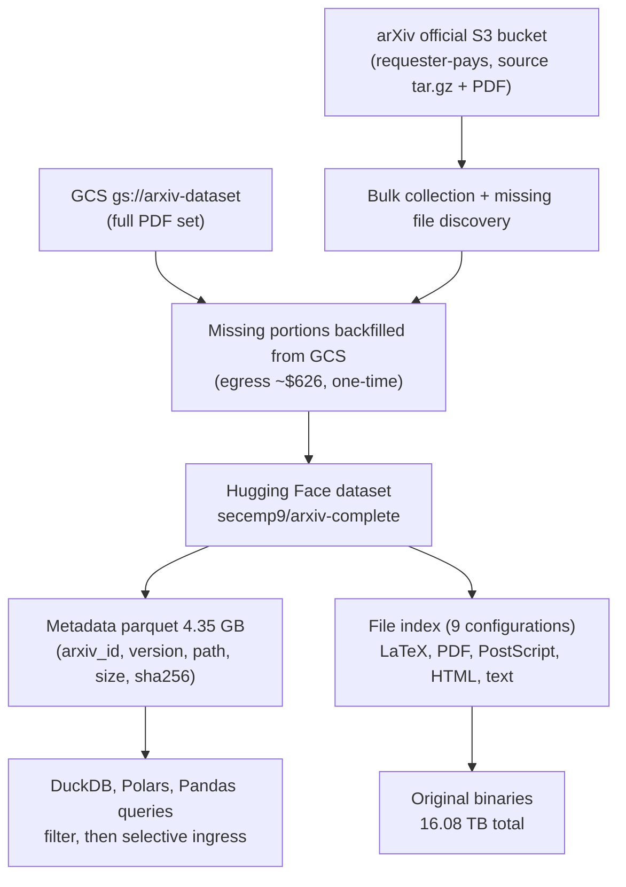

## Why read this

If you build RAG systems on top of the arXiv corpus, prepare continued pretraining or SFT sources, or track paper version history, this post is the reference you need. In late September 2026, secemp9 published [arxiv-complete](https://huggingface.co/datasets/secemp9/arxiv-complete) on Hugging Face: a roughly 16.08 TB snapshot of the entire arXiv, all 3,148,796 papers, every version, in LaTeX, PDF, PostScript, and HTML. The core takeaway up front. The value of this dataset is provenance, not size. Files that were genuinely missing from the official arXiv S3 bucket were found and backfilled from GCS during collection, and every file now carries a path, size, and SHA-256. The whole archive is queryable through a single parquet layer. Most workloads never need the full corpus, but many do need the entire archive in a verifiable state.


*Conceptualizing the entire arXiv corpus packaged as a single dataset.*

## Overview

Bulk access to arXiv data has always come in three flavors. The official S3 bucket is open on a requester-pays basis, and arXiv's own documentation calls it the canonical path for full-corpus downloads. It holds the source files (TeX/LaTeX, tar.gz) and the processed PDFs. GCS hosts the gs://arxiv-dataset bucket with the full PDF set, also accessible from Kaggle environments. The remaining path pulls papers one by one through the API, which stops being realistic at 3.15 million papers.

Hugging Face already had arXiv mirror datasets. Their coverage and shape differed, though. [arxiv-community/arxiv_dataset](https://huggingface.co/datasets/arxiv-community/arxiv_dataset) is a JSON-metadata-centric mirror over 1.1 TB in size, but it does not hold the full body files. [scholarweave/arxiv-latex](https://huggingface.co/datasets/scholarweave/arxiv-latex) pre-parses LaTeX sources into parquet. [neuralwork/arxiver](https://huggingface.co/datasets/neuralwork/arxiver) stops at papers from January to October 2023. Demand existed for metadata alone, for LaTeX alone, for recent windows alone, but there was no place to get the full archive with every version, original formats, and verifiable provenance in one pull.

arxiv-complete fills exactly that place. The dataset card describes itself as a snapshot of "arXiv's metadata, version history, submission files, and rendered documents." It was published around September 19 to 20, 2026 (per coverage), and the card's like count passed 44 within two days of release. This post walks through the composition and schema, the incompleteness of the official S3 bucket that surfaced during collection, and the differences from existing mirrors, with real numbers. It closes with application angles from ThakiCloud's perspective.

## What this dataset is

### Scale and composition

Card-based figures, organized:

| Item | Value | Notes |
|---|---|---|
| Papers | 3,148,796 | All versions included |
| Total size | 16,076,056,758,128 bytes (about 16.08 TB) | Sum across 9 configurations |
| PDF portion | 8.65 TB | Per coverage |
| Metadata parquet | 4.35 GB | Query starting point |
| Raw content described by the files field | 22,571,129,586,192 bytes (about 22.57 TB) | Includes indexed unpublished HTML |
| Formats | LaTeX, PDF, PostScript, HTML, extracted text | Submission originals plus rendered documents |

The total size being smaller than the raw content described in the files field is because the card does not inline every file binary. It describes them through metadata and an index. Which file sits where, how large it is, and what its hash is all live in the parquet; the actual binaries are accessed separately.

### Schema (as reported)

The metadata parquet fields are reported as follows, based on coverage and card citations.

| Field | Contents | Example |
|---|---|---|
| `arxiv_id` | Paper identifier | `0704.0001` |
| `version` | Paper version | `v1`, `v2` |
| `source` | File type | `source`, `pdf`, `ps` |
| `path` | File path | `arxiv/arxiv/pdf/0704/0704.0001v1.pdf` |
| `encoding` | Character encoding | `utf8` |
| `size` | File size (bytes) | |
| `sha256` | File content hash | |

The field list was not verified directly against the card source; it is organized from coverage and snippet references. Thirty seconds in the dataset viewer to pull one row and confirm is needed before real work.

### The collection pass: files missing from official S3

The interesting fact surfaces in the collection process. secemp9 attempted a bulk download from the official arXiv S3 bucket and found that some files were missing from it. In the publisher's own words: "My gut told me something was missing from the official arXiv S3 bucket, and I was right." The missing portions were backfilled from GCS (gs://arxiv-dataset), and the AWS egress cost for that pass was disclosed at roughly $626.

Two facts should be read together. First, even the path called "canonical" is incomplete by bulk-collection standards. Second, the concrete count of missing files and the scope of the GCS backfill (PDFs only, or source files as well) are not documented in public material. What we could not verify is written as unverified.

### README honesty: the absence of quality flags

The card has a section distinguishing "missing files, incomplete content, and anomalous-but-valid files." It also states, together with that, that the schema carries no generic quality flag to separate those states. In other words, the dataset claims "complete" while admitting that anomalies are mixed in and that no field filters them out. At the scale of 3.15 million papers times every version, that is a rational choice. Re-parsing the entire archive to label every file would cost more than post-hoc verification with SHA-256 ever should. The design keeps provenance (hashes) and drops quality labels.



## Access and integration

### Pulling 16 TB first is a wrong premise

The correct starting point for working with this dataset is the metadata parquet (4.35 GB). Whatever the paper-selection criterion is, an arxiv_id range, a version, a format, run the filter on the parquet first and fetch only the files the results point to. Hugging Face datasets support selective access at the configuration and file level. A workflow that copies the full 16 TB locally or into a bucket before deciding loses on both bandwidth and storage cost.

```bash
# Fetch metadata only to inspect schema and scale
hf download secemp9/arxiv-complete --include "metadata/*"
```

### Querying the parquet

The HF card's discussion documents query examples with ClickHouse, DuckDB, Pandas, and Polars. In DuckDB terms, this is the shape:

```sql
-- All versions and files for a specific paper ID
SELECT arxiv_id, version, source, path, size, sha256
FROM 'metadata/*.parquet'
WHERE arxiv_id = '1706.03762'
ORDER BY version;

-- Size totals by format (terabytes)
SELECT source, COUNT(*) AS files, SUM(size) / 1e12 AS size_tb
FROM 'metadata/*.parquet'
GROUP BY source;
```

(The query syntax is not copied verbatim from the card discussion's example structure; it is written against the reported fields. Confirm the actual column names and file paths in the viewer before adjusting.)

### Where SHA-256 actually gets used

The purpose of the hash field is pinning. For the same arxiv_id, v1 versus v2, and the LaTeX source versus PDF of each version are distinguished by file path or name alone. If a training dataset needs the body of a specific version, or a RAG index needs one slice of a document, the source file has to be pinned to a specific moment via sha256. Only then does a later rebuild find the same document again. That pinning capability is exactly why no dataset had snapshotted the "entire site" of arXiv until now.

## Actual results

This pass did not execute a 16 TB ingress. Pulling the full corpus locally or into an internal bucket is not the goal of this review; the bandwidth cost would exceed the value of the numeric verification. Instead, the numbers verified against the card and public coverage are reported as-is. Parts not reproduced are labeled as not reproduced.

### Card-based measured figures

| Metric | Value | Source |
|---|---|---|
| Papers (all versions) | 3,148,796 | Dataset card |
| Total size | 16,076,056,758,128 bytes | Dataset card |
| PDF portion | 8.65 TB | Coverage |
| Metadata parquet | 4.35 GB | Dataset card |
| Raw content described by files field | 22,571,129,586,192 bytes | Dataset card |
| Collection egress (one-time) | ~$626 | Publisher's X post |
| Operating hosting | $249/month | Coverage |

### Comparison with existing arXiv datasets

| Dataset | Coverage | Formats | Scale |
|---|---|---|---|
| arxiv-complete | Full archive, all versions | LaTeX, PDF, PostScript, HTML, text | ~16.08 TB |
| arxiv-community/arxiv_dataset | Metadata-centric | JSON | 1.1 TB+ |
| scholarweave/arxiv-latex | LaTeX target | parquet (pre-parsed) | separately stated |
| neuralwork/arxiver | Jan to Oct 2023 | originals | limited window |

Scale figures are stated differently across cards (pre/post compression, metadata inclusion), so the baselines are not perfectly aligned. Under the condition of "full archive, original formats, all versions," arxiv-complete remains the only candidate.

### The structure of collection cost

Reading the two numbers together, $626 egress and $249/month hosting, shows the dataset's economics. The collection pass, bulk download from requester-pays official S3 plus missing-file discovery plus GCS backfill, sits at roughly $626 one-time. After that, operations run on HF hosting at $249 per month. It is a personal project; the publisher has opened a donation page (secemp.blog/donate). That operational continuity ultimately depends on that monthly bill is what the card itself says.

## ThakiCloud product application implications

Parts not yet exercised are marked as such at the end of each subsection. This section is application angles, not completed work.

### Training data pipelines (Maxis lens)

For work that uses arXiv bodies as continued pretraining or domain SFT sources, this dataset makes "which papers, which version, which format" a single parquet query. At internal GPU-cluster bandwidth (tens to hundreds of MB/s on the internal network), the 4.35 GB metadata is a matter of minutes, and selective ingress of needed files is a matter of hours. The baseline is a structure that fetches only the LaTeX sources for the arxiv_id set the training spec requires; a full 16 TB ingress is not assumed.

### Knowledge bases and RAG (Paxis lens)

When a paper-based RAG system or an agent knowledge layer pulls from arXiv, the sha256 field serves document version pinning and same-content detection at reindex time. Even with "arXiv ID plus version" specificity, files can change over time. With hash pinning, an index entry always points at the identical binary. That is the same reason no provenance-carrying archive snapshot existed before.

### On-prem and data sovereignty

In closed-network or data-sovereignty environments, a knowledge base that depends on the arXiv API becomes an external dependency. Bringing the 16 TB corpus into internal object storage once, then running on the metadata parquet, reduces external access frequency substantially. On-prem, the premise of fetching only the needed configurations applies identically.

### Cost structure

The cost of doing official S3 requester-pays plus bulk egress plus missing-file backfill yourself is separate from the cost of fetching an already-backfilled snapshot. The value of the confirmation itself, that files are missing even in the official path, is what lets you skip re-collection.

## Limitations and counterarguments

First, a snapshot is a point in time. Papers registered after the publication moment are not included. The dataset represents arXiv at that moment, not the present. Workloads that need periodic re-ingestion must design around that gap.

Second, the absence of quality flags is a stated design. Missing, incomplete, and anomalous-but-valid files are mixed in, and the schema does not distinguish them. It is a post-hoc hash verification structure; when users need to, they filter size-zero files or out-of-range sizes themselves. Without a sample check across the full range before use, do not take the word "complete" on faith.

Third, operational continuity. It is a personal project that depends on a $249/month hosting bill and a donation page. The risk that the dataset disappears or its access terms change exists structurally. For critical workloads, duplicating the needed scope internally is the standard response.

Fourth, licensing. Each paper's license differs per paper, and it was not confirmed that the dataset card provides a uniform license. For commercial training or redistribution, per-arxiv_id verification is required for the set you will use.

## Summary

The value of arxiv-complete is not the 16.08 TB figure. It is the 3,148,796 papers times every version times file-level SHA-256 inside it. The collection pass that backfilled missing files from GCS and actually built the "whole," the structure that starts from the metadata parquet, the provenance that pins documents by hash. An archive snapshot with all three in place has now been placed on Hugging Face for the first time.

The practical instruction compresses to one line. Do not take in the 16 TB. Fetch the 4.35 GB metadata parquet first, specify the arxiv_ids, versions, and formats your workload needs as a query, and selectively ingress only the resulting files. And when you must pin a document unit, use sha256. The archive changes; the hash does not.

## Sources

- [secemp9/arxiv-complete (Hugging Face dataset card)](https://huggingface.co/datasets/secemp9/arxiv-complete)
- [secemp9's X post (announcement)](https://x.com/secemp9/status/2101416879772340411)
- [secemp9's X post (collection cost, $626 egress)](https://x.com/secemp9/status/2101417350230650891)
- [AGI Hunt: Entire arXiv uploaded to Hugging Face: 3.15M papers](https://agihunt.info/en/p/1a0bb7d0ed10a9321cff40761c0)
- [explainx.ai: Full arXiv Archive: 3.1M Papers in a 16TB HF Dataset](https://www.explainx.ai/blog/arxiv-full-archive-16tb-huggingface-dataset-2026)
- [arxiv-community/arxiv_dataset (comparison)](https://huggingface.co/datasets/arxiv-community/arxiv_dataset)
- [scholarweave/arxiv-latex (comparison)](https://huggingface.co/datasets/scholarweave/arxiv-latex)
- [neuralwork/arxiver (comparison)](https://huggingface.co/datasets/neuralwork/arxiver)
