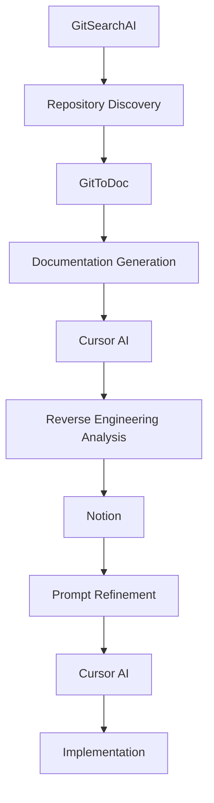
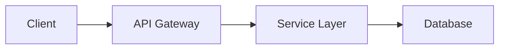

## Introduction

Reverse engineering is the practice of analyzing an existing system or product to understand its structure and operating principles, and sometimes to reproduce them. In software development, reverse engineering has been used for a wide range of purposes, including understanding legacy code, analyzing competitors, and discovering security vulnerabilities.

Today, advances in AI tools are rapidly shifting the paradigm of reverse engineering. This article traces the evolution of reverse engineering through representative examples from each era and introduces modern AI-based methodologies.

## The History of Reverse Engineering by Era

### 1970s-1980s: The Era of Hardware Cloning

**The Birth of IBM PC Compatible Machines**

In the early 1980s, when IBM dominated the personal computer market, many companies reverse-engineered the IBM PC to build compatible machines.

- **Compaq Portable (1983)**: The first fully IBM PC-compatible machine to succeed commercially
- **Phoenix BIOS**: A landmark case of reverse-engineering IBM's BIOS without legal issues
- **Clean-room design**: Separating the team that studied the original code from the team that implemented it, to avoid copyright infringement

```bash
# The reverse engineering process of that era
1. Hardware signal analysis
2. Assembly code disassembly
3. Function-by-function module analysis
4. Re-implementation in a clean room
```

### 1990s: The Golden Age of Software Reversing

**The Samba Project (1992)**

A landmark project that reverse-engineered Microsoft's SMB/CIFS protocol to enable Windows file sharing on Unix/Linux.

- **Network packet capture analysis**
- **Protocol documentation**
- **Open-source implementation development**

**The Wine Project (1993)**

A project that reverse-engineered the Windows API to allow Windows applications to run on Linux.

```c
// Example of Wine's Windows API re-implementation
HWND WINAPI CreateWindowExW(DWORD dwExStyle, LPCWSTR lpClassName,
                           LPCWSTR lpWindowName, DWORD dwStyle,
                           int X, int Y, int nWidth, int nHeight,
                           HWND hWndParent, HMENU hMenu,
                           HINSTANCE hInstance, LPVOID lpParam)
{
    // Translates Windows API behavior to Linux/X11
    return create_window_internal(/* ... */);
}
```

### 2000s: Web and Network Protocol Reversing

**Pidgin/Gaim Project**

Reverse-engineered various instant messenger protocols (AIM, MSN, Yahoo, ICQ) to develop a unified messaging client.

- **Network traffic analysis**
- **Encryption protocol interpretation**
- **Multi-protocol support architecture**

**Flash Player Alternatives**

Several open-source projects emerged that reverse-engineered Adobe Flash's SWF format.

### 2010s: Mobile and Cloud Era

**Android Custom ROMs**

- **CyanogenMod/LineageOS**: Reverse-engineering Android source code and binary drivers
- **Rooting tools**: Techniques for bypassing manufacturer security mechanisms

**API Reversing**

```python
# Example of REST API reverse engineering
import requests
import json

# Discovering API endpoints through network traffic capture
def reverse_engineer_api():
    # 1. Analyze network requests using browser developer tools
    # 2. Understand header and payload structure
    # 3. Understand authentication mechanisms
    headers = {
        'Authorization': 'Bearer token_discovered',
        'Content-Type': 'application/json'
    }
    
    response = requests.get('https://api.example.com/v1/data', headers=headers)
    return response.json()
```

## Modern AI-Based Reverse Engineering Methodologies

### A New Paradigm: AI-Powered Software Archaeology

The traditionally manual and time-consuming reverse engineering process is being transformed by AI tools.

### Modern Reverse Engineering Workflow



#### Step 1: GitSearchAI - Repository Discovery

**[GitSearchAI](http://gitsearchai.com)** is a tool that lets you search GitHub's vast collection of repositories using AI.

```bash
# Traditional approach
git clone https://github.com/target/repo
find . -name "*.py" | xargs grep -l "specific_function"

# AI-based approach
# Search in GitSearchAI using natural language
# "authentication middleware implementation in Python Flask"
```

**Use cases:**

- Searching for implementation patterns for specific features
- Discovering projects with similar architectures
- Researching security implementation best practices

#### Step 2: GitToDoc - Automated Documentation Generation

**[GitToDoc](http://gittodoc.com)** analyzes a repository and automatically generates documentation.

```markdown
# Traditional approach: manual analysis
1. Read README.md
2. Understand code structure
3. Analyze dependencies
4. Find API documentation

# AI approach: automated documentation generation
- Summary of the entire codebase structure
- Descriptions of key functions and classes
- Data flow diagrams
- List of API endpoints
```

#### Step 3: Cursor - AI-Based Code Analysis

Example reverse engineering prompt using **Cursor AI**:

```markdown
# Reverse Engineering Analysis Prompt
Analyze this codebase and identify the following:

1. **Architecture patterns**: Design patterns and architectural styles in use
2. **Data flow**: How data is processed and moved
3. **Core algorithms**: How key business logic is implemented
4. **Security mechanisms**: Authentication, authorization, and encryption implementation
5. **Performance optimizations**: Caching, database query optimization, etc.

Please explain in detail how [specific_component] works.
```

#### Step 4: Notion - Prompt Refinement

Organize analysis results in Notion and refine prompts for further analysis.

```markdown
# Notion Template: Reverse Engineering Analysis Results

## Project Overview
- **Project name**: 
- **Main tech stack**: 
- **Architecture**: 

## Key Findings
### Architecture Patterns
- [ ] MVC
- [ ] MVP  
- [ ] MVVM
- [ ] Clean Architecture

### Data Flow


## Implementation Plan

### Phase 1: Re-implementing Core Features

- [ ] Authentication system
- [ ] Data model
- [ ] API endpoints

### Phase 2: Optimization and Expansion

- [ ] Performance optimization
- [ ] Security hardening
- [ ] Test coverage improvement

```

#### Step 5: Cursor - Execution and Implementation

Proceed with actual implementation using the refined prompts.

```python
# Example implementation of reverse engineering results generated with Cursor AI
class ReversedAuthSystem:
    """
    Re-implementation based on analysis of the original system's authentication mechanism
    
    Discovered patterns:
    - JWT token-based authentication
    - Refresh token rotation
    - RBAC permission system
    """
    
    def __init__(self, secret_key: str):
        self.secret_key = secret_key
        self.token_blacklist = set()
    
    def authenticate(self, credentials: dict) -> dict:
        """Reproduces the same authentication flow as the original system"""
        # Implementation based on analyzed algorithm
        pass
    
    def authorize(self, token: str, resource: str) -> bool:
        """Re-implementation of authorization logic"""
        # RBAC logic identified through reverse engineering
        pass
```

### Advantages of Reverse Engineering in the AI Era

#### 1. Speed and Efficiency

- **Previously**: Weeks to months of analysis time
- **Now**: Reduced to hours or days

#### 2. Improved Accuracy

- AI analyzes patterns without missing anything
- Minimizes human error and bias

#### 3. Automated Documentation

- Analysis process and results are documented automatically
- Easier knowledge sharing across teams

#### 4. Repeatable Process

- Standardized workflow
- Consistent quality of analysis results

## Real-World Applications

### Case Study 1: Legacy System Modernization

```bash
# Modernizing a legacy COBOL system to Python
1. Search GitSearchAI for similar modernization examples
2. Use GitToDoc to document the legacy code
3. Analyze business logic with Cursor
4. Establish migration plan in Notion
5. Generate Python code with Cursor
```

### Case Study 2: Developing an API Client Library

```python
# Developing an SDK for a third-party API
# 1. Research existing SDK patterns in GitSearchAI
# 2. Auto-generate API documentation with GitToDoc
# 3. Analyze and generate client code with Cursor

class ThirdPartyAPIClient:
    """API client developed through reverse engineering"""
    
    def __init__(self, api_key: str, base_url: str):
        self.api_key = api_key
        self.base_url = base_url
        self.session = self._create_session()
    
    def _create_session(self):
        """Create session based on analyzed authentication patterns"""
        # Apply header patterns analyzed by AI
        pass
```

## Ethical Considerations

### Legitimate Reverse Engineering

- **Interoperability**: Ensuring compatibility between systems
- **Security auditing**: Discovering and fixing vulnerabilities
- **Educational purposes**: Learning and research

### Important Considerations

- **Respect copyright**: Apply clean-room design
- **License compliance**: Verify open-source licenses
- **Avoiding patent infringement**: Patent research is essential

## Future Outlook

### Advances in AI-Based Tools

```python
# Expected future reverse engineering tools
class FutureReverseEngineer:
    def __init__(self):
        self.llm = "GPT-6"  # More powerful language models
        self.code_analyzer = MultiModalAnalyzer()  # Integrated analysis of code + docs + execution results
        self.pattern_db = GlobalPatternDatabase()  # Global pattern database
    
    def analyze_system(self, target):
        """Fully automated system analysis"""
        # 1. Automated code discovery and collection
        # 2. Multimodal analysis (code, documentation, execution logs)
        # 3. Pattern matching and similarity analysis
        # 4. Automated re-implementation and testing
        pass
```

### New Challenges and Opportunities

- **Real-time analysis**: Analyzing live systems
- **Security hardening**: AI versus AI dynamics
- **Automation expansion**: Fully automated reverse engineering

## Conclusion

Reverse engineering has continuously evolved, starting from hardware cloning, moving through software analysis, and arriving at today's AI-based automation.

Modern AI tool combination:

- **GitSearchAI** - repository discovery
- **GitToDoc** - documentation automation
- **Cursor** - code analysis and generation
- **Notion** - process management

This workflow enables developers to understand and improve existing systems faster and more accurately. However, as technology advances, ethical responsibility must be considered alongside it.

As AI technology continues to develop, reverse engineering is expected to become more precise and automated, bringing transformative change to software development as a whole.

---

*If you found this article helpful, please leave a star on GitHub. For more AI and development content, visit [ThakiCloud](https://thakicloud.github.io).*
