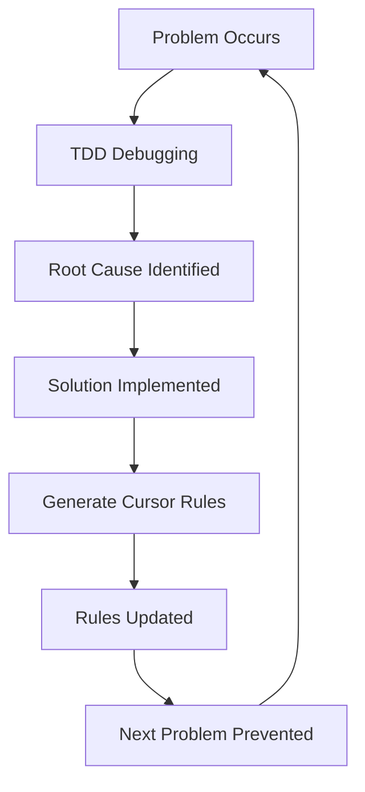

## Overview

You have probably heard someone say "500 requests a month is absurdly low." But is it really? [Steve Sewell of Builder.io](https://www.builder.io/blog/cursor-tips) says "I now spend 80% of my time coding through conversation with AI." The key is **quality over quantity**.

This guide, based on the latest Cursor AI features as of June 2025, presents strategic techniques to **maximize productivity without ever hitting the 500-request monthly limit**. Instead of blindly delegating to AI, we will build a truly professional workflow through **strategic collaboration**.

## 🎯 **Core Philosophy: Strategic AI Collaboration**

### **Before: Indiscriminate AI Dependence**
```markdown
❌ Problem arises → Immediately ask AI to fix it → Fails → Ask again → Repeat
→ Result: Monthly 500 requests exhausted quickly, no fundamental resolution
```

### **After: Strategic Collaboration Workflow**
```markdown
✅ Analyze problem → Refined request based on PRD/rules → AI collaboration → Verify → Update rules
→ Result: 200-300 requests per month is sufficient, continuous quality improvement
```

## 🏗 **Step 1: Build a Solid Project Foundation**

### **PRD-Centric Development Culture**

```markdown
# Practical PRD Template (Cursor Rules Integration)

## Project Overview
- Vision: [Core value in 30 characters or fewer]
- Problem definition: [Specific pain points]
- Success metrics: [Measurable KPIs]

## Technology Stack Matrix
| Layer | Chosen Tech | Alternative | Rationale |
|-------|-------------|-------------|-----------|
| Frontend | React 18 | Vue 3 | Team familiarity, ecosystem |
| State | Zustand | Redux | Learning curve, bundle size |
| Styling | Tailwind | Styled-Components | Development speed, consistency |

## AI Collaboration Guidelines
- Model selection: Simple changes (Claude Sonnet) vs. complex planning (Claude Opus)
- Context: @Docs React, @Code utils, @Git main
- Validation criteria: TypeScript passes, test coverage 80%+
```

### **Cursor Rules Auto-Generation Workflow**

```bash
# Use init-cursor.sh (provided in the project)
./init-cursor.sh

# Generated structure
.cursor/rules/
├── prd.mdc              # Full project context
├── tech-stack-doc.mdc   # Technology stack guidelines
├── frontend-guidelines.mdc  # Frontend rules
├── backend-structure.mdc    # Backend architecture
└── security-checklist.mdc   # Security checklist
```

## 🎮 **Step 2: Strategic Use by Model**

### **Model Selection Matrix**

| Task Type | Recommended Model | Reason | Estimated Tokens |
|-----------|-------------------|--------|------------------|
| Simple bug fixes | Claude Sonnet | Speed, accuracy | 1,000-3,000 |
| Architecture design | Claude Opus | Deep reasoning, creativity | 5,000-10,000 |
| Code review | GPT-4.1 | Follows clear instructions | 2,000-5,000 |
| Test writing | Gemini Pro | Finds edge cases | 3,000-7,000 |

### **Practical Model Switching Example**

```typescript
// 1. Quick prototype with Sonnet
interface UserProfile {
  id: string;
  name: string;
  // TODO: Extended design needed with Opus
}

// 2. Complex business logic design with Opus
interface UserProfileAdvanced {
  id: UserId;
  personalInfo: PersonalInfo;
  preferences: UserPreferences;
  permissions: PermissionMatrix;
  // Complete domain modeling
}
```

## 🧪 **Step 3: TDD-Based Debugging Workflow**

### **Problems with the Old Approach**
```markdown
❌ Bug found → Ask AI to "fix it" → Fails → Ask to "fix it" again → Infinite loop
→ Token waste, root cause never identified
```

### **TDD-Based 3-Step Debugging**

#### **Step 1: Write a Failing Test (Agent Mode)**
```typescript
// Cursor prompt
/*
When pressing Y on page X, it should behave like A, but behaves like B.
I want to fix it using TDD, so please write test code that reproduces this behavior and run it.
Remember that the test code should fail at this point.
If reproduction fails, let me know because I might be wrong.
Do not start fixing the problem without my instruction.
*/

// Result: Failing test code generated
describe('UserProfile Bug Reproduction', () => {
  it('should update username when form is submitted', async () => {
    // Currently failing test
    expect(result.username).toBe('newUsername'); // Fails!
  });
});
```

#### **Step 2: Root Cause Analysis (Ask Mode)**
```typescript
// Cursor prompt
/*
I want to identify the root cause of the bug.
Please suggest possible options for why and when this behavior occurs.
Also explain how to confirm which of those options is correct.
Tell me what additional information is needed and what should be logged.
No need to execute those methods, just explain them.
*/

// AI analysis result
/*
Possible causes:
1. State update timing issue (React 18 Concurrent Features)
2. Form validation logic interference
3. API response processing order issue

Verification methods:
1. Track state changes with React DevTools
2. Confirm API call order in the Network tab
3. Add state change logs to Console
*/
```

#### **Step 3: Test-Based Fix (Agent Mode)**
```typescript
// Cursor prompt
/*
Please add the test code created earlier to .cursorignore.
Then, starting with the most likely cause you suggested, identify the root cause
and organize the ideal flow as a flowchart.
Then modify the code using that ideal flow until the test passes.
Let me know if there is anything I need to check or intervene in.
*/

// Result: Systematic fix and passing test
```

## 🧠 **Step 4: Build a Self-Learning System**

### **Using Generate Cursor Rules**

```typescript
// After debugging is complete, request rule generation
/*
Please create or update Rules based on the content of this conversation.
In particular, add guidelines to prevent future issues
related to React 18 Concurrent Features and state updates.
*/

// Auto-generated rule example
/*
---
title: "React State Management Best Practices"
alwaysApply: true
---

## State Update Patterns
- Consider useState batch updates
- Verify accuracy of useEffect dependency array
- Check Concurrent Features compatibility

## Debugging Checklist
1. Write failing test first using TDD approach
2. Track state changes with React DevTools
3. Fix after identifying root cause
*/
```

### **Progressive Intelligence Improvement Cycle**



## ⚡ **Step 5: Maximize Productivity**

### **Multi-Tab Workflow**

```typescript
// Tab 1: Agent Mode (code editing)
// Refactoring UserProfile component in progress...

// Tab 2: Ask Mode (plan next task)
/*
After the UserProfile refactoring is done, the next tasks:
1. Improve type safety of API interfaces
2. Add error boundaries
3. Improve accessibility (ARIA labeling)

Tell me the priority and estimated time for each task.
*/

// Tab 3: Ask Mode (architecture inquiry)
/*
When migrating state management to Zustand in the current component structure,
what breaking changes should I consider and what migration strategy do you suggest?
*/
```

### **Auto Options Optimization**

```yaml
# .cursor/settings.json
{
  "auto-run": true,           # Automatically run terminal commands
  "auto-fix-lints": true,     # Automatically fix lint errors
  "auto-apply-edits": true,   # Automatically apply code changes
  "privacy-mode": false,      # Performance priority (set true for security-sensitive work)
  "max-mode": false          # Token-saving mode (enable when needed)
}
```

## 🔧 **Step 6: Advanced Context Usage**

### **Strategic Use of the @ Symbol**

```typescript
// 1. Reference a specific function with @Code
/*
Referring to the @Code:UserProfile.validateForm function,
create AddressForm.validateForm using a similar pattern.
*/

// 2. Accurate library usage with @Docs
/*
@Docs:React Hook Form
Implement an error message pattern that considers accessibility
along with real-time error display in form validation.
*/

// 3. Compare changes with @Git
/*
Compare @Git:feature/user-profile branch with the current code,
summarize what has changed, and tell me potential conflict points.
*/

// 4. Check latest information with @Web
/*
@Web:React 18.3 new features
Among the new features in the latest React version,
recommend ones that would be good to apply to the current project.
*/
```

### **Using Context7 MCP**

```typescript
// Check accurate library usage with Context7
/*
@Context7:zustand
Tell me best practices for ensuring type safety when using Zustand with TypeScript.
Focus especially on patterns used together with immer.
*/

// Result: Accurate guide based on the latest official documentation
```

## 🛡 **Step 7: Security and Quality Management**

### **Strategic Use of Privacy Mode**

```typescript
// Distinguish between company projects and personal projects
interface PrivacyStrategy {
  companyProject: {
    privacyMode: true;
    features: ["basic-completion", "ask-mode"];
    restrictions: ["no-background-agent", "no-data-collection"];
  };
  
  personalProject: {
    privacyMode: false;
    features: ["all-features", "background-agent", "advanced-tools"];
    benefits: ["faster-performance", "latest-features"];
  };
}
```

### **Using the MCP Tool Ecosystem**

```yaml
# Recommended MCP tool combinations
essential_mcps:
  development:
    - context7          # Library documentation reference
    - playwright        # E2E test automation
    - supabase         # Database integration
  
  quality_assurance:
    - snyk             # Security vulnerability scanning
    - semgrep          # Code quality analysis
    - sentry           # Error monitoring
  
  deployment:
    - netlify          # Frontend deployment
    - heroku           # Backend deployment
    - browserbase      # Browser automation

productivity:
  - memory-bank       # Context memory
  - taskmaster        # Task management
  - vooster          # Voice interface
```

## 📊 **Step 8: File Structure Optimization**

### **Understanding Cursor Internal Tools**

```typescript
// File structure considering Cursor tool limitations
interface OptimalFileStructure {
  maxFileLength: 500;        // Considering the 250-line limit
  maxToolCalls: 25;          // Tool call limit per session
  directoryNaming: "clear";  // List Directory efficiency
  
  // Recommended structure
  structure: {
    "components/": {
      "UserProfile/": {
        "index.ts": "exports only",
        "UserProfile.tsx": "main component (within 300 lines)",
        "UserProfile.test.tsx": "tests (within 200 lines)",
        "types.ts": "type definitions (within 100 lines)"
      }
    }
  };
}
```

### **Always Applied Rules Optimization**

```markdown
---
title: "Project Structure Guide"
alwaysApply: true
---

# Core Directory Structure
```
src/
├── components/          # Reusable components
├── pages/              # Route components
├── hooks/              # Custom hooks
├── utils/              # Utility functions
├── types/              # TypeScript types
└── stores/             # Zustand stores
```

# File Naming Conventions
- Components: PascalCase.tsx
- Hooks: use + PascalCase.ts
- Utilities: camelCase.ts
- Types: PascalCase.types.ts

# Code Style Guide
- Prefer functional components
- Separate logic into custom hooks
- TypeScript strict mode
- ESLint and Prettier applied
```

## 🚀 **Step 9: Modularization Strategy**

### **Ask, Plan, Execute Pattern**

```typescript
// Step 1: Ask about modularization strategy (Ask)
/*
If I were to modularize this project, what perspective or strategy would be best?
For example:
1) Layered Architecture perspective
2) Domain-Driven Design perspective
3) Feature-Sliced Design perspective
4) Clean Architecture perspective
*/

// Step 2: Formulate a comprehensive plan (Ask)
/*
Based on the strategies you suggested,
create a modularization plan suited to the current project size and team situation.
Also include a step-by-step migration roadmap.
*/

// Step 3: Execute (Agent)
/*
Document that plan and then execute it.
Proceed incrementally so as not to break existing functionality,
and verify by running tests at each stage.
*/
```

### **Feature-Sliced Design Example**

```typescript
// Modularization result
src/
├── shared/              # Common utilities
│   ├── ui/             # Basic UI components
│   ├── lib/            # Library configuration
│   └── api/            # API client
├── entities/           # Business entities
│   ├── user/
│   ├── product/
│   └── order/
├── features/           # Feature units
│   ├── auth/
│   ├── user-profile/
│   └── product-search/
├── widgets/            # Composite UI blocks
│   ├── header/
│   ├── sidebar/
│   └── product-card/
└── pages/              # Page compositions
    ├── home/
    ├── profile/
    └── checkout/
```

## 💡 **Step 10: Integrated Practical Workflow**

### **Daily Development Routine**

```typescript
// 9:00 AM: Planning (Ask Mode)
/*
Check what was worked on yesterday using @Recent Change,
then prioritize today's tasks.
Tell me the estimated time and required context for each task.
*/

// 10:00 AM - 12:00 PM: Focused development (Agent Mode)
// Implement new features using TDD approach

// 1:00 PM - 2:00 PM: Code review and cleanup (Ask Mode)
/*
Please review the code written this morning.
Focus on improvements, potential bugs, and performance issues.
*/

// 2:00 PM - 5:00 PM: Bug fixes and optimization (Agent Mode)
// Improvement work based on review results

// 5:00 PM - 6:00 PM: Documentation and rule updates
/*
Update Cursor Rules based on what was learned today.
In particular, add any newly discovered patterns or cautions.
*/
```

### **Git Workflow Integration**

```bash
# Full integration of Cursor AI with Git
# 1. Start work
git checkout -b feature/user-authentication

# 2. Development with Cursor
# (Implement feature using TDD approach)

# 3. AI commit message generation
# Use the AI Commit Message feature in Cursor

# 4. Automatic PR creation and code review
/*
Based on the changes in the current branch,
please write a PR template including the following:
- Summary of changes
- Test results
- Potential impact
- Review points
*/
```

## 📈 **Performance Measurement and Optimization**

### **Monthly Usage Analysis**

```typescript
interface CursorUsageAnalysis {
  monthly_limit: 500;
  actual_usage: {
    week1: 80;   // Project initial setup
    week2: 120;  // Core feature development
    week3: 90;   // Bug fixes and optimization
    week4: 70;   // Documentation and deployment
    total: 360;  // 140 requests remaining
  };
  
  efficiency_metrics: {
    bugs_prevented: 15;      // Prevented through rule-based approach
    development_speed: "2.5x"; // Compared to previous approach
    code_quality_score: 92;   // Automated validation
    learning_curve: "steep";  // Continuous improvement
  };
}
```

### **ROI Calculation**

```typescript
// Return on investment analysis
const cursor_roi = {
  monthly_cost: 20,        // Cursor Pro subscription fee
  time_saved: 40,          // 40 hours saved per month
  hourly_rate: 50,         // Value per hour
  monthly_value: 2000,     // 40h x $50
  roi_percentage: 9900     // (2000-20)/20 x 100
};

// Conclusion: 99x return on investment
```

## 🎯 **Conclusion: The Future of Strategic AI Collaboration**

### **Key Success Factors**

1. **Structured approach**: PRD, rules, execution, verification, improvement
2. **Model specialization**: Choose the right model for the task
3. **TDD approach**: Safe development based on tests
4. **Self-learning**: Continuous improvement with Generate Cursor Rules
5. **Context utilization**: Accurate information via @ symbols and MCP

### **Outlook for the Second Half of 2025**

```typescript
// Expected direction of development
interface Future_Cursor_Features {
  multimodal_input: "Integrated voice, screen, and text";
  team_collaboration: "Real-time multi-developer sessions";
  advanced_reasoning: "Deeper code understanding and suggestions";
  custom_models: "Project-specific fine-tuned models";
}
```

### **Action Plan to Start Now**

```markdown
## This Week's Execution List
- [ ] Write PRD template and apply to project
- [ ] Generate rules structure with init-cursor.sh
- [ ] Practice TDD debugging once
- [ ] Install and test Context7 MCP
- [ ] Document personal workflow

## This Month's Goals
- [ ] Complete project within 500-request monthly limit
- [ ] Formulate team-wide Cursor adoption plan
- [ ] Identify automatable repetitive tasks
- [ ] Define and track performance metrics

## Long-Term Vision (3 months)
- [ ] Build fully automated CI/CD pipeline
- [ ] Establish AI collaboration-based development culture
- [ ] Complete project-specific custom rulesets
- [ ] Achieve more than 2x improvement in team productivity
```

**The monthly 500-request limit is not a restriction but sufficient opportunity.** The key is using AI not as a simple code generator but as a **strategic partner**.

Like [Steve Sewell of Builder.io](https://www.builder.io/blog/cursor-tips), "spend 80% of your time coding through conversation with AI," but maximize the quality of that conversation. Through a structured approach and continuous learning, we hope you experience a new development paradigm together with Cursor AI.
