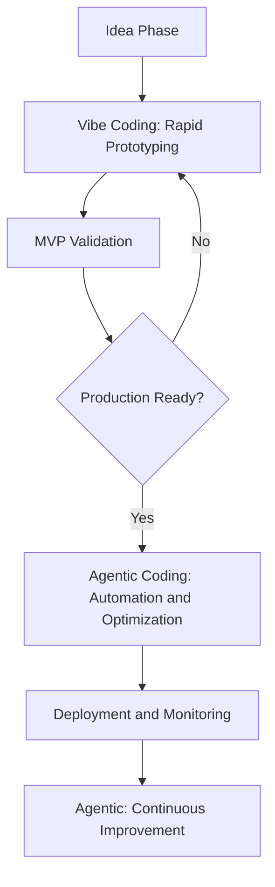

## Overview

This is a complete practical guide for applying two innovative AI coding paradigms presented in Cornell University's latest research, [*"Vibe Coding vs. Agentic Coding: Fundamentals and Practical Implications of Agentic AI"*](https://arxiv.org/pdf/2505.19443), in real development environments. We explore the core principles of **Vibe Coding** proposed by Andrej Karpathy and next-generation **Agentic Coding**, and present specific implementation strategies using ChatGPT and Cursor AI.

## Understanding the Two Paradigms

### 🎨 **Vibe Coding: Intuitive Collaborative Coding**

```
Developer intention → Natural language prompt → AI code generation → Immediate review/edit → Iterate
```

- **Philosophy**: Convey what you want to build in natural language and code through conversation with AI
- **Role**: Developer as **Creative Director**, AI as **high-speed copilot**
- **Characteristics**: Rapid prototyping, creative exploration, learning-friendly
- **Best for**: Idea validation, UI/UX prototypes, education, MVP development

### 🤖 **Agentic Coding: Autonomous Agent Coding**

```
Set goal → AI agent autonomously plans → Executes tools → Automated testing → Reports results
```

- **Philosophy**: Provide only high-level goals and the AI independently plans, executes, and validates
- **Role**: Developer as **Strategic Supervisor**, AI as **autonomous peer**
- **Characteristics**: Large-scale automation, consistent quality, enterprise-grade reliability
- **Best for**: CI/CD automation, legacy migration, large-scale refactoring

## ChatGPT Usage Strategies

### 1. **Vibe Coding with ChatGPT**

#### 🎯 **Effective Prompt Design**

##### Basic Vibe Coding Prompt Template

**Context Setting**
I am developing a [project type].
Tech stack: [React/Python/Node.js, etc.]
Current situation: [Brief description of current state]

**Intention Delivery**
I want to implement the following features:
- [Specific feature 1]
- [Expected user experience]
- [Constraints to consider]

**Collaboration Request**
Please generate the code step by step, and explain and suggest improvements at each step.

#### Practical Example: React Dashboard Prototyping

##### Step 1: Concrete Initial Idea

**Example prompt:**

```
I am building a data analytics dashboard.
I am using React + TypeScript + Chart.js.

I want a dashboard with this feel:
- Clean and modern design
- Three real-time charts (line chart, bar chart, pie chart)
- Dark mode support
- Responsive layout

Please start with the basic structure and develop it progressively.
```

**How to use ChatGPT's response:**
1. Test generated code locally immediately
2. Provide specific feedback when problems are found
3. Request improvements like "Can we make this part more elegant?"

##### Step 2: Iterative Improvement

**Feedback prompt example:**

```
The chart animation looks too stiff.
Please add smoother and more attractive transition effects.
Also, please make a tooltip appear when hovering over a data point.
```

#### 🛠 **Vibe Coding Best Practices**

```javascript
// 1. Share code snippets to maintain context
const currentCode = `
// Component currently being worked on
function Dashboard() {
  const [data, setData] = useState([]);
  // Chart logic to be added here
}
`;

// 2. Set step-by-step validation checkpoints
const checkpoints = [
  "Basic layout complete",
  "Data binding implemented", 
  "Chart rendering confirmed",
  "Styling applied",
  "Responsive testing"
];

// 3. Maximize context window usage (16k-32k tokens)
// Show the entire project structure at once
```

### 2. **Agentic Coding with ChatGPT Advanced Data Analysis**

#### 🎯 **High-Level Goal Setting Prompts**

##### Agentic Prompt Template

**Mission Definition**
Project: [Project name]
Final objective: [Specify a complete deliverable]
Success criteria: [Quantitative success metrics]

**Constraints**
- Tech stack: [Fixed technology constraints]
- Time limit: [Deadline]
- Quality requirements: [Test coverage, performance, etc.]

**Autonomous Execution Authority**
Please perform the following tasks independently:
1. [Subtask 1]
2. [Subtask 2]
3. [Automated verification method]

Report progress at each step and the final result.

#### Practical Example: API Migration Automation

**Agentic mission prompt example:**

```
This is a project to migrate a legacy REST API to GraphQL.

Objective:
- Convert 50 REST endpoints to a GraphQL schema
- Maintain 100% compatibility with existing response formats
- Generate an automated test suite

Constraints:
- Use Node.js + Apollo Server
- No changes to existing database schema
- Migrate without performance degradation

Autonomous execution request:
1. Analyze REST API and design GraphQL schema
2. Auto-generate resolver functions
3. Write and run integration tests
4. Compare performance benchmarks
5. Auto-generate documentation

Report progress, discovered issues, and solutions at each step.
```

#### 🔄 **Autonomous Execution Monitoring**

```python
# Using ChatGPT Advanced Data Analysis
# Automatic execution log analysis and reporting

class AgenticMonitor:
    def __init__(self):
        self.execution_log = []
        self.checkpoints = []
        
    def track_progress(self, task, status, details):
        """Track agent progress"""
        log_entry = {
            "timestamp": datetime.now(),
            "task": task,
            "status": status,  # SUCCESS, FAILED, IN_PROGRESS
            "details": details,
            "next_action": self.determine_next_action(status)
        }
        self.execution_log.append(log_entry)
        
    def generate_report(self):
        """Auto-generate progress report"""
        return {
            "overall_progress": self.calculate_progress(),
            "blocking_issues": self.identify_blockers(),
            "recommended_actions": self.suggest_interventions()
        }
```

## Cursor AI Usage Strategies

### 1. **Vibe Coding with Cursor AI**

#### 🎨 **Real-Time Collaboration Workflow**

```typescript
// Effective Vibe Coding patterns with Cursor AI

// 1. Set context (Ctrl+K)
/*
Context: Building a modern e-commerce checkout flow
Tech Stack: Next.js 14, TypeScript, Stripe, Tailwind
Current Goal: Create a multi-step checkout with form validation
*/

// 2. Intention-based generation (Ctrl+I)
// "Create a checkout form with shipping, payment, and confirmation steps"

interface CheckoutStep {
  id: string;
  title: string;
  component: React.ComponentType;
  validation: (data: any) => boolean;
}

// 3. Progressive improvement (Tab autocomplete + editing)
const checkoutSteps: CheckoutStep[] = [
  // Review and edit the structure Cursor suggested immediately
];
```

#### 🛠 **Cursor-Specific Vibe Coding Techniques**

```javascript
// 1. Chat window usage pattern
// Share full project context with @codebase tag
/*
@codebase Analyze the styling patterns of the current React components
and improve them into a consistent design system.

Focus especially on the consistency of buttons, form elements, and card components.
*/

// 2. Inline Chat (Ctrl+L) usage
// Request immediate improvements for a specific function or block
function processPayment(paymentData) {
  // Ctrl+L: "Add error handling and loading state management to this function"
}

// 3. Command Palette (Ctrl+Shift+P) workflow
// Optimize development flow with commands like "Cursor: Generate commit message"
```

### 2. **Agentic Coding with Cursor AI Rules**

#### 🤖 **Setting Up the Autonomous Execution Environment**

**.cursorrules file configuration example:**

```yaml
# Define agentic behavior patterns

system_prompt: |
  You are an autonomous coding agent working on a TypeScript/React project.
  
  AUTONOMOUS BEHAVIORS:
  1. Always write tests before implementing features
  2. Follow established project patterns without asking
  3. Automatically handle error cases and edge conditions
  4. Generate comprehensive TypeScript types
  5. Optimize performance by default
  
  DECISION AUTHORITY:
  - Code structure and architecture choices
  - Library selection within approved list
  - Testing strategy implementation
  - Performance optimization techniques
  
  REPORTING REQUIREMENTS:
  - Log all significant decisions made
  - Report any breaking changes
  - Summarize test coverage achieved
  - Note any security considerations

coding_standards:
  - Use functional programming patterns
  - Prefer composition over inheritance
  - Implement proper error boundaries
  - Follow SOLID principles
  
auto_actions:
  - Generate types for all API responses
  - Create unit tests for pure functions
  - Add JSDoc for public APIs
  - Implement accessibility features
```

#### 🎯 **Mission-Driven Development Process**

**1. Mission definition file (mission.md) example:**

```markdown
# E-commerce Platform Migration Mission

## Objective
Migrate legacy jQuery e-commerce site to modern React/Next.js stack

## Success Criteria
- [ ] 100% feature parity with legacy system
- [ ] 90%+ lighthouse performance score
- [ ] Zero accessibility violations
- [ ] Full TypeScript coverage

## Autonomous Agent Tasks
1. Analyze existing jQuery codebase structure
2. Create React component hierarchy
3. Implement state management with Zustand
4. Build responsive UI with Tailwind
5. Set up testing infrastructure
6. Create CI/CD pipeline

## Constraints
- Must maintain existing API contracts
- No breaking changes to user experience
- Database schema cannot be modified
- Must support IE11 compatibility layer
```

**2. Autonomous execution monitoring implementation:**

```typescript
// 2. Autonomous execution monitoring
class MissionTracker {
  private tasks: Task[] = [];
  private completedTasks: Task[] = [];
  
  async executeAutonomously() {
    for (const task of this.tasks) {
      try {
        // Cursor AI autonomously performs the task
        const result = await this.executeTask(task);
        this.logProgress(task, result);
        
        // Automated quality validation
        await this.validateTask(task, result);
        
        this.completedTasks.push(task);
      } catch (error) {
        // Attempt autonomous error recovery
        await this.handleTaskFailure(task, error);
      }
    }
    
    // Generate final report
    return this.generateMissionReport();
  }
}
```

## Hybrid Workflow: Harmonizing the Two Paradigms

### 🔄 **Step-by-Step Transition Strategy**

**Workflow Diagram:**



#### Practical Hybrid Example: SaaS Dashboard Development

**Phase 1: Vibe Coding (Idea to MVP)**
Rapid prototyping with ChatGPT/Cursor Chat

I want to build a user feedback analytics dashboard:
- Compare and select chart libraries
- Basic layout and component structure
- Quick visualization with sample data

Please create an attractive and creative UI/UX!

**Phase 2: Transition (Validation to Stabilization)**
Gradually introduce Agentic patterns

```typescript
const transitionTasks = [
  "Strengthen TypeScript type safety",
  "Auto-generate component tests", 
  "Automatically apply performance optimizations",
  "Standardize error handling"
];
```

**Phase 3: Agentic Coding (Production Operations)**
Transition to fully autonomous system

**Mission: Production-Ready Dashboard System**

**Autonomous Tasks:**
1. Implement comprehensive error tracking
2. Set up monitoring and alerting
3. Create automated testing pipeline
4. Optimize bundle size and performance
5. Generate API documentation
6. Set up CI/CD with automated deployments

**Success Metrics:**
- 99.9% uptime
- Less than 2s page load time
- 95%+ test coverage
- Zero critical vulnerabilities

### 📊 **Performance Measurement and Optimization**

```python
# Hybrid workflow performance analysis

class HybridPerformanceTracker:
    def __init__(self):
        self.vibe_metrics = {
            "idea_to_prototype_time": [],
            "iteration_count": [],
            "developer_satisfaction": []
        }
        
        self.agentic_metrics = {
            "automation_coverage": [],
            "bug_detection_rate": [],
            "deployment_success_rate": []
        }
    
    def analyze_workflow_efficiency(self):
        """Analyze workflow efficiency"""
        return {
            "optimal_transition_point": self.find_transition_sweet_spot(),
            "cost_benefit_analysis": self.calculate_roi(),
            "recommended_improvements": self.suggest_optimizations()
        }
    
    def find_transition_sweet_spot(self):
        """Detect the optimal transition point from Vibe to Agentic"""
        factors = [
            "code_complexity_threshold",
            "team_confidence_level", 
            "requirement_stability",
            "test_coverage_readiness"
        ]
        
        return self.calculate_transition_score(factors)
```

## Tool-Specific Advanced Usage

### 📱 **Using the ChatGPT Mobile App**

#### On-the-Go Idea Capture Workflow

**Voice Input Usage Example:**

"Hey ChatGPT, I want to build a coffee ordering app for cafes. The flow is: scan a QR code to see the menu, then pay with KakaoPay. Can you organize the libraries I'll need and the basic screen structure when building this with React Native?"

**Image Analysis Usage Example:**

[Upload photo of UI sketch]
"Please turn this hand-drawn wireframe into actual React components. Implement it responsively using Tailwind CSS."

### 🖥 **Advanced Cursor AI Feature Usage**

```typescript
// 1. Multi-file editing (Ctrl+Click)
// Apply consistent changes by editing multiple files simultaneously

// 2. Codebase-wide refactoring
// @codebase "Migrate PropTypes to TypeScript interfaces in all components"

// 3. Using the AI Review feature
/*
Apply the following review criteria to my recent changes:
1. TypeScript best practices
2. React performance patterns  
3. Accessibility compliance
4. Security vulnerabilities
5. Code maintainability

Provide specific suggestions for each file changed.
*/

// 4. Terminal integration
// Ctrl+` auto-generates AI commands in the terminal
// "create a build script that optimizes for production"
```

## Scenario-Based Guides

### 🚀 **Scenario 1: Startup MVP Development**

#### Weeks 1-2: Focus on Vibe Coding

**ChatGPT usage patterns:**
- Daily 30-minute brainstorming sessions
- Rapid prototype validation
- UI/UX idea visualization
- Technology stack decision support

**Cursor usage patterns:**
- Real-time code generation and editing
- Quick build of component libraries
- API interface mockup generation

#### Weeks 3-4: Hybrid Transition

```typescript
// Stabilize validated features with Agentic patterns
const productionReadyTasks = [
  "Implement user authentication system",
  "Optimize database schema", 
  "Standardize API error handling",
  "Improve mobile responsiveness"
];

// Automate quality standards with Cursor Rules
```

### 🏢 **Scenario 2: Enterprise Migration**

#### Phase 1: Current State Analysis (Agentic)

**Autonomous analysis mission example:**

```
Legacy codebase analysis mission:

1. Scan entire PHP/jQuery codebase
2. Identify business logic patterns
3. Map database dependencies
4. Generate architecture documentation
5. Estimate migration complexity
6. Propose modernization roadmap

Auto-generate comprehensive report with:
- Code quality metrics
- Security vulnerability assessment
- Performance bottleneck identification
- Breaking change impact analysis
```

#### Phase 2: Gradual Modernization (Hybrid)

```typescript
// 1. API layer separation (Agentic)
// Autonomously create REST API endpoints

// 2. Progressive frontend replacement (Vibe)
// Replace page by page with React components

// 3. Test and deployment automation (Agentic)
// Fully autonomous CI/CD pipeline setup
```

## Security and Quality Management

### 🔒 **Vibe Coding Security Checklist**

**1. Prompt Security Guidelines**

Security requirements to include in prompts:
- Do not hardcode API keys or secrets
- Include user input validation logic
- Use HTTPS communication only
- Apply SQL injection prevention code

"Please review the generated code from a security perspective and point out potential vulnerabilities."

**2. Code Review Automation**

```javascript
const reviewChecklist = [
  "Check for hardcoded credentials",
  "Verify input validation is not missing", 
  "Inspect error message information exposure",
  "Confirm authorization verification logic"
];
```

### 🛡 **Agentic Coding Governance**

```yaml
# .cursor-governance.yml
# Autonomous agent behavior constraints

security_constraints:
  - no_external_api_calls_without_approval
  - require_input_validation_all_endpoints
  - mandatory_error_logging
  - enforce_https_only
  
quality_gates:
  - minimum_test_coverage: 80%
  - max_cyclomatic_complexity: 10
  - require_typescript_strict_mode: true
  - accessibility_compliance: WCAG_2.1_AA

approval_required:
  - database_schema_changes
  - external_dependency_additions
  - environment_variable_modifications
  - deployment_configuration_updates
```

## Performance Optimization Strategies

### ⚡ **Vibe Coding Performance Patterns**

**1. Performance-Focused Prompt Design**

Performance optimization prompt example:

```
Please optimize the following React component for performance:

Current issues:
- Too many unnecessary re-renders
- Large bundle size
- Slow initial page load

Optimization goals:
- Achieve Lighthouse performance score of 90+
- Reduce bundle size by 50%
- Initial load time under 2 seconds

Please apply the latest React 18 features and best practices.
```

**2. Progressive Optimization Validation**

```typescript
const performanceCheckpoints = [
  "Confirm React.memo is applied",
  "useMemo/useCallback optimization",
  "Code splitting implemented", 
  "Image optimization applied",
  "Bundle analysis report generated"
];
```

### 🚀 **Agentic Performance Monitoring**

```typescript
// Autonomous performance optimization agent
class PerformanceAgent {
  async optimizeAutonomously() {
    const tasks = [
      this.analyzeBundle(),
      this.optimizeImages(), 
      this.implementCaching(),
      this.setupCDN(),
      this.configureCompression()
    ];
    
    const results = await Promise.all(tasks);
    
    return this.generateOptimizationReport(results);
  }
  
  async analyzeBundle() {
    // Automatically run Webpack Bundle Analyzer
    // Identify and suggest removal of unnecessary dependencies
  }
  
  async optimizeImages() {
    // Optimize image format (convert to WebP)
    // Auto-generate responsive images
  }
}
```

## Team Collaboration and Knowledge Sharing

### 👥 **Vibe Coding Team Workflow**

#### Team Vibe Coding Guidelines

**Daily Standup Pattern**
1. Share yesterday's "vibe" (how the coding felt)
2. Announce today's intention (what you want to build)
3. Share where you got stuck in AI collaboration
4. Share successful prompt patterns

**Code Review Checklist**
- [ ] Is the prompt intention well reflected in the code?
- [ ] Were AI suggestions not blindly accepted?
- [ ] Is the business logic clearly expressed?
- [ ] Is the code easy for a human to read?

**Building a Prompt Library**
Organize successful prompts by category in the team wiki:
- UI component generation prompts
- API integration prompts
- Test code generation prompts
- Debugging support prompts

### 🤖 **Agentic Team Orchestration**

```yaml
# team-agentic-config.yml
# Team-level autonomous agent collaboration settings

team_agents:
  frontend_agent:
    role: "React/TypeScript UI development"
    authority_level: "component_creation"
    collaboration_protocol: "sync_with_backend_agent"
    
  backend_agent:
    role: "API and database management"
    authority_level: "schema_modification"
    collaboration_protocol: "notify_frontend_changes"
    
  devops_agent:
    role: "CI/CD and infrastructure"
    authority_level: "deployment_automation"
    collaboration_protocol: "coordinate_with_all_agents"

conflict_resolution:
  - escalate_to_human_lead: true
  - require_consensus: ["schema_changes", "breaking_api_changes"]
  - auto_merge: ["code_formatting", "documentation_updates"]

reporting:
  frequency: "daily"
  format: "structured_markdown"
  recipients: ["tech_lead", "product_manager"]
```

## Future Roadmap and Direction

### 🔮 **Next-Generation AI Coding Tools**

```typescript
// Expected direction of development

interface NextGenAICoding {
  // 1. Multimodal input
  multiModalInput: {
    voice: "Natural language voice coding",
    sketch: "Hand-drawn sketch to code conversion",
    gesture: "Gesture-based code manipulation"
  };
  
  // 2. Real-time collaboration
  realTimeCollaboration: {
    humanAIPairing: "Advanced pair programming",
    multiAgentOrchestration: "Multiple AI agent collaboration",
    liveCodeReview: "Real-time code quality validation"
  };
  
  // 3. Self-evolving systems
  selfEvolvingSystems: {
    continuousLearning: "Per-project learning adaptation",
    patternRecognition: "Automatic learning of team coding patterns",
    predictiveCoding: "Predicting and preparing for the next step"
  };
}
```

### 📈 **ROI Measurement and Optimization**

```python
# AI coding return on investment analysis

class AICodingROI:
    def __init__(self):
        self.metrics = {
            "development_speed": 0,
            "code_quality": 0, 
            "developer_satisfaction": 0,
            "maintenance_cost": 0,
            "time_to_market": 0
        }
    
    def calculate_vibe_coding_roi(self):
        """Calculate Vibe Coding ROI"""
        benefits = {
            "faster_prototyping": 300,  # 3x faster prototyping
            "reduced_syntax_errors": 80,  # 80% reduction in syntax errors
            "improved_creativity": 150   # Creativity improvement (qualitative)
        }
        
        costs = {
            "chatgpt_subscription": 20,  # Monthly subscription fee
            "learning_curve": 40,        # Learning cost
            "prompt_engineering": 30     # Prompt optimization time
        }
        
        return self.calculate_roi(benefits, costs)
    
    def calculate_agentic_roi(self):
        """Calculate Agentic Coding ROI"""
        benefits = {
            "automation_savings": 500,   # Time saved through automation
            "quality_improvement": 200,  # Quality improvement effect
            "scalability_gains": 400     # Scalability improvement
        }
        
        costs = {
            "infrastructure_setup": 100,  # Infrastructure setup cost
            "monitoring_overhead": 50,    # Monitoring cost
            "agent_management": 80        # Agent management cost
        }
        
        return self.calculate_roi(benefits, costs)
```

## Practical Checklists

### ✅ **Vibe Coding Master Checklist**

**Foundation Level (Weeks 1-2)**
- [ ] Familiarize yourself with the basic ChatGPT/Cursor interface
- [ ] Secure 5 or more effective prompt templates
- [ ] Try generating a simple component with a prompt
- [ ] Establish a code review and editing process

**Intermediate Level (Weeks 3-4)**
- [ ] Able to express complex business logic in natural language
- [ ] Have prompt patterns for various frameworks
- [ ] Can quickly judge the quality of AI suggestions
- [ ] Build a system for sharing prompt knowledge with team members

**Advanced Level (1-2 months)**
- [ ] Build a domain-specific professional prompt library
- [ ] Able to solve creative problems in collaboration with AI
- [ ] Able to design architecture across the project with AI
- [ ] Able to determine when to transition to Agentic patterns

### ✅ **Agentic Coding Master Checklist**

**Foundation Level (Weeks 2-3)**
- [ ] Able to set clear goals and define constraints
- [ ] Set up a basic autonomous execution environment
- [ ] Build a system for monitoring agent execution results
- [ ] Understand the right timing for intervention when things fail

**Intermediate Level (1-2 months)**
- [ ] Able to delegate complex multi-step tasks to agents
- [ ] Proficient in setting quality gates and safety measures
- [ ] Implement inter-agent collaboration orchestration
- [ ] Optimize automation scope and measure ROI

**Advanced Level (3-6 months)**
- [ ] Establish enterprise-grade governance policies
- [ ] Operate a fully autonomous CI/CD pipeline
- [ ] Build a predictive maintenance system
- [ ] Complete hybrid workflow optimization

## Conclusion

The **Vibe Coding** and **Agentic Coding** presented in the Cornell University research are not simply new tools: they are **paradigms that fundamentally redefine how developers and AI collaborate**.

### 🎯 **Key Insights**

1. **Complementary relationship**: The two paradigms are collaborators, not competitors
2. **Gradual application**: Appropriate transitions according to the project lifecycle
3. **Human-centeredness**: Even as AI advances, human creativity and judgment remain central
4. **Continuous learning**: The shift in mindset matters more than the tools

### 🚀 **Core Principles for Success**

- **Vibe Coding**: Focus on "what do we build?" and have creative conversations with AI
- **Agentic Coding**: Think about "how do we automate this?" and delegate authority to AI
- **Hybrid approach**: Choose and switch between the optimal paradigm for each situation

The future of software development will evolve in the direction of amplifying **human intuition and creativity** with **AI automation and consistency**. We hope this guide helps you become a pioneer of the next-generation AI-based development workflow.
