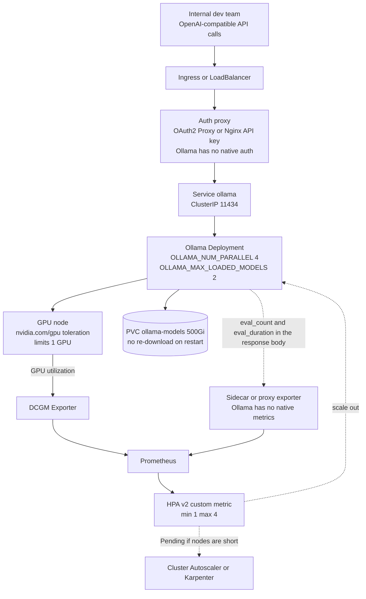

⏱️ **Estimated reading time**: 9 min

Ollama has moved well beyond a personal experimentation tool and is being used as team-level infrastructure. Running `ollama run` on a local Mac and operating a serving layer for an entire team on a Kubernetes cluster are architecturally different problems. This post covers the latter.

Seeing the full picture first makes it easier to place the pieces that follow.



The dotted paths are not provided out of the box and have to be built by hand. The monitoring section below covers this part in detail.


*A visual metaphor for the article's key idea.*

## Why Ollama: Positioning Against vLLM

vLLM focuses on throughput optimization. PagedAttention, continuous batching, and FP8 inference are all about squeezing maximum throughput from GPU resources. Ollama's strength is simplicity of installation and model management. `ollama pull llama3:70b` downloads the model in one line and an OpenAI-compatible API server comes up automatically.

The two tools occupy different layers rather than competing directly. vLLM fits a public inference endpoint where throughput matters. Ollama fits an internal code-assist tool or a small private chatbot used by a development team, where operational simplicity outweighs raw throughput.

## Basic Kubernetes Deployment

### Namespace and RBAC

```bash
kubectl create namespace ollama
kubectl label namespace ollama kueue.x-k8s.io/team=internal-tools
```

### GPU PersistentVolumeClaim

Model files range from tens of GB to hundreds of GB. Without a PVC, every Pod restart triggers a full model re-download. That is an operational disaster.

```yaml
apiVersion: v1
kind: PersistentVolumeClaim
metadata:
  name: ollama-models
  namespace: ollama
spec:
  accessModes:
    - ReadWriteOnce
  storageClassName: nfs-retain    # use the StorageClass appropriate for your cluster
  resources:
    requests:
      storage: 500Gi
```

If multiple Pods need to share the same model volume, you need a StorageClass that supports `ReadWriteMany` (NFS, CephFS, Azure Files, etc.). With `ReadWriteOnce`, the volume attaches to only one Pod at a time.

### Deployment

```yaml
apiVersion: apps/v1
kind: Deployment
metadata:
  name: ollama
  namespace: ollama
spec:
  replicas: 1
  selector:
    matchLabels:
      app: ollama
  template:
    metadata:
      labels:
        app: ollama
    spec:
      tolerations:
      - key: nvidia.com/gpu
        operator: Equal
        value: present
        effect: NoSchedule
      containers:
      - name: ollama
        image: ollama/ollama:latest
        ports:
        - containerPort: 11434
        env:
        - name: OLLAMA_MODELS
          value: "/models"
        - name: OLLAMA_NUM_PARALLEL
          value: "4"         # number of concurrent requests to process
        - name: OLLAMA_MAX_LOADED_MODELS
          value: "2"         # maximum number of models to keep in memory
        volumeMounts:
        - name: models
          mountPath: /models
        resources:
          limits:
            nvidia.com/gpu: "1"
            memory: "32Gi"
          requests:
            nvidia.com/gpu: "1"
            memory: "16Gi"
      volumes:
      - name: models
        persistentVolumeClaim:
          claimName: ollama-models
```

`OLLAMA_NUM_PARALLEL` caps the number of requests processed concurrently. When GPU memory is insufficient to hold multiple requests in flight, they must be serialized. Leaving the default (1) means requests queue up serially and latency grows.

### Service

```yaml
apiVersion: v1
kind: Service
metadata:
  name: ollama
  namespace: ollama
spec:
  selector:
    app: ollama
  ports:
  - port: 11434
    targetPort: 11434
  type: ClusterIP
```

For access from outside the cluster, expose via Ingress or LoadBalancer. Because Ollama has no built-in authentication, always place an auth proxy in front of any external exposure.

## Custom Model Configuration with Modelfile

An Ollama Modelfile builds a custom model from a base model, with a fixed system prompt, parameters, and context length.

```dockerfile
FROM llama3:8b

SYSTEM """
You are ThakiCloud's internal code review assistant.
You specialize in Go, Kubernetes YAML, and Python code.
Review in order: security vulnerabilities, performance issues, code style.
"""

PARAMETER temperature 0.1      # low temperature is better for code review
PARAMETER num_ctx 8192          # enough context to handle long files
PARAMETER num_predict 2048
```

Two approaches for building and deploying a Modelfile:

**Option 1: Preload with an InitContainer**

```yaml
initContainers:
- name: model-puller
  image: ollama/ollama:latest
  command:
  - sh
  - -c
  - |
    ollama serve &
    sleep 5
    ollama pull llama3:8b
    # mount Modelfile from ConfigMap, then build
    ollama create code-reviewer -f /modelfiles/Modelfile
    kill %1
  volumeMounts:
  - name: models
    mountPath: /models
  - name: modelfiles
    mountPath: /modelfiles
```

**Option 2: Run as a Separate Job**

Run a separate Job after the Pod is up to pull the model and build the Modelfile. Run it once on initial deployment.

## Structured Output

Ollama enforces JSON output via the `format` parameter:

```bash
curl http://ollama:11434/api/generate -d '{
  "model": "llama3:8b",
  "prompt": "Find security vulnerabilities in the following code and return them as JSON:",
  "format": "json",
  "stream": false
}'
```

You can also pin the output format via the system prompt in the Modelfile:

```dockerfile
SYSTEM """
Always return responses in the following JSON schema:
{"issues": [{"severity": "high|medium|low", "line": number, "description": string}]}
Include no text outside the JSON structure.
"""
```

In practice, even with `format: "json"` enabled, the model does not always respect the schema fully. A validation layer that parses and checks the schema after each response is necessary.

## Monitoring: Ollama Has No Native `/metrics`

There is something worth flagging up front here. **Ollama does not expose a Prometheus `/metrics` endpoint.** There is an open issue asking for one, and the linked PR still has not merged. If you wire up a ServiceMonitor pointing at `path: /metrics`, the scrape fails quietly and the dashboard stays empty. It is the kind of problem you tend to discover on a high-traffic day, not right after deployment.

There are three paths that actually work, and all three have to be built by hand.

**First, the timing fields in the response body.** The `/api/generate` and `/api/chat` responses include fields such as `eval_count`, `eval_duration`, and `prompt_eval_count`. You can compute token throughput and latency from these. The catch is that these values land on the caller, so turning them into metrics means the client or the proxy has to aggregate and emit them.

**Second, a proxy exporter.** Since there is already an auth proxy sitting in front, measuring request count and latency at that same point is the cheapest option. There are also third-party exporters that sit in front of Ollama and expose their own metrics on a separate port. Either way, the metric names are defined by that exporter, not by Ollama, so dashboards and alerts need to be written against whatever exporter you actually deployed.

**Third, the GPU level is covered by DCGM Exporter.** This one works fine independent of Ollama. Deploy it as a DaemonSet on GPU nodes and it ships utilization and memory numbers to Prometheus. Most of the signal that actually matters for scaling decisions in model serving lives on the GPU side anyway, so if you are only going to wire up one thing first, this is the one to pick.

```yaml
# ServiceMonitor pointed at DCGM Exporter. It scrapes the GPU exporter, not the Ollama Pod.
apiVersion: monitoring.coreos.com/v1
kind: ServiceMonitor
metadata:
  name: dcgm-exporter
  namespace: ollama
spec:
  selector:
    matchLabels:
      app: dcgm-exporter
  endpoints:
  - port: metrics
    interval: 30s
```

## HPA Autoscaling

GPU-based HPA scales on GPU utilization metrics. Collecting GPU utilization from NVIDIA's DCGM Exporter into Prometheus makes it available as a custom HPA metric.

```yaml
apiVersion: autoscaling/v2
kind: HorizontalPodAutoscaler
metadata:
  name: ollama
  namespace: ollama
spec:
  scaleTargetRef:
    apiVersion: apps/v1
    kind: Deployment
    name: ollama
  minReplicas: 1
  maxReplicas: 4
  metrics:
  - type: Pods
    pods:
      metric:
        name: ollama_queue_depth    # queued request count (custom metric)
      target:
        type: AverageValue
        averageValue: "10"
```

`ollama_queue_depth` is just an example name. As the previous section covered, Ollama does not emit this metric itself, so it needs to be renamed to whatever the proxy exporter actually exposes. An HPA pointing at a metric that does not exist does not scale, it just sits there quietly. You also need to confirm the metric is registered with the custom metrics API through an adapter such as Prometheus Adapter.

When GPU nodes are insufficient, HPA scale-out attempts leave Pods in Pending state. Node-level scaling requires Cluster Autoscaler or Karpenter in addition to HPA.

## Authentication Proxy Pattern

Ollama has no built-in authentication. Even on an internal service, leaving it open means anyone can use the model. The simplest approach is OAuth2 Proxy or Nginx validating an API key.

```yaml
# Nginx ConfigMap example
nginx.conf: |
  location / {
    if ($http_x_api_key != "your-team-key") {
      return 401;
    }
    proxy_pass http://ollama:11434;
  }
```

Integrating with an IdP such as Keycloak allows per-team access control.

## Operational Tips

**Schedule model updates as a separate Job.** `ollama pull` can run alongside a live Pod, but capacity issues during updates sometimes cause Pod restarts. Running the update as a Job during a maintenance window is safer.

**Tune `OLLAMA_MAX_LOADED_MODELS` to match GPU memory.** Two 70B models loaded simultaneously will exhaust VRAM. Calculate the model size relative to available VRAM and set this value accordingly.

**Adjust the log level.** By default, Ollama logs detailed output for every request. Set `OLLAMA_DEBUG=false` to reduce log volume in production.

## Summary

Running Ollama properly on Kubernetes requires four things: a model PVC, GPU tolerations, an auth proxy, and monitoring. The first three are just manifests once you write them. The last one is a different story. Since Ollama does not emit metrics, you have to assemble observability yourself out of DCGM and a proxy exporter, and if you skip that and only wire up a ServiceMonitor, you end up operating under the impression that monitoring is in place when it is not. Using Modelfile to configure team-specific models puts the system prompt and parameters under version control. For internal tool serving where operational simplicity matters more than throughput, Ollama is a good choice relative to its setup cost.

## Sources

- Ollama, [FAQ](https://docs.ollama.com/faq): default value of 1 for `OLLAMA_NUM_PARALLEL`, `OLLAMA_MAX_LOADED_MODELS`, `OLLAMA_MODELS`
- Ollama, [Modelfile Reference](https://docs.ollama.com/modelfile): `FROM`, `SYSTEM`, `PARAMETER temperature`, `num_ctx`
- Ollama, [Structured Outputs](https://docs.ollama.com/capabilities/structured-outputs): the `format` parameter
- Ollama, [Troubleshooting](https://docs.ollama.com/troubleshooting): `OLLAMA_DEBUG`
- ollama/ollama, [add /metrics endpoint (issue #3144)](https://github.com/ollama/ollama/issues/3144): the native Prometheus endpoint remains an open, unimplemented request
- Kubernetes, [HorizontalPodAutoscaler Walkthrough](https://kubernetes.io/docs/tasks/run-application/horizontal-pod-autoscale-walkthrough/) and [HPA v2 API Reference](https://kubernetes.io/docs/reference/kubernetes-api/autoscaling/horizontal-pod-autoscaler-v2/)
- NVIDIA, [dcgm-exporter](https://github.com/NVIDIA/dcgm-exporter): GPU metrics DaemonSet
- vLLM, [Documentation](https://docs.vllm.ai/en/latest/): PagedAttention and continuous batching
