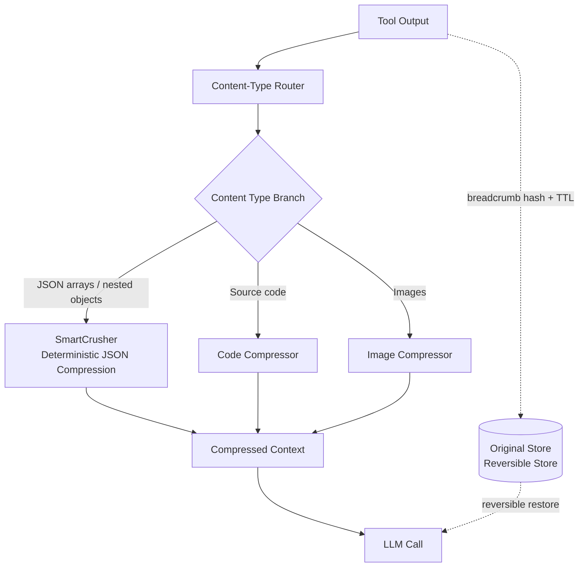

*Context is not free. Condensing scattered tokens losslessly is what Headroom does.*

## Overview

Any team running AI coding agents daily knows where the biggest hidden cost comes from. It is context. Tool outputs, RAG results, logs, files, and conversation history pile up every turn, and those tokens become the bill. In multi-agent workflows this cost grows not linearly but multiplicatively, because every time one subagent drops a large search-result JSON into context, the cache-read tokens grow alongside it.

This post is not a simple tool introduction. ThakiCloud already runs Headroom in its production tool chain, and this time we pulled three real JSON tool outputs from our own repo and ran Headroom directly against them. We document the install command, the integration code, and the measured token reductions in a reproducible form. The short version: the more repetitive the JSON structure, the larger the savings, and on our data the token reduction reached up to 71.2%. Every number was measured in a real sandbox, with no estimates mixed in.

## What Is Headroom

Headroom (PyPI package `headroom-ai`, GitHub `chopratejas/headroom`) is a context-compression tool open-sourced by ex-Netflix engineer Tejas Chopra. Its stated goal is clear: compress tool outputs, logs, files, and RAG chunks before they reach the LLM, reducing tokens while keeping the answer identical.

Most existing context-reduction tools are irreversible. Once you cut, you cannot get the original back. Headroom's key differentiator is that it runs locally, covers multiple content types, and is reversible. The original can be restored within a configured TTL via breadcrumb hashes. This structurally prevents the classic failure of "we compressed and the agent lost the details." You can run on the compressed version by default and restore the original only when a specific section is needed.

There are three ways to attach it: as a library you call directly, as a proxy, or as an MCP server. It recognizes content type and compresses selectively, keeping only the outliers in JSON or only the failure lines in logs.

### Internals: SmartCrusher Is the Core

Headroom routes to a different compressor per content type. In this experiment the transforms that actually fired showed up in the router log as `router:protected:user_message` and `router:mixed:...`, meaning it protects the user message and compresses only the JSON payload of tool messages.

- **SmartCrusher**: a general-purpose JSON compressor that handles arrays of dicts, nested objects, and mixed types. For repetitive JSON tool output (search results, log rows, record lists) it folds redundant keys and infers schema to reduce deterministically. It accounted for most of the savings in our measurement.
- **Code compressor**: structure-aware source-code compression.
- **Image compression**: image payloads are also reduced.

The diagram below is the data flow we observed. Tool output passes through the router into SmartCrusher, and while the compressed context goes to the LLM call, the original is stored separately for reversible restoration when needed.


*Headroom data flow: tool output is routed through a content-type router, compressed by SmartCrusher, and delivered to the LLM — while the original is held in a reversible store with TTL. Click the diagram to enlarge.*

## Install and Integration

Our Python runtime is unified into a single interpreter (3.12.8) `.venv`. Installation is one line.

```bash
VIRTUAL_ENV="$PWD/.venv" uv pip install "headroom-ai[code,relevance]"
```

The `[code,relevance]` extra enables code structure-aware compression and relevance-based filtering. Semantic compression of plain text needs an additional model (about 261MB), but the highest-impact JSON path works with this base install alone.

Integration is simplest by passing a message list directly. The core of the wrapper we actually use (`scripts/headroom_compress.py`) is below. Put the tool output as the `content` of a `tool`-role message and call `compress`.

```python
from headroom import compress

messages = [
    {"role": "user", "content": "Summarize this tool output"},
    {"role": "assistant", "content": None,
     "tool_calls": [{"id": "c1", "type": "function",
                     "function": {"name": "tool", "arguments": "{}"}}]},
    {"role": "tool", "tool_call_id": "c1", "content": raw_json_string},
]

result = compress(messages, model="claude-sonnet-4-5-20250929")
compressed = result.messages[-1]["content"]
print(result.tokens_before, "->", result.tokens_after, result.transforms_applied)
```

The object `compress` returns carries `tokens_before`, `tokens_after`, and `transforms_applied`, so code can verify after the fact what the compression actually did. The point is that these are values the library measured, not numbers the model self-reports. On top of that we cross-checked once more with a separate tokenizer (tiktoken).

## Real Experiment Results

The experiment ran in an isolated git worktree sandbox. The structure never touches the main working tree and keeps only results in an evidence directory. The test data is three of our repo's real artifacts with clearly repetitive JSON structure.

1. **skill_index.json**: a BM25 index for skill search. Records with identical schema repeat at scale.
2. **seedance-prompts/raw-prompts.json**: a catalog of 605 prompts. Natural-language text is the dominant share.
3. **twitter timeline archive**: 1,385 timeline records. An array of objects with identical key structure.

Token counts were measured with the `cl100k_base` tokenizer. We recorded both bytes and tokens because compression should be judged not by raw byte savings but by how much it helps in the actual billing unit, the token. The results are below.

| Test data | Original tokens | Compressed tokens | Token reduction | Byte reduction | Time |
|---|---|---|---|---|---|
| skill_index (BM25 index) | 1,618,287 | 465,445 | **71.2%** | 64.9% | 2.08s |
| twitter-timeline (record array) | 399,926 | 192,465 | **51.9%** | 57.0% | 0.24s |
| seedance-prompts (prompt catalog) | 1,085,592 | 713,210 | **34.3%** | 38.5% | 0.57s |


*Measured reduction rates for three JSON tool outputs from the ThakiCloud repo. Bytes and tokens are shown together.*

How to read the numbers matters. **The more repetitive the structure, the larger the savings.** skill_index is an index of densely repeating identical-schema records, so SmartCrusher's key folding maximizes and cut tokens by a full 71.2%. The twitter timeline, also a uniform object array, was reduced by more than half. By contrast seedance-prompts, where natural-language prompt text makes up most of each record, had little room to trim via structural compression and landed at 34.3%. This difference directly demonstrates the design intent that "JSON is where it works best."

The timing is also worth noting. It processed a 1.6-million-token index in two seconds, and the rest in under a second. That is fast enough to inline right before tool output enters context with almost no perceptible latency. Because the compression is deterministic, the same input always yields the same output, which is also cache-friendly.

One honest caveat. The numbers above are single-run measurements over three datasets. On other kinds of JSON, especially data with mostly unique values and few repeated keys, the reduction may be lower. Still, within our measured range, a span of 34-71% token reduction is a clearly meaningful result, at least for repetitive-structure tool output.

## Application to the ThakiCloud K8s AI/ML SaaS Platform

The point where we adopted Headroom is exactly what the experiment above shows: **repetitive-structure, large JSON tool output.** Our context-hygiene rule (`ecc-token-strategy`) spells this out: repetitive-structure JSON array tool output is compressed deterministically with SmartCrusher before entering context, plain text is not a target but JSON is, and the priority is subagent summarization first, then headroom compression.

The reason this matters so much in K8s multi-agent orchestration is the structure of the cost. In a workflow where many subagents run, context hygiene means three things at once. First, token cost control. Second, cache hit-rate management; deterministic compression guarantees identical output for identical input, so it does not break the prompt cache. Third, latency management; the smaller the context, the faster the model responds.

Our LLM serving schedules GPU workloads with Kueue on top of K8s, and many inference requests flow concurrently. In this environment, a bloated context costs more than one request; it eats overall throughput. Headroom lets us insert this layer with almost no code change. We compress a search-result or log array in one line right before it enters context, and restore reversibly only when a specific section is needed.

It is practical from a data-scientist's perspective too. In a RAG pipeline where retrieved chunks come loaded with repetitive metadata (identical keys like source URL, timestamp, score), that metadata is precisely the area SmartCrusher trims best. Because it preserves the body and reduces only the structural overhead, you secure context budget without sacrificing retrieval accuracy.

## Limitations and Counterarguments

We do not recommend this tool uncritically. Here are the honest limitations and counterarguments.

**First, local execution is a precondition.** Headroom needs to run a local process, so it cannot be used in fully sandboxed, isolated execution environments. There are deployment shapes this constraint does not fit.

**Second, the effect on plain text is limited.** As the seedance-prompts result shows, data with a high share of natural-language text has little room to trim via structural compression. Reducing plain text semantically requires an additional model, and that path gives up some determinism and speed.

**Third, it may be overkill for single-provider teams.** If one model provider's native compaction is enough and you do not need cross-agent memory, the operational burden of adding a separate compression layer may outweigh the gain.

**Fourth, the strongest counterargument is "couldn't you just summarize with a subagent?"** In fact our own rule prioritizes subagent summarization over headroom compression. Summarization is irreversible but reduces far more and compresses by meaning. So where does Headroom fit? The answer is "when summarizing would lose details that might be needed later." Reversibility fills exactly this gap. You run on the compressed version normally, and the moment you need the original of a specific record, you restore it precisely within the TTL. Summarization and compression are not competitors but complements.

In short, Headroom implements the principle that "context is not free" with the concrete design of reversible compression. Within our measured range it cut tokens by 34-71% on repetitive-structure JSON, and thanks to determinism and reversibility it neither broke the cache nor lost the details. If you are an engineer interested in how ThakiCloud treats context hygiene as a cost and reliability problem, we are the place that runs this layer in production.

---

Sources: Headroom (headroom-ai), PyPI https://pypi.org/project/headroom-ai/ · GitHub https://github.com/chopratejas/headroom (author Tejas Chopra). The figures in this post are measured directly on ThakiCloud repo data.
