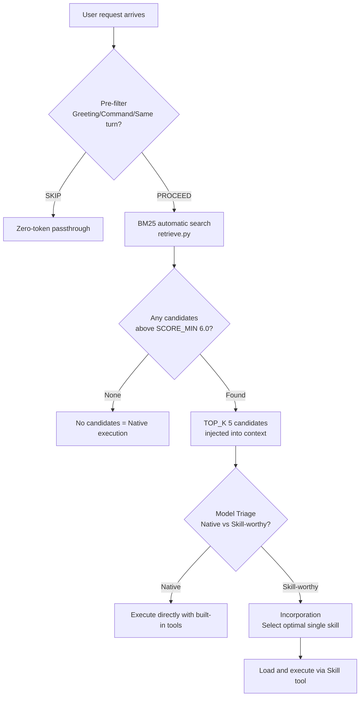

## Overview: The Problem Created by Skill Proliferation

When you operate an AI agent system for a long time, skills naturally accumulate. First dozens, then hundreds, and one day you open the catalog to find 1,620 entries. That is the current state of ThakiCloud's Claude Code-based agent infrastructure. Approximately 1,620 local skills, 55 subagents, 36 always-on rules, 22 slash commands, and 12 hooks are running together.

The first intuition you encounter here is "the more skills, the stronger the agent." That is wrong. As skills multiply, the agent actually slows down, picks up the wrong skill, or starts answering raw without using any skill at all. The problem was not the number of skills -- it was routing.

This article documents the routing design principles learned from operating a skill ecosystem of over 1,600 skills solo. It covers how Skill Retrieval Augmentation (SRA, arXiv:2604.24594) was applied to a real operating environment, what the BM25 gate does, why description quality determines search accuracy, and honestly, what is still lacking.

## Why More Skills Slows You Down: The Noise Tax

Claude Code's context window is finite. Putting the entire skill list into context every turn reduces the tokens available for actual work. This is the "noise tax." Just listing the names and short descriptions of 1,620 skills amounts to tens of thousands of tokens. Injecting this every turn causes costs to explode and the model to get lost among irrelevant skill names.

The more serious problem is "forced matching." This is the phenomenon where the model picks up the wrong skill because its name partially overlaps with something in the skill list. For example, loading the `4phase-debugging` skill for a simple "fix this bug" request and running a complex workflow, or pulling out the `technical-writer` skill for a simple file edit. As skills multiply, this noise probability increases.

The SRA paper (arXiv:2604.24594) defines this problem as "distractor noise being the primary accuracy risk in environments with 1,000+ skills." The solution direction is clear: instead of showing the agent all skills, filter to only the small number of candidates genuinely relevant to the current request.

## SRA + BM25 Two-Stage Gate

The structure ThakiCloud adopted combines the SRA paper's three-stage protocol with a BM25-based automatic gate.



### Stage 1: Retrieval - BM25 Automatic Search

The `skill-router-gate.py` hook is wired to the `UserPromptSubmit` event. The moment a user submits a prompt, this hook runs first.

The first step of the hook is the pre-filter. Greetings ("Hello"), simple confirmations ("Got it"), and pure commands (direct file path edits) pass through immediately without BM25 search. If an explicit skill trigger keyword is already present (`/review`, `/debug`, etc.), it is force-routed to that skill.

The second step is BM25 search. `retrieve.py` indexes SKILL.md frontmatter, agent definitions, and the skill catalog with BM25, then calculates relevance against the current query. Leveraging IDF weighting and a Korean-English cross-language synonym dictionary (25+ vocabulary pairs), it narrows down 1,200+ skills in real time. Only candidates scoring SCORE_MIN (6.0) or above -- up to TOP_K (5) -- are filtered and injected into context. If the request is identical to the previous turn, re-injection is skipped. All routing results are logged to `state/skill-router.jsonl`.

### Stage 2: Triage - Native vs Skill-worthy

The model looks at the injected candidate list and judges the nature of the current task.

- Native tasks: file editing, git commands, simple Q&A, single-line code changes, grep. Tasks where built-in tools are sufficient. Executed directly without loading a skill.
- Skill-worthy tasks: structured writing, multi-domain code review, pipeline orchestration, domain-specific analysis, document generation. Tasks that benefit from a skill with a checklist or workflow.

When the judgment is ambiguous, Native is the default. The criterion is whether structured workflow overhead is worth incurring.

### Stage 3: Incorporation - Selecting the Single Optimal Skill

Once classified as skill-worthy, one candidate from the BM25 list is selected, the reason is stated in a single sentence, and it is loaded via the Skill tool. If two or more candidates are neck and neck, the user is asked. If there are no candidates, it falls back to Native. Forced matching is not done.

A separate agent pool is also managed. The 55 subagents are searched in an index separate from the general skill pool, so user-facing skills and orchestration agents route without confusion.

## Description Quality Discipline

BM25 accuracy ultimately depends on the description quality of each skill. BM25 reads text. If descriptions are vague, similar skills receive similar scores for the same query and wrong candidates surface.

The description format ThakiCloud enforces has three components.

```yaml
description: >-
  [What the skill does - one sentence, third person].
  Use when [English + Korean trigger keywords].
  Do NOT use for [cases that are not this skill] (use [adjacent skill name]).
```

The first sentence is the capability. It defines "what it does" with a single verb. The second sentence is the utterance trigger. It must include both English and Korean. Korean requests match Korean triggers; English requests match English triggers. Having only one side misses half the queries. The third sentence is the boundary. It specifies "patterns that should not come to this skill" and "the adjacent skill to use instead." This is the core of disambiguation.

Descriptions must be within 1,024 characters. This is the upper limit accounting for BM25 indexing efficiency and context injection cost.

An additional discipline introduced on 2026-06-22 is Skill IR (Intent-Trigger schema). Before creating a complex new skill, six fields are filled in first: intent (what single problem it solves), triggers (English + Korean utterance keywords), inputs (what it receives), outputs (what it produces), boundaries (what it does not do + adjacent skills), and references (dependent scripts/rules). Fixing this IR first filters out trigger conflicts and duplicate skills at the description-writing stage. It is not applied to simple skills.

There is one lesson extracted from failure. "If the skill name sounds plausible, surely it will be found even if the description is rough" is a misconception. BM25 reads the full description, not the name. Even if the name is great, if there are no triggers in the description, it will not appear in search results.

## Measurement: What Improved

The benchmark methodology is stated upfront. The figures below are results from a gold-set benchmark of 63 cases. They are not values measured every turn in the actual operating environment. They measure the potential accuracy of the engine; operating accuracy may differ.

Before/after router repair comparison (sra-bench, 63 cases):

| Metric | Before repair | After repair |
|--------|--------------|-------------|
| Recall@5 | 44.0% | 73.3% |
| Gated (gate pass rate) | - | 53.3% |
| Top-1 accuracy | - | 31.1% |
| Hallucination (wrong skill loaded) | 10.0% | 0.0% |

Before repair, Recall@5 of 44% means the relevant skill was in the top-5 candidates less than half the time. In this state, even if the model selected perfectly, the correct answer was absent half the time. After repair it rose to 73.3%, and hallucination (loading a nonexistent or completely unrelated skill) dropped to 0%.

The three main causes of improvement were: first, skills lacking Korean triggers in their descriptions were updated in bulk. Second, cases where adjacent skill descriptions overlapped and caused score collisions were separated with Do-NOT-use clauses. Third, the BM25 SCORE_MIN threshold was tuned so that low-scoring noise candidates do not enter context.

Top-1 accuracy of 31.1% is still low. The gap between 73% (correct answer in top 5) and 31.1% represents "the model's ability to select the optimal one from candidates." This is an area that can continue to improve through description refinement, but the current ceiling is [estimate] around 50%.

A separate experiment was also conducted on composite requests (e.g., "research this, fact-check it, make a docx, and post it to Slack"). For 12 cases, the step_coverage of the single-query retrieve (SINGLE) strategy was 32.8%. Bundling multiple steps into a single query causes the skills for later steps to be missed. This problem is not fully resolved yet; composite requests are partially addressed by having the agent decompose into sub-tasks and retrieve each separately.

## Productization into Praxis

This routing structure is generalized on the same principles in ThakiCloud's SaaS product Praxis. Praxis's skill router has a two-stage structure. Stage 1 narrows domain candidates from a large skill pool. Stage 2 evaluates seven factors (intent match, trigger coverage, boundary violation, input sufficiency, output fit, reference dependencies, context cost) to select the optimal skill.

The key difference is diversification of scale. In Claude Code local operation, a single agent sees 1,600 skills, but in Praxis the skill pool is separated per tenant and the router readjusts to each tenant's context. The BM25 + gate + description discipline validated in solo operation applies directly to the multi-tenant product.

The part that changes most significantly during productization is responsibility for description writing. In local operation, the operator writes descriptions directly and validates with benchmarks. In Praxis, a gate is needed to automatically check description quality when customers register skills. Without this gate, skills registered by customers conflict and routing accuracy degrades. This gate is currently under development.

## Limitations and Lessons

An honest summary.

**BM25's limitations**: BM25 is lexical-match-based search. "Review my code" and "give me PR feedback" are semantically equivalent but lexically different. A synonym dictionary partially compensates, but there are limits. A hybrid approach combining semantic search (embedding-based) with BM25 is theoretically more accurate. However, embedding computation cost and index management complexity have prevented adoption so far.

**Gold-set bench vs. operating reality**: The figures cited in the measurement section are results for 63 pre-prepared cases. In actual use, unexpected phrasing, composite requests, and domain boundary cases are mixed in. Benchmark figures may differ from operating experience.

**Skill maintenance cost**: Updating 1,620 skills individually is not feasible. When descriptions become outdated, triggers misalign and accuracy drops. Currently some skills are updated through a nightly automation loop, but there is no systematic method to guarantee freshness across all skills.

**Composite request decomposition**: As mentioned earlier, composite requests spanning multiple steps are currently weak in routing. Having the agent decompose sub-tasks and retrieve each stage yields step_coverage of 42.5% under oracle conditions, higher than single retrieve (32.8%), but this ceiling is also low. Composite request routing is an area requiring further research alongside description quality improvement.

**"More skills is not better"**: This sentence is the core of this article. Skills are a tax. They raise context cost, maintenance cost, and routing noise. Before adding a skill, you must first ask "would the agent be wrong without this skill?" If the answer is "no," the skill should not be created.

1,620 is a large number. But the skills that are actively used daily are far fewer. The rest are latent assets that can only be retrieved when needed -- if routing works. Without routing, they become noise.

SRA + BM25 gate + description quality discipline is the infrastructure that makes those latent assets actually usable. It is not perfect and continues to improve, but the direction is right.
