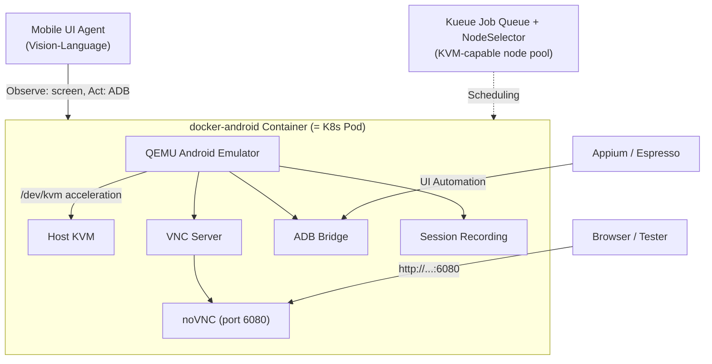

## Overview

Testing mobile apps or training and evaluating AI agents that operate a mobile UI ultimately requires a real Android device. The pain point is device management. Installing the SDK and system images on a local machine pollutes the host, every team member ends up with a different setup, and spinning up a clean device for each CI pipeline run is awkward. `budtmo/docker-android` is an open-source project that solves this problem with containers. It packages an Android emulator entirely inside a Docker image so you can launch it with a single command, view it through a browser, and even record the session to video.

The reason this topic belongs on the ThakiCloud blog, which covers K8s-based AI/ML SaaS platforms, goes beyond simple mobile testing tooling. The core idea is **scheduling reproducible device environments on Kubernetes**. Whether the use case is a device farm for CI or a sandbox for evaluating vision-language agents that manipulate a mobile screen, the central question is the same: can an Android device be treated as a K8s resource, the same way a GPU workload is? This post analyzes the structure of docker-android and how to run it, then examines the possibilities and constraints when extending the concept to our platform.

## What This Tool Does

docker-android bundles an Android emulator and its surrounding tooling into a single Docker image. When the container starts, a QEMU-based emulator boots inside it and exposes its display over VNC. A web-based VNC client called noVNC is included, so without installing any separate client you can open `http://localhost:6080` in a browser and interact with the running Android screen directly.

The key capabilities are as follows. First, browser-based remote control via noVNC. Second, automatic session recording, which saves the full test run as a video. Third, ADB integration, which lets the host or other containers connect to the device using the standard Android Debug Bridge. Fourth, compatibility with test frameworks like Appium and Espresso for running UI automation tests inside the container. Fifth, support for multiple Android versions and device profiles, including profiles for specific devices such as Samsung Galaxy S10.

The key to performance is hardware acceleration. Running the emulator in pure software is prohibitively slow, so docker-android passes the host's KVM device (`/dev/kvm`) into the container to enable hardware acceleration. This is also the most significant infrastructure constraint, which is discussed in more detail later.

The diagram below shows the internal layout of the container and how it maps to a K8s pod.




## Installation and Running

The most basic run command is shown below. This is the standard form documented in the official repository.

```bash
docker run -d -p 6080:6080 \
  -e EMULATOR_DEVICE="Samsung Galaxy S10" \
  -e WEB_VNC=true \
  --device /dev/kvm \
  --name android-container \
  budtmo/docker-android:emulator_11.0
```

What each option does:

- `-d`: Run the container in detached (background) mode.
- `-p 6080:6080`: Map the noVNC web port to the host. Connect at `http://localhost:6080` after the container starts.
- `-e EMULATOR_DEVICE="Samsung Galaxy S10"`: Specify the device profile to emulate.
- `-e WEB_VNC=true`: Enable the web-based VNC client (noVNC) for browser access.
- `--device /dev/kvm`: Pass the host's KVM device into the container to enable hardware acceleration.
- The image tag (`emulator_11.0`) selects the Android version.

Once the container is running, open the browser at port 6080 to see the booted Android display. To connect via ADB, use `adb connect` against the ADB port the container exposes. Appium tests target this device through either an Appium server running inside the container or a separate Appium container. Additional configuration options, including video recording paths, display resolution, and custom device definitions, are documented in the repository's custom configuration guide.

> Honest disclosure: the isolated sandbox environment used to write this post cannot guarantee nested virtualization (`/dev/kvm`), so the emulator was not actually booted and metrics such as boot time and frame rate were not measured. Fabricated benchmark numbers are therefore absent from this post. What was verified are the facts available from the official repository: the run commands, the exposed port (6080/noVNC), the KVM acceleration requirement, and the stated feature support for video recording, Appium, Espresso, and ADB.

## What Was and Was Not Verified

Verified facts: docker-android containerizes an Android emulator, provides browser-based interaction via noVNC, and supports video recording, Appium and Espresso testing, and ADB integration. The host's KVM hardware acceleration is required to run it. Multiple Android version images are available.

Not verified: actual boot performance and concurrent instance density. How many emulators can run stably on a single node and how long each takes to boot depend heavily on the host CPU, memory, and KVM support. Values that were not directly measured are not estimated here. Some advanced features, such as real device support, require additional permissions and hardware and are outside the scope of this post.

## Applying to the ThakiCloud K8s AI/ML SaaS Platform

Because docker-android is a container image, it can be launched as a Kubernetes pod. Two platform angles emerge from this.

The first is a mobile CI device farm. A clean Android device can be spun up dynamically on K8s for each build and the pod reclaimed when tests finish. Because the device environment is fixed in an image, environment differences across team members and CI runners disappear, and the recorded video serves as evidence for failure reproduction. Just as GPU workloads are queued through Kueue, emulator pods can be treated as jobs with resource requests. Scheduling to a KVM-capable node pool is a matter of setting a node selector.

The second, and more interesting, angle is **an evaluation environment for mobile UI agents**. Vision-language agents that observe a screen and operate an app through taps and swipes need a reproducible Android environment for training and evaluation. docker-android standardizes that environment as a container. An agent observes device state through the noVNC display or an ADB stream and executes actions via ADB or Appium. Running per-tenant isolated device pods on a multi-tenant K8s cluster lets multiple agent experiments run in parallel safely.

From the ThakiCloud perspective, the noteworthy point is that this reuses existing infrastructure without modification. K8s scheduling, multi-tenant isolation, job queuing via Kueue, and the observability stack are already core components of the platform. Treating an Android device as one more container workload adds both "mobile CI" and "mobile agent evaluation" as product angles without new infrastructure. Running on-premises means test device data does not leave for an external device farm service, which is a direct benefit for customers where data sovereignty matters.

## Limitations and Counterarguments

This is not purely good news. The most significant constraint is KVM. Running the emulator without hardware acceleration is too slow to be practical. Passing `/dev/kvm` into a container requires bare-metal or specific cloud instance types that support nested virtualization, and it means granting the container privileged device access. This can conflict with multi-tenant security boundaries, and many managed K8s environments do not expose KVM. The pattern therefore requires careful node pool design and security policy work.

The second issue is resource density. An Android emulator is a meaningful consumer of CPU and memory. Packing dozens of emulators onto a single node the way multiple inference requests are batched onto a single GPU is unrealistic, and actual concurrent instance density needs to be established through direct load testing. The cost model differs from GPU serving.

Third, an emulator is not a real device. Hardware sensors, specific chipset behavior, and real network conditions cannot be fully replicated by QEMU. Final validation of mobile agents or app tests may ultimately require physical hardware, and the realistic position for docker-android is as a fast, reproducible environment for the stages that come before that.

In summary, budtmo/docker-android takes the straightforward idea of running Android as a container and implements it in a practical form that includes noVNC, video recording, Appium, and ADB. Handled the KVM constraint carefully, it becomes a realistic starting point for placing both mobile CI and mobile agent evaluation workloads on the same K8s infrastructure.

## Sources

- budtmo/docker-android: [https://github.com/budtmo/docker-android](https://github.com/budtmo/docker-android)
- Custom configuration documentation: [https://github.com/budtmo/docker-android/blob/master/documentations/CUSTOM_CONFIGURATIONS.md](https://github.com/budtmo/docker-android/blob/master/documentations/CUSTOM_CONFIGURATIONS.md)
