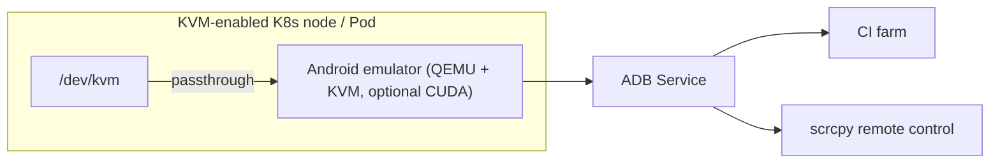

## Overview

Testing a mobile app requires Android devices. Managing a fleet of physical handsets is a maintenance burden, and installing a heavy emulator locally on every developer's machine leads to environment drift and poor reproducibility. Those problems multiply when you try to include Android tests in a CI pipeline, because every build node needs a consistent emulator setup.

`docker-android` (the HQarroum edition) solves this with containers. It packages an Android emulator in a minimal configuration, runs it headlessly, and exposes ADB and screen control over the network. A single container gives you a clean, consistent Android environment in seconds, making it a natural fit for CI/CD and automated testing.

This post verifies docker-android's architecture and real requirements against the project documentation, then examines how a Kubernetes platform like ThakiCloud can handle this class of device workload. Android emulation is not central to our AI/ML platform, but the question of how to isolate and run privileged containers that need KVM device passthrough and GPU acceleration maps directly onto our infrastructure capabilities.

---

## What docker-android Is

HQarroum's docker-android bundles an Android emulator, KVM support, and JRE 11 into a compact Alpine-based image (current version 1.1.0). The design intent is clear: expose a fully functional, remotely controllable Android emulator with the smallest possible software footprint. Inside the image live the emulator itself, an ADB server for external access, and QEMU with libvirt.

Key characteristics:

- **Minimal footprint**: Alpine-based for size optimization. Building without the SDK and emulator produces a much smaller image.
- **Configurable**: Android version, device type, and image variant are all selectable.
- **Built-in port forwarding**: Emulator and ADB are exposed through the container network interface.
- **Headless**: No GUI required, making it suitable for CI farms. Screens can be accessed remotely via [scrcpy](https://github.com/Genymobile/scrcpy).
- **Reproducibility**: The emulator image resets on every restart, so each run starts from an identical state.

The diagram above shows a hypothetical deployment of this container on ThakiCloud Kubernetes. The emulator runs in a pod on a KVM-enabled node with `/dev/kvm` passed through; the cuda variant is used when GPU acceleration is needed. ADB is exposed as a Service so CI farms and scrcpy clients can reach it.

---

## Installation and Integration

The default build bundles the Android SDK, platform tools, and emulator into the image. Bringing everything up with docker-compose looks like this:

```bash
# Basic emulator
docker compose up android-emulator

# GPU acceleration
docker compose up android-emulator-cuda

# GPU acceleration + Google Play Store
docker compose up android-emulator-cuda-store
```

You can also build directly with Docker:

```bash
docker build -t android-emulator .
```

After building the image, run the container with the KVM device mounted. Using a Play Store image requires the emulator and client to share the same `adbkey`; generate it with `adb keygen adbkey` and place it in the `./keys` directory.

Image size varies considerably by build variant. The comparison table from the repository documentation:

| Build variant | Uncompressed | Compressed |
|---|---|---|
| API 33 + emulator | 5.84 GB | 1.97 GB |
| API 32 + emulator | 5.89 GB | 1.93 GB |
| API 28 + emulator | 4.29 GB | 1.46 GB |
| Without SDK/emulator | 414 MB | 138 MB |

Images that include the emulator are over 1.5 GB even compressed. When distributing across many nodes, registry bandwidth and node disk capacity both need to be factored in.

---

## Verifying Actual Behavior

This post does not include a verified container boot. Honest record: could not boot here (no Docker daemon on the work host, and macOS provides no `/dev/kvm`). docker-android requires KVM hardware acceleration, so real operation is only possible on a Linux host or a KVM node with nested virtualization enabled.

What we could verify came directly from the repository documentation. The image size comparison table above reflects numbers stated in the docs; build variants, compose service names, and KVM mount requirements are all documentation-based. Figures such as boot time or test throughput that we could not measure are not included. In an actual deployment, once KVM nodes are available, the right procedure is to measure container boot time, ADB connection latency, and maximum concurrent emulator count directly.

---

## Implications for the ThakiCloud K8s AI/ML SaaS Platform

docker-android is not an AI/ML tool in itself. But the operational requirements it surfaces overlap precisely with what ThakiCloud does well.

First, **isolation of device-passthrough workloads**. An emulator is essentially a privileged container that requires `/dev/kvm`. Running this class of workload safely in a multi-tenant Kubernetes environment demands careful node selection, device plugins, and security contexts. ThakiCloud already queues GPUs through device plugins and Kueue; KVM passthrough can be handled with the same pattern.

Second, **reproducible test farms**. Packaging headless emulators as containers lets you scale clean environments horizontally across as many nodes as you need. Running many parallel Appium UI tests from a CI/CD pipeline is a textbook use case for Kubernetes job scheduling.

Third, looking further ahead, this extends naturally to **on-device AI validation**. Verifying the behavior of lightweight models or agents running on mobile devices at scale requires a device farm that can spin up many isolated Android environments and run regression tests automatically. This is not a core concern for our platform today, but as our multi-tenant GPU and device orchestration capabilities mature, a mobile AI QA farm of this kind becomes something we could offer on the same infrastructure.

In short, docker-android is not a product we are building, but it is a good case study in taming heavy container workloads that mix privilege, device passthrough, and GPU acceleration on Kubernetes. That is a concrete illustration of the general-purpose K8s orchestration capabilities ThakiCloud emphasizes.

---

## Limitations and Counterarguments

- **Heavy dependencies**: KVM hardware acceleration is non-negotiable. In environments without nested virtualization support, performance degrades sharply or the emulator does not boot at all. Cloud node selection becomes a hard constraint.
- **Image bloat**: Emulator-inclusive images are several GB even compressed. Distributing across many nodes accumulates real registry and disk costs.
- **Distance from AI/ML relevance**: Honestly, this tool is far from the training and inference workloads at the core of our platform. For organizations with no mobile testing demand, the direct value is limited. The value of this post lies not in "the emulator itself" but in "the operational patterns for device-passthrough containers."
- **Security of privileged containers**: `/dev/kvm` access and privileged settings complicate multi-tenant security boundaries. Preserving tenant isolation requires dedicated node pools and strict policies.

docker-android is a powerful tool for mobile test automation and a useful reference for how to handle device-class workloads on Kubernetes. Even before the moment we need it directly, the operational patterns are worth understanding in advance.

---

## Sources

- docker-android (HQarroum): [https://github.com/HQarroum/docker-android](https://github.com/HQarroum/docker-android)
- Docker Hub image: `halimqarroum/docker-android`
- scrcpy (remote screen control): [https://github.com/Genymobile/scrcpy](https://github.com/Genymobile/scrcpy)
- Original tweet (RT): [https://x.com/hjguyhan/status/2069427245295493446](https://x.com/hjguyhan/status/2069427245295493446)
