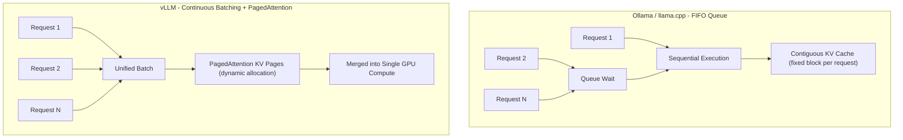

Search for how to run an LLM locally and two names come up almost every time: Ollama and vLLM. Strong claims like "don't use Ollama if you care about performance, use vLLM instead" appear frequently. Are they right? The short answer is: half right. A laptop used by one person sending one request at a time is a completely different problem from a server handling dozens of concurrent users. This post uses RTX 4090 benchmark numbers published in 2026 to examine where the two tools diverge, and what that divergence means for ThakiCloud's Kubernetes-based serving stack.

## Overview

Both Ollama and vLLM are inference engines for running LLMs locally or on private infrastructure, but their design goals differ. Ollama is built for a single person to pull a model quickly and run it with minimal friction. Installation is simple, model management is built in, and the lightweight Go server starts fast. vLLM is a production serving engine designed from the ground up to saturate a single GPU with multiple concurrent requests, maximizing throughput. Its core weapons are PagedAttention and continuous batching.

Why does this distinction matter again now? Both tools underwent significant architectural changes after 2024. Ollama refined its llama.cpp kernel optimizations and quantization inference paths to lift single-stream performance; vLLM simplified its installation experience while continuing to improve PagedAttention and speculative decoding. Benchmarks from a year ago no longer reflect the current reality, which is why a fresh look with up-to-date numbers is warranted.

ThakiCloud processes inference requests from multiple customers on a shared GPU pool in a multi-tenant environment. In that context, "is it fast for one person" is almost irrelevant; what matters is "does it hold up when many users hit it simultaneously." That is the lens through which we examine the two engines' scaling curves.

## What Each Tool Is

The decisive difference between the two engines lies in how they manage the KV cache. During generation, a transformer accumulates keys and values from previous tokens in a cache. That KV cache is the largest consumer of GPU memory. Ollama and llama.cpp pre-allocate a contiguous memory block per request. The implementation is straightforward, but as concurrent requests grow, fragmentation builds up and the ability to handle parallel work hits a ceiling quickly.

vLLM's PagedAttention treats the KV cache like virtual memory pages in an operating system. Allocating in small, non-contiguous blocks on demand means far more concurrent sequences can fit in the same VRAM. Continuous batching compounds this: when a new request arrives it gets inserted into the active batch immediately rather than waiting for earlier requests to finish. These two mechanisms together explain why vLLM traces a different curve under concurrency.

The diagram below illustrates the difference in how each engine handles concurrent requests.



In short, Ollama is optimized for cleanly handling one request at a time; vLLM is optimized for bundling many requests into a single GPU operation. That design difference shows up directly in the benchmark numbers.

## Installation and Integration

Launching both tools via Docker is the cleanest approach for reproducibility. Ollama starts like this:

```bash
docker run -d --gpus=all -v ollama:/root/.ollama \
  -p 11434:11434 --name ollama ollama/ollama
docker exec -it ollama ollama run llama3.1:8b
```

vLLM can be launched directly from its OpenAI-compatible server image:

```bash
docker run --gpus all -p 8000:8000 \
  --ipc=host vllm/vllm-openai:latest \
  --model meta-llama/Llama-3.1-8B-Instruct \
  --dtype auto
```

Both servers expose an OpenAI-compatible API, so client code can remain identical across both:

```bash
curl http://localhost:8000/v1/completions \
  -H "Content-Type: application/json" \
  -d '{"model":"meta-llama/Llama-3.1-8B-Instruct","prompt":"Hello","max_tokens":64}'
```

For reproducibility, pin image digests. Public benchmarks recommend recording the RepoDigest via `docker inspect ollama/ollama:<tag>` and `docker inspect vllm/vllm-openai:<tag>`, and capturing `ollama --version` and `pip show vllm` output alongside results. Even a single version increment can shift the numbers.

One disclosure: this post was authored on Apple Silicon (macOS, MPS), so CUDA-based vLLM benchmarks could not be reproduced directly. The numbers below are cited from a public benchmark run on the same hardware (SitePoint, March 2026, RTX 4090). The source is listed at the end of this post. Numbers that come from someone else's measurement are kept distinct from any claim that they are our own.

## Benchmark Results (Public Benchmark Citation)

The cited benchmark environment: GPU - NVIDIA RTX 4090 (24GB), CPU - AMD Ryzen 9 7950X, 64GB DDR5 RAM, Ubuntu 24.04, CUDA 12.6, Python 3.12. Models compared were Llama 3.1 8B and DeepSeek-R1-Distill-Llama-8B under identical prompts.

First, single-user sequential throughput. Contrary to common wisdom, vLLM does not dominate. For Llama 3.1 8B, Ollama (Q4_K_M) produced roughly 62 tok/s, vLLM (FP16) roughly 71 tok/s, and vLLM AWQ roughly 68 tok/s. The roughly 13% gap comes more from quantization differences than from architectural advantages. With a single user, Ollama's low server overhead and quantization kernel optimizations offset vLLM's structural strengths.

The picture changes entirely under concurrency. The table below shows aggregate token throughput (tok/s) by concurrent user count.

| Configuration | Ollama | vLLM FP16 | vLLM AWQ |
|---|---|---|---|
| Llama 3.1 8B, 1 user | 62 | 71 | 68 |
| Llama 3.1 8B, 10 users | 148 | 485 | 452 |
| Llama 3.1 8B, 50 users | 155 | 920 | 875 |
| DeepSeek-R1 8B, 1 user | 58 | 67 | 63 |
| DeepSeek-R1 8B, 10 users | 135 | 445 | 418 |
| DeepSeek-R1 8B, 50 users | 142 | 840 | 795 |

At 10 concurrent users vLLM is already roughly 3.3x ahead; at 50 users it is roughly 6x. Ollama processes through a FIFO queue - effectively sequential - so aggregate throughput barely grows as concurrency increases. vLLM absorbs concurrent requests through continuous batching and scales close to linearly.


Latency tells the same story from a different angle. At one user, time to first response (TTFR) is roughly 45ms for Ollama and roughly 82ms for vLLM - Ollama is faster. At 50 concurrent users the positions reverse. Ollama's TTFR climbs to roughly 3,200ms as requests stack in the queue, while vLLM holds around 145ms thanks to continuous batching. The tool that is faster in isolation becomes the slowest under load.

Resource usage makes the trade-off explicit. At idle with Llama 3.1 8B, Ollama uses roughly 5.2GB VRAM; vLLM FP16 uses roughly 16.1GB. At 50 concurrent users Ollama stays near 5.4GB while vLLM FP16 grows to roughly 21.8GB as it dynamically allocates pages for active sequence KV caches. The AWQ variant is more conservative at roughly 12.4GB under the same load. System RAM and CPU usage are also lower for Ollama (roughly 1.8GB vs 4.6GB idle RAM). vLLM's higher throughput is not free - it is paid for with more VRAM and more RAM.

## Developer Experience and Ecosystem

Beyond performance, developer experience shapes operational cost. Ollama installs in one command, and `ollama run` brings up a model with built-in download and quantization variant management. The low barrier to entry once made it feel like a hobbyist tool, but today it appears broadly in CI pipelines for code review prompts, edge deployments on devices like Jetson Orin, and internal developer toolchains.

vLLM previously required familiarity with Python ML tooling, but the installation experience has simplified significantly in recent versions. Pulling and running the OpenAI-compatible server image lets existing OpenAI client code attach with minimal changes. Rich production features - tensor parallelism, speculative decoding, hot-swappable LoRA adapters - are strong ecosystem advantages. Because both tools share the OpenAI-compatible API surface, transitioning from Ollama in development to vLLM in production is relatively smooth.

## ThakiCloud K8s AI/ML SaaS Platform - Application and Implications

This comparison explains precisely why ThakiCloud standardizes on vLLM-family engines for multi-tenant serving. Our platform is not a single user monopolizing a single model. Multiple customers' requests flow concurrently across a shared GPU pool. In that setting, what matters is not single-stream speed but the concurrency scaling curve and latency stability under load. At 50 concurrent users, 6x throughput and 20x lower latency translate directly into the number of tenants a single GPU can serve - that is unit cost.

Operationally, we deploy vLLM serving pods on Kubernetes and queue GPU workloads with Kueue. A serving workload looks roughly like this:

```yaml
apiVersion: apps/v1
kind: Deployment
metadata:
  name: vllm-llama31-8b
spec:
  replicas: 1
  template:
    spec:
      containers:
        - name: vllm
          image: vllm/vllm-openai:latest
          args:
            - "--model=meta-llama/Llama-3.1-8B-Instruct"
            - "--max-num-seqs=64"
            - "--gpu-memory-utilization=0.90"
          resources:
            limits:
              nvidia.com/gpu: "1"
          ports:
            - containerPort: 8000
```

`--max-num-seqs` and `--gpu-memory-utilization` are the key tuning handles. PagedAttention's dynamic VRAM growth is a variable that must be factored into pod memory limits and GPU partition policy. As the numbers above show, VRAM moves from 16GB to 22GB as concurrency rises, so static allocation lands you in either OOM or chronic under-utilization. We therefore measure the maximum concurrent sequences and KV cache ceiling per model and size pod resources accordingly. Kueue holds jobs in queue until GPU capacity is available and dispatches when it clears, preventing GPU over-subscription even when many tenants arrive at once.

None of this makes Ollama irrelevant. For local prototyping by internal engineers, single-user demo environments, and lightweight code review prompts in CI pipelines, Ollama's fast startup and low resource floor are genuine advantages. For ThakiCloud the boundary is clear: customer-facing production multi-tenant inference uses vLLM; individual developer workflows and edge demos use Ollama. For on-premises self-hosting customers where data cannot leave the premises (national security requirements and similar), the fact that both engines can run on their own GPU hardware is itself a core part of the value proposition.

## Limitations and Caveats

A few things to keep in mind. First, the cited benchmarks are for a single RTX 4090. Multi-GPU setups, models above 70B, and tensor-parallel configurations may produce different curves. In those scenarios vLLM is effectively the only practical option, but specific numbers need to be measured on the relevant hardware.

Second, Ollama's concurrency weakness reflects the version tested. Ollama is actively improving batching, and future versions may narrow the gap. Treating "Ollama is weak at concurrency" as a permanent fact is incorrect. Tools change fast.

Third, vLLM's high throughput has a real cost: more VRAM, more RAM, more operational complexity, and Python runtime overhead. Deploying vLLM for workloads with almost no concurrent requests is over-engineering. Tool selection should start not from "which one is faster" but from "where does my concurrency profile sit."

Finally, the core numbers in this post are cited from a public benchmark, not measured by us. Reproduction measurements in our actual GPU environment are planned for a separate follow-up post. Please read with the understanding that cited numbers from someone else's setup should not be generalized as our own conclusions.

## Sources

- SitePoint, "Ollama vs vLLM: Performance Benchmark 2026" (2026-03-05): [https://www.sitepoint.com/ollama-vs-vllm-performance-benchmark-2026/](https://www.sitepoint.com/ollama-vs-vllm-performance-benchmark-2026/)
- vLLM Official Documentation: [https://docs.vllm.ai](https://docs.vllm.ai)
- Ollama: [https://ollama.com](https://ollama.com)
