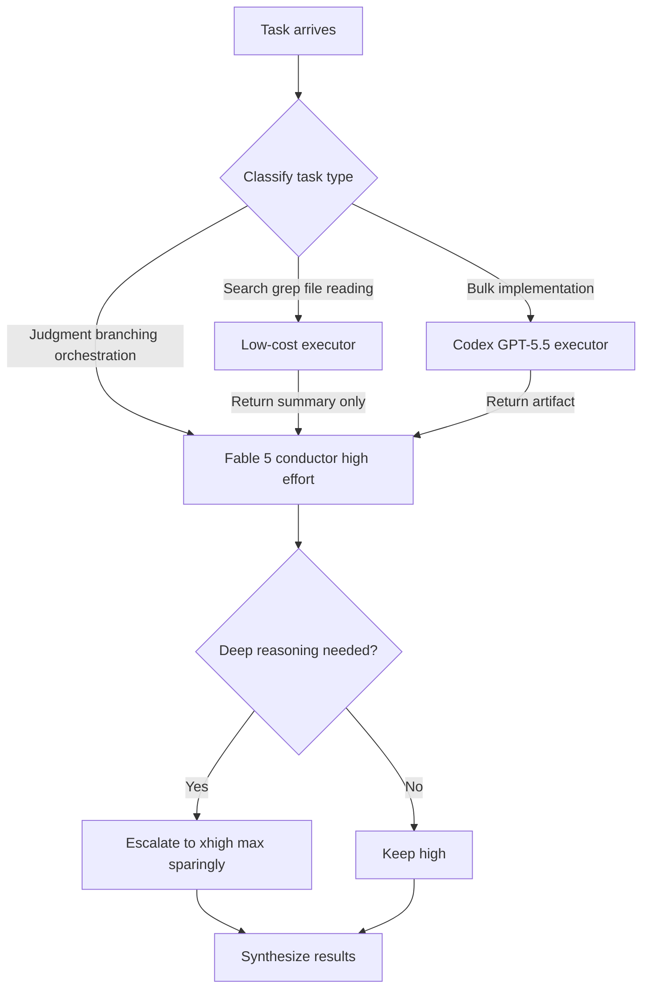

*A visualization of routing, where heavy and light work flow to different models.*

## Overview

Grabbing one powerful coding model and throwing every task at it is comfortable. The problem is that the comfort comes back as a token budget and rate limit bill. If you use the most expensive model even for the simplest tasks, your quota is empty by the time you actually need hard reasoning.

In early July 2026, T3 stack creator Theo (@theo) shared how he runs Claude Fable 5 all day without hitting rate limits. The point is simple. Instead of piling everything onto one model, split the model and effort by the nature of the work. In this post we walk through his four strategies with real quotes, and set them alongside the model routing discipline ThakiCloud already applies in operating Paxis and ai-platform.

Why this matters is clear. In an era where agents run autonomously for a long time, how you design the token flow across an entire session, rather than the quality of a single model call, decides real productivity and cost.

## The Problem: Rate Limits Are About Allocation, Not Quality

Users who hit rate limits often do so not because the model is weak but because their allocation is clumsy. If you run the top tier model at top effort even for low difficulty work like reading a single file, a simple grep, or summarizing a log, tokens burn not linearly but exponentially. Thinking tokens in particular pile up invisibly.

The key insight is this. The best model is a finite resource, and deciding where to spend it is exactly what routing means. Theo's four tips are all the same principle practiced from different angles.

## Theo's Four Strategies

### 1. Default to High Effort, Reserve xhigh and max

Theo says he uses Fable only on "high" effort for now. In his own words, xhigh is "token hungry," and max and extra are "a furnace with worse outputs than lower options."

The lesson here is that raising effort does not monotonically raise quality. As thinking tokens grow, the output can become scattered or take excessive detours. For most practical work, high is the balance point between quality and cost. Reserve xhigh and max for stages that genuinely need deep reasoning.

### 2. Orchestrate Codex as a Sub-Executor

The second strategy is to layer models. Theo taught Claude Code to call Codex (GPT-5.5) as a sub-executor for implementation work. By his observation, GPT-5.5 is highly steerable, so Fable can learn how to steer it.

In other words, Fable acts as a conductor handling judgment and branching, while repetitive, high-volume implementation is delegated to a cheaper executor. This way the expensive conductor model spends its tokens on judgment, and the implementation volume comes out of a different budget.

### 3. Declare Model Priority in CLAUDE.md

The third is to harden this routing into a contract rather than improvisation. Theo wrote a large section in his CLAUDE.md on which model to prioritize for which work, and how to allocate when orchestrating subagents and workflows.

This point matters especially. If you bake the routing rules into a document, you do not have to decide again each session, and the whole team shares the same allocation discipline. Turning a repeated prompt into a rule is a basic tenet of prompt hygiene.

### 4. Offload Token-Heavy Work and Retrieve Only Results

Finally, Theo runs token-heavy tasks (computer use, full codebase analysis, and the like) with other models, then has only the result reported back to Fable.

This ties directly to main context hygiene. If you dump a large exploration output straight into the conductor model's context, the cost of re-reading that large context on every subsequent turn grows linearly. If a sub-executor handles the heavy reading and passes up only a summary, the conductor model's context stays clean.

Drawn as a single flow, the four strategies look like this.

## Implications for ThakiCloud Products

Theo's tips read as a welcome confirmation because ThakiCloud's agent platform Paxis already stands on the same principle. Paxis is an Agent-Native Cloud control plane that runs on top of ai-platform, treating skills, tools, policies, and audit logs as first-class resources. Within it, model routing is not decoration but the backbone of the cost structure.

Our subagent routing discipline aims at exactly the same target as Theo's fourth strategy. Exploration and file reading go to the cheapest tier, implementation and review to the middle tier, and only architecture and complex multi-step reasoning to the top tier. Subagents do not push raw large outputs upward but return only a summary and file paths. This rule of keeping the conductor model's context clean is the same practice Theo described as "report only the results."

The second strategy of separating conductor and executor also touches the design of Paxis. The Paxis skill harness selects from more than 960 skills with BM25 and runs them in isolated sandboxes, where the orchestration layer handles only light judgment and heavy execution is isolated to separate workers. Using the expensive judgment model only for routing and synthesis, and placing the actual heavy lifting on cheaper workers, is the same picture as Theo putting Fable as conductor and Codex as executor.

The third strategy, hardening routing into documents and policy, is implemented in Paxis as policy gates and audit logs. When you fix which work should flow to which resource as an explicit rule rather than improvised judgment, the allocation discipline does not waver even as an autonomous agent runs for a long time.

At the infrastructure layer, the ai-platform lens works alongside. When serving models on K8s and Kueue based GPUs, flowing low difficulty requests to small models at low batch priority saves GPU time, and that saving flows back into agent economics. Lower serving cost creates the headroom to afford more aggressive routing. In short, low-cost serving (ai-platform) underpins the economics of agent orchestration (Paxis).

## Limitations and Counterarguments

This approach has weaknesses too. First, as routing grows complex, management cost appears. Weaving several models together means each has a different context window, price, and availability, making debugging harder. If the conductor misreads the executor's output, round trips increase and end up spending more tokens.

Second, "high is always best" is Theo's personal observation and varies by task type. For genuinely hard architecture judgments or subtle bug hunts, higher effort earns its cost. The rule is only a default, and the eye to judge exceptions is still required.

Third, orchestration that mixes models from different vendors widens the data flow and security boundary. When you hand codebase analysis to an external executor, you must control exactly what enters that model's context. This is precisely why Paxis passes every action through policy gates and audit logs.

In conclusion, rate limits are not a problem to push through with a more expensive plan but one to solve with allocation. Start cheap, use the expensive model only for heavy judgment, and harden that rule into documents and policy. This is the direction all four of Theo's tips point to, and the discipline ThakiCloud practices every day on Paxis.

## Sources

- Theo (@theo), "I've been getting a TON done with Fable today and I'm not hitting rate limits": [x.com/theo/status/2072481845363822914](https://x.com/theo/status/2072481845363822914)
- "T3 Stack creator Theo shares Fable AI workflow", digg.com: [digg.com/tech/wmowks0x](https://digg.com/tech/wmowks0x)
- "Fable Is Back. Here's How to Actually Code With It", Wavect: [wavect.io/blog/coding-with-claude-fable-5](https://wavect.io/blog/coding-with-claude-fable-5/)
