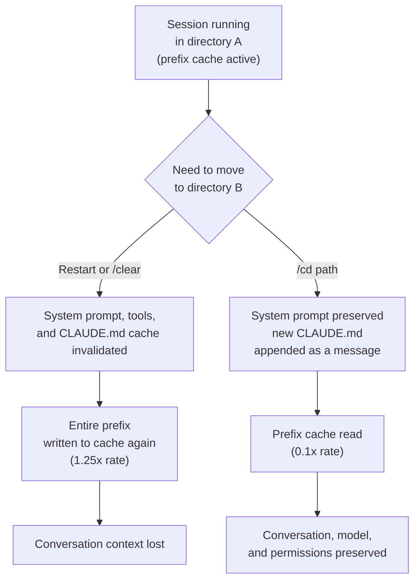

Anyone who works with a coding agent long enough eventually has to switch directories. The classic case is a monorepo: you fix something in a core module inside a shared library, then move to the service that consumes it to verify the integration. Until now, that meant closing the session and reopening it in the new directory, or clearing the context with `/clear`. Either way, all the conversation context you had built up disappeared, and a less visible cost kicked in as well: the prompt cache was invalidated entirely, so the next request got billed at the cache-write rate all over again. The `/cd` command, quietly added in Claude Code v2.1.169, prevents both of these losses at once. This post looks at why that one line is not just a convenience feature but a real question of coding agent operating cost, using the rates Anthropic has published.


## Overview

`/cd <path>` moves a running Claude Code session to a different working directory. Because the session is not restarted, the conversation history, the selected model, and the permission settings all carry over to the new directory intact. So far this sounds like an ordinary convenience feature. The real point is what happens next: `/cd` does not break the prompt cache. The first message you send right after switching directories gets billed at the cache-read price, not the cache-write price.

This distinction matters because of how steep the cache rates actually are. In Anthropic's published prompt caching rates, a cache read costs roughly 10 percent of the standard input price, or 0.1x. Writing fresh content into the cache, on the other hand, carries a 1.25x premium over the base input rate. When you restart a session, the system prompt, the tool definitions, and the project's `CLAUDE.md` all have to be written into a fresh cache. On a large project, that prefix can run to tens of thousands of tokens. `/cd` avoids rewriting that prefix; it simply reads and reuses it.

ThakiCloud runs multiple customers' agents and batch jobs on shared infrastructure in a multi-tenant environment. In that kind of setting, token economics is service cost. If a coding agent re-caches its prefix every time it switches directories, that cost accumulates in proportion to session count and switch frequency. A single behavior that preserves the cache, like `/cd`, adds up to a real saving at scale. That is why this feature is better understood as a matter of cost hygiene than as a handy shortcut.

## What Is This Technology

To see the value of `/cd`, it helps to first understand how the prompt cache works. Claude Code automatically caches the system prompt, tool definitions, and `CLAUDE.md` on every turn, with no configuration required. This cached prefix sits at the front of the conversation, and each new message is appended after it. As long as the cache is alive, that prefix is billed only at the read rate. Once the cache breaks, the entire prefix has to be written again.

Restarting a session or clearing context with `/clear` invalidates the cache. But switching directories has a hidden trap: the new directory has its own `CLAUDE.md`. Intuitively, you'd expect the cache to break the moment the `CLAUDE.md` that feeds into the system prompt changes. This is exactly where `/cd` is clever. Instead of rewriting the destination directory's `CLAUDE.md` into the system prompt, it appends it as the next message in the conversation. Because the system prompt is never rewritten, the cached prefix stays intact, and the new `CLAUDE.md` is simply handled as one more user message tacked on at the end. That is how it applies the new directory's rules while still protecting the cache.

The diagram below shows how the two paths handle the cache differently when you switch directories.



The key point in this diagram is that the right-hand path never touches the system prompt. The left-hand path rewrites the prefix and throws away all the conversation you had accumulated along with it. Both paths arrive at the same destination, but the cost you pay to get there is completely different.

The reason appending works is that prompt caching operates at the level of the prefix. The cache reuses however much of the front of the conversation, the prefix, is identical to before. If even a single character in that prefix changes, everything from that point onward has to be recomputed. That's why putting content that changes frequently near the front hurts the cache hit rate, while putting stable content at the front and letting variable content trail behind it keeps the hit rate high. `/cd` appending the new `CLAUDE.md` as a message at the end of the conversation, rather than folding it into the system prompt, is a design that respects exactly this principle. It leaves the cached prefix untouched and absorbs all the change outside the cache boundary.

## Installation and Integration

`/cd` requires no separate installation. It works out of the box on Claude Code v2.1.169 or later. The command shipped on June 8, 2026. Usage is straightforward.

```bash
# Move to another directory within the session
/cd ../consuming-service

# Absolute paths work too
/cd /Users/me/repo/apps/web

# Home-relative paths
/cd ~/repo/packages/core
```

Once you run the command, Claude Code updates the working directory, reads the `CLAUDE.md` at the new location and appends it to the conversation, then continues the work it was doing. Because the conversation history and every decision made so far are preserved, a follow-up request like "verify that the interface I just changed in the core module works from this service" flows naturally.

Here's a concrete example. ThakiCloud's platform workspace bundles seven product repositories, the Go backend, the frontend, GitOps deployment, the multi-cluster mesh, and more, as git submodules. Changing a backend API's response schema and then checking that the frontend consuming that schema still renders correctly is a routine task in this structure. In the old workflow, you had to close the backend session and open a fresh one in the frontend directory, and then re-explain to that new session exactly what you had just changed and why. With `/cd`, the flow never breaks.

```bash
# Working on a schema change in the backend submodule
# ...

# Move to the frontend that consumes that schema (context and cache preserved)
/cd ../ai-suite/apps/web

# Immediately ask: does this screen reference the field name I just renamed?
```

Right after the move, the frontend directory's `CLAUDE.md` gets appended to the conversation, so that repository's rules (things like FSD boundaries or TDS token usage) apply immediately. At the same time, the context built up in the backend, namely which field was changed and why, is still there, so you can go straight into verification.

To understand the cache economics, you need to look at the rate table. Below is a summary of Anthropic's published prompt caching rates.

| Item | Rate vs. Standard Input | Description |
|---|---|---|
| Cache read | 0.1x | Reuse of a cached prefix, a 90 percent discount |
| Cache write (5-minute TTL) | 1.25x | Writing a new prefix into the cache, recovered on the first read |
| Cache write (1-hour TTL) | 2.0x | Applies when `ENABLE_PROMPT_CACHING_1H=1` is set |
| Uncached input | 1.0x | Base rate |

One piece of context worth flagging: Anthropic quietly cut the default cache TTL from 60 minutes to 5 minutes in March 2026. If your next request doesn't arrive within 5 minutes, the cache expires and you pay the write cost again. If you're working with long gaps between requests, you might consider enabling the 1-hour option, but the write premium jumps to 2.0x, so it's a real trade-off to weigh. `/cd` is what keeps the cache alive while you continue a session within that TTL window, which makes it more important than ever in this shorter-TTL era.

## Real Experiment Results

To be honest, `/cd` is an interactive slash command, so it wasn't possible to spin up an actual session and run an interactive benchmark in the headless environment used to write this post. Rather than fabricate measurements, this section presents a cost model built purely from the published rates. The figures below are not measurements; they are calculations based on documented rates, and that distinction is stated explicitly.

Let's compare how the two paths bill the cached prefix on the first request right after switching directories. On the restart or `/clear` path, the prefix is rewritten to the cache at the write rate (1.25x). On the `/cd` path, the same prefix is reused at the read rate (0.1x). Assuming the prefix size is identical in both cases, the ratio of what you pay for the prefix right after the switch is 1.25 divided by 0.1, or 12.5x. In other words, the restart path costs roughly 12.5 times more than the `/cd` path for re-billing the prefix.


This ratio holds regardless of the prefix's absolute token count. The absolute savings, however, grow larger as the prefix grows. In large projects it's common [estimated] for the combined prefix of system prompt, tool definitions, and a hefty `CLAUDE.md` to reach tens of thousands of tokens, and in sessions like that, moving between directories several times a day makes the re-caching cost add up fast. `/cd` compresses that 12.5x premium per switch down to the read rate.

One more thing worth noting: what `/cd` preserves isn't only cost. The conversation context lost on the restart path is a cost that's hard to translate into tokens. Having to re-explain the intent behind code you just changed, hypotheses you'd already formed, or approaches you'd already ruled out, costs both human time and additional tokens. `/cd` removes that re-explanation cost as well.

## Implications for ThakiCloud Products

This feature is meaningful from the perspective of both ThakiCloud products.

From the Paxis angle, `/cd` addresses session hygiene for coding agents directly. Paxis is ThakiCloud's Agent-Native Cloud, treating skills, tools, policies, and audit logs as first-class resources and running agents in isolated sandboxes. A coding agent moving across multiple repositories and submodules is a common scenario on Paxis. If every switch restarted the session and re-cached the prefix, a large skill harness and its policy context would get re-billed every time. The approach `/cd` takes, preserving the prefix and appending only the directory-specific rules as a message, aligns well with Paxis's orchestration model, which keeps skill selection and policy gates intact while only the working path changes. The idea of appending context after the fact rather than rewriting the system prompt is the same principle behind managing an always-loaded rule layer with cache stability in mind.

From the ai-platform angle, cache economics is directly multi-tenant serving cost. ThakiCloud's ai-platform serves multiple customers' inference workloads on K8s and Kueue-based GPU scheduling. Prompt caching is the key lever for reducing input costs by reusing repeated prefixes, and the principle `/cd` demonstrates, appending context after the cached boundary instead of in front of it so the cache never breaks, applies equally to our own serving stack. Designing the prompt structure to minimize cache invalidation points is a direct path to a competitive cost position on serving. The two lenses reinforce each other: lower serving cost (ai-platform) makes agent economics work (Paxis), and cache-preserving agent behavior (Paxis) in turn reduces infrastructure load.

## Limitations and Counterarguments

`/cd` isn't a silver bullet. First, cache preservation only matters within the 5-minute TTL. If you step away for a long time after switching directories, the cache expires regardless of whether you used `/cd`, and the next request pays the write cost either way. Given the short TTL, `/cd`'s savings are largest in a continuous work session and shrink for intermittent work.

Second, appending `CLAUDE.md` as a message instead of folding it into the system prompt has a subtle catch. If you edit the original project's `CLAUDE.md` mid-session, that change doesn't break the cache, but it also doesn't take effect until you `/clear`, `/compact`, or restart. In other words, you can end up in a situation where you've changed the rules but the session hasn't picked them up, so you need to deliberately refresh the session after any rule change.

Third, the 12.5x savings ratio is strictly a documented-rate calculation for re-billing the prefix right after a switch. How much you actually feel that savings in the total session cost depends on the prefix's share of overall cost, conversation length, and how often you switch. Don't stretch this post's ratio into "your session costs 12.5x less." The precise claim is narrower: you don't have to re-cache the prefix at the moment you switch.

Even so, the conclusion is clear. If your work involves frequently moving between directories in a monorepo or across multiple repositories, `/cd` is the cheapest way to protect both your conversation context and your prompt cache at the same time. For any team that operates coding agents with cost in mind, this one line is worth turning into a habit.

## Sources

- [Manage sessions - Claude Code Docs](https://code.claude.com/docs/en/sessions)
- [How Claude Code uses prompt caching - Claude Code Docs](https://code.claude.com/docs/en/prompt-caching)
- [Claude Code /cd: Switch Projects Without Losing Cache](https://claudcod.com/blog/claude-code-cd-command/)
- [Original tweet (retweeted by @delba_oliveira)](https://x.com/hjguyhan/status/2074414356058763747)
