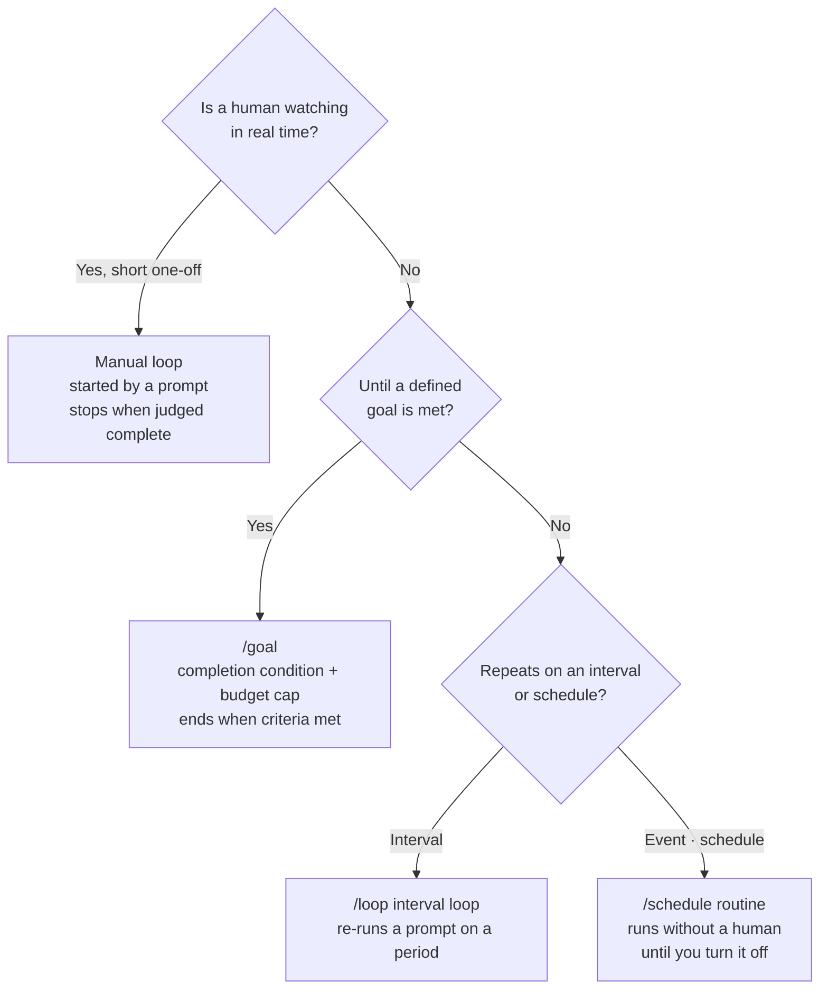

## Who Should Read This

This post is for developers and platform engineers who want to run a coding agent not as a one-shot tool but as a long-running automation system. It addresses practical questions like "what do I have to define so the agent repeats on its own instead of me typing every prompt?" and "how do I prevent infinite loops and runaway cost?" We read Anthropic's official loops document and overlay it with our own operational experience wiring these patterns into real unattended pipelines.

## Overview

Until now, using a coding agent has been a conversation. A person types a prompt, the agent responds once, and it stops. It waits for the next instruction. That works beautifully for short tasks, but it does not fit the flow of repetitive, well-bounded work like reflecting PR reviews, fixing CI, triaging issues, or upgrading dependencies, because a human has to stay attached, prompting every turn.

On July 7, 2026, Anthropic published an official document, "Getting started with loops," and named this shift: loop engineering. The document's core sentence is this: stop typing every prompt directly, and start designing the system that prompts the agent for you. This post reads the kinds of loops and stop conditions that document lays out, and follows through to how we actually wired these patterns into real unattended pipelines.

## What Loop Engineering Is

Loop engineering is the next step after prompt engineering. If prompt engineering is about refining "an instruction that gets one good response," loop engineering is about designing the repeating structure itself: observe, judge, act, observe again. What determines the quality of a good loop is not only the model's capability but the quality of the feedback the loop receives on each pass.

The most reliable feedback comes from deterministic verification that returns pass or fail objectively, like tests, type checkers, and linters. The model's self-report of "this looks done" cannot be the termination condition of a loop. When a loop should stop is decided by a tool's verdict, not the model's assertion.

## The Three Loop Types and /goal

The official document divides loops into three types. Which one to use splits on "is a human watching in real time?", "is there a defined endpoint?", and "does it repeat on a fixed schedule?"

First is the manual loop. It starts with a user prompt and stops when Claude judges the task complete or judges that it needs more context. It fits relatively short tasks that are not part of a regular process or schedule.

Second is the `/loop` interval loop. It re-runs a single prompt on a fixed interval. The document's example is: `/loop 5m check my PR, address review comments, and fix failing CI`, checking the PR every five minutes, reflecting review comments, and fixing failed CI.

Third is the `/schedule` routine. It is triggered by an event or a schedule, with no human watching in real time. Each task ends when its goal is met, but the routine itself keeps running until you turn it off. It fits well-defined streams of repeated work like bug reports, issue triage, migrations, and dependency upgrades.

Running through all three is `/goal`. `/goal` sets a completion condition and keeps Claude working toward it without a human prompting each step. It is a structure that holds a directional goal and converges via tool feedback.

## How to Design Good Success Criteria

A loop's success hinges on how well the success criteria are defined. The official document emphasizes three properties of a good success criterion.

First is verifiability. Claude must be able to confirm completion programmatically or through explicit observation. "All unit tests pass" is verifiable. By contrast, "improve the code" is not.

Second is a scope boundary. You must state what is in bounds and what is out. "Refactor the payment service without touching the database layer" is a scoped, safe goal.

Third is a success metric. Numbers help. "Reduce the API response time of the `/search` endpoint below 200ms" gives a concrete target. Deterministically judged criteria like tests passing, a Lighthouse score, or an empty queue work best.

And there is one more safety valve: the turn cap. Without a bound like "stop after five tries," a vague goal can burn a long time and many tokens as the agent decides whether it is "close enough." Including a turn cap in the completion condition is the simplest defense.

## Verification Gates and Skills

The principle the document returns to is that the quality of feedback determines the quality of the loop. This is where skills enter. A skill packages the verification procedure the loop runs on each pass into a reusable form, giving the agent a way to verify its own output. If a loop filters out nothing and only ever passes, that is a sign the verifier is broken.

This is where it matters most in practice. A fan-out loop that spreads many subtasks in parallel accumulates hallucinations if it merges results without a verification stage. For code work, the exit code of a test; for research or content work, an adversarial refutation vote must audit the results before moving to the next step. The common misreading when quality falls short is to bump the model to a more expensive tier, but the more common cause is the absence of a verification stage.

## Implications for ThakiCloud

This document is special to us because we already operate the patterns it describes in real unattended pipelines.

Three layers of loops run in our repository. First, pge-loop, which uses the compiler and the test runner as reward signals to repeat code transformations until tests pass. This implements the document's "verifiable completion condition" from `/goal` as the exit code of `make test-short`. Second, Goal Mode, which autonomously pursues a goal to a done state. With a state file, a budget cap, and a `check_cmd` gate, it follows the document's turn-cap and success-metric principles directly. Third, launchd cron runners that repeat at fixed times with no human, corresponding to the document's `/schedule` routines. Work that needs no human judgment each tick, like monitoring and content generation, runs on cron rather than keeping Claude resident, holding cost at zero.

This operating discipline is exactly the Paxis design philosophy. Paxis is ThakiCloud's Agent-Native Cloud control plane, treating skills, tools, policies, and audit logs as first-class resources. From a loop-engineering standpoint, Paxis provides four things: declaring schedule routines with natural-language Cron, assembling fan-out and verification stages with DAG multi-agents, selecting from over 960 skills via BM25 to run in an isolated sandbox, and passing every loop action through a policy gate and audit log. The document's principle that "fan-out without verification is dangerous" becomes an infrastructure feature in Paxis: the policy gate.

Beneath it, the ai-platform lens also operates. A long-running loop is ultimately an inference-cost problem. Holding a low serving cost on top of Kubernetes and Kueue-based GPU scheduling is the economic foundation that makes schedule routines sustainable. Low-cost serving creates the economics of agent loops, and on top of it Paxis owns the safety and assembly of the loops.

## Limitations and Counterarguments

Taking loop engineering as a cure-all is itself dangerous. The first limitation is unverifiable work. Loop a task whose success cannot be judged deterministically, and the agent burns budget with no termination condition. If you cannot define the gate first, a one-shot run, not a loop, is the right call.

The second limitation is cost. A long-session loop that re-reads a huge context on each tick sees cache-read cost grow linearly. Accumulating 24-hour monitoring into one session is especially expensive. The rule is to call the agent only when a human or event is present and to push simple polling to cron.

The third limitation is cognitive surrender. The deeper a loop goes, the more one tends to trust the results and stop reviewing. Automation is a tool that assists thinking, not one that replaces it. Core outputs must be sampled and reviewed by a human periodically, and if the verifier filters out nothing, that must be read as a failure signal.

These three limitations all reduce to one principle: define the exit gate before you start the loop. With a gate, a loop compounds quality; without one, a loop compounds hallucination.

## Sources

- Anthropic, "Getting started with loops" (2026-07-07): [claude.com/blog/getting-started-with-loops](https://claude.com/blog/getting-started-with-loops)
- Claude Code Docs, "Keep Claude working toward a goal": [code.claude.com/docs/en/goal](https://code.claude.com/docs/en/goal)
