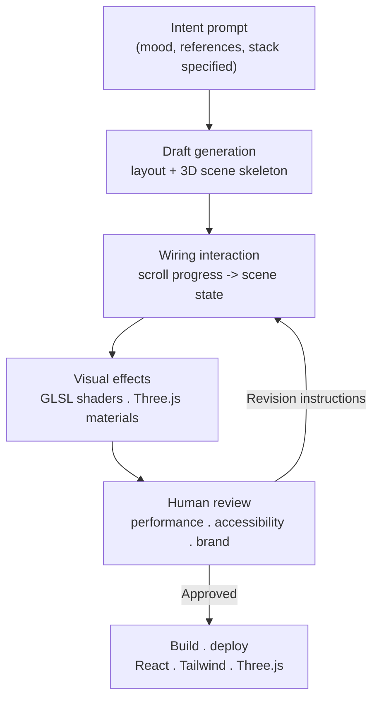

## Who should read this

This piece is for frontend developers and design engineers who build real product surfaces with AI coding tools, and for platform engineers trying to wire coding agents into a team's workflow. The claim that "AI can spit out a convincing landing page mockup" is old news by now. What we want to dig into here goes one level deeper: how far can a model actually get with interactions that used to take days to hand-code, things like a 3D scene that reacts to scroll position or a shader-driven background, and how do you actually put that output into a production pipeline. If you're weighing whether to adopt this, our goal is to draw a clean line between what's genuinely possible today and where a human still has to be in the loop, without the hype.

## Overview

For a long time, the wall AI-generated frontends kept hitting was "static." Pages with tidy buttons and cards came out fine, but interactions that tangle state and time together, a 3D scene where the camera moves with scroll position, or a glass material that refracts as you move the mouse, tended to break the model. Code would compile, but nothing would happen on screen, or the frame rate would stutter badly.

By the middle of 2026, that wall had visibly come down. Anthropic's Claude Fable 5 sits at the center of it. Developer Viktor Oddy published a public guide titled "Claude Fable 5 Just Changed Web Design Forever!" recording, start to finish, the process of generating a 3D, interactive, animated website from a single prompt. Since then, the community has gone further and produced an open-source gallery collecting UI experiments built with Fable 5. This post follows that thread to work out what has actually changed, and what it means for a company like ThakiCloud that treats agents as infrastructure.



The video above is Viktor Oddy's recorded walkthrough of building a 3D interactive web experience with Fable 5.

## What sets Fable 5 apart

Fable 5 is a Claude-family model from Anthropic that shows particular strength in frontend engineering and multi-step agentic work. That phrase, "multi-step," matters here. Building a single interactive web page is really a bundle of separate jobs: laying out the structure, defining 3D geometry, wiring scroll events to scene state, attaching shaders, organizing files, and tuning performance. Where earlier models would handle one or two of those steps and hand the rest back to a human, Fable 5 carries the chain forward on its own for much longer.

Concretely, a few capabilities show up again and again across public examples. First, it implements scroll-driven animation in code, wiring scroll progress to a scene's camera or element state, the kind of thing that's genuinely fiddly state management by hand. Second, it combines 3D libraries like Three.js with GLSL shaders to produce effects like refraction, noise, and particles. Third, it can take a screenshot as input and propose a redesign that improves an existing site's layout and interactions. Fourth, it organizes project file structure and assets on its own, carrying a single prompt through to a runnable result.

What these capabilities have in common isn't "generating static markup" but "generating code where state and time are entangled." That has been the weak link in AI frontend generation for a while, and it's the part Fable 5 has visibly pushed forward.

## How interactive web design actually gets built

Working backward from published guides and gallery results, the real workflow tends to follow the pattern below. Rather than expecting a perfect result in one shot, it hands the model big chunks of the work it's good at, and lets a human review and narrow things down from there.

The key is packing enough specificity about "what you want" into the first prompt. Naming the mood you're after, reference sites, and the stack you want to use (React, Tailwind, Three.js, for example) changes draft quality substantially. Including a screenshot raises redesign accuracy. Once a draft exists, interaction-level revision instructions, something like "slow the camera down near the bottom of the scroll," work well. In other words, this isn't a one-shot prompt that finishes the job. The model takes on the big skeleton, and a human tunes the texture of the interaction.

There's also a clear caution here. Flashy shaders and 3D come at a cost to mobile performance and accessibility. Even when a model's output looks great on desktop, handling low-end devices and screen reader users is still squarely a human job. Skip building that review step explicitly into the workflow, and you end up accumulating output that's pretty but unusable in production.

## Real examples and the open-source gallery

The evidence that this isn't one person's bragging sits in public material. Viktor Oddy's guide, mentioned above, recorded the entire process, and the community has published an open-source gallery, `pulkitxm/claude-directory`, collecting UI experiments built with Fable 5. The repository gathers examples of landing pages, hero sections, GLSL shaders, design systems, animation, and 3D built on React, Tailwind, and Three.js, and lets you open each result directly, code included. Being able to run individual experiments in a browser matters, because it means you can verify "does this actually work" by execution, not by looking at a screenshot.

Another example on record combines Fable 5 with Higgsfield MCP to build a cinematic scroll website. What's worth noting here is that the model isn't doing everything alone. It connects to an external tool (visual asset generation, in this case) through an MCP connector, and the two are merged into one result. That's a signal that interactive web generation is evolving from a single model's trick into the product of a pipeline where a model and tools mesh together.

Putting it together, here's what can be confirmed at this point. First, a single prompt produces a runnable draft of a 3D interactive web experience. Second, that result is verifiable, code included, in public repositories. Third, tool connections like MCP integrate asset generation into the pipeline as well. That said, none of these examples come with standardized, published quantitative performance benchmarks (frame rate, bundle size, accessibility score), so quality judgment still comes down to each team's own review criteria. That's worth treating as a plain fact rather than an "[estimated]" caveat.

## Implications for ThakiCloud's product

This trend lines up closely with the direction ThakiCloud is taking Paxis. Paxis is the Agent-Native Cloud control plane running on top of ai-platform, and it treats Skills, Tools, Policies, and Audit Logs as first-class resources. What Fable 5 demonstrates is that a coding agent has become a generation subject that carries multiple steps forward on its own, not just a single-shot responder. To put an agent like that into a product workflow, "where it runs, under what permissions, and what gets logged" starts to matter just as much as "what it generates."

Looked at from Paxis's angle, each stage of the workflow above reduces to a control-plane resource. A repeatable task like interactive web generation gets registered as a single skill, selected by BM25 out of a pool of roughly 960 skills, and the actual code generation and build run in an isolated sandbox. When an external tool is needed, as in the Higgsfield MCP example, the MCP connector handles even OAuth reconnection automatically. Before a generated artifact reaches production, policy gates enforce review rules, and every action lands in the audit log. In short, what a control plane does is take the individual trick of "AI is good at building screens" and promote it into a repeatable pipeline a team can trust and audit.

There's an infrastructure-level implication too. Frontends with 3D and shaders demand heavy rendering and repeated builds during generation. ThakiCloud's ai-platform, built on K8s and Kueue, schedules this kind of bursty work inside isolated tenants and manages cost by attaching and releasing resources only when needed. Being able to run this pipeline self-hosted on premises or in a sovereign environment matters in particular for customers who can't send code and design assets outside their own walls. Agent economics (Paxis) only work on top of a low-cost, stable generation and build infrastructure (ai-platform).

## Limits and counterarguments

Sticking to optimism would throw off the balance. A few counterpoints worth stating plainly.

First, the maintainability of generated interaction code is still an open question. A 3D scene produced from a single prompt is impressive, but whether someone else can understand and modify that state management logic months later is a different problem. Flashiness and maintainability are frequently at odds.

Second, performance and accessibility don't come along for free. As noted above, mobile frame rate, bundle size, and screen reader support aren't areas the model handles by default, and if you don't make them an explicit review gate, they end up as technical debt.

Third, there's a question of originality. If similar prompts produce similar 3D hero sections, you can end up with every site converging on the same mood, a kind of homogenization of "AI aesthetics." The more powerful the tool gets, the more human judgment about what to actually build matters.

Fourth, the absence of standardized quantitative metrics in public examples calls for some caution. There's no shortage of impressive testimonials about how different this feels, but reproducible, verified benchmarks are still thin. Before adopting this in production, it's worth reproducing the results yourself against your own stack and standards.

In conclusion, Fable 5 has genuinely lowered the barrier to generating interactive web experiences. But turning that output into a product you can trust remains a matter of review, policy, and infrastructure. And how a team closes that last stretch with a system is what separates teams that use the tool from teams that build the product.

## Sources

- Viktor Oddy, "Claude Fable 5 Just Changed Web Design Forever!" (guide video and article), <https://www.youtube.com/watch?v=_JF_s-ZRTyY>
- pulkitxm/claude-directory, an open-source gallery of UI experiments built with Fable 5 (React, Tailwind, Three.js, GLSL), <https://github.com/pulkitxm/claude-directory>
- "I Built a Cinematic Scroll Website Using Claude Fable 5 and Higgsfield MCP", Medium, <https://medium.com/@info.booststash/i-built-a-cinematic-scroll-website-using-claude-fable-5-and-higgsfield-mcp-72fbcebb8ad1>
