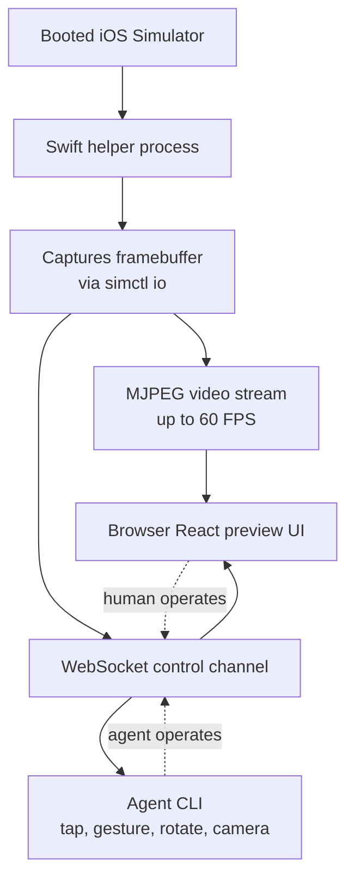

Ask an AI coding agent to build an iOS app and you run into one fundamental wall. The agent can write code and even build it, but it cannot actually see what happens on screen. The problem gets worse once you move your development environment to a Mac Mini in the cloud, because on a headless server with no GUI the Xcode Simulator window never even appears.

[serve-sim](https://github.com/EvanBacon/serve-sim), built by Evan Bacon of the Expo core team, aims straight at that wall. It became widely known after indie developer levelsio showed it off, saying it let him "watch, in a browser, in real time, an iOS app that Claude Code built on a cloud Mac Mini." Its slogan is simple: "npx serve for Apple Simulators."

## Overview

What makes serve-sim interesting is that it is not just a screen-mirroring tool. It opens two things at once: a video stream that sends the simulator screen to a browser, and a control channel that lets a browser or an agent operate the simulator. In other words, it makes both "watching" and "operating" possible remotely.

That combination matters because it completes the development loop for AI coding agents. An agent can fix code, build it, run it, look at the resulting screen, tap a button to move to the next step, and cycle through all of that without a human in the loop. This lines up exactly with what ThakiCloud's Agent-Native Cloud, Paxis, is aiming for: agents doing real work inside isolated environments. That makes it worth a closer look at how one open-source tool implements that workflow.


*A visualization of a headless server's simulator screen becoming a stream that flows into a remote browser.*

## What serve-sim Is

The way serve-sim works is simpler and more clever than it sounds. There is no separate Xcode plugin to install, and no instrumentation code to embed in the app. Instead it spins up a small Swift helper process that captures the framebuffer of an already-booted iOS Simulator through Apple's own `simctl io` interface.

The captured screen is exposed in two ways. First, it sends the video to the browser as an MJPEG stream at up to 60 FPS. Second, it opens a WebSocket control channel alongside it, so input from the browser side, taps and gestures, can be sent back to the simulator. On top of that sits a React-based preview UI, so a person can operate the app in the browser as if it were a real device.



The key point is that it targets "any booted simulator." Since it requires no modification to the app, it can be attached to an existing project as-is. It can also forward simulator logs to the browser, so browser-use style MCP tools can read those logs to judge state. There is even a convenience feature where dragging a video or image into the browser window adds it as a file on the simulator device.

## Installation and Use

The barrier to entry for serve-sim is low. On a Mac with Node.js, one line is enough.

```bash
npx serve-sim
```

Once running, you can view the preview at `http://localhost:3200` locally. It supports three modes: using it locally, connecting from another device on the same LAN, or hosting it on a remote Mac and reaching it from anywhere through a tunnel. levelsio's case is the third mode: running it on a headless Mac Mini in the cloud and viewing it through a remote browser.

Agent integration is provided as a separate Agent Skill. This skill, packaged at `skills/serve-sim` in the repository, teaches any host that implements the open Agent Skills standard, including Claude Code, Cursor, Codex CLI, and Gemini CLI, how to operate the simulator through the CLI. That includes taps, gestures, hardware buttons, screen rotation, injecting camera input, and handing the stream off to the host's own preview window.

## A Note on Reproduction

This post was written in a headless batch session with no GUI, where running Node.js is blocked by policy, so we were not able to run `npx serve-sim` directly ourselves and capture the screen. The commands and behavior described in this post are therefore based on facts confirmed in the repository README and the official announcement material, and we have not fabricated any benchmark numbers. Please verify the actual simulator streaming screen and latency yourself, on a macOS machine with a booted Xcode Simulator, using the commands above.

## Implications for ThakiCloud Products

On the surface, serve-sim is a tool for iOS developers, but underneath it sits a much bigger trend: agent-native development.

**Paxis lens (agent-native development).** ThakiCloud's Paxis is an Agent-Native Cloud control plane that runs skills in isolated sandboxes and passes every action through policy gates and audit logs. The open Agent Skills standard that serve-sim adopts is the same kind of contract model that Paxis's skill harness handles. The idea that a single skill can give "tap, rotate, and read the screen of a simulator" capability to multiple agent hosts points in exactly the same direction as Paxis's structure of selecting from 960-plus skills via BM25 and running them in isolation. In particular, workloads where an agent operates a real UI, like serve-sim's control channel, need those operations to pass through policy gates and be recorded in audit logs before they can safely go into production. If serve-sim provides the "capability," Paxis provides the layer that "safely governs" that capability.

**ai-platform lens (headless execution infrastructure).** What really makes serve-sim compelling is that it runs on a headless, remote Mac. The idea of building and streaming from a GUI-less server shares its philosophy with how ThakiCloud's ai-platform schedules and runs workloads on Kubernetes without a GUI. A pipeline that attaches macOS runners on demand for iOS builds, lets an agent automatically build and test on top of them, and streams only the results back to a human, could extend beyond CI into "agent-driven QA." It is a structure where low-cost headless execution infrastructure (ai-platform) underpins the economics of agent automation (Paxis).

## Limits and Counterarguments

A few things deserve a sober look.

First, serve-sim targets the simulator. Because it is a simulator and not a physical device, issues that only surface on real hardware, camera, sensors, performance characteristics, still go uncaught. The old limitation that passing on the simulator does not guarantee passing on a real device remains unchanged.

Second, MJPEG streaming is simple and compatible but not very efficient at compression. Continuously streaming a 60 FPS, high-quality feed over a remote tunnel can turn bandwidth and latency into a bottleneck. For gesture testing where responsiveness matters, network round-trip delay translates directly into input lag.

Third, an agent being able to "see and operate" the screen is a separate matter from that judgment being correct. It remains entirely possible for an agent to misread the stream and tap the wrong button, and this is exactly why policy gates and human review are needed. The more capability a tool opens up, the more important the layer that governs that capability becomes.

Even so, serve-sim's direction is clear. It has built a real bridge needed to move from "the agent only writes code" to "the agent builds, runs, and verifies by directly operating the screen." If you are a team trying to develop mobile apps with agents from a headless cloud, you can open that world right now with a single line: `npx serve-sim`.

## Sources

- Evan Bacon. "serve-sim: The `npx serve` of Apple Simulators." GitHub. <https://github.com/EvanBacon/serve-sim>
- @levelsio, tweet introducing serve-sim. <https://x.com/levelsio/status/2075328941317886210>
