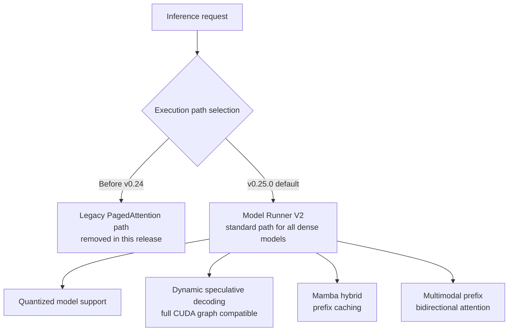

## Overview

vLLM is the de facto standard inference engine for serving open-weight LLMs in production. Thanks to its high throughput and broad hardware support, most teams that host their own models on their own GPUs run them through vLLM. A new release of an engine like this is never just a version bump. It changes how the entire serving stack is operated.

This post is written for engineers who run inference infrastructure directly or own serving costs. vLLM v0.25.0, released in 2026, contains 558 commits from 232 contributors, 64 of them new. The scale matches the intent: the new execution architecture the project has been building toward over several prior releases was promoted to the default in this one, and the old paths were cleaned up along the way.

The headline is two changes. First, **Model Runner V2 (MRv2) is now the default execution path for every dense model**. Second, the **legacy PagedAttention implementation that made vLLM famous has been removed**. This post covers what those two changes mean for anyone operating a serving fleet, and what the accompanying video and speculative-decoding features are good for.

## What This Release Changes

The biggest structural change is the promotion of MRv2. MRv2 was built up over previous releases while the team hardened quantized model support, and as of v0.25.0 it becomes the standard execution path for dense models. Most models now run on this new core without needing any special flags. The vLLM team describes MRv2 as a more modular, faster core, and this release locks it in as the default path.

The natural consequence of that shift is the removal of the legacy PagedAttention implementation. Now that the V1 and MRv2 backends are the standard path, there was no longer a reason to keep the old attention implementation around. PagedAttention, the technique that manages the KV cache page by page to cut memory waste, was something of a signature feature from vLLM's early days, but the idea itself has already been absorbed into the new backends. What was removed here is old code, not the concept.

Here is the shift in execution paths laid out visually:



## Key Changes in Detail

The features layered on top of MRv2 in this release mostly target multimodal and long-context workloads.

First, **Efficient Video Sampling (EVS)**. Vision-language models that handle video see their token counts explode as frame counts grow, which quickly wrecks memory and latency. EVS prunes tokens from spatiotemporal regions that are nearly static while preserving the positional identity of the tokens that remain. Because the number of retained tokens grows sublinearly with clip length, models can handle much longer temporal context without blowing past memory and latency budgets.

Second, **dynamic speculative decoding is now compatible with full CUDA graphs**. Speculative decoding uses a small draft model to propose several tokens ahead of time, which the main model then verifies, boosting throughput. Working alongside CUDA graph capture means you can now get the kernel-overhead savings of graph capture and the throughput gains of speculative decoding at the same time.

Third, there is an important tradeoff to know about. **Turning on EVS pruning automatically disables the video CUDA graph.** Because EVS makes the token count depend on the input data, it conflicts with CUDA graph capture, which assumes a fixed shape. In other words, choosing the token savings of long-video pruning means giving up CUDA graph optimization on that path. Which side makes sense depends on the workload, and teams need to make that call themselves.

The release also ships realtime embeddings, prefix caching for Mamba hybrid models, and bidirectional attention support for multimodal prefixes. As hybrid architectures built on Mamba become more common, prefix caching support for them is a concrete win that lowers the cost of repeated requests.

## Installation and Verification

vLLM v0.25.0 installs the standard way.

```bash
uv pip install vllm==0.25.0
```

The basic command for serving a model after installation hasn't changed.

```bash
vllm serve <model-id>
```

Since MRv2 is now the default path, you generally don't need to set any separate runner flags to serve dense models.

To be upfront about it, the environment we wrote this post in has no GPU, so we couldn't measure actual throughput or latency ourselves. That's why this post doesn't include any performance numbers we haven't measured firsthand. Every fact cited here comes from the official release notes: the commit and contributor counts, MRv2's promotion to default, the removal of legacy PagedAttention, and the characteristics of EVS and dynamic speculative decoding are all based on published release information. For real benchmarks, we recommend measuring on your own GPU cluster with your target models and traffic patterns.

## Implications for ThakiCloud's Products

This release lands directly on how ThakiCloud runs **ai-platform**. ai-platform schedules GPUs with K8s and Kueue and serves models to a range of customer environments through vLLM. Since vLLM is the core engine of our serving stack, a change in its execution architecture is also a change in how we operate.

MRv2 becoming the default means we can now concentrate our validation and optimization effort on a single standard execution path. When multiple paths coexist, bug reproduction and performance tuning fork along each one, but once a standard path is set, operational complexity drops. For a platform serving dozens of models concurrently in a multi-tenant environment, that simplification translates directly into stability.

The combination of dynamic speculative decoding with CUDA graphs, along with Mamba hybrid prefix caching, both push serving costs down. Lower serving costs are a direct competitive edge for customers who need on-premises or sovereign AI. The economics of the agents and applications running on top only work if the underlying infrastructure can serve cheaply. In that sense, ai-platform's low-cost serving is the foundation that supports the economics of higher-level agent layers like Paxis.

## Limitations and Counterpoints

The first thing to flag is that this release includes a breaking change. Because the legacy PagedAttention path was removed, any custom configuration or third-party integration that depended on it may break under v0.25.0. When bumping versions in production serving, you should actually spin up your target models in staging and check for regressions before rolling out. Deploying a new release straight to production just because it's new is risky.

Second, as with the EVS and CUDA graph tradeoff noted above, new features don't always come out as a pure win. Teams need to decide which optimizations to turn on or off based on their own workload characteristics, and that call is hard to make without real measurement. The expectation that "turning on every new feature makes things faster" often doesn't hold up in practice.

Third, the sheer size of the release is itself a risk. A release that bundles in 558 commits at once leaves more room for unexpected interactions. There may be issues that only show up with specific model architectures or hardware combinations, so it's worth not skipping validation on the exact model and GPU combination you actually serve.

In short, vLLM v0.25.0 is a release that locks in the results of long preparation as the default. Unifying around MRv2 and cleaning up legacy paths makes the serving stack simpler and faster over the long run, which is a direct benefit for ThakiCloud's ai-platform, which runs vLLM as its core engine. But capturing that benefit safely still requires the basics: validating breaking changes and measuring per-workload before you flip the switch.

## Sources

- vLLM v0.25.0 release: [github.com/vllm-project/vllm/releases/tag/v0.25.0](https://github.com/vllm-project/vllm/releases/tag/v0.25.0)
- Model Runner V2 introduction: [vllm.ai/blog/2026-03-24-mrv2](https://vllm.ai/blog/2026-03-24-mrv2)
- Efficient Video Sampling (EVS) paper: [arxiv.org/pdf/2510.14624](https://arxiv.org/pdf/2510.14624)
