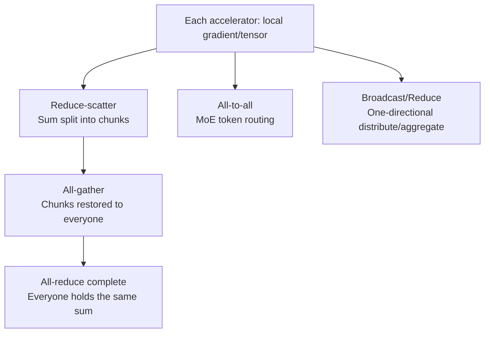

## Overview

It has been a while since large language models could fit on a single GPU. Models with tens of billions to trillions of parameters are split across tens or thousands of accelerators, and at every training step those accelerators have to reconcile each other's results. This "reconciling" process is collective communication, and in most modern distributed training workloads, the thing that actually eats up time isn't matrix multiplication, it's this communication.

This post is for infrastructure engineers training or serving models on GPU or TPU clusters, and for anyone responsible for serving cost and scalability. It takes Aleksa Gordic's widely read deep dive, "Inside TPU and GPU Clusters: The Anatomy of Collective Communication," as a starting point, and cross-checks the core concepts against standard references (NCCL, the TPU v4 paper, and so on) along the way.

Here's the headline summary up front. First, the performance of distributed training reduces down to a handful of collective operations. Second, the cost of the same operation changes completely depending on the physical topology it runs on (NVIDIA's switch-based fabric versus Google's torus structure). Third, which parallelism strategy you use determines which collectives get called, and how often. Understanding these three points explains why placing a handful of GPUs in a particular arrangement has such an outsized effect on performance.

## What Collective Communication Actually Is

A collective operation is a communication pattern that multiple processes (typically one per accelerator) participate in together. Where point-to-point (P2P) communication is one process sending to another single process, a collective has the whole group split and merge data according to a shared rule. A few of these show up over and over in distributed training:

- **All-reduce**: every participant's tensor is reduced element-wise (summed or averaged), and the result is sent back to everyone. This is the exact operation used to reconcile gradients in data-parallel training.
- **Reduce-scatter**: a sum is computed, but instead of one participant holding the whole result, it's split into chunks that get distributed across participants.
- **All-gather**: each participant's chunk is collected so that everyone ends up with the full set. This is the counterpart to reduce-scatter, and chaining the two together produces an all-reduce.
- **All-to-all**: every participant sends a different chunk of data to every other participant. This pattern is close to a transpose, and it's central to routing tokens to experts in mixture-of-experts (MoE) models.
- **Broadcast / Reduce**: one-directional operations where one participant sends the same data to everyone, or everyone's data is collected and reduced down to one participant.

One key insight here is that all-reduce is not an atomic operation. All-reduce decomposes into a **reduce-scatter followed by an all-gather**. This decomposition is the root of the cost formula we'll get to later.



## The Physical Structure of GPU Clusters

It's easiest to think of an NVIDIA-based cluster as two layers: within a node (scale-up) and between nodes (scale-out).

Within a node, **NVLink** and **NVSwitch** tie the GPUs together tightly. The eight or so GPUs inside a single server are wired through NVSwitch into something close to a full mesh, communicating at uniformly high bandwidth from any GPU to any other. This is exactly why work with extremely frequent communication, like tensor parallelism, gets confined inside this domain.

Between nodes, a leaf-spine (fat-tree) network built on **InfiniBand** or **RoCE** (RDMA over Converged Ethernet) is used. This scale-out fabric connects GPUs across racks and servers. A design that shows up often here is the rail-optimized topology: the same-numbered NIC on each node is attached to the same switch (a "rail"), so that inter-node all-reduce traffic passes through fewer hops at the spine layer.

That flexibility comes at a cost. The thousands of switches a scale-out fabric requires can consume roughly 5 to 10 percent of a cluster's total power [the estimated range varies by configuration], and they demand significant capital expenditure. In other words, instead of relying on any GPU being able to talk cleanly to any other GPU by default, NVIDIA's approach buys that uniformity by paying for switches that actively process packets.

## TPU Clusters Take a Different Path

Google's TPUs go a completely different route. Rather than an active switching fabric, TPU chips connect directly to their neighbors over a dedicated high-speed link called **ICI (Inter-Chip Interconnect)**. In the latest generation, each chip extends ICI links in six directions, plus and minus X, Y, and Z, forming a **3D torus** lattice (earlier generations used a 2D torus to build pods of 256 chips). Because chips only connect directly to their neighbors, most of the switching layer disappears.

That raises an obvious question: how do you connect chips that are far apart, or scale beyond a single pod? This is where the **optical circuit switch (OCS)** comes in. According to the TPU v4 paper, an OCS reconfigures optical fibers using MEMS mirrors rather than actively interpreting the optical signal, it just reflects it. That lets it reconfigurably connect up to 4096 chips while consuming far less power than an InfiniBand switch, since power is only needed to hold the mirror positions in place. It also allows one axis of the torus to be optically wrapped around, or lets the topology be rewired in software to route around a failed node.

Put simply, GPU clusters invest in active switches to buy uniform access, while TPU clusters lean on a neighbor-direct torus plus optical reconfiguration to save on power and cost. Neither approach is unconditionally superior. A torus is optimal for neighbor-to-neighbor traffic but adds hops for arbitrary long-distance communication, while a switch fabric is uniform but expensive and power-hungry.

## How Collectives Map to Parallelism Strategies

Which collective gets called, and how often, ultimately comes down to which parallelism strategy is in use.

- **Data parallelism (DP)**: each replica processes a different batch, then gradients are reconciled with **all-reduce**. Communication volume scales with model size and happens once per step.
- **Fully sharded data parallelism (FSDP/ZeRO)**: parameters are sharded and held in pieces, gathered with **all-gather** right before the forward pass, and split back apart with **reduce-scatter** after the backward pass. It saves memory at the cost of more frequent communication.
- **Tensor parallelism (TP)**: a single layer's computation is split across multiple GPUs, and the results are merged at each layer boundary with **all-reduce** or all-gather/reduce-scatter. Communication is extremely frequent, which is why confining it inside the NVLink domain mentioned earlier is practically mandatory.
- **Pipeline parallelism (PP)**: the model is sliced by layer and distributed across different GPUs, and activations are handed off between stages mostly via **P2P** transfers. Point-to-point communication dominates rather than collectives.
- **Expert parallelism (EP/MoE)**: tokens have to be routed to the accelerator holding the relevant expert, so **all-to-all** is central. As the number of participants grows, the number of communication pairs in an all-to-all grows quadratically, making it especially sensitive to topology.

In practice, these strategies are layered on top of each other. For example, a typical layout places TP inside a node's NVLink, DP's all-reduce over the inter-node InfiniBand, and PP spanning across both. Get the placement wrong, and frequent tensor-parallel communication leaks onto the slower inter-node links, slowing down the entire training run.

## The Rule That Governs Performance: Rings and Trees

There are several algorithms for actually implementing a collective, but from a bandwidth perspective, the best known is **ring all-reduce**. Participants are connected in a single ring, and at each step each one passes its chunk to its next neighbor, carrying out reduce-scatter and all-gather each over N-1 steps.

The total amount of data carried on each link works out to a well-known formula. For an all-reduce of a tensor of size S across N participants, the traffic per link is approximately:

```
2 x (N - 1) / N x S
```

That's because (N-1)/N x S flows during reduce-scatter, and another (N-1)/N x S flows during all-gather. The key property here is that as N grows, (N-1)/N converges toward 1, so traffic per link flattens out to roughly 2S. This is why ring all-reduce is called bandwidth-optimal, and it's why libraries like NCCL and Gloo have relied on it for a long time.

The problem is latency. A ring has to traverse N-1 sequential steps, so the fixed per-step latency (alpha) accumulates in proportion to the number of participants. When a lot of nodes are doing an all-reduce on a small tensor, bandwidth is left on the table while latency becomes the bottleneck. That's why real libraries automatically choose between ring and tree (or hierarchical) algorithms depending on tensor size and node count. Tree algorithms bring latency down closer to log(N) at the cost of some bandwidth efficiency, which is why NCCL selects different algorithms depending on message size.

The practical implication of this rule is clear. As you change batch size, model size, and node count, the dominant bottleneck shifts back and forth between bandwidth and latency. That's exactly why you can't assume "doubling the number of nodes doubles the speed" without benchmarking it.

## Implications for ThakiCloud's Products

This topic touches the heart of infrastructure, which makes it especially practical from the perspective of ThakiCloud's **ai-platform** (our Kubernetes-based AI/ML SaaS infrastructure).

First, **topology-aware scheduling**. ai-platform schedules GPU workloads with Kueue, and the placement principle of keeping tensor-parallel jobs inside the same NVLink domain (the same node) while routing a data-parallel job's all-reduce over rail-optimized inter-node links lines up exactly with the communication characteristics of the collectives covered here. You need to know which collective flows over which link before job placement can translate into performance.

Second, **tensor parallelism in serving**. When a large model is served across multiple GPUs with tensor parallelism using an engine like vLLM, an all-reduce fires at every layer. Placing pods so that this communication stays inside NVLink makes it much easier to hit latency targets, and crossing a node boundary noticeably raises per-token latency. In a multi-tenant environment, this kind of placement discipline translates directly into serving cost and SLA outcomes.

Third, **the economics of on-premises and sovereign cloud**. The fact that GPU switches account for a meaningful share of power draw means that when designing a cluster for an on-premises or domestic sovereign environment, networking isn't a minor add-on, it's a core variable in total cost of ownership (TCO). The self-hosting and cost efficiency ThakiCloud aims for only holds up on top of these network design decisions.

There's also a connection to **Paxis**, our agent orchestration product. When distributed training or large-scale inference jobs are coordinated as a DAG and executed in isolation, understanding the communication profile of the collectives each stage calls makes it possible to design more precise resource reservations and policy gates. That said, the center of gravity in this post is the infrastructure layer, so the ai-platform lens is the primary one here.

## Limitations and Counterarguments

This perspective has its counterarguments too. First, frameworks abstract collectives away quite a lot. With the higher-level APIs in PyTorch or JAX, most placement decisions happen automatically inside the library and scheduler, and application developers don't need to know these details. So if you ask, "does every team need to know torus and ring formulas," the honest answer is closer to no.

But the moment performance becomes a problem, this abstraction breaks down. When training runs slower than expected or serving latency spikes, finding the root cause eventually requires looking at which collective is flowing over which link. The abstraction is convenient on the happy path, but it turns into a leaky abstraction the moment you're diagnosing a bottleneck.

The rules laid out in this post also keep changing across hardware generations. NVLink and InfiniBand bandwidth, the number of TPU ICI links, and OCS scale all vary from generation to generation, so any concrete numbers should always be re-verified against the official documentation for that specific generation. The formulas and structures here provide a mental framework, but production decisions need to be closed out with real benchmarks. Finally, there's the practical gap where software fails to keep pace with hardware. Even a theoretically optimal topology is wasted if the kernels and communication libraries can't fully exploit it.

## Sources

- Aleksa Gordic, "Inside TPU and GPU Clusters: The Anatomy of Collective Communication": https://www.aleksagordic.com/blog/collective-operations
- NVIDIA NCCL documentation and the communication cost model for ring all-reduce (reduce-scatter + all-gather, bandwidth optimality)
- Google's TPU v4 paper, "TPU v4: An Optically Reconfigurable Supercomputer for Machine Learning with Hardware Support for Embeddings" (ICI 3D torus, OCS): https://arxiv.org/abs/2304.01433
