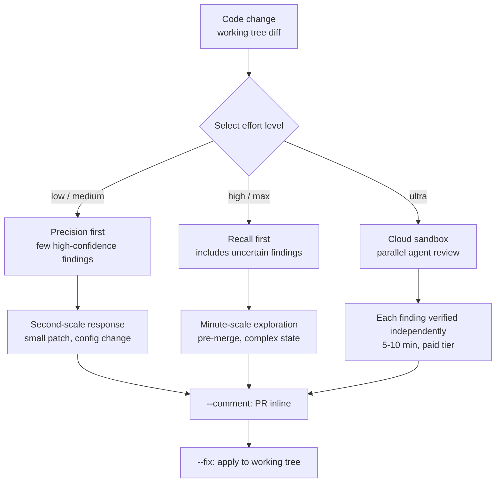

## Overview

There is a question people skip when choosing a code review tool: how much review does this change actually need? Running the same review intensity on a one-line typo fix and on a rewrite of payment logic is either wasteful or insufficient. Most automated review tools do not leave that choice to the user and operate at a single fixed intensity.

Claude Code addressed this directly in v2.1.101. The April 11, 2026 release renamed the existing `/simplify` command to `/code-review` and attached an effort level flag that governs how deeply the model reasons before answering. There are five levels, low, medium, high, max, and ultra, and the review itself is rewritten at each one. Shallow levels return fast, high-confidence findings; deep levels spend more time and sweep through edge cases and subtle regressions.

This post reads that design from the perspective of ThakiCloud, which operates AI coding agents. We look at why effort level is the right axis for splitting cost and quality in code review, when to pick each level in practice, and how the idea overlaps with the skill harness and verification loop of Paxis, our agent platform. The durations and costs cited below are all reported values from Anthropic's public documentation and release notes, not figures measured by ThakiCloud.

## What the feature is

`/code-review` is a slash command that reads the diff in your current working tree, finds problems, and reports them. The key change is that you can append a level to the command. Specifying a level like `/code-review low` makes the review engine adjust its exploration scope and reasoning depth to match. Omitting the level runs the default.

What matters is that the level is not simply "make the output longer or shorter." According to the documentation, low and medium return a small set of high-confidence findings, while high and max return uncertain findings alongside the confident ones. In other words, shallow levels prioritize precision and deep levels prioritize recall; the character of the review itself changes. This also matches the psychology of the person receiving the review. On a small patch, a handful of certain findings beats a long list padded with false positives; just before a merge, missing nothing is better.



## When to use each of the five levels

Choosing a level is a matter of weighing the risk of the change against the time you have left. Translating the character the documentation describes into practical intuition:

low and medium are for a quick sanity check. Use them before pushing a config edit or a small patch when you only want to filter out obvious correctness bugs. Responses come back in seconds, so you can run them habitually right before a commit without breaking your flow.

high and max are for code paths just before a merge or that carry complex state. Merging a feature branch into main, or touching areas like concurrency and transactions where subtle regressions hide, falls here. These levels spend more time verifying assumptions and digging through edge cases, so findings labeled "this may not be an issue but check it" appear alongside the certain ones. Whether you treat that uncertainty as noise or as a safety net depends on the situation. Just before a merge, the safety net is the right read.

ultra is a different kind of tool. We cover it separately below.

If you compress this ladder into one sentence, it says: match review intensity to the risk of the change. This is exactly the principle we follow when operating scheduled skills. Start cheap, and escalate only the failing task to an expensive tier. Running every review at maximum intensity wastes cost, and running every review at minimum intensity plants the seed of an incident.

## --comment and --fix: putting review into the workflow

Separate from effort levels, two flags wire the review into an actual workflow. `--comment` posts findings as inline comments on the PR, and `--fix` applies findings directly to the working tree.

```bash
# Broad pre-merge review with PR comments plus local application
/code-review high --comment --fix

# Deep cloud review, then apply results to the working tree
/code-review ultra --fix
```

The solo-developer workflow the documentation offers goes like this. Combine `--comment --fix` to leave findings on the PR and apply them locally, then eyeball the diff and push. It is a way to pass the first review pass automatically without waiting on a reviewer. That said, because `--fix` touches the code, a human must review the applied diff. Automatic application is not a replacement for review; it is preparation for it.

## ultrareview: cloud multi-agent review

The ultra level is unlike the other four that run locally. Running `/code-review ultra` bundles your repository state, uploads it to a remote sandbox, and lets specialized reviewer agents analyze the code in parallel there. Each agent focuses on a different class of issue, and findings are independently verified one by one. According to the documentation, a run takes five to ten minutes, and after three free runs for Pro and Max subscribers, each run costs five to twenty dollars.

Two design decisions stand out here. First, the review is handled as a fan-out of several specialized agents rather than a single agent. Since one reviewer struggles to catch every class of defect equally well, splitting perspectives by issue type widens coverage. Second, each finding is verified independently. A fan-out on its own risks accumulating hallucinations, so it must be closed with a verification stage before merging. ultra implements both principles as a product feature.

## What this means for ThakiCloud products

The design principles of this feature overlap strikingly with what we have practiced operating an agent platform. We split it across our two products.

**Paxis lens.** Paxis is ThakiCloud's Agent-Native Cloud, treating Skills, Tools, Policies, and Audit Logs as first-class resources. The question `/code-review` poses is the same one the Paxis skill harness solves every day: which intensity of agent do you attach to which task? Paxis selects from over 960 skills via BM25 and runs them in isolated sandboxes, and the same idea as effort levels operates here. Light work like exploration and lookup goes to a cheap tier; heavy work like architectural judgment and verification goes to an expensive tier. ultra's multi-agent parallel review and per-finding independent verification share the same structure as the way Paxis closes fan-out results with a verification stage. A fan-out without verification accumulates hallucinations, and a verification gate stops it. If code review runs as one isolated agent skill whose results pass through policy gates and audit logs, that is exactly the operating model Paxis aims for.

**ai-platform lens.** The fact that ultra offloads the review to a cloud sandbox and charges per run reconfirms that agent workloads ultimately run on GPU and isolated-execution infrastructure. ThakiCloud's ai-platform provides K8s and Kueue based GPU scheduling, multi-tenant isolation, and on-premises serving. A workload that spins up a fleet of reviewer agents in parallel is exactly the kind of work such infrastructure targets. For organizations reluctant to upload source code to an external cloud in particular, the option to run the same multi-agent review pattern inside their own infrastructure becomes important. Because agent economics only hold when low-cost serving and isolated execution are in place, the two lenses complement each other.

## Limitations and counterarguments

Effort levels are not a cure-all. A few honest counterarguments.

First, the level choice itself depends on the user's judgment. Misreading the risk sends an important change through as low, or wastes ultra on a trivial one. The tool provides the axis; positioning yourself correctly on it is still up to the human.

Second, the uncertain findings that high and max produce are a double-edged sword. They can act as a safety net, but if false positives pile up they cause review fatigue and you end up ignoring the list. How much to trust an unverified finding depends on the team's discipline.

Third, ultra uploads the repository to a remote sandbox. For organizations with sensitive source, that alone is an adoption barrier. And the five-to-twenty-dollar cost per run is heavy to run often, so the team has to compute its own economics past the three free runs.

Fourth, automatic `--fix` does not replace review. Pushing without checking the applied diff lets convenient-looking automation slip in silent bugs instead. Automation is a tool that assists thinking, not one that replaces it.

Even so, the idea of effort levels points in the right direction. Matching review intensity to the risk of the change is exactly the cost-quality balance we learned operating agents.

## Sources

- [Code Review - Claude Code Docs](https://code.claude.com/docs/en/code-review)
- [Claude Code Review: How to Use /code-review and Ultrareview - Fastio](https://fast.io/resources/claude-code-review-guide/)
- [Claude Code Effort Levels Explained - MindStudio](https://www.mindstudio.ai/blog/claude-code-effort-levels-explained)
