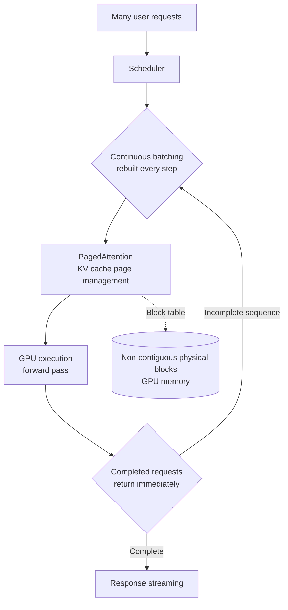

## Overview

Any team that has taken a large language model into production eventually learns one thing. What determines a service's latency and cost is not which model you chose, but what you serve it with. On the same GPU, with the same model, throughput per second can differ by several times depending on the inference engine. And a several fold difference in throughput means a several fold difference in the number of GPUs needed to handle the same traffic, which directly changes the order of magnitude on your infrastructure bill.

This post covers vLLM, which has become the de facto standard for production LLM serving today. We will walk through what problem vLLM was built to solve, what its core techniques, PagedAttention and continuous batching, actually do, and what you need to watch for when running it reliably on Kubernetes. ThakiCloud operates this engine across both on premise and managed environments for our customers, so we will go beyond a conceptual explanation and write this from an operator's point of view.

## What Is vLLM

vLLM is an open source inference engine released by researchers at UC Berkeley in 2023. Its goal is simple and clear: make LLM inference faster and cheaper. Since its release it has spread quickly and is now the default choice underlying production inference at organizations including Meta, Mistral, Cohere, and IBM.

What vLLM targets is two kinds of waste hidden inside traditional inference. One is memory fragmentation, the other is GPU idle time. Neither is obvious on the surface, but together they leave a large portion of expensive GPUs sitting idle. vLLM's two core techniques, PagedAttention and continuous batching, each target one of these two forms of waste head on.

Here is the overall structure laid out first.



## PagedAttention: Eliminating Memory Waste

As an LLM generates tokens one at a time, it stores the keys and values it has already computed. This is called the KV cache, and the longer the sequence, the more GPU memory it consumes. The problem is that the traditional approach reserves memory up front for each request, sized for the expected maximum length, and does so as one large contiguous block. If the actual response ends up shorter, much of that reserved memory simply goes to waste. When many requests arrive at once, this waste accumulates, to the point where a GPU with free memory available still cannot accept a new request.

PagedAttention borrows its idea directly from how operating systems manage RAM, namely virtual memory and paging. Instead of reserving the KV cache as one large block, it splits it into small, reusable pages. Each sequence's logical blocks are mapped, through a block table, to non-contiguous physical blocks inside GPU memory. This means only as many pages as actually needed get allocated, which sharply cuts memory waste. According to vLLM's own materials, this approach can reduce memory waste by up to 90 percent.

There is a significant side benefit too. In complex decoding scenarios that branch out from a single prompt, such as parallel sampling or beam search, vLLM does not need to duplicate the prompt's KV cache. Multiple logical blocks can point to the same physical block, and a copy is only made when one of them needs to modify that block, a copy-on-write scheme. This lets requests that share the same prefix context coexist while saving memory.

## Continuous Batching: Keeping the GPU Busy

The second kind of waste is wasted time. Traditional static batching groups requests into a batch and processes them together, and will not start the next batch until every request in the current one is done. The problem is that requests generate wildly different numbers of tokens. A request producing a short answer finishes early, but still has to wait until the longest request in the batch is done. In the meantime, the GPU slot that the finished request used to occupy sits idle.

Continuous batching removes this wait. The scheduler makes decisions at the granularity of an iteration rather than a batch, that is, at every forward pass. As soon as a request finishes in a given step, its slot is immediately filled with a new request from the queue. Because in-flight requests and new requests are dynamically mixed at every step, the GPU is almost never idle. This approach is reported to raise throughput on the same hardware by 3x to 10x.

Applying PagedAttention and continuous batching together is commonly observed to improve throughput by roughly 2x to 4x over a naively implemented serving stack. The two techniques complement each other. For continuous batching to slot in a new request at every step, it needs memory it can attach and detach just as flexibly, and that flexibility is exactly what PagedAttention provides.

> The figures above come from the vLLM project and various benchmark reports, and actual gains vary depending on model size, sequence length distribution, and hardware. You should measure the exact numbers for your own environment against your own workload.

## How It's Used in Production

Once you understand the concepts, actually running it in production is surprisingly mundane. vLLM ships with an OpenAI-compatible server by default, so code that used to call an external API often works unchanged once you just swap the endpoint address.

The simplest way to start the server looks like this.

```bash
# Install vLLM (CUDA environment)
pip install vllm

# Start the OpenAI-compatible server
vllm serve meta-llama/Llama-3.1-8B-Instruct \
  --tensor-parallel-size 1 \
  --max-model-len 8192 \
  --gpu-memory-utilization 0.90
```

Calls to it use the existing OpenAI client as-is.

```python
from openai import OpenAI

client = OpenAI(base_url="http://localhost:8000/v1", api_key="EMPTY")
resp = client.chat.completions.create(
    model="meta-llama/Llama-3.1-8B-Instruct",
    messages=[{"role": "user", "content": "Explain vLLM in one sentence"}],
)
print(resp.choices[0].message.content)
```

The part that actually requires attention in production is not the server startup command itself, but the operational parameters around it. In particular, you need to pay attention to the following.

- `--gpu-memory-utilization`: the fraction of GPU memory to use for the KV cache. Set it too high and you risk sudden out-of-memory errors. Set it too low and you reduce how many requests you can serve concurrently.
- `--tensor-parallel-size`: the tensor parallel size used to split the model across multiple GPUs. This is required when serving a large model that does not fit on a single GPU.
- `--max-model-len`: the maximum context length. The longer you set it, the larger the KV cache per request grows, which trades off against concurrent throughput.

Running on Kubernetes adds scheduling and resource management on top of this. GPUs are expensive and finite, so as soon as multiple teams and multiple models share a cluster, resource contention shows up immediately. This is where queue-based batch scheduling comes in. ThakiCloud places Kueue at this layer to manage, as policy, which workload gets to occupy how much GPU and when.

## Implications for ThakiCloud's Products

ThakiCloud's ai-platform is a Kubernetes-based AI/ML SaaS infrastructure, and serving models across our customers' diverse environments is a core capability. vLLM is the default engine at this serving layer. The throughput gains that PagedAttention and continuous batching create translate directly into lower serving costs, and that is what lets us offer our customers competitively low serving costs.

The value of this combination is especially large in on-premise and sovereign environments. Customers who cannot send data outside their own infrastructure have to run models within their own GPU infrastructure, and in that setting, squeezing the maximum possible throughput out of each GPU is what determines whether adoption is even feasible in the first place. If an inference engine uses a GPU twice as efficiently, it means you can run the same service on half the hardware.

From an operational standpoint, the value ThakiCloud adds is not the engine itself but the scaffolding around it: GPU queue management through Kueue, multi-tenant isolation, autoscaling and observability, and a policy layer that lets multiple models safely coexist on a single cluster. If vLLM is responsible for the efficiency of a single server, the platform is responsible for making dozens of those servers something an entire organization can share reliably.

## Limitations and Counterarguments

vLLM is not a silver bullet. It comes with a few honest limitations.

First, vLLM's strength shows when throughput matters, that is, when it is handling many concurrent requests. Conversely, in a low-load situation where requests come in one at a time, sparsely, the benefit of continuous batching is not as large, and a different approach specialized for latency optimization may work better. You need to first understand whether your own traffic pattern looks like high-volume concurrent requests or sparse, one-off requests.

Second, the numbers PagedAttention and continuous batching deliver depend heavily on the workload. For very long or very short sequence lengths, or on certain hardware, the reported gains may not reproduce as-is. Adoption decisions must be based on actual load testing that represents your own workload, and you should not assume that a multiplier someone else reported will automatically be yours.

Third, as the engine gets more efficient, the bottleneck actually shifts upward, toward scheduling and multi-tenant operations. No matter how much you optimize a single server, the problem of multiple teams competing for GPUs has to be solved at the platform layer, not the engine layer. vLLM is an excellent starting point, but it is not the finish line, and production's real hard problems start right after it.

## Sources

- [vLLM Explained: PagedAttention and Continuous Batching (RunPod)](https://www.runpod.io/articles/guides/vllm-pagedattention-continuous-batching)
- [LLM Serving Optimization: Continuous Batching, PagedAttention, and Chunked Prefill (Spheron)](https://www.spheron.network/blog/llm-serving-optimization-continuous-batching-paged-attention/)
- [vLLM Production Deployment (Introl)](https://introl.com/blog/vllm-production-deployment-inference-serving-architecture-guide)
- [vLLM: Deploying LLMs at Scale (LearnOpenCV)](https://learnopencv.com/vllm-deploy-llms-at-scale-paged-attention/)
