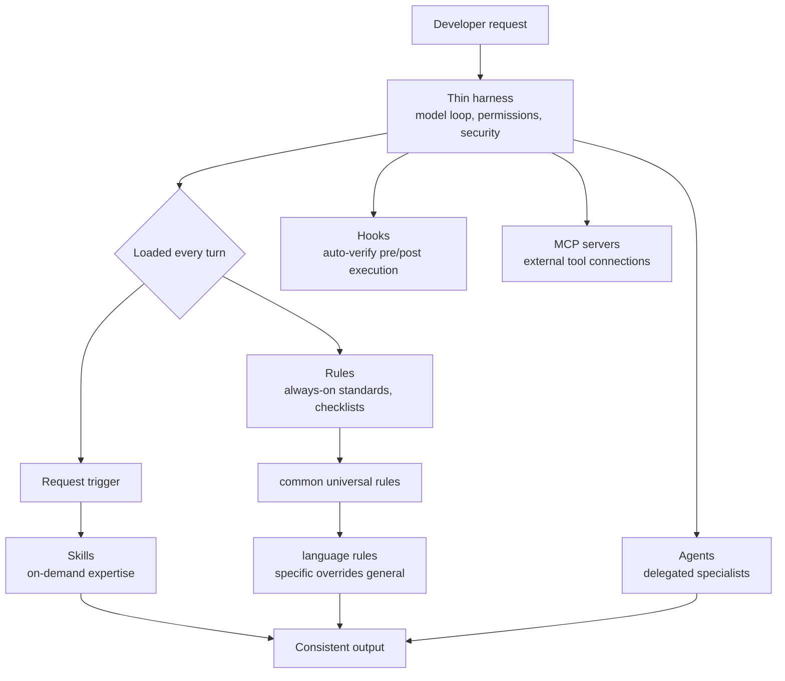

## Overview

Any developer who uses an AI coding tool seriously for a few days hits the same wall. Yesterday you clearly told it "this project commits like this, do not touch that folder, run tests with this command," yet today, when you open a new session, the tool remembers none of it. You paste the same rules again, and you revert the same convention-breaking code again. The smarter the model gets, the more frustrating this gap becomes: the capability is there, but there is no skeleton to make that capability apply your rules consistently.

`everything-claude-code` is an open-source configuration collection that tackles exactly this skeleton. An Anthropic hackathon winner open-sourced the entire production-grade config they refined for over six months while running a real TypeScript microservice project, and the repository quickly gathered stars after release (around 9,700 per the source tweet, [estimated]). This post walks through what the repository contains, the design principles it stands on, and how those principles connect to the agent platform ThakiCloud is building. ThakiCloud has adopted this repository's rule set as an actual internal standard, so this is a hands-on take rather than a mere introduction.

## What everything-claude-code Is

`everything-claude-code` (ECC for short) describes itself as "the agent harness performance optimization system." It bundles six kinds of configuration assets: subagents that handle delegated tasks (agents), on-demand bundles of specialized knowledge (skills), hooks that automatically intervene before and after tool execution (hooks), slash commands wrapping repeated work (commands), always-on rules (rules), and MCP server configs that connect external tools (MCPs).

Crucially, this is not some hobby project's config. The author won the Anthropic x Forum Ventures hackathon in September 2025 by building a product using only Claude Code, then honed this config for over ten months while shipping real products every day. The quality metrics the repository states are concrete: 1,282 tests, 98% coverage, and 102 static-analysis rules. The very fact that a configuration collection carries this level of discipline is evidence that the author separates "rules to hand the AI" from "code that verifies those rules are kept."

Another trait is harness neutrality. ECC is designed to work not only in Claude Code but also in other coding agents like Codex, Opencode, and Cursor. The idea of reusing the same rules and skills across multiple tools is a natural consequence of the design philosophy discussed below.

## Architecture: Thin Harness, Fat Skills

ECC's heart is a single principle: **build capability into skills, not into the harness.** The harness itself, meaning the execution skeleton of the model loop, file access, permissions, and security, is kept minimal, while domain knowledge, judgment criteria, templates, and failure cases are stacked thickly into skills and rules. That is what lets the same skill work across many harnesses, whether Claude Code or Cursor.

This philosophy leads directly to two practical distinctions. First, the role separation between Rules and Skills. Rules are broad, always-applied standards and checklists, such as "test coverage of 80% or higher" or "no hardcoded secrets." They load every turn. Skills, by contrast, are execution knowledge needed deeply for a specific task, loaded only when a request calls for them. Rules define *what* to do; skills tell you *how*.

Second, rules themselves are stacked in layers. The `common/` directory holds language-agnostic universal principles (coding style, git workflow, testing, security, and so on), and above it, language-specific directories such as `typescript/`, `python/`, `golang/`, and `web/` extend or override the universal rules. Precedence works like CSS specificity or `.gitignore` rules: the more specific rule beats the more general one. For example, the universal rules recommend immutability as a default principle, but Go's language-specific rules state that struct mutation via pointer receivers is idiomatic, overriding just that point.

The overall structure looks like this.



You can start to see how this structure solves the earlier "forgets rules every time" problem. Rules load automatically every session, so developers do not have to re-paste conventions. Skills load only when needed, so they do not waste the context window. Hooks verify at the code level whether a tool broke a rule. In other words, deterministic checks enforce quality rather than relying on the model's self-report.

## How You Actually Adopt It

There are two adoption paths. The easiest is to install it through the Claude Code plugin marketplace. The more direct path is to clone the repository and copy only the assets you need into your own Claude config directory. To avoid breaking the layered structure, copy at the directory level.

```bash
# Create the ECC rule namespace once.
mkdir -p ~/.claude/rules/ecc

# Copy the universal rules (required for all projects).
cp -r rules/common ~/.claude/rules/ecc/

# Copy language-specific rules matching your project stack.
cp -r rules/typescript ~/.claude/rules/ecc/
cp -r rules/golang ~/.claude/rules/ecc/
cp -r rules/web ~/.claude/rules/ecc/
```

Here the repository explicitly warns about a common mistake. Do not flatten-copy with a wildcard like `rules/common/*`. The universal and language-specific directories contain files with the same names (`coding-style.md`, `testing.md`, and so on), so flattening makes the language file overwrite the universal file and breaks the relative reference (`../common/`). To keep the hierarchy, you must copy entire directories.

MCP server configs need separate handling. Pull only the server configs you need from `mcp-configs`, but the key point is **not to enable them all at once**. The repository warns strongly here, because too many attached tools can shrink a 200k context window down to an effective 70k. Each enabled MCP server pays a schema cost every turn, so you need the hygiene of enabling only the servers you actually use.

Hooks are the core of the automation the repository emphasizes. For instance, connect a hook that runs a formatter after editing files, a hook that checks file size before commit, and a hook that verifies the production build at session end to your project's existing tool entrypoints. Hooks that run one-off remote packages are discouraged; using repo-owned local dependencies is the recommended way.

## Implications for ThakiCloud's Products

The design principles ECC raises overlap strikingly with what ThakiCloud builds. Let me split this into two lenses.

**Paxis lens (agent platform).** ThakiCloud's Paxis is an Agent-Native Cloud control plane running atop ai-platform, treating Skills, Tools, Policies, and Audit Logs as first-class resources. ECC's "thin harness, fat skills" philosophy is precisely the model Paxis productizes. Paxis's Skill Harness selects from more than 960 skills via BM25, executes them in isolated sandboxes, and passes every action through policy gates and audit logs. In other words, the layers of rules, skills, and hooks that ECC manages by hand in an individual developer's `~/.claude` directory, Paxis lifts to a multi-tenant cloud level of automatic selection, isolated execution, policy enforcement, and audit. Paxis can be seen as the operational, platform-scale form of the principles ECC validated in a personal workflow. ECC's insight that "rules load every turn and pay rent" carries straight into Paxis's design of loading skills on demand only and filtering noise via BM25.

**ai-platform lens (infrastructure).** The idea of layered rules applies just as well to infrastructure standardization. Just as ECC separates universal rules from language-specific rules, ThakiCloud's ai-platform separates organization-wide defaults from per-cluster and per-tenant overrides. Defining infrastructure standards like K8s, Kueue GPU scheduling, and vLLM serving once and applying them consistently across many customer environments, while overriding environment-specific quirks at lower layers, is the same shape as ECC's rule-precedence model. The stronger a customer's on-premises and sovereign requirements, the more the discipline of "enforce a standard defined once, yet override it safely per environment" translates into operational reliability.

In short, ECC is the essence of harness hygiene hand-crafted by an individual, and ThakiCloud builds products where the platform keeps that hygiene automatically. Low-cost serving (ai-platform) creates the economics of agents, and on top of it, skill execution with policy and audit (Paxis) creates trust.

## Limits and Counterpoints

For balance, let me note the other side. First, ECC is a config that strongly reflects one person's taste and workflow. It is the result of refining a particular TypeScript microservice for six months, so copying it wholesale onto a different stack or a different team culture can create friction instead. That is why the repository repeatedly warns not to copy-paste as-is but to adjust to your project's needs.

Second, the thicker the config, the higher the maintenance cost. Rules loading every turn means consuming tokens every turn. As you add rules and skills, you must continually ask "does this really need to be in every session?" or the context budget quietly leaks away. ECC itself addresses this with the discipline that "every line must pay rent," but keeping the discipline is ultimately a human's job.

Third, harness neutrality is an ideal, not a guarantee. The promise that the same skill works identically in Claude Code and Cursor holds only when each harness's tool surface and permission model are actually compatible. If hook execution or file-access rules differ per harness, a neutrally written skill can quietly diverge on a particular harness.

Even so, ECC's value is clear. Quality problems in AI coding tools usually arise not because the model is weak but because there is no rule-and-verification skeleton wrapping the model. ECC published that skeleton in a battle-tested form, and ThakiCloud is on the path to lifting the same principles to platform scale. For any team looking to hand code to AI, this repository's message, "inspect the harness before you swap the model," is worth keeping in mind.

## Sources

- [everything-claude-code (affaan-m/everything-claude-code), GitHub](https://github.com/affaan-m/everything-claude-code)
- Author profile related to [zenith.chat](https://zenith.chat/), the Anthropic x Forum Ventures hackathon winner
- Original tweet: @Ryrenz (RT @hjguyhan), 2026-07-20
