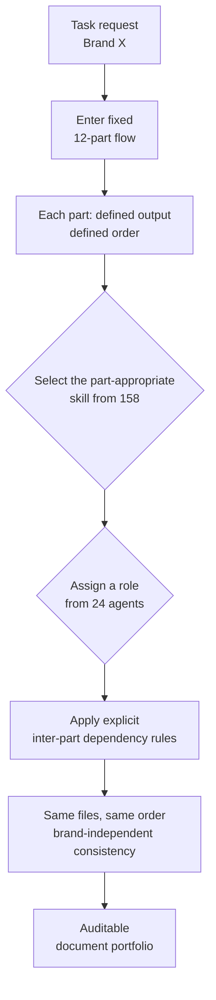

## Overview

Anyone who has built a serious agent system runs into the same paradox. Adding more skills and agents feels like it should make the system smarter, but often it does the opposite. Once you pass a few dozen skills, the agent starts getting confused about which skill to use when, and once there are several agents, they handle the same task differently or the order and format of outputs drift every run. Capability goes up while consistency of results goes down.

The open-source marketing plugin **Digital Marketing Pro** is an interesting case that tackles this paradox head on. It bundles 158 skills and 24 specialist agents (the repo docs list 25; the original tweet said 24) and still keeps the consistency of producing the same files in the same order every time. The trick is not a smarter model but a strategy flow fixed into 12 parts, a deterministic skeleton. This article dissects not the marketing tool itself but the agent engineering design inside it. What structure survives even when skills explode in number, and how that principle connects to the agent platform ThakiCloud is building.

Why this case matters to developers is clear. It shows, in concrete open-source code, why the naive hope of "just make lots of skills" so often fails in practice, and what stops that failure.

## What the Plugin Is

Digital Marketing Pro is an open-source marketing plugin released under the MIT license. Its surface purpose is to help agencies and in-house marketing teams produce marketing documents consistently across many brands. According to the repo description, it targets agencies handling between 50 and 200 client brands, running every brand through the same 12-part flow to produce the same files in the same order.

By the numbers, the plugin is fairly large. It has 158 skills, 24 specialist agents, and a 12-part strategy flow expanded into 61 detailed steps. On top of that sit EU AI Act Article 50 readiness, AEO/GEO (answer engine optimization) features for six platforms including Google AI Mode, and Cowork support that persists state at the team level.

Worth noting is the install target. The plugin is not tied to Claude Code alone; it installs across multiple agent runtimes including Cowork, Codex, Cursor, Copilot CLI, and Antigravity. In other words, a single bundle of skills and agents is designed to work across many harnesses. This is an important enough design decision to treat separately below.

In short, beneath the appearance of a "marketing tool," this plugin holds one answer to how you organize and consistently execute a large bundle of skills and agents.

## A Deterministic Skeleton Tames the Skill Explosion

The core insight of this plugin is that it does not let the 158 skills and 24 agents collaborate freely. Instead it forces every task through a strategy flow fixed into 12 parts. Each part produces a defined output in a defined order, and there are explicit dependency rules between parts. A later part runs only when the earlier result exists, and the names and order of the result files stay identical even as the brand changes.

Why this matters becomes clear if you imagine the opposite. If 24 agents freely picked the skill that "looked best" and ran in free order, the composition and format of outputs would differ per brand. One brand might get competitor analysis first; another might skip that step entirely. If an agency manages 200 clients, this variance quickly becomes unauditable chaos. The 12-part flow deliberately reduces that freedom to raise average quality and consistency.

The flow below is a simplified view of how this deterministic skeleton constrains the freedom of skills and agents.

The lesson here has nothing to do with marketing. The way to protect quality as skills and agents grow is not to make the model smarter but to demote free design into filling in a validated skeleton. A deterministic structure owns the format, order, and dependencies, while the model fills only the content inside that skeleton. Whether there are 158 skills or 500, as long as the skeleton holds the degrees of freedom in check, the result stays predictable.

## What It Means to Install Across Six Runtimes

Another design worth watching is that this plugin installs across multiple agent runtimes. Claude Code, Cursor, Codex, and Copilot CLI are each a different harness. Their system prompts differ, their tool definition styles differ, and their permission models differ. That the same skill and agent bundle is designed to run on top of all of them means the capability was accumulated in the skills, not in the harness.

This distinction matters in practice. If the knowledge of a marketing workflow were baked into a specific tool's config files or system prompt, switching tools would mean rebuilding everything. Conversely, when the knowledge lives in a portable bundle of skills, the harness stays thin and the skills are reused across tools. Digital Marketing Pro's cross-runtime install is a case of practicing this "thin harness, fat skills" principle at a commercial scale.

Of course supporting many runtimes at once has a cost. Because each runtime loads and calls skills slightly differently, designing to the common denominator can leave a specific runtime's unique features underused. Even so, prioritizing portability is a reasonable direction that frees skill assets from tool lock-in and lets them survive longer.

## Implications for ThakiCloud Products

What makes this case interesting is that it deals with a problem strikingly similar to what ThakiCloud is building with **Paxis**. Paxis is ThakiCloud's agent-native cloud, treating Skills, Tools, Policies, and Audit Logs as first-class resources. A skill harness selects the right skill among more than 960 skills via BM25, runs it in an isolated sandbox, and passes every action through policy gates and audit logs.

The exact problem Digital Marketing Pro solved by taming 158 skills with a 12-part flow, Paxis solves at larger scale. Once skills pass 960, "which skill to use when" reaches a scale a human cannot specify by hand, so BM25-based skill selection replaces that skeleton. Instead of freely calling any skill, only the skills most relevant to the request are surfaced as candidates, reducing the degrees of freedom. This is the same principle by which the 12-part flow blocked free order, except that instead of a fixed flow it controls freedom through retrieval-based selection.

Also, the plugin's emphasis on EU AI Act Article 50 readiness and auditable document output aligns with Paxis treating audit logs and policy gates as first-class. In customer environments where regulation and auditing matter, you must be able to trace "what was produced, in what order, on what basis." A deterministic flow and audit logs are the two axes that create this traceability, and Paxis provides them at the platform level. No matter how many skills you stack, because policy gates and audit logs record every action, a large skill asset can be operated safely even in regulated environments.

Finally, cross-runtime portability matches the direction ThakiCloud aims for. A design that reuses a skill asset across harnesses rather than binding it to a specific tool is the same reason Paxis treats skills as first-class resources. When capability is accumulated in the skills rather than the harness, the assets you have built remain even as the tool changes.

## Limitations and Counterpoints

It is important not to over-read this case. The fixed 12-part flow sacrifices flexibility in exchange for consistency. An exceptional need that departs from the standard flow, such as an unstructured task required only for a specific brand, may be handled awkwardly within this skeleton or not at all. A deterministic skeleton is powerful for repeatable bulk work but becomes a shackle for work with many creative exceptions.

The number 158 skills itself deserves careful reading. Having many skills means having many maintenance targets, and whether each skill is actually validated and kept current is a separate matter. A number does not guarantee quality. How many core skills the 12-part flow actually calls, and how often the rest are used, is hard to confirm from the repo docs alone [estimate].

Also, this article analyzes the plugin's design principles, not the actual quality of its marketing output. That a deterministic flow produces consistent documents is a different matter from whether those documents lead to real marketing results. What we take from this case is not the marketing outcome but the engineering pattern of taming a large bundle of skills and agents with a deterministic skeleton.

## Sources

- Repository: [github.com/indranilbanerjee/digital-marketing-pro](https://github.com/indranilbanerjee/digital-marketing-pro)
- Original source: [@tom_doerr tweet](https://x.com/hjguyhan/status/2079315207579660557)
