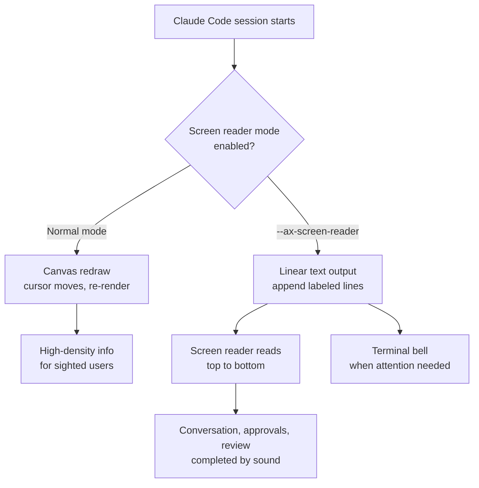

## Overview

Terminal-based AI coding tools have mostly evolved toward filling the screen beautifully: live spinners, color-coded diffs, boxed permission prompts, and progress indicators that redraw as the cursor moves around. For sighted users, that visual density is a strength. For a developer who reads the terminal with a screen reader rather than with their eyes, it works in reverse. A screen that constantly redraws makes it hard for the screen reader to decide what is actually new, and boxes and animations get narrated as orderless noise.

Claude Code now tackles this head on with a screen reader mode. A single line, `claude --ax-screen-reader`, turns the visual terminal UI into plain, linear text. Instead of ornate rendering, it prints labeled lines in order so that screen readers like VoiceOver, NVDA, and JAWS can read top to bottom naturally. This article walks through exactly what the mode changes, how it works, and why the accessibility of agent interfaces is a problem the whole development ecosystem should own right now.

It looks like a small flag, but the change widens the answer to a real question: who can actually use a terminal AI agent? It is a theme ThakiCloud keeps running into while building an agent-native cloud, so we cover it not just as a feature note but from an interface design perspective.

## What the Screen Reader Mode Is

A normal Claude Code session treats the terminal like a canvas. It moves the cursor, erases lines it already printed and redraws them, and shows progress as a live animation. That is optimal for someone scanning the screen with their eyes, but it is the worst possible input for a screen reader. The screen reader must decide what to read every time the buffer changes, and when the screen redraws every frame it tends to repeat the same content or miss the important new output entirely.

Screen reader mode changes the rendering model itself. Instead of redrawing the screen, it appends new information as labeled single lines in order. When a tool runs, for example, explicit labels such as a permission request, a tool-running notice, and a result come through as text. The screen reader simply reads that linear text top to bottom, so following the whole conversation, approving tool permissions, and reviewing output can all be completed by sound alone.

The flow below is a simplified view of how the two rendering paths diverge.



The point is not "give less information" but "give the same information as ordered text." Instead of stripping meaning, it removes visual flourish and provides a monotone, predictable output stream that a screen reader can trust.

## How to Enable It and How It Works

There are two ways to turn on screen reader mode. To enable it for a single session, pass the flag at launch.

```bash
claude --ax-screen-reader
```

This flag genuinely exists in the installed Claude Code. Checking the help output shows it:

```bash
$ claude --help | grep ax-screen
  --ax-screen-reader                    Render screen-reader friendly output
```

To apply it by default to every session started from a shell, set the environment variable.

```bash
export CLAUDE_AX_SCREEN_READER=1
```

Now any Claude Code session opened in that shell uses screen-reader-friendly output without a separate flag. According to the official docs, this mode works on Claude Code v2.1.181 and later, and earlier versions reject the `--ax-screen-reader` flag with an error.

There are thoughtful behavioral details too. In screen reader mode, Claude Code rings the terminal bell when it needs the user's attention. In particular, the bell rings when a tool that ran longer than five seconds finishes, signaling the end of a long task without needing to look at the screen. A screen reader user cannot visually confirm when a result has arrived after kicking off a command, so this audible signal creates a rhythm for the interaction.

There is a separate setting for low-vision users who rely on a screen magnifier.

```bash
export CLAUDE_CODE_ACCESSIBILITY=1
```

Setting this keeps the native terminal cursor visible. Screen magnifiers like macOS Zoom magnify the screen by following the cursor position, so if a tool hides the cursor the magnifier loses focus. This setting exposes the cursor so the magnifier can accurately track where the user is.

So the accessibility support splits three ways: linear text output for screen readers, a terminal bell for attention, and cursor persistence for magnifiers. Each targets a different assistive technology and can be enabled independently through environment variables.

## Why It Matters Now

The first reason this feature matters is that terminal AI agents are quickly becoming a core tool for developers. Reading code, fixing it, running commands, and reviewing results increasingly happen inside these tools. If accessibility is missing from that flow, blind or low-vision developers cannot use the same productivity tools their peers use. No matter how capable the tool is, if the door to that capability is narrow, for some developers it does not exist.

The second reason is that this feature started from a community request. Issues asking for NVDA and JAWS support were filed in the public repository, and that demand turned into an actual release. Accessibility features are often pushed to "later," so a case where a user request raised the priority is a good reference. Accessibility is not a niche special need; it is a design axis that determines the range of people who can use the tool.

The third is that this approach reaffirms an old truth: linear text is a robust interface. A text stream that is clearly ordered, labeled, and predictable is not only good for screen readers. It is easy to log, easy to pipe, and easy to parse for automation. It is no coincidence that an output mode built for accessibility turns out to also favor scripting and auditing.

## Implications for ThakiCloud Products

ThakiCloud operates an agent-native cloud called **Paxis**. Paxis treats Skills, Tools, Policies, and Audit Logs as first-class resources: a skill harness selects the right skill among many and runs it in an isolated sandbox, passing every action through policy gates and audit logs. As the surface where an agent interacts with people grows, the question of whether that surface is "accessible to anyone" becomes a basic design axis rather than an add-on.

The lesson from Claude Code's screen reader mode is clear. Accessibility of an agent interface, separate from making the screen beautiful, comes down to whether you can present the same information as linear, labeled text. A platform like Paxis that already treats audit logs and policy gates as first-class is structurally well positioned here. Because every agent action is already recorded as a labeled event, reconstructing that event stream into human-readable linear output is less about building a whole new rendering pipeline and more about surfacing structured logs you already have.

This case also shows that accessible output and automation-friendly output share the same root. Text a screen reader can read is also text a log collector can parse and an audit trail can preserve. Given how much ThakiCloud emphasizes observability and audit on its agent platform, designing an accessible linear interface alongside them satisfies both goals at once. Rather than treating a rich UI and accessible text as opposites, the better approach renders both representations on the common foundation of a structured event stream.

## Limitations and Counterpoints

It is important not to overstate this feature. Screen reader mode is a starting line for accessibility, not the finish. Outputting linear text does not automatically make every interaction comfortable, and understanding a long code block or a complex diff by sound alone is still a cognitively heavy task. Grasping the full context of a large refactor without a screen remains hard even with this mode.

The attention signal that relies on the terminal bell also varies by environment. Some terminal emulators are configured to convert the bell into a visual flash or to silence it entirely, so the bell signal may not arrive as intended. Users need to tune their own terminal settings for the best experience.

Finally, the fact that an accessibility mode exists is different from the fact that it has been thoroughly validated in practice. Real blind developers need to use it across various screen readers and workflows over a long period, accumulating feedback before the rough edges surface and get smoothed. Given that this mode first works in v2.1.181, it is still early, with plenty of room for improvement ahead. Even so, the fact that such a feature is included in the default distribution is itself a meaningful signal of a direction to handle accessibility now rather than later.

## Sources

- Claude Code accessibility docs: [code.claude.com/docs/en/accessibility](https://code.claude.com/docs/en/accessibility)
- Feature request issue (NVDA/JAWS): [anthropics/claude-code #11002](https://github.com/anthropics/claude-code/issues/11002)
- Original source: [@ClaudeDevs tweet](https://x.com/hjguyhan/status/2079435394727416168)
