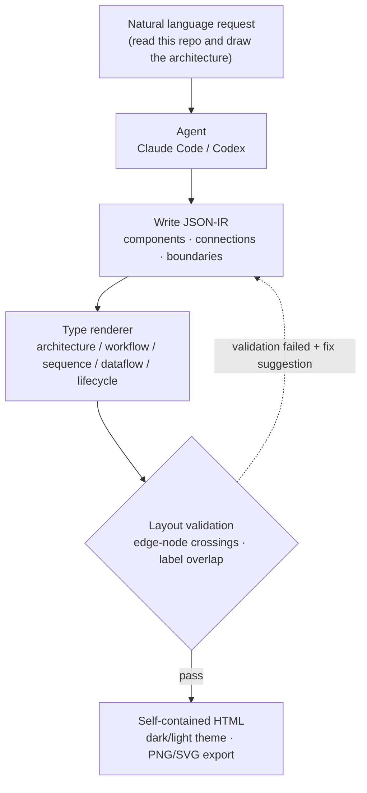

## Why read this

This post is for **developers and platform engineers who draw architecture diagrams often but keep losing time to Mermaid syntax or drag-and-drop drawing tools**. It's meant to help anyone who needs a concrete basis for picking a tool.

Here's the conclusion up front. Archify's real value isn't the convenience of "draw a diagram by describing it in words." It's that **the renderer forcibly validates the layout an agent produces, so a broken diagram simply cannot be created.** When we actually ran it, our first attempt was rejected by the renderer, and that rejection is exactly what makes this tool worth using.

## Overview

Architecture diagrams are one of the outputs developers produce most often and dread most. Mermaid requires memorizing syntax. Drawing tools require dragging boxes and lines into place by hand. Even after you finish, dark mode often doesn't line up, or you have to re-export the file to drop it into a slide deck.

**Archify**, which recently gained traction in the Chinese developer community, targets exactly this pain point. Give Claude Code or Codex a plain sentence like "read these repositories and draw me a comparison of their architectures," and out comes a single self-contained HTML diagram that opens right in the browser. You can toggle between dark and light themes, and export to PNG or SVG.

So far, this reads like typical marketing copy. So instead of trusting the copy, we installed it, ran it ourselves, and used it to diagram ThakiCloud's own ai-platform structure. That process revealed why this tool is different from a simple "AI diagram generator." This post is both a record of that experiment and a look at how it connects to the design philosophy behind Paxis, ThakiCloud's agent platform.

## What this tool is

Archify is an open source agent skill released under the MIT license by `tt-a1i`. At the time of our experiment, the version was 2.11.0. It is a fork and rewrite of Cocoon AI's architecture-diagram-generator v1.0, and it credits Cocoon AI for the original visual language. It installs into several agent runtimes, including Claude, Codex CLI, and opencode.

Understanding its core structure explains why the tool is unusual. Archify doesn't draw a diagram directly. Instead, it describes the diagram as a **JSON-IR (intermediate representation)**, and a type-specific renderer turns that JSON into HTML. There are five renderers: architecture, workflow, sequence, dataflow, and lifecycle. In other words, "what to draw" lives in structured JSON, and "how to draw it" is owned by validated code.

The five renderers each handle a different kind of diagram. Architecture covers system components and boundaries. Workflow covers procedures like approval chains or CI/CD. Sequence covers request lifecycles or API call ordering. Dataflow covers data movement such as ETL pipelines and event streams. Lifecycle covers state transitions such as deployments or agent execution. Once you know what you're drawing, the matching renderer and schema kick in, and that schema enforces the shape of the input JSON.

This division of labor creates the decisive difference from Mermaid. Mermaid parses syntax and lays things out automatically (via dagre), but it will happily render a diagram where a line cuts through a box or labels overlap. Archify does the opposite: it makes you specify layout coordinates explicitly, and right before rendering it **forcibly checks layout rules**. If a rule is violated, it refuses to produce the diagram and raises an error instead.

The overall flow looks like this.



## Installation and integration

Installation is a single npx command. The global install looks like this.

```bash
# Install globally, then pick an agent
npx skills add tt-a1i/archify -g

# Try it once without a permanent install
npx skills use tt-a1i/archify@archify --agent codex
```

You can also clone the repository directly and verify it with the CLI to pull out examples. Here are the exact commands we ran and their output. Our test environment was Node.js v24.1.0. Archify requires Node 18 or higher, and it has essentially no runtime dependencies (the only dev dependency is ajv, used for schema validation).

```bash
git clone --depth 1 https://github.com/tt-a1i/archify.git
cd archify/archify

# Check install status
node bin/archify.mjs doctor
```

Here is the actual output of the `doctor` command. All five renderers and the schema validators checked out fine.

```text
Archify doctor

[ok] Node.js v24.1.0 (requires >=18)
[ok] Core template
[ok] Standalone schema validators
[ok] architecture renderer, schema, and example
[ok] workflow renderer, schema, and example
[ok] sequence renderer, schema, and example
[ok] dataflow renderer, schema, and example
[ok] lifecycle renderer, schema, and example

Archify is ready.
```

Pulling one of the built-in examples produces a single self-contained HTML file, 508KB, that opens directly in a browser with no external server needed.

```bash
node bin/archify.mjs demo ./out
# Demo ready: ./out/archify-demo.html   (about 508KB, single HTML)
```

## What we found when we actually ran it

Reading the docs alone makes it seem like that's the whole story. So instead of using someone else's example, we wrote out **ThakiCloud's actual ai-platform structure** as a JSON-IR by hand and rendered it. We included nine components: GPU scheduling with Kueue, model serving with vLLM, multi-tenant auth with Keycloak, state and events through PostgreSQL and NATS, and GitOps deployment via ArgoCD.

The JSON-IR wasn't hard for a human to read or write. A component is an object with a type, a label, a position, and a size. A connection carries a source, a destination, and a label. For example, we described the gateway and the GPU-serving piece like this.

```json
{
  "components": [
    { "id": "gateway", "type": "backend", "label": "API Gateway",
      "sublabel": "Go Fiber :8080", "pos": [280, 300], "size": [140, 60] },
    { "id": "vllm", "type": "backend", "label": "vLLM Server",
      "sublabel": "OpenAI API", "pos": [540, 300], "size": [140, 60] }
  ],
  "connections": [
    { "id": "gw-to-vllm", "from": "gateway", "to": "vllm", "label": "route inference" },
    { "id": "vllm-gpu", "from": "vllm", "to": "gpupool", "label": "CUDA", "variant": "emphasis" }
  ]
}
```

Our first render attempt **failed.** And this failure is the most important part of this post. Instead of drawing anything, the renderer pointed out three concrete problems.

```text
Error: Architecture layout validation failed:
- [clean-flow/edge-through-node] connection "kueue-gpu" (kueue -> gpupool)
  crosses component "vllm" (unrelated to this relationship)
- [clean-flow/edge-through-node] connection "kueue-gpu" (kueue -> gpupool)
  crosses component "argocd" (unrelated to this relationship)
- Label "publish" overlaps component "gateway"
  Suggested fix: labelDy +24 (below); or labelAt [350, 374]
```

In other words, the connection from Kueue to the GPU pool cut through the unrelated vLLM and ArgoCD boxes, and the "publish" label overlapped the gateway box. What stands out is that the renderer didn't just flag the problems, it **also suggested how to fix them**, down to the exact coordinates for how far to move the label.

We followed the suggestion, added a routing waypoint (`via`) to the connection, adjusted the label position, and re-rendered. This time it passed. Here are the actual measurements.

| Item | Measurement |
| --- | --- |
| Render time | About 0.073 seconds |
| Output file | 519,709 bytes (about 508KB) single HTML |
| Inline SVG | 1 (the whole diagram is a single SVG) |
| Theme support | 27 uses of `data-theme` · 7 uses of `prefers-color-scheme` |
| External references | 1 (JetBrains Mono web font, falls back to system font) |

To sum up, the render itself takes 73 milliseconds, effectively instant. The output is a self-contained HTML file with no dependency on an image server or CDN, and its only external reference is a single web font for code, so it still opens correctly offline, falling back to the system font. The dark and light themes aren't cosmetic labels either. They're implemented with real CSS variables and `prefers-color-scheme`.

The lesson here is clear. Archify's validator isn't a device for producing "a pretty picture." It's **a gate that blocks a bad diagram, one with tangled lines or overlapping labels, before it ever ships.** A visual defect that a human drawing by hand would have simply missed, the code caught every single time, using the same standard.

## Implications for ThakiCloud's products

This tool's design lines up precisely with a principle ThakiCloud holds to across two products.

**Through the Paxis lens (agents and skills).** Paxis is ThakiCloud's Agent-Native Cloud, and it treats skills as first-class resources. It selects from more than 960 skills using BM25, runs them in an isolated sandbox, and routes every action through policy gates and audit logs. Archify is exactly the shape of tool that a skill harness like this is built to select and run. More importantly, look at its internal design. Archify has **the model produce content (the JSON-IR), while code owns the format and the validation.** This matches a principle ThakiCloud repeats across its batch-output work: separate the freeform generation step from the deterministic validation step. Instead of asking the model to "draw something nice," you have it produce a structured representation, and code enforces whether that representation follows the rules. Our first render getting rejected was exactly this principle in action.

**Through the ai-platform lens (infrastructure and documentation).** Self-contained HTML is especially useful in on-premise and sovereign environments. For a customer who can't upload internal architecture to an external diagramming SaaS, rendering locally and getting a single portable file back is directly usable as a deliverable. And because the JSON-IR is plain text, it's version-controlled in Git and diffable. Just as ArgoCD manages manifests, you can manage architecture diagrams as code too, tracking and reviewing every change. Instead of redrawing onboarding docs or customer-facing deployment diagrams by hand every time, you just edit the JSON when the structure changes and re-render.

The two lenses reinforce each other. A validated skill (Paxis) produces a reproducible artifact (ai-platform documentation), and that artifact in turn becomes a portable asset for on-premise customers.

## Limitations and counterpoints

Archify is, of course, not a silver bullet. It has a few clear weaknesses.

First, **you have to specify layout coordinates.** Unlike Mermaid's automatic layout, you have to give the position and size of every component as coordinates, and that layout has to pass validation. As our own first attempt showed, this step is not entirely free. In practice, though, an agent fills in these coordinates for you and fixes them itself when it gets a validation error, so the burden on a human is reduced.

Second, **the output isn't lightweight.** A single diagram is roughly 508KB of HTML, because it packs fonts and scripts into a self-contained file. That's heavier than a plain SVG or a Mermaid block. If you're dropping several diagrams onto one blog page, that weight can add up.

Third, **it isn't distributed as a library.** The `package.json` is marked `private: true`, meaning you consume it as a repository skill or CLI rather than pulling it in as an npm package. Wiring it into a pipeline as a library takes some extra thought.

Fourth, **it's a static snapshot.** It isn't a live dashboard that updates with real-time data, but a picture of a structure at a specific point in time. If you just want to sketch something quickly, the strictness of the validation rules can feel like friction. That said, this strictness is also the whole reason the tool exists.

## Wrap-up

Having installed Archify ourselves and used it to draw the ThakiCloud stack, here's our conclusion. The core of this tool isn't the convenience of "drawing by describing it in words." It's the discipline of **having a renderer validate every layout an agent produces against the same standard, every time, so a bad diagram never ships.** As we said up front, our first render getting rejected was exactly the moment that earned this tool our trust.

So the next step is clear. If you draw architecture diagrams often, and you want those diagrams to live in your docs or repository like code, Archify is worth running once. If instead you're after a quick sketch or want to stack several diagrams on one page, Mermaid is still the lighter option. The deciding question is whether you want this diagram managed as a reproducible, validated asset. If the answer is yes, then Archify, and the Paxis skill harness that builds the same principle into a product, is the answer.

> Sources
> - Archify repository: [github.com/tt-a1i/archify](https://github.com/tt-a1i/archify) (MIT, v2.11.0)
> - Original tweet: [@alin_zone via @hjguyhan](https://x.com/hjguyhan/status/2079683904030777353)
> - Experiment log: the commands, output, and measurements in this post were captured from a local run on 2026-07-22 (Node v24.1.0).
