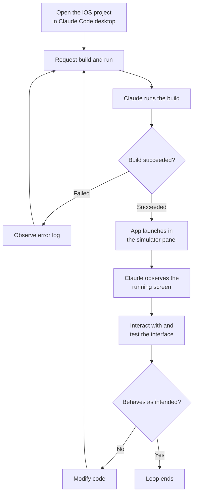

## Why this is worth reading

If you build iOS apps with Claude Code on macOS, this post boils down to one point. The "closed loop" where a coding agent runs the app it just wrote and watches the screen while fixing it now runs inside the desktop app itself, with no separate tooling required. Below, we walk through what you actually need to learn and why this shift is not just a convenience feature but a matter of how an agent converges on code quality on its own.

## Overview

An AI coding agent becomes genuinely useful the moment it stops just spitting out code and starts checking, on its own, whether that code actually works and fixing it when it doesn't. For backend code, you can run tests and get an objective pass or fail signal. Mobile app UI is a different story. Whether an onboarding screen renders as intended, or whether tapping a button actually moves you to the next screen, has always been something you could only confirm by looking at it. Until now, that confirmation fell to a human. The agent would write the code and then sit idle until a person launched the simulator, tapped around, and reported back.

On July 21, 2026, the Claude Code desktop app shipped a public beta feature aimed squarely at closing that gap. When you build and run an iOS app, Apple's iOS Simulator opens in a panel right next to the conversation, and Claude watches the running app screen, interacts with the interface directly, and keeps iterating on the code until it behaves as intended. The back-and-forth where a human had to launch the simulator, check the result, and translate it back into words has folded into a single loop.

As ThakiCloud builds an agent-native cloud, we keep running into the same question: how does an agent observe the results of its own actions and decide what to do next? This feature is one very concrete answer to that question, so it is worth examining not just as a product announcement but through the lens of loop design.

## What the iOS Simulator integration actually is

The core idea is simple. Open an iOS project in Claude Code desktop and ask it to build and run the app, and the simulator appears in a panel beside the conversation, with Claude treating that screen as something to observe. Each session opens its own independent simulator, so running multiple tasks at once does not mix up screens between them. And this panel only works in local sessions, since the simulator itself is software that only runs on macOS.

What makes this interesting is not that it bolts on one more rendering surface, but that it opens up an additional "observation channel" for the agent. Until now, most of the signals a coding agent could check were text: compiler errors, test results, logs. What the app actually looks like and how it responds, by contrast, could only reach the agent once a human looked at it and put it into words. The simulator integration turns that visual outcome into a signal the agent can check for itself.

Simplified, the overall flow becomes a repeating loop like the one below.

As the diagram shows, human involvement is limited to the initial request and the final check; the build, run, observe, and modify steps in the middle all happen inside the agent. It is exactly the same structure as a backend test runner closing the loop by returning an objective pass or fail signal, except this time the simulator plays that role in the visual UI domain.

## How to turn it on and use it

This feature doesn't require any elaborate setup. What it does require is a clear set of prerequisites. First, you need macOS, since the iOS Simulator doesn't run outside the Apple ecosystem, so this panel is unavailable on Windows or Linux. You also need Xcode installed with the iOS platform, since the underlying machinery that actually performs the build and launches the simulator is Xcode's build tools and simulator. On the plan side, this feature is available to users on the Pro, Max, and Team plans.

Using it is entirely conversational. Open your iOS project in Claude Code desktop, set the app's project folder as the project, and start a session. Any project that builds an app for the iOS simulator will work. From there, just ask Claude to run or test the app. Tell it in natural language, something like "build the app, run it in the simulator, and check the onboarding flow," and Claude will run the build, launch the app in the simulator panel, and go through its checks while observing the screen.

In short, there is essentially no new command or config file to memorize. What changes is the scope of what you can ask an agent to do. Where you used to say "fix this screen to look like this" and then had to launch it yourself to check, you can now fold that check into the instruction itself. Since this is still a public beta, the details will keep getting refined, but the direction of the interaction model is already clear.

## What a closed loop gives a coding agent

The real significance of this feature lies less in convenience and more in the completeness of the loop. For an agent to be useful, it needs a way to verify its own output, and if that verification depends on a human's eyes and hands every single time, the agent remains only half-automated. iOS UI work has long been a textbook case of this half-finished state. The agent writes the code, but whether the result is correct on screen has always needed a human to look.

Once the simulator sits next to the conversation and the agent can watch the running screen, observation, judgment, and correction all chain together inside one loop. If the build fails, it reads the error and fixes it; once the app launches, it looks at the screen, spots where things diverge from intent, and fixes it again. The key point is that this cycle runs without a human round trip. Granted, this observation works by capturing and checking the screen, so it can't perfectly replace the subtle feel a human gets from actually touching and interacting with the interface. Even so, simply removing the disconnect of "I fixed the code but have no idea how the screen changed, so I'm waiting for the next instruction" changes the texture of the work.

This structure also connects to loop engineering principles ThakiCloud has been formalizing internally. Reliable feedback is a deterministic signal that objectively reports pass or fail, and an agent's self-report ("looks like it worked") can never serve as the loop's exit condition. The simulator is a device that extends that deterministic signal into the visual domain. Build success or failure was already a clear signal; now that another observation channel, the running screen, has been added, the loop for UI work closes that much more tightly.

## Implications for ThakiCloud's products

Since this is fundamentally about agents, it's natural to view it through the Paxis lens. Paxis is ThakiCloud's agent-native cloud, treating skills, tools, policies, and audit logs as first-class resources, running skills in isolated sandboxes, and routing every action through policy gates and audit logs. The "build, run, observe, fix" closed loop that Claude Code's simulator integration demonstrates belongs to exactly the same family as the execution model Paxis is aiming for: an agent runs something in an isolated environment, observes the result to decide its next action, and the entire process stays within controlled boundaries.

From a Paxis perspective, this case carries two implications. First, opening a channel for an agent to observe execution results is what determines the depth of automation. Just as a loop for UI work that text signals alone couldn't close was closed by adding a single visual observation channel, quality in Paxis likewise hinges on each skill having a signal to verify its own output. Second, that execution happens in an environment isolated per session. Just as Claude Code opens an independent simulator for each session, Paxis's sandboxed isolated execution is a design built on the same principle: guaranteeing that multiple agent tasks running in parallel never contaminate one another.

One more point worth adding from an infrastructure angle: for a closed loop like this to be practical, the execution environment needs to spin up and tear down cheaply and fast. ThakiCloud's ai-platform's ability to efficiently schedule isolated execution environments on Kubernetes underpins the economics of running agent loops at scale. Without low-cost isolated execution, an agent loop that repeats observation and correction cannot run without racking up unsustainable cost.

## Limitations and counterarguments

To avoid overstating this feature, its boundaries deserve equal attention. For one, the platform is locked to macOS. That's an unavoidable constraint given that the iOS Simulator doesn't run outside Apple's ecosystem, but it also means this loop is only open to Mac users. Xcode is a hard prerequisite, the feature is limited to Pro, Max, and Team plans, and the panel only works in local sessions. It's still too early to expect the same experience in remote sessions or shared team environments.

The feature itself is also a public beta. What was published alongside the announcement is how it works and how to use it, not a benchmark of how fast or accurately this loop actually converges in practice. So it's not yet possible to state numerically how much better things get. And because the agent's screen observation works by capturing and checking the running screen, it cannot substitute for the subtle response of a gesture or the felt sense of performance that a human experiences on an actual device with their own fingertips. Complex animations, accessibility behavior, and issues that only surface on real hardware still need human verification.

One last counterargument worth raising: this kind of convenience carries the risk of turning into unreviewed trust. The more smoothly a loop runs, the easier it becomes for a human to accept the result at face value. An agent saying "I checked it" doesn't mean that judgment is itself verification. Simulator observation is a useful signal, not final approval, and especially for subtle aspects of user experience, a human still needs to tap through it and judge for themselves.

## Wrap-up

Claude Code's iOS Simulator integration looks small, but its direction is clear. The closed loop where a coding agent runs what it just built, observes it, and fixes it has now extended into UI, a domain that had long depended on humans. For developers building iOS apps with Claude Code on macOS, this is a change worth trying right now, and because it widens the scope of what you can ask an agent to do, it invites you to rethink how you work in the first place.

Zooming out, this case reconfirms that what makes an agent useful isn't model size alone but a harness question: how well does it close the loop of observing results and deciding the next action? That's precisely the problem ThakiCloud is solving with Paxis and ai-platform. Today's one-line takeaway is this: the next time you hand UI work to an agent, don't stop at asking it to fix the code. Tell it to "run it and check it too." Letting the agent close the loop instead of a human is the most practical change this feature brings.

## Sources

- [Claude Code official docs: Test iOS apps in the simulator](https://code.claude.com/docs/en/desktop-ios-simulator)
- [ClaudeDevs announcement (X)](https://x.com/ClaudeDevs/status/2079674432038248611)
- [9to5Mac: Claude Code brings live iOS app testing into its Mac app](https://9to5mac.com/2026/07/21/claude-code-brings-live-ios-app-testing-into-its-mac-app/)
- [MacRumors: Claude Code Can Now Build and Test iOS Apps in Apple's Simulator](https://www.macrumors.com/2026/07/21/claude-code-ios-simulator/)
