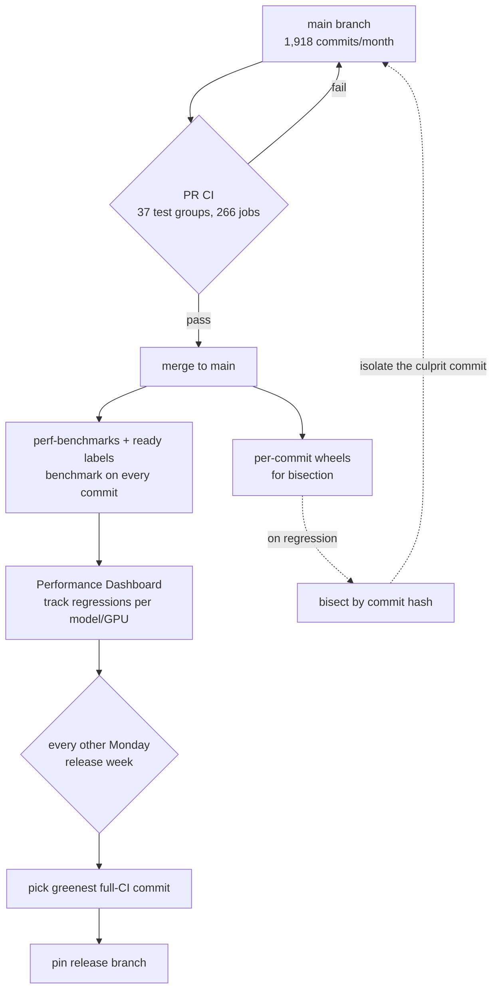

## Why Read This

This post is for platform engineers and MLOps practitioners who serve LLMs with vLLM, or whose production depends on fast-moving open source. It is for the person who has to decide: "The inference engine we run changes hundreds of times a week. Which version do we upgrade to, and when, without breaking?"

The conclusion first. The key to holding production quality at 2,000 commits a month is not adding tests without limit. It is **three deterministic devices: a benchmark gate that catches performance regressions, release-branch pinning to the healthiest commit, and per-commit bisection to isolate a regression when one appears.** These are the same operational patterns ThakiCloud can adopt directly when serving vLLM in a multi-tenant setup on Kubernetes.

## Overview

On July 16, 2026, the vLLM maintainers published a write-up titled "Keeping vLLM Production Quality." The numbers alone are staggering. In June 2026, vLLM merged **1,918 commits** into main. That is about 64 a day, on par with large open-source projects like PyTorch or Kubernetes. In the same month, CI consumed **13 million job minutes**, with **1,400 concurrent runners** at peak.

Why does this speed create a problem? It comes from the nature of an inference engine. For a typical web service, "if the tests pass, it is mostly safe" holds. But in an LLM inference engine, **a change can pass every test and still make a specific model slower or subtly corrupt its output.** Swap one kernel and throughput can halve on a specific GPU architecture, and a regression like that never shows up in a pass/fail unit test.

For an organization like ThakiCloud that depends on vLLM as a core serving dependency, this write-up is not someone else's story. Every vLLM version we ship governs the latency and throughput of customer workloads. So understanding how vLLM protects itself tells us what we should gate on top of it.

## What It Actually Is

vLLM's quality system splits into three layers. Each layer stops a different kind of failure.

**First, broad functional CI.** The vLLM CI suite runs **37 test groups and 266 jobs**. It covers major components and features from different kernels to speculative decoding to LoRA. This layer verifies "does the code work?"

**Second, continuous benchmarking.** This layer catches the performance regressions that functional CI misses. It measures performance automatically across many models and GPU devices, and tracks it over time to surface regressions or improvements. This layer verifies "is the code still fast, is the output still correct?"

**Third, release engineering.** No matter how good CI and benchmarks are, deciding which commit to release to users is a separate call. vLLM entrusts that decision to repeatable rules rather than human intuition.

The diagram below shows how the three layers interlock. Read top to bottom, it is the path a single commit travels to reach a user.



## What Broke, and How They Fixed It

This system was not complete from the start. In May 2026, days after releasing v0.20.0, vLLM had to cut two emergency patches. Two problems had sailed straight through CI to users.

One **broke gpt-oss on Blackwell GPUs when split across multiple GPUs**; the other **tanked DeepSeek V4 throughput on GB200**. At the time vLLM had no benchmarking pipeline. Both problems passed the functional tests cleanly, but nobody was automatically measuring actual performance and correctness on real hardware.

That incident is the direct reason the continuous benchmarking layer exists. The lesson is clear. **The equation "tests pass = safe" does not hold for an inference engine.** Functional correctness and performance are separate axes, and each must be gated independently.

## The Commands Maintainers Actually Use

This system is exposed not only as a concept but as tooling users can run. Two practical tools for tracking performance regressions are especially useful.

The performance dashboard updates automatically on PRs with specific labels. On every commit that carries both the `perf-benchmarks` and `ready` labels, and whenever a PR merges into main, benchmarks run and publish to the public dashboard.

```text
# Labels that trigger performance benchmarks (vLLM PR workflow)
perf-benchmarks + ready
# → run benchmarks on many models/GPUs per commit → publish to public performance dashboard
```

More interesting is **per-commit bisection**. vLLM publishes wheels for previous commits, so specifying a commit hash in the install URL installs vLLM exactly as it was at that commit.

```bash
# Install a vLLM wheel at a specific commit hash (to bisect behavior/perf regressions)
pip install https://wheels.vllm.ai/<commit-hash>/vllm-<version>-cp38-abi3-manylinux1_x86_64.whl

# Narrow "when did it get slower?" by bisection:
#   good commit A ── ? ── bad commit B
#   → install a midpoint to reproduce → halve the range
```

Here the real value of release engineering shows. vLLM kicks off release week every other Monday. The release manager reviews the recent full-CI runs on main that day and picks the **greenest commit**. That secures the healthiest starting point before any release-specific changes are added. Cutting release branches frequently has a hidden benefit: **tracing a regression is far easier when you have about 500 commits to bisect rather than a few thousand.** The release cadence itself is a device that lowers debugging cost.

## The Scale Numbers vLLM Published

Below are the actual figures the write-up published as of June 2026. These are not our reproduction; they are the maintainers' reported values, quoted verbatim.

| Metric | Value | Meaning |
|---|---|---|
| Commits merged to main | 1,918/month (~64/day) | PyTorch/Kubernetes-class change rate |
| CI time consumed | 13M minutes/month | Enormous verification cost |
| Peak concurrent runners | 1,400 | Scale of parallel verification |
| CI test groups | 37 | Kernels, spec decoding, LoRA, etc. |
| CI jobs | 266 | Per-component granularity |
| Release cadence | every other Monday | Keeps bisect range at ~500 commits |

What these numbers say is simple. To hold quality at this speed, verification **cannot rely on human review** and must be replaced by deterministic gates and automated measurement.

## Implications for ThakiCloud Products

ThakiCloud's **ai-platform** serves models to diverse customer environments on top of Kubernetes and Kueue GPU scheduling. vLLM is the core engine on that serving path, so how vLLM maintains quality feeds directly into our release policy design.

First, **separate version pinning from the benchmark gate.** Per vLLM's lesson, we do not promote a new version to production on functional test passes alone. We automatically run throughput and latency benchmarks on representative customer workloads (model/GPU combinations) before rollout, and place a gate that blocks promotion when a regression is detected. This moves vLLM's continuous benchmarking layer into a gate on our deployment pipeline.

Second, **pin the vLLM release explicitly in the ArgoCD-based GitOps rollout.** Rather than tracking the latest commit on main, we treat the release tag vLLM has itself verified and cut as canonical, and pin that tag in per-cluster values. Rolling out first to a few tenants as a canary, then expanding to all only when the benchmark dashboard is green, reproduces vLLM's "pick the healthiest commit" principle at the deployment layer.

Third, **use per-commit wheels for in-house regression tracing.** When a specific customer signals "it got slower than last week," we can bisect with vLLM's per-commit wheels to isolate the culprit commit. Quickly narrowing where a regression's responsibility lies in a multi-tenant environment is central to operational trust.

These three converge on one principle. **To operate production on top of a fast-moving upstream dependency, you must delegate quality judgment to automated gates, not human intuition.**

## Limits and Counterarguments

vLLM's approach does not transplant cleanly to every organization. There are real constraints.

The biggest is **cost.** 13 million CI minutes a month and 1,400 concurrent runners presume a substantial infrastructure budget. It is unrealistic for a small team to clone a benchmark farm at this scale. So what we need is not a replica of the scale but **a representative benchmark narrowed to core workloads.** Gating only the top few combinations of actual customer traffic, rather than the full model/GPU matrix, pays off far better per dollar.

Second, a benchmark's **coverage is its limit.** Regressions in models, sequence lengths, or batch combinations that are not in the benchmark still leak through. vLLM's May incident was missed precisely because there was no benchmark, and even after adding one, combinations absent from the dashboard remain blind spots. Never forget that a gate protects only "what you measured."

Third, the biweekly release cadence is a **trade-off between stability and freshness.** Cutting releases frequently makes bisection easier, but slows how fast new features reach production. If a customer urgently needs the latest kernel optimization, a policy that insists on stable releases only can itself become the bottleneck. That balance point differs by organization.

## Wrap-Up

Back to the problem of protecting production on top of fast-moving open source. vLLM does not collapse at 2,000 commits a month not because it adds tests without limit, but because it has **three deterministic devices: a benchmark gate that stops performance regressions, release-branch pinning that picks the healthiest commit, and per-commit bisection that narrows the cause.**

For an organization like ThakiCloud that runs vLLM as a serving core, the action to take today is clear. When you upgrade to a new vLLM version, do not rely on functional test passes alone; stand up a benchmark on representative customer workloads as a rollout gate. And instead of tracking main, pin the release tag vLLM has verified into your GitOps values. Putting just these two into your deployment pipeline lets you absorb the upstream's speed while protecting the downstream's stability. Quality comes not from more tests, but from a gate placed in the right spot.

## Sources

- vLLM Blog, "Keeping vLLM Production Quality: A Look Inside CI, Benchmarking, and the Release Process" (2026-07-16): [https://vllm.ai/blog/2026-07-16-keeping-vllm-production-quality](https://vllm.ai/blog/2026-07-16-keeping-vllm-production-quality)
- vLLM Performance Dashboard (docs): [https://docs.vllm.ai/en/latest/benchmarking/dashboard/](https://docs.vllm.ai/en/latest/benchmarking/dashboard/)
