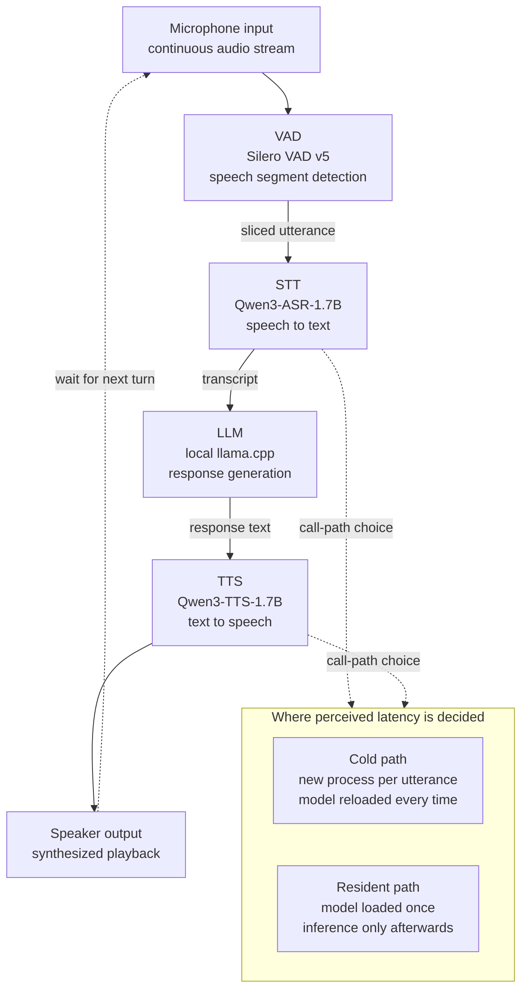

## Why Read This

This post is for engineers who have to run a voice interface on their own infrastructure or on the device itself, without cloud APIs. You are on an air-gapped network, or call audio cannot leave your perimeter, or per-user speech API billing is destroying your unit economics, and you need to decide whether a local stack is viable.

The conclusion first. In a fully local voice agent, conversation breaks down not because the models are large but because of **a call structure that loads the model into memory again on every utterance**. In our measurements on a MacBook, feeding the same engine the same audio and changing only the call path to a resident one cut speech recognition from 14.42 seconds per utterance to 5.92 seconds. We did not swap models or add GPUs. We simply kept the process alive.

## Overview

A demo out of the Chinese developer community circulated on X over the weekend. A voice agent that runs on a single laptop with no internet connection and no API key, with a clearly stated stack: Silero VAD v5 for slicing speech segments, Whisper for recognition, local llama.cpp for response generation, and Qwen3-TTS for synthesis. The talking point was that all four models were packed onto one machine.

The combination is not a new invention. Hugging Face's [speech-to-speech](https://github.com/huggingface/speech-to-speech) project already ships the same four-stage pipeline as open source, and the whisper.cpp repository carries an [issue for built-in Silero VAD support](https://github.com/ggml-org/whisper.cpp/issues/3003). Every part is public and assembly is not hard. So the interesting question is not "can it be built" but **"once built, does it reach conversational speed?"**

A demo video does not answer that. Videos get edited, and the silence between responses gets cut. So we rebuilt the same structure on the local speech stack ThakiCloud already operates and measured wall-clock time per stage. The test machine is an Apple Silicon (arm64) MacBook, and both models ran on the PyTorch MPS backend. Every number below was measured on that machine. None of it is estimated.

## What This Stack Is

A local voice agent is a closed loop of four models wired in series. Each stage waits for the output of the previous one, so perceived latency is the sum of all four.



Our reproduction differs from the original demo in one respect. The original used Whisper for recognition; we used Qwen3-ASR-1.7B, our in-house standard. ThakiCloud has consolidated its transcription path on this model, and we needed the ability to anchor Korean proper nouns as hints. Synthesis used the Qwen3-TTS family, same as the original. Both carry the Apache-2.0 license, so there is no restriction on commercial deployment, which matters when choosing a local stack.

Proper-noun anchoring makes a real difference. Without hints, the company name fractures into something like "Takgi Cloud"; pass "ThakiCloud" through as context and it stays intact. For internal meeting notes or call recordings dense with domain terms, that difference drives the entire post-processing cost.

## Installation and Integration

Both engines are already wired into isolated virtual environments in our repository. The recognition engine pins a specific `transformers` version, so placing it in the same environment as the synthesis engine breaks both. We separate the interpreters, and a wrapper script re-executes into the correct environment.

```bash
# Speech recognition (Qwen3-ASR): dedicated venv, isolated transformers pin
python3 -m venv --system-site-packages ~/.venvs/qwen-asr
~/.venvs/qwen-asr/bin/python -m pip install 'qwen-asr==0.0.6'

# One-shot transcription: language plus proper-noun anchoring
python3 scripts/stt/stt_transcribe.py \
  --file scripts/stt/samples/ko_brand_test.wav \
  --language ko \
  --context "다키클라우드, 쿠버네티스" \
  --format json
```

Running it returns a fixed JSON contract. Because the output format is owned by code rather than by the model, parsing downstream in the pipeline never drifts.

```json
{
  "status": "ok",
  "engine": "qwen3-asr",
  "language": "Korean",
  "text": "안녕하세요. 다키클라우드 음성 인식 테스트입니다."
}
```

Synthesis has the same shape. One-shot and batch calls are separated, and batch takes a list of segments in a single pass.

```bash
# One-shot synthesis
python3 scripts/tts/qwen3_tts.py \
  --text "네, 다키클라우드 온프레미스 환경에서도 동일하게 동작합니다." \
  --lang ko --out reply.wav

# Batch synthesis: load the model once, then process segments in sequence
python3 scripts/tts/qwen3_tts.py --spec tts_spec.json --outdir warm_tts/
```

Measurements ran inside an isolated git worktree sandbox, so the experiment never contaminated the main working tree while the logs still landed in the repository.

```bash
bash scripts/blog/impl_sandbox.sh setup local-voice-agent-stack
bash scripts/blog/impl_sandbox.sh run local-voice-agent-stack -- python3 <experiment script>
bash scripts/blog/impl_sandbox.sh teardown local-voice-agent-stack
```

## Measured Results

We split this into three runs. The first is the cold path, spawning a new process per utterance the way the original demo does. The second batches the calls. The third is an A/B between two batch paths.

**Something looked wrong in the very first run.** Transcribing 2.72 seconds of audio took 14.42 seconds, while audio nearly four times longer at 10.52 seconds took 14.26 seconds. The audio grew fourfold and the processing time went slightly down. As a real-time factor that is 5.3x dropping to 1.36x. That shape appears when **fixed per-call cost**, not inference, dominates.

Synthesis behaved the same way. A 33-character sentence took 77.57 seconds and a 39-character sentence took 40.40 seconds. The first call is unusually slow because the cost of fetching and loading the model is stacked on top.

**The second run batched the calls.** Synthesis improved as expected. Processing four sentences in one process dropped the real-time factor from 8.02x to 4.70x, landing at 18.51 seconds per utterance. Recognition, however, came out at 13.49 seconds per utterance even when batched, essentially the same as the 14.42 seconds of a cold one-shot. The batch had done nothing.

At that point we opened the code. The batch option in our recognition wrapper was spawning the engine script as a fresh subprocess for every item. Meanwhile the engine itself already implemented a separate path that loads the model once and walks the list, and the wrapper was routing around it.

**The third run is the A/B that tests that hypothesis.** We ran the same four clips back to back through both paths on the same machine.

| Path | Total for 4 clips | Per utterance | Note |
|---|---|---|---|
| Wrapper batch (reload per item) | 45.50s | 11.38s | 4 subprocess spawns |
| Engine batch (single load) | 23.66s | 5.92s | model loaded once |

**That is a 1.92x difference.** The time wasted on reloading was 5.46 seconds per utterance. The model, the audio, and the machine were unchanged. Only the call path moved.


*Left: per-utterance processing time for cold one-shot calls versus resident engine calls. Right: total time for the same four clips through the two batch paths.*

Two things deserve an honest note. First, **we could not measure the response generation stage.** Neither ollama nor a llama.cpp binary was installed on this machine, and rather than invent a number we recorded it as unmeasured. So the figures above cover the two speech ends of the loop, not the full four-stage round trip. Second, the wrapper batch total moved between runs, 53.96 seconds in the second run and 45.50 seconds in the third. That is variance from laptop load, which is exactly why an A/B has to run back to back inside a single execution.

Even so, the conclusion holds. 5.92 seconds per utterance is still not a natural conversational pace. For a human to experience it as conversation, the response needs to start inside about a second, and here recognition alone eats six, with generation and synthesis still to come. A smooth demo video and real round-trip latency are two different things.

## What This Means for ThakiCloud

This experiment lands directly on both of our products.

**Through the ai-platform lens, speech workloads must be designed as resident services.** Our ai-platform schedules GPU resources with Kueue on Kubernetes and serves models multi-tenant. What this experiment confirms is why a design that spins up a speech model as a Job every time fails. Pod startup plus weight loading overwhelms inference time, so recognition and synthesis belong in resident inference services that hold their weights, not in per-request batch jobs. For the same reason, autoscaling policy should set minimum replicas by cold-start cost rather than by request count.

There is a customer segment for which this picture matters most. Financial institutions handling call recordings, hospitals handling clinical audio, and public agencies operating under network separation cannot send speech data to an external API. An on-premise speech stack is not an option for them, it is a requirement. And composing that stack from Apache-2.0 models means the service runs on hardware cost alone, with no usage-based billing.

**Through the Paxis lens, what surfaced here is a design flaw in the tool invocation layer.** Paxis is ThakiCloud's Agent-Native Cloud, running on top of ai-platform, treating skills and tools as first-class resources, executing them in isolated sandboxes, and passing every execution through policy gates and audit logs. In that architecture, how a single tool spawns processes propagates into the response time of the whole agent. In this case, the fact that a batch option was internally fanning out into subprocesses was invisible from the wrapper's contract and only surfaced once we measured. The practical lesson is that a tool wrapping a heavy model should state in its contract how many times it loads that model.

## Limits and Counterarguments

This measurement has clear boundaries.

First, **the response generation stage is missing.** The LLM is usually the heaviest stage in a four-part loop, and we could not measure it, so the numbers here should not be read as full round-trip latency. Real round trips add generation time on top.

Second, **the hardware is a single laptop.** The MPS backend falls back to CPU for some operations, so putting the same models on a datacenter GPU changes the absolute figures substantially. What generalizes from this post is not the absolute timing but the structural observation that load cost dominates inference cost.

A counterargument is available too. **For a personal local agent, six seconds of latency may not be a problem.** If privacy is the goal and one person uses the tool alone, a few seconds of silence is tolerable. The reason the original demo is appealing is not speed but the fact that nothing leaves the device. That logic collapses the moment it becomes a commercial service, though, because in workloads like support or meeting assistance where many people use it concurrently, latency is churn.

Finally, **the flaw we caught is an implementation problem in our repository, not in the engine.** The Qwen3-ASR engine had a single-load path from the start, and a convenience wrapper layered on top routed around it. There is no guarantee another team assembling the same stack falls into the same trap.

## Wrapping Up

A fully local voice agent is already assemblable technology. Every part is public, and the Apache-2.0 license does not block commercial deployment. The problem is not assembly. It is wiring.

Measuring it ourselves confirmed three things. First, in a cold call structure roughly 14 seconds per utterance goes out as a fixed cost regardless of audio length. Second, keeping the model resident brings the same engine down to 5.92 seconds, a 1.92x difference. Third, six seconds is still not conversational, so anyone targeting a natural voice interface needs hardware acceleration and streaming on top.

If you are evaluating a local speech stack, there is one thing to check before model selection. **Read the code and confirm whether the wrapper you plan to use loads the model once or reloads it on every request.** In our case that single difference doubled the entire benchmark, and we would never have found the cause by swapping models.

## Sources

- [huggingface/speech-to-speech](https://github.com/huggingface/speech-to-speech): open-source local voice agent pipeline
- [whisper.cpp: built-in Silero VAD support, issue #3003](https://github.com/ggml-org/whisper.cpp/issues/3003)
- Measured logs: ThakiCloud internal sandbox execution records (run-1 through run-3)
