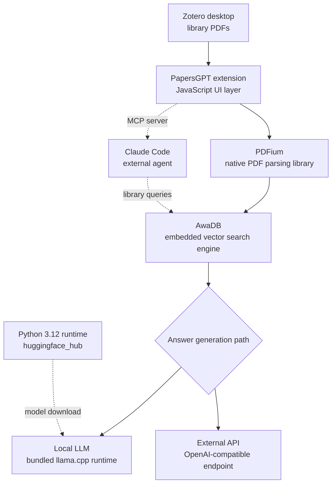

A Zotero plugin that claims to index 1,000 papers in minutes went around Korean tech timelines this week, and a reasonable objection travelled with it. The vendor says the plugin runs on a native C++ engine, yet the GitHub repository reports only JavaScript and TypeScript. Here is the answer up front: the C++ engine is real. It simply ships as prebuilt binaries inside the release artifact rather than as source in the repository, so the language statistics never see it. We downloaded the 131MB artifact and classified all 55 entries inside it.

## Why This Matters

We wrote this for platform engineers and security reviewers who have to decide whether a local-first AI tool belongs on company machines. The conclusion is this: the real substance of a desktop AI plugin lives in the release artifact rather than in the repository source, and if you never open that artifact you are approving an install without knowing what lands on your file system. In this case, installing one extension actually brought in an embedded vector database, a PDF parser, a llama.cpp inference runtime, and a complete Python interpreter. That is not an argument against using the tool. It is an argument for changing what you inspect.

## Overview

Zotero is an open source reference manager where researchers collect paper PDFs and bibliographic metadata. The recurring problem is that material accumulates and never gets read. Two hundred sleeping PDFs in a folder are not a symptom of laziness. They are what happens when the cost of finding something exceeds the cost of reading it.

PapersGPT targets exactly that gap. It is a Zotero extension that indexes your whole library, answers questions that span several papers, and links every claim back to the source location when you click a citation. The vendor documentation leans on three points: indexing runs entirely locally and works in airplane mode, a native C++ core processes 1,000 documents in minutes instead of hours, and the plugin doubles as an MCP server you can attach to Claude or Claude Code.

The repository is [papersgpt/papersgpt-for-zotero](https://github.com/papersgpt/papersgpt-for-zotero) under an AGPL-3.0 license. It was created on 22 November 2024 and as of this writing has 2,571 stars, 91 forks, and 75 open issues, with the last push on 22 July 2026. The GitHub API, however, reports the language breakdown as 4,250,035 bytes of JavaScript, 211,657 bytes of TypeScript, and 25,113 bytes of CSS. Not a single byte of C++.

That leaves two hypotheses. Either the performance claim is marketing, or the C++ lives outside the repository and reaches users only in compiled form. Opening the release artifact settles it immediately.

## What the Tool Actually Is

Start with the shape of the thing. When a user installs the extension into Zotero, the extension unpacks the native executables it carries and then behaves as a thin UI layer talking to them. Instead of embedding-based fuzzy retrieval, the documentation says it parses and indexes document structure.



The left-hand column is the point. Reading PDFs, indexing them, and producing answers all stay closed inside the user's machine. Cloud access is optional rather than the default path. The dotted edges on the right show that this is not merely a viewer: it also exposes an MCP server, which means a Claude Code session can treat an entire Zotero library as one knowledge source. For practitioners that is the most immediately useful part, because it removes the ritual of explaining folder paths and asking for files to be opened one at a time.

## Installation and Integration

To inspect the distribution yourself, pull the release asset. It is the same file Zotero installs.

```bash
# Inspect the latest release metadata
curl -s https://api.github.com/repos/papersgpt/papersgpt-for-zotero/releases/latest \
  | python3 -c "import json,sys; d=json.load(sys.stdin); \
    print(d['tag_name'], d['published_at']); \
    [print(a['name'], a['size']) for a in d['assets']]"

# Download the release artifact (131MB)
curl -L -o papersgpt-v0.6.1.xpi \
  https://github.com/papersgpt/papersgpt-for-zotero/releases/download/papersgpt-v0.6.1/papersgpt-v0.6.1.xpi
```

A Zotero `.xpi` is a zip archive, so the standard library is enough to look inside. We wrapped download and entry classification into one script and ran it in an isolated work tree. Rather than trusting file extensions, we read magic bytes and decided Mach-O, ELF, or PE directly.

```python
MAGICS = [
    (b"\xcf\xfa\xed\xfe", "Mach-O 64-bit (macOS)"),
    (b"\xca\xfe\xba\xbe", "Mach-O universal (macOS)"),
    (b"\x7fELF", "ELF (Linux)"),
    (b"MZ", "PE/COFF (Windows)"),
    (b"GGUF", "GGUF model weights"),
]

with zipfile.ZipFile(XPI) as zf:
    for info in zf.infolist():
        if info.is_dir() or info.file_size < 4096:
            continue
        with zf.open(info) as fh:
            head = fh.read(8)
        kind = next((label for magic, label in MAGICS if head.startswith(magic)), "")
        if kind:
            natives.append((info.file_size, kind, info.filename))
```

Nothing beyond the Python standard library was required. We installed no dependencies and did not need the Zotero desktop app. The full script is kept under `outputs/blog-impl/papersgpt-zotero-local-rag/`.

## Measured Results

The download took 10.6 seconds. The file is 137,481,144 bytes, roughly 131.1MB, with SHA-256 digest `e0ef451af731c2a5781f17b2dc0998903332d82880d64ae9fdf3bf122d088f1f`. Excluding directories, the archive holds 55 entries.

Here is the breakdown by extension, sorted by uncompressed size.

| Extension | Files | Size |
|---|---|---|
| `.zip` (nested archives) | 4 | 99.0MB |
| no extension (executables) | 2 | 31.6MB |
| `.dll` | 5 | 26.1MB |
| `.dylib` | 3 | 22.3MB |
| `.js` | 3 | 9.8MB |
| images and other | 41 | about 1.0MB |

JavaScript accounts for 9.8MB, essentially all of it in a single `chrome/content/scripts/index.js`. The remaining 120MB and more is native code or nested archives containing native code. Magic-byte classification found 8 native payloads totalling 50,812,989 bytes, about 48.5MB. That is 5.0 times the script volume.

Looking at individual files makes the identities obvious.

| File | Size | Identity |
|---|---|---|
| `resource/win/libawadb.dll` | 14.1MB | AwaDB embedded vector search engine (Windows) |
| `resource/mac/libawadb.dylib` | 10.9MB | Same engine (macOS universal) |
| `resource/mac/libpdfium.dylib` | 10.8MB | PDFium PDF parser |
| `resource/win/pdfium.dll` | 5.5MB | Same parser (Windows) |
| `resource/mac/papersgpt-agent-mac` | 20.7MB | MCP agent executable |
| `resource/win/papersgpt-agent` | 10.9MB | Same agent (Windows) |
| `resource/win/libcrypto-3-x64.dll` | 5.5MB | OpenSSL |

The C++ question resolves here. AwaDB is an embedded vector database written in C++, and PDFium is the C++ PDF engine that came out of Chromium. The vendor claim was accurate, and the code simply is not in the repository, which is why GitHub never counted it.

The four nested zips holding 99MB turned out to be more interesting still. This extension carries an entire inference stack and language runtime.

`resource/mac/llm-server-deploy-package.zip` is 36.7MB across 31 files, including `libllama-server-impl.dylib` at 28.1MB, `libllama-common.dylib` at 14.7MB, `libllama.dylib` at 4.9MB, and `libggml-cpu.dylib` at 2.2MB. That is llama.cpp. The Windows counterpart is 14.0MB across 21 files, with `papersgpt-local-llm-base` at 18.6MB and `llama.dll` at 3.0MB, plus `ggml-cpu-sapphirerapids.dll`, `ggml-cpu-zen4.dll`, `ggml-cpu-icelake.dll`, `ggml-cpu-skylakex.dll`, `ggml-cpu-cooperlake.dll`, and `ggml-cpu-cannonlake.dll` at 1.3MB to 1.6MB each. Per-microarchitecture CPU kernels prebuilt and selected at runtime.

The other two are more surprising. `resource/mac/download-release.zip` is 24.9MB compressed but expands to 1,851 files, among them `python-3.12/lib/libpython3.12.dylib` at 38.3MB. It is a complete Python 3.12 distribution with `huggingface_hub`, `hf_xet`, and the `certifi` CA bundle. The Windows `download-release.zip` is 23.4MB across 1,932 files with `python311.dll`, `sqlite3.dll`, and a bundled `pip-24.0` wheel. The one-click local LLM download from Hugging Face is implemented on top of that embedded Python.

One last observation bears directly on adoption. The archive contains only two platform directories, `resource/mac` and `resource/win`. There is no `resource/linux`. This tool does not run on Linux desktops or servers.

One thing deserves a plain statement. We did not attach a real Zotero library and time the indexing of 1,000 papers. The scope of this experiment ended at verifying the composition of the release artifact, and on the speed claim we confirmed only that a native engine capable of delivering it genuinely exists. The indexing throughput figure remains a vendor statement, not an independently verified number.

## What This Means for ThakiCloud

The findings overlap precisely with problems we handle across two products.

Take the ai-platform view first. ThakiCloud's ai-platform serves models into customer environments on Kubernetes, and many of those customers cannot send data outside their perimeter. PapersGPT demonstrates that local-first RAG already works on a single desktop: embedded engines handle vector search and llama.cpp CPU kernels handle inference. The more important lesson runs the other way, though. This approach replicates 48.5MB of binaries plus a Python runtime onto every user's machine, and at organizational scale version drift and patch lag become direct costs. If we offered the same capability internally, keeping embedding and inference in a central GPU pool with thin clients would be far more maintainable. Queue GPUs through Kueue and serve with vLLM, and model updates happen in one place while data stays inside the customer boundary. Meeting on-premises and data sovereignty requirements does not have to mean installing on personal machines.

Then the Paxis view. Paxis is ThakiCloud's Agent-Native Cloud control plane running on top of ai-platform, treating Skills, Tools, Policies, and Audit Logs as first-class resources. Because PapersGPT exposes an MCP server, it plugs straight into coding agents like Claude Code. The convenience is real, but the moment you attach a connector to an agent, whatever file system access that connector holds becomes the agent's reach. As we confirmed here, this particular connector contains eight executables whose source is not published, plus an embedded Python interpreter. That is why Paxis places MCP connectors behind a policy gate and records every call in an audit log. Instead of trusting connectors, we constrain and record their behavior, which is the realistic defense when no team can hand-audit every tool it adopts. Running skills and tools inside isolated sandboxes follows from the same judgment.

## Limitations and Counterarguments

This analysis has clear boundaries. We examined static composition only. We did not reverse engineer the binaries and did not observe network traffic during execution. So we have not verified the claim of fully local processing. We verified that the parts capable of implementing that claim are present.

The fair counterargument deserves space too. Shipping prebuilt binaries is ordinary practice and not a problem in itself. Requiring desktop users to have a compiler is not a realistic alternative, and bundling widely used projects like PDFium or llama.cpp is sensible. What sits awkwardly is the combination: an AGPL-3.0 repository whose performance-critical native core has no source in that repository leaves users unable to audit the part that matters. There is a gap between the impression of open source and actual verifiability.

There are functional limits as well. The absence of a Linux build removes this tool from server and Linux workstation environments outright. Star count 2,571 with 75 open issues signals an active project and also a backlog. And the library-wide synthesis capability, powerful as the documentation makes it sound, is something we did not measure.

## Wrapping Up

The skepticism raised on Twitter was half right. The native C++ engine is real: AwaDB, PDFium, and llama.cpp ship as prebuilt binaries totalling 48.5MB, five times the JavaScript. And the source for that engine is not in the repository, so users cannot verify it. Those two facts do not contradict each other, and you need both to judge well.

The one line worth keeping is this. When you evaluate a desktop AI tool, do not read the repository. Open the release artifact. The method used here takes minutes with nothing but the Python standard library, and reading magic bytes instead of extensions produces a full inventory of what gets installed. If you look at that inventory and still choose to adopt, that is an informed decision. If you install without looking, that is not a decision. It is a hope.

## Sources

- [papersgpt/papersgpt-for-zotero (GitHub)](https://github.com/papersgpt/papersgpt-for-zotero)
- [PapersGPT v0.6.1 release](https://github.com/papersgpt/papersgpt-for-zotero/releases/tag/papersgpt-v0.6.1)
- [Zotero official site](https://www.zotero.org/)
