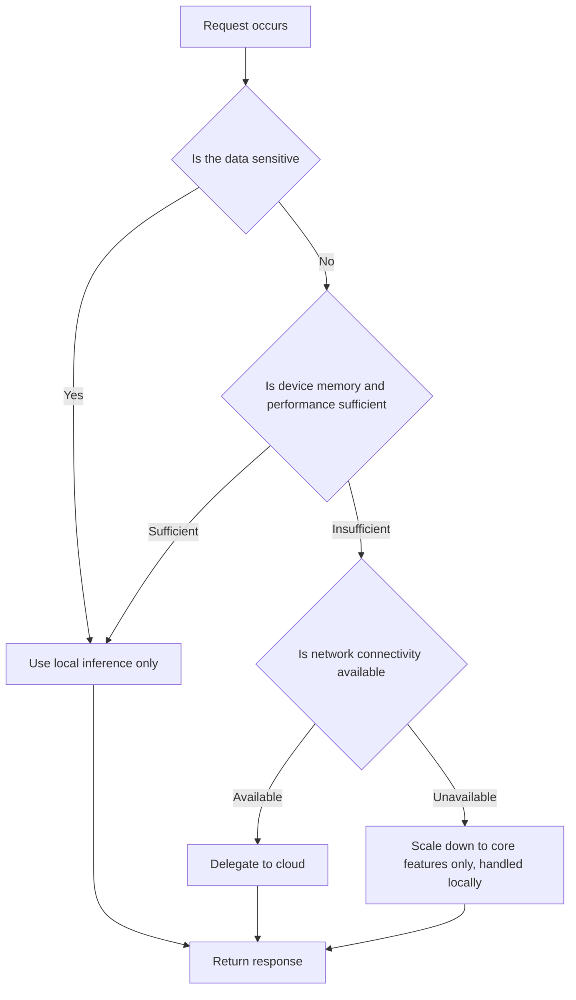

If you're an engineer who has to build AI features in an environment where data can't leave the internal network, this post is for you. It lays out what choosing to run a model inside the device forces on your architecture as a whole when you can't just plug in a cloud API, and what you actually gain and have to give up within that constraint.

The phrase "local-first" often gets mistaken for a story about performance optimization. In practice, though, what forces this choice is usually not speed or cost but a regulation or contract term that data cannot leave the device. That difference in starting point is what makes the whole design different.

## The Constraint That Data Never Leaves the Device

If you've ever built an app that handles medical records, a service that summarizes financial consultations, or a public-sector system running inside a closed network, you know this problem. The moment a user's input goes to a cloud API, that data has already reached the service provider's server. It might get kept in a log, reused to train a model, or leaked in a security incident. As regulations like personal data protection laws or GDPR tighten, this risk stops being a matter of choice and becomes a condition you have to comply with.

Local-first design solves this problem in a fundamentally different way. Instead of worrying about how to transmit data safely, it makes sure the data never needs to leave the device in the first place. If inference finishes inside the user's phone, laptop, or an in-house server, the leak path itself disappears. This difference can end up being the practical line between passing and failing a security audit.

The moment you accept this constraint, though, another problem comes along with it. You can't reproduce, inside a device, the reasoning capability that a large cloud model has. Choosing local-first means accepting a trade: you gain privacy at the cost of lowering the ceiling on model performance. Admitting that trade honestly and starting your design from there is what keeps you from being blindsided later by the gap between expectation and reality.

This constraint isn't limited to consumer apps, either. In software aimed at enterprise customers, it's common for the contract itself to explicitly prohibit data from leaving the premises. In this kind of environment, no matter how good a cloud API's response quality is, it can't even be considered as an option in the first place. The contract ends up deciding the technical choice before the technology does. That's why it's safer for local-first design to start not purely as a technical team's call, but by confirming the conditions together with legal and security from the outset.

## Why Latency Reshapes Architecture

A cloud API call can't avoid a network round trip. Just going from Seoul to an overseas region takes around 100 milliseconds, and model inference time gets added on top of that. This much latency might not matter much in an interaction like a chatbot exchanging text once. But it's a different story for a real-time voice conversation, or an augmented-reality feature that has to react to every camera frame.

When latency grows, it doesn't just mean the user waits longer. It decides whether a feature can even be built into the product at all. To keep a natural voice conversation flowing, a response needs to come right after the other person stops talking, and the moment a network round trip gets inserted, that naturalness breaks. The same goes for real-time subtitles or instant image filtering. These kinds of features can't even make it onto the design board without local inference.

Local inference removes the network segment entirely. Run a model of the right size on suitable hardware, and you can produce a response in tens of milliseconds. This speed isn't the result of optimization; it's a structurally guaranteed value, because there's no network to round-trip in the first place. So when evaluating a local-first architecture, it's more accurate to ask this question before cost savings: is there a feature in our product that simply stops working the moment a network round trip gets inserted?

## The Reality of Local Hardware: The Memory and Quantization Trade-off

This is where we need to say something that gets left out of a lot of writing about local AI. The claim that local is always better is an overstatement. In practice, adopting local inference brings in, all at once, a pile of constraints you never had to worry about with the cloud.

The first wall you hit is memory. On a phone or laptop, the OS and other applications already occupy a substantial chunk of memory, so what's actually available to a model is far smaller than the total memory. Load a large model as-is, and the app gets force-killed for running out of memory. That's why most models built for local deployment go through quantization. Take weights originally stored as 32-bit or 16-bit and cut them down to 8-bit or 4-bit, and the model's size and memory usage shrink together.

The problem is that quantization isn't free. The lower you drop the bit count, the smaller the model gets, but the subtle expressiveness the original model had gets shaved off along with it. Compress lightly and the quality loss is barely noticeable, but the memory savings are small too. Compress aggressively, on the other hand, and you get more memory headroom, but responses can start sounding unnatural, or the model can start generating factually wrong content more often. There's no single fixed answer here. You have to measure and decide, on your own, how much quality degradation your specific task can actually tolerate.

Hardware acceleration paths aren't uniform across devices either. The latest Apple silicon comes with a dedicated neural engine that enables efficient inference at low power, but older Android devices often either don't properly support a neural acceleration layer or support it with unstable behavior. That's why, when designing a local-first product, you need to build in a fallback path from the start that quietly drops to CPU inference whenever the acceleration path fails. Without this fallback, a feature that runs smoothly on the latest devices can stop entirely, or become noticeably slower, on older ones.

Device heat is another variable you can't ignore. Sustained inference on a mobile chip triggers thermal throttling that lowers processing speed on its own to manage heat. A number you get from running a benchmark briefly, just once, tends to overestimate real-world performance. You only find out about the degradation you'll actually hit after deployment if you validate performance under continuous-use scenarios too.

The sheer size of the model file itself is also an obstacle in app distribution. App stores and Play Store often cap initial install size, and users don't readily download an app that's several gigabytes either. That's why many teams don't bundle the model into the app and instead have it download separately the first time the app runs. In that case, you also need to design a retry path for when the download stalls or fails, and what to show the user while the model isn't ready yet.

## When to Use Local and When to Hand Off to the Cloud

Once you accept these constraints, the next question naturally follows. If local alone can't solve everything, when should you use local, and when should you hand off to the cloud? Here's that decision criterion laid out as a flow.



The first question to ask is the sensitivity of the data. If it's data whose external transmission is flat-out banned by regulation or contract, local processing is mandatory regardless of performance or convenience. Once this condition is met, none of the rest of the judgment matters.

If you're clear of the sensitivity condition, device performance comes next. For a task where a local model can produce sufficient quality, there's no reason to go all the way to the cloud. Conversely, for complex reasoning or a query that needs up-to-date information, a local model's limits show up immediately. In that case, handing off to the cloud is the better choice for user experience.

You also have to account for situations where the network is completely cut off. For the app not to stop entirely on a subway, a plane, or in a field with restricted connectivity, at least the core features need to keep working locally. The important principle here is not trying to perfectly reproduce every feature offline. It's far more realistic to keep only frequently used core actions, like summarizing or searching, local, and temporarily disable advanced features until the network is back.

Caching frequently repeated queries also helps make this decision run smoothly at every runtime. Even for questions that aren't exactly identical, reusing the result of a semantically similar question filters out a good number of cases where a cloud call would otherwise have been needed. Below is a simple gate example that checks device state to decide the path between local and cloud.

```python
def choose_inference_path(is_sensitive: bool, device_ram_mb: int,
                           min_ram_for_local_mb: int, network_available: bool) -> str:
    if is_sensitive:
        return "local"
    if device_ram_mb >= min_ram_for_local_mb:
        return "local"
    if network_available:
        return "cloud"
    return "local_reduced"
```

This function would get far more complex in an actual product, but the core point is spelling out the order of judgment in code. Checking sensitivity always has to come first, and only then do you weigh performance and network status. Flip the order, and sensitive data can accidentally end up going all the way to the cloud.

## Common Pitfalls in Local-First Design

There are a few mistakes that come up repeatedly when a team adopts a local-first architecture for the first time.

The first is mistaking the performance of the device you tested on for the baseline of all your users. A local model runs smoothly on the latest flagship device a developer uses, but a large share of actual users are on mid-range devices that are several years old. If you don't validate on a range of real devices with different specs, you only discover this gap after launch.

The second is thinking that deploying a local model once is the end of it. Like any software, a model can have vulnerabilities discovered later, and new versions can bring major improvements in performance or quality. A path for safely updating a deployed model file needs to be part of the design from the start.

The third is overlooking the fact that a local model doesn't know current information. A model built into the device has no way of knowing about events or data past its training cutoff. No matter how important privacy is, if a query genuinely needs up-to-date information, local alone can't answer it. This kind of task should be classified as a hybrid-design target from the outset.

The fourth is not treating battery and heat as part of the user experience. Because local inference uses the device's compute resources directly, battery drain and heat can end up noticeably higher than the cloud approach. If the impression an app leaves is "eats my battery" before "this is smart," that ends in a deletion.

The fifth is hiding the source of the response from the user. Depending on whether a local model or a cloud model answered the same question, how far you can trust it changes. Showing that distinction somewhere on screen, even small, lets the user judge for themselves how far to trust an answer. Hide the distinction, and things might look smooth in the moment, but it becomes hard to explain the source of quality variance later.

## From ThakiCloud's Perspective

We serve a Kubernetes-based AI platform directly inside our customers' environments. And we keep confirming, over and over, that the concerns local-first developers run into are fundamentally the same concerns we face every day in an on-premises environment. Both start from the same place: data sovereignty. The requirement that data not leave an individual user's device, and the requirement that data not leave the boundary of a customer's internal infrastructure, come from the same principle; they just differ in scale.

The difference is the layer of constraint. An individual device has to run a model within the physical limits of memory, battery, and heat, whereas the environments we serve can draw on GPU clusters inside the customer's own infrastructure, giving relatively large models room to run inside a closed network too. Even so, the fallback-path design, the caching strategy, and the judgment structure for deciding which requests get handled locally and which get handed off to bigger resources carry over almost as-is. In the end, local-first development is solving, for a single device, the same problem we're solving in the same way for an entire organization.

The model-update problem repeats the same way too. The concern of safely updating a local model on an individual device is, in form, different from, but at its core the same as, the concern we face when replacing a model we're serving inside a customer's closed network without downtime. The requirement to complete deployment and rollback internally, without depending on an external network, applies identically whether it's a single device or an entire cluster.

Local-first AI isn't a cure-all. You can't expect the same level of reasoning capability as a large cloud model, the performance gap between devices is large, and you have to carry the real-world constraints of battery and heat as well. But the structural advantage that data never needs to leave the device in the first place, and the instant response you get without a network round trip, are hard to replace any other way. Admitting that trade honestly, and spelling out in code a judgment structure that checks sensitivity, performance, and network status in that order, is the practical starting point for local-first design.

This post is adapted for the blog from a section of our internal ebook, Local-First AI Software Development.
