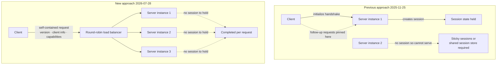

If you have operated an MCP server, you probably hesitated at some point while trying to scale out. The moment you add a second instance, the session becomes the problem. The client has to stay pinned to the instance it first connected to, which means sticky sessions or a shared session store. The [new MCP specification](https://blog.modelcontextprotocol.io/posts/2026-07-28/) Anthropic published on July 28, 2026 removed that premise entirely.

## Why read this

This post is for backend engineers and platform owners already running MCP servers or about to deploy one. The conclusion first. The essence of this revision is not a new feature but moving state out of the protocol and into the payload, and as a result the MCP server goes from a stateful service needing special handling to an ordinary stateless HTTP service. Nothing breaks immediately. Existing servers keep working and deprecated items carry at least twelve months of grace. So the practical purpose of this post is not emergency response but deciding what belongs on next quarter's roadmap.

## Overview

MCP was originally designed as something closer to a protocol for attaching local tools. If the picture is a desktop app opening a single connection to a local process and talking over it, a session is a natural concept. Remember what you negotiated for as long as the connection lives.

The problem surfaced as MCP moved to remote services. In an environment where multiple instances sit behind a load balancer, an autoscaler adds and removes instances, and a serverless runtime spins up containers per request, sessions are a cost. Scaling is easy when a request can go to any instance, and a session takes exactly that freedom away. This revision addresses the point head on, and several write-ups describe it as the largest revision since launch.

## What changed

The biggest change is that the protocol core became stateless. Concretely, two things went away. The `initialize` handshake exchanged when opening a connection is gone, and the protocol-level notion of a session is gone with it.

Every request became self-contained instead. The protocol version, client information, and capability negotiation that used to be exchanged once at connection time now ride along on every request. It looks wasteful at a glance, but the payoff is large. With no session identifier, any request can go to any instance. You can stand MCP servers behind a plain round-robin load balancer with no sticky session configuration and no shared session store.

The transport layer changed too. The Streamable HTTP transport now requires `Mcp-Method` and `Mcp-Name` headers. The purpose is clear: let load balancers, gateways, and rate limiters know which operation this is and route on it without opening the body. In a structure where you had to parse JSON to tell a tool call from a list query, the infrastructure layer could do almost nothing.

## What fills the space the session left

Removing the session means something has to do the session's job. The spec adds two mechanisms.

The first is Multi Round-Trip Requests. Introduced as SEP-2322, it replaces the long-lived SSE stream. It works like this. When a server needs to ask the client something mid-processing, instead of holding the connection it returns an `InputRequiredResult`. That response carries `inputRequests`, the items to ask about, along with an opaque `requestState` token. The client gathers the answers and re-issues the original call with `inputResponses`. Because state lives in the payload rather than a held connection, it fits the stateless model.

The second is discovery and caching. A server that previously relied on a session header or the `initialize` handshake must now implement the `server/discover` method. List and read results carry `ttlMs` and `cacheScope` to declare that they are cacheable. Once every request is self-contained you end up re-exchanging things like tool lists repeatedly, and cache hints offset that repetition. Authorization hardening and a formal extensions framework went in alongside, and the Tier 1 SDKs were updated.

## What was deprecated and what replaces it

SEP-2577 marked three features as deprecated: Roots, Sampling, and Logging. The legacy HTTP with SSE transport was retired along with them.

| Deprecated | Recommended replacement |
|---|---|
| Roots | Tool parameters, resource URIs, or configuration |
| Sampling | Direct LLM provider API calls |
| Logging | stderr and OpenTelemetry |
| Legacy HTTP with SSE transport | Streamable HTTP |

There is a consistent logic in the replacement directions. All three features only worked if the server could request something back from the client or hold the connection open. That premise does not hold in a stateless model, so each moved to a path that needs no state. Handing Logging off to stderr and OpenTelemetry is the clearest case. It reads as a judgment that observability is not the protocol's problem to carry when mature standards already exist.

Deprecated is not removed. A formal deprecation policy was codified in this revision: at least twelve months must pass from the release of the revision that first marks a feature deprecated before it becomes eligible for removal.

## When to migrate

The short answer is that nothing needs fixing urgently.

If you run a v1 server in production, nothing breaks on July 28. Existing servers keep working and deprecated items have a year of grace. The compatibility design is careful too. A v2 server answers the legacy `initialize` handshake alongside `server/discover`, so upgrading your server does not strand existing clients on the 2025-11-25 spec. From the other side, the client's default mode probes `server/discover` first and falls back to `initialize` on failure. Both ends are designed for gradual transition.

So the realistic order looks like this. First, check whether your codebase uses any of the three deprecated features. If you were using Sampling, that is the largest piece of work. Converting a structure where the server borrows the client's model into direct provider API calls changes who pays for inference and where keys live, which makes it more than a simple substitution. Logging is comparatively easy, and Roots needs a design decision because there are three replacement paths.

## What this means for ThakiCloud products

This change reaches our two products in different ways.

Paxis is the more direct case. Paxis is ThakiCloud's Agent-Native Cloud control plane, treating skills, tools, policies, and audit logs as first-class resources and connecting external tools through MCP connectors. The stateless shift lowers the operational difficulty of that connector layer. With sessions gone there is no reason for a connector to be pinned to a particular server instance, and there is less state to recover when a reconnect fails. Header-based routing is the more interesting part. Exposing `Mcp-Method` and `Mcp-Name` as headers means a gateway can tell which tool is being called without opening the body. There are few better places to attach a policy gate. Allow and deny decisions per tool name, rate limits, and audit logging can all move from the application into the infrastructure layer.

For ai-platform the question becomes one of serving topology. ThakiCloud's ai-platform is multi-tenant infrastructure running models and services on Kubernetes. A stateless MCP server is a far easier workload to handle there. With no sticky session configuration you can use default service load balancing as is, and with no state to hold between requests you scale out and in freely. Scaling to zero when there is no traffic becomes an option. In on-premises and sovereign environments there is one more implication. Dropping the external state store used for sessions removes a component from the deployment, and fewer components means less surface to explain during air-gapped review.

## Limits and counterarguments

The stateless shift is not free.

Every request being self-contained also means every request is heavier. Protocol version, client information, and capability negotiation travel repeatedly. That is why the spec added cache hints, but caches only help if clients actually honor them. A lazy implementation tips toward more bandwidth and more latency.

Deprecating Sampling is not a simple substitution. There were real advantages to the server borrowing the client's model. The server did not need to hold model credentials and the client bore the inference cost. Moving to direct provider API calls puts keys on the server and shifts cost there too. Depending on your deployment model, that change can be substantial.

Then there is timing. As of writing, the spec is a little over a week old. SDKs are updated and at least one cloud gateway has announced support, but how smoothly the broader ecosystem passes through a period of supporting both specs remains to be seen. Transition periods cost something to support on both sides, and that cost gets paid out over twelve months.

## Wrapping up

Reduced to a sentence, this revision moved MCP from a protocol for attaching local tools to a protocol that runs in distributed environments. The conclusion stated at the top is recovered here. One decision to move state from the protocol into the payload cleared away sticky sessions, shared session stores, and autoscaling constraints all at once, and the price is heavier requests and deprecated features that need replacement paths.

What to do now is an audit, not a migration. Find the places in your codebase that use Sampling, Roots, and Logging and write them down. Twelve months sounds long, but it gets tight when items requiring design work are mixed in. Conversely, if you are just now designing a new MCP server the call is simple. Do not adopt the three deprecated features, and design for stateless from the start.

## Sources

- [The 2026-07-28 Specification, Model Context Protocol Blog](https://blog.modelcontextprotocol.io/posts/2026-07-28/)
- [Beta SDKs for the 2026-07-28 MCP Spec Release Candidate](https://blog.modelcontextprotocol.io/posts/sdk-betas-2026-07-28/)
- [MCP 2026-07-28 spec: what changed, what breaks, Stacktree](https://stacktr.ee/blog/mcp-2026-spec-changes)
- [Model Context Protocol prepares to break with its stateful past, The Register](https://www.theregister.com/devops/2026/07/23/model-context-protocol-prepares-to-break-with-its-stateful-past/5276722)
- [How AgentCore Gateway supports the MCP 2026-07-28 spec, AWS](https://aws.amazon.com/blogs/machine-learning/how-agentcore-gateway-supports-the-mcp-2026-07-28-spec/)
