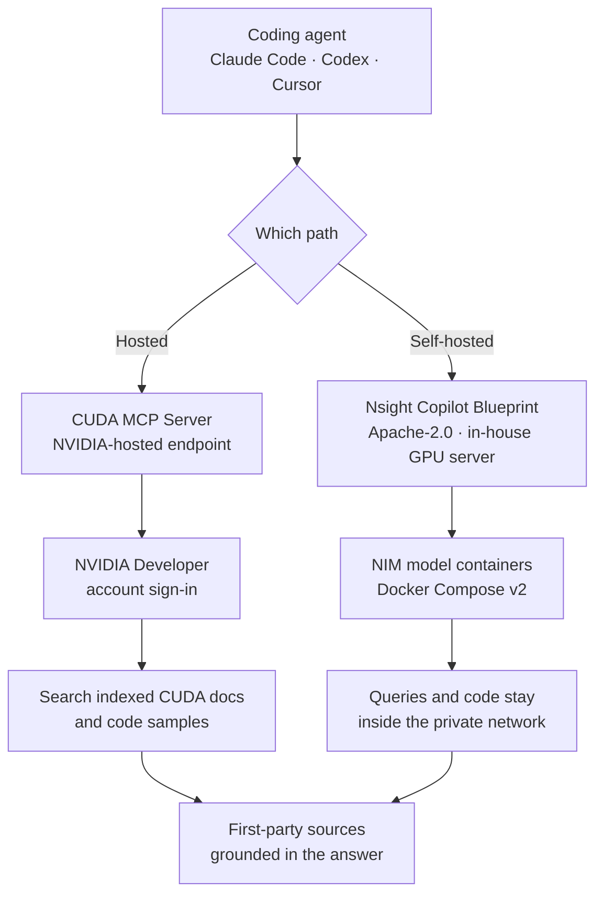

If you have ever asked a coding agent about a CUDA kernel, you have probably received a confidently wrong answer. The agent is not lying. It is reciting CUDA knowledge frozen at training time. When an API signature changes or a recommended pattern shifts, the model has no way of knowing. NVIDIA decided to fix this from the documentation side, with the [CUDA MCP Server](https://developer.nvidia.com/nsight-ai), which indexes official CUDA documentation and code samples and exposes them over MCP.

## Why This Matters to You

This article is written for engineers who work on CUDA code with a coding agent, and for platform owners who must decide which external MCP servers are allowed inside a company development environment. Here is the conclusion up front. Attaching this server costs a single command, so an individual developer should just do it, but an organization should not attach it casually. Every client needs an NVIDIA Developer account sign-in, and your queries leave your machine. NVIDIA does not hide this. Its own documentation tells teams handling sensitive code to use the self-hosted path instead. So this article covers both how to connect and when not to.

## Overview

CUDA is a domain where stale knowledge hurts unusually badly. Toolkit releases arrive often, recommended patterns shift with each architecture generation, and identical code can perform completely differently across generations. Worse, wrong answers pass silently. A compiler catches bad syntax, but a kernel written against an outdated recommendation compiles fine, runs fine, and is merely slow. Nothing reveals the problem until you attach a profiler. This is exactly the kind of field where an agent answering from old knowledge does the most damage.

The knowledge freshness problem is not new. Until now there were broadly two answers. One is to give the agent web search. The other is to build an internal RAG system by loading documentation into a vector database yourself. The first approach cannot control result quality, so it drags in outdated blog posts and community misinformation. The second controls quality but requires you to build the index and keep it current. In a domain as large and fast-moving as CUDA, that maintenance cost is not trivial.

The CUDA MCP Server is a third option. NVIDIA, the author of the documentation, builds and maintains the index itself and exposes it through the standard MCP interface. From the agent's point of view, it is one more search tool. From yours, the index maintenance burden disappears. NVIDIA places this server under an umbrella called Nsight AI, which its product page describes as the evolved, rebranded platform replacing Nsight Copilot.

Placing all three options on the same axes makes the differences clear.

| Approach | Who maintains the index | Evidence quality | Data exposure |
|---|---|---|---|
| Attach web search | Nobody | Uncontrolled, community errors leak in | Queries go to a search engine |
| Build internal RAG | Your team | Controlled, high refresh cost | Stays inside |
| Vendor MCP server | NVIDIA | First-party source, refresh delegated | Queries go to the vendor |

In short, a vendor MCP server removes the maintenance cost of internal RAG in exchange for routing your queries outside. Whether that trade is acceptable is the entire adoption decision, and the answer differs by organization.

## What This Actually Is

Nsight AI is not one product but a bundle of three entry points, and they differ enough to be worth separating.

The first is the subject of this article, the **CUDA MCP Server**. NVIDIA hosts it, and you register a single endpoint with your agent. The server provides a search tool over indexed CUDA documentation and code samples, and the agent searches that corpus when a CUDA question comes in.

The second is the **Nsight Copilot Blueprint**, an open-source, self-hosted CUDA AI backend that you deploy onto your own GPU-accelerated system. This is the path for organizations that cannot use a hosted service.

The third is the **Nsight Compute integration and VS Code extension**, which is closer to interactive guidance inside the profiler, such as flagging uncoalesced memory accesses in a kernel and suggesting a direction.



The fork between these two paths is not performance but where the data flows. NVIDIA offers the same criterion in its FAQ. The hosted server provides access to NVIDIA-curated documentation, but it states plainly that users handling highly sensitive or proprietary code should use the self-hosted Blueprint so that data remains strictly on-premises. It is uncommon for a vendor to narrow the scope of its own hosted service in writing, so that sentence is worth taking at face value and using as a decision rule.

## Installation and Integration

Connecting really is one command. The following is exactly what NVIDIA's product page specifies per client.

Claude Code registers it like this.

```bash
claude mcp add --scope user --transport http nvidia-cuda-docs \
  https://api.copilot.nsight.ngc.nvidia.com/mcp/cuda-docs
```

Codex uses its own subcommand.

```bash
codex mcp add nvidia-cuda-docs \
  --url https://api.copilot.nsight.ngc.nvidia.com/mcp/cuda-docs
```

Clients that take a config file directly, such as Cursor, use the standard `mcpServers` block.

```json
{
  "mcpServers": {
    "nvidia-cuda-docs": {
      "url": "https://api.copilot.nsight.ngc.nvidia.com/mcp/cuda-docs"
    }
  }
}
```

There is one easy trap here. Antigravity uses the same structure but names the key `serverUrl` rather than `url`.

```json
{
  "mcpServers": {
    "nvidia-cuda-docs": {
      "serverUrl": "https://api.copilot.nsight.ngc.nvidia.com/mcp/cuda-docs"
    }
  }
}
```

Authentication happens at first connection, not at registration. You sign in with an NVIDIA Developer account, and the client reuses that authentication afterward. On a desktop with a human sitting at it, this is a natural flow. That interactive login step becomes a constraint in automated environments, which we will return to.

To confirm the registration itself landed, check your client's server list. In Claude Code, `claude mcp list` should show a `nvidia-cuda-docs` entry. Appearing in the list does not mean authentication is complete. Registration and authentication are separate steps.

It is also worth deciding your `--scope` in advance. NVIDIA's guidance uses `--scope user`, which makes the server visible to every project on that machine. That is convenient on a personal laptop, but in an organization where allowed connectors differ per project, global registration actively works against control. Inside a company, prefer registering at project scope and managing explicitly which repositories may use which connectors.

Self-hosting carries far heavier requirements. You need an NVIDIA GPU-accelerated system running Ubuntu 22.04 or later, Docker Compose v2, and the NVIDIA Container Toolkit, plus at least 200 GB of free disk. The repository is [NVIDIA-AI-Blueprints/nsight-copilot](https://github.com/NVIDIA-AI-Blueprints/nsight-copilot) under Apache-2.0. As checked through the GitHub API, the repository was created on 2026-02-12, was last pushed on 2026-07-19, and has 11 stars. A low star count is not a reason to doubt quality here. The deployment audience is limited to organizations with GPU servers, so this was never the kind of repository that accumulates stars. It does mean community validation is thin, so budget time to validate it yourself if you adopt it.

## Measured Results

I checked directly whether the endpoint is live, by sending an ordinary GET request to the published endpoint.

```text
GET https://api.copilot.nsight.ngc.nvidia.com/mcp/cuda-docs
→ HTTP Error 405: Method Not Allowed
```

The key detail is that this is 405 and not 404. The path exists and is routed, it simply does not accept GET. MCP's streamable HTTP transport carries JSON-RPC over POST, so this response is correct behavior. If you open it in a browser and see nothing, that does not mean the server is down.

From here I will be direct. **The full MCP handshake was not completed in this environment.** The first connection requires an interactive NVIDIA Developer account login, and this session is headless, so that step could not be cleared. As a result, this article will not quote the exact tool names the server exposes, the shape of its search responses, or query latency. Leaving numbers out is better than publishing numbers I did not verify.

That failure is itself a practical result, though. An interactive authentication step becomes a direct obstacle when you want to use this server from a CI runner or an overnight batch agent with no human attached. On a developer laptop you log in once and forget it, but in a pipeline where containers are recreated on every run, you have to design credential handling separately. Do not decide based on the desktop scenario alone.

It is also worth writing down what to measure when you evaluate it yourself. First, freshness. Pick an API that changed recently or a newly recommended pattern, ask about it, and see whether the answer differs before and after attaching. If it does not, the index does not cover the CUDA version range you actually use. Second, citation accuracy. Open the documentation location the answer cites and confirm it says what the agent claimed. Attaching search does not automatically make citations correct. Third, latency. Document search adds a round trip to every question, so use it for a few days and judge whether the conversation becomes slow enough that you end up turning it off. All three depend on your codebase and CUDA version, so nobody else's benchmark can substitute.

## What This Means for ThakiCloud

What we find notable here is not the CUDA knowledge itself but the structure.

Through the **Paxis** lens, this is a case of standardizing a domain's first-party source as an MCP connector. Paxis is our Enterprise Agent Platform for automating work with agents, where skills are retrieved and executed in an isolated sandbox and every action passes a policy gate and an audit log. External MCP connectors are knowledge suppliers plugged into that structure, which makes the evaluation criterion clear. Each additional connector improves the grounding of an agent's answers while simultaneously adding one more exit for data. A connector like the CUDA MCP Server, where the vendor curates the first-party source directly, is attractive on grounding quality, so what you need is a per-connector policy deciding which workloads may use it and which may not. Allowing everything or blocking everything both lose.

Through the **Telox** and **Velox** lenses, this is one more development-support workload running on GPUs. The Nsight Copilot Blueprint puts NIM model containers on an in-house GPU system and asks for 200 GB of disk before anything else. On Telox as GPUaaS or Velox as bare metal, an always-on development-support backend shares GPUs with training and inference workloads, so scheduling and isolation are worth designing from the start. If a convenience sidecar eats production job capacity, the benefit cancels out.

The **Aegis** lens is the most direct. The sentence where NVIDIA tells teams with sensitive code to self-host is precisely why Aegis exists. For finance, public sector, defense, and manufacturing customers, kernel code and the workloads being optimized are themselves assets, and those queries cannot go to an external endpoint. Standing up the same capability inside an air-gapped on-premises environment while preserving data sovereignty is what Aegis does, and this Blueprint adds one more open-source component that can sit on top of it. The principle that the same workload runs identically in a hosted environment and inside a customer's closed network applies here too.

## Limitations and Counterarguments

The biggest limitation is scope. This server only searches CUDA documentation. It does not profile your kernels or catch performance regressions. Errors caused by misreading documentation go down, but problems rooted in algorithm design or memory access patterns remain untouched. The agent does not come to understand CUDA. It comes to cite CUDA documentation accurately.

It is also worth resisting the idea that self-hosting is a universal alternative. The Blueprint is not a lightweight service that only hosts a document index. It is a backend including NIM model containers, and the product page footnotes that hardware compatibility depends on the requirements of the included NIM models. In other words, 200 GB is a floor, and the GPU memory and compute you actually need shift with whichever models ship inside. Going on-premises buys data sovereignty at the price of continuously spending GPU capacity and operations headcount. Model updates and index refreshes that the hosted service handled for free become your job. Choosing self-hosting because data cannot leave is sound, but the cost does not disappear. It changes shape and moves onto your side of the ledger, and your budget should reflect that.

A lock-in counterargument is available too. Putting a vendor-hosted endpoint inside your development workflow adds a dependency. MCP's structure blunts much of this objection, though. A connector is one line of configuration, so removing it costs about as little as adding it, and you can substitute a self-hosted backend behind the same interface. The real lock-in risk lives in the workflows you build on top rather than in the endpoint, so keep treating connectors as replaceable parts.

Finally, a note on how thin the verification here is. This article directly confirmed the official product page, repository metadata, and the endpoint response code, and nothing beyond that. Whether search quality is actually good requires attaching account authentication and throwing a batch of real CUDA questions at it, and that work has not been done. Confirm with your own questions before committing.

## Wrapping Up

To summarize, the CUDA MCP Server is an approach where the author of the documentation fixes the freshness problem in coding agents directly, and because attaching it costs one command, the call is easy for individual developers. Go ahead and attach it.

The organizational call is different. To bring back the conclusion from the opening, this server should be attached together with a per-connector policy rather than attached casually. Two properties, that queries leave your environment and that authentication is interactive, change the answer decisively depending on the workload. If you handle sensitive code, evaluate the Apache-2.0 self-hosted path exactly as NVIDIA itself recommends, and check the GPU and disk requirements before you commit.

If we compress the next action into one line, attach it on your personal laptop today and hold company-wide rollout until the connector allowlist policy is settled. Doing it in the other order costs far more to undo.

## Sources

- [NVIDIA Nsight AI product page](https://developer.nvidia.com/nsight-ai)
- [NVIDIA-AI-Blueprints/nsight-copilot (Apache-2.0)](https://github.com/NVIDIA-AI-Blueprints/nsight-copilot)
- [NVIDIA HPC Developer announcement post](https://x.com/NVIDIAHPCDev/status/2082144045107917084)
