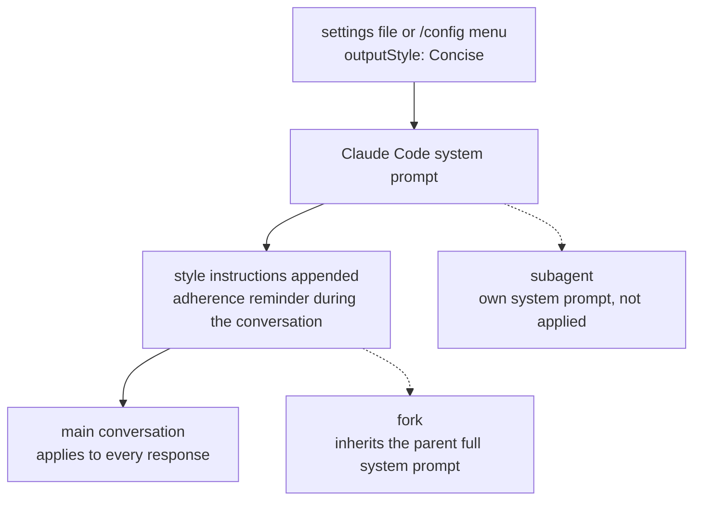

## Why read this

If you use Claude Code daily, or build headless agent loops on top of it, this is the reference for "should I turn on Concise, and how far does it reach." On August 20, Claude Code v2.1.237 added Concise to the built-in output styles. The core conclusion up front: Concise is the first built-in feature that trims response length at the system prompt level, and what matters in its design is not "short" but where the line is. Error reports, security warnings, and destructive-action confirmations are kept intact. And because it applies to the main conversation only and not to subagents, environments that spawn many subagents may find the savings drop out of their calculations.

## Overview

Claude Code's output styles are the mechanism for changing the role, tone, and default format of responses. Before this release, the built-in styles were four: Default (the existing system prompt), Proactive (executes immediately, makes reasonable assumptions instead of pausing for routine decisions), Explanatory (provides educational "Insights" between tasks), and Learning (a learn-by-doing mode that inserts TODO(human) markers so you contribute small strategic pieces of code yourself). Concise is the fifth built-in style, and the first one that adjusts response length as a default.

The announcement came from the @ClaudeDevs account on August 20, in a one-line summary: "leads with the result, keeps responses short, and still gives full detail when you ask." The official documentation spells out Concise's behavior contract, how output styles work, and how they compare to related features.

## What Concise does

Following the documentation's definition, Concise instructs Claude to:

- Lead with the result. Preamble and narration are skipped.
- Keep responses short by default. The requested work is still done as thoroughly as in the Default style.
- Answer in full when asked for an explanation or more detail. Short does not mean less information.
- Keep safety information as an exception. Error reports, security warnings, and confirmations for destructive actions retain their complete content.
- Require Claude Code v2.1.237 or later.

That last exception is what makes the feature practical. If "short" were the only instruction, the model would be tempted to trim error messages and warnings too, and at that point the output style becomes a token saver that loses safety information. Concise explicitly separates what gets cut (preamble, narration) from what does not (errors, security, confirmations), and a mid-conversation request for "more detail" restores the full depth.

There are two ways to enable it. In the terminal, run `/config` and pick a style under Output style; the selection is saved to `.claude/settings.local.json` at the local project level. Or set the `outputStyle` field in a settings file directly.

```json
{
  "outputStyle": "Concise"
}
```

One caution the documentation makes explicit: the setting does not apply immediately. It takes effect after `/clear` or at the next session start. Also, the standalone `/output-style` command was deprecated in v2.1.73 and removed in v2.1.91; `/config` is now the only menu path.

## How it works

The output style mechanism has four parts.

1. It modifies the system prompt directly. The style's custom instructions are appended to the end of the system prompt.
2. An adherence reminder fires during the conversation. Every output style inserts a re-confirmation signal so Claude keeps following the instructions.
3. Custom styles omit Claude Code's built-in software engineering instructions (scoping changes, writing comments, verifying work) by default. Set `keep-coding-instructions` to true in the frontmatter to retain them. Built-in styles do not have this problem; Concise is documented to do the work just as thoroughly.
4. The scope is the main conversation. Subagents run their own system prompt, so output styles do not change how they respond. The exception is a fork, which inherits the parent's full system prompt.



This structure is the answer to "how far does it reach." In an interactive session where you keep coding and reviewing in one conversation, every turn is affected. In a workflow that spawns subagents for exploration, implementation, and review, subagent responses keep the default length.

### Where the token usage goes

The documentation is explicit about tokens. Adding instructions to the system prompt increases input tokens, but prompt caching reduces that cost after the first request in a session. In other words, the input-side cost of an output style is nearly one-time per session, and the difference is on the output side. Explanatory and Learning deliberately produce longer responses than Default, increasing output tokens; Concise goes the other way. For custom styles, output depends on what the instructions tell Claude to produce.

## Concise, or something else

Claude Code has several features that change how Claude behaves, and they sit at different levels. The documentation's comparison, summarized:

| Feature | How it works | Use it when |
|---|---|---|
| Output styles | Modifies the system prompt | You want a different role, tone, or default response format every turn |
| CLAUDE.md | Adds a user message after the system prompt | Claude should always know your project conventions and codebase context |
| --append-system-prompt | Appends to the system prompt without removing anything | A one-off addition for a single invocation |
| Agents | A subagent runs its own system prompt, model, and tools | You need a separately scoped helper for a focused task |
| Skills | Loads task-specific instructions when invoked or relevant | You have a reusable workflow |

The dividing line is where, at what scope, and for how long. Output styles change the system prompt itself and apply to the whole session. CLAUDE.md leaves the system prompt untouched and layers a user message on top; talk-style rule files like this repo's caveman-mode rule ride that path. --append-system-prompt is one process, and skills are on-demand.

The interesting point: pushing "answer tersely" through CLAUDE.md or a rules file adds one more resident text to every session's context, and when that instruction collides with the model version or other style instructions, you have less leverage than the built-in style's single `/config` toggle. Concise lifts that instruction to the product level and guarantees the safety exception (errors, security, confirmations) in the official documentation.

## Where Concise sits in agent loops

For headless agent operation, output styles matter in three places.

**First, output tokens are the billing unit.** From the serving engine's view, input is largely absorbed by caching, but every output token is charged as-is. In long sessions, the per-turn preamble and narration compound along with the context length. Concise cuts exactly that axis.

**Second, in multi-agent setups the savings can drop out of the calculation.** Because subagents run their own system prompt, a Concise main session still gets default-length subagent responses. In workflows where subagents produce most of the output (exploration fan-out, implementation delegation), the real savings from "I turned on Concise" are smaller than the documentation suggests. Forks inheriting the parent are the rare path where it does apply.

**Third, the safety-information floor is design, not regulation.** In automated pipelines, a model that trims error reports makes debugging harder, and trimmed security warnings break gates. Concise separating "short" from "kept intact" at the prompt level puts a documented floor under a token-saving feature. For organizations running internal agent fleets, that floor is the primary criterion for choosing an output style.

ThakiCloud's internal agent fleets ran the same direction manually, before this release: a talk-style rule file (a rules entry enforcing terse responses, result-first, no decoration) kept resident in the CLAUDE.md layer. The contrast with built-in Concise is clear. A manual rule lives in every session's context and can only ask the model to keep the safety exceptions; the built-in style applies at the system prompt level with the exceptions documented. Concise is the same goal lifted to the product level, and a rules file remains a valid layer when an organization wants a stronger, context-specific constraint.

## ThakiCloud product implications

Concise is a small feature, but it sits in a meaningful place for both product lines.

**Paxis lens.** The economics of the enterprise workflows Paxis automates ultimately hang off the token unit price. If an agent tacks preamble and narration onto every turn, that cost is billed in tokens, not per workflow. An output style that formalizes "do not cut safety information" means "savings" and "trust" can be separated into one documented setting. From Paxis's workflow orchestration view, the subagent non-coverage is the same story: the scope of the savings is computable only by someone who knows the agent structure, and making that structure visible is Paxis's job.

**ai-platform (Metis) lens.** In the tokens Metis serves, output tokens are the pure billing axis that caching cannot absorb. If Explanatory and Learning increase output and Concise decreases it, then the same model on the same input charges different token counts per request depending on the output style. From a serving view, output style can become a cost variable on the same footing as model selection. In a structure where low-cost serving creates the economics of agent workflows, the formalization of a response-length layer is a signal that one more variable in that structure is now manageable.

## Limitations and counterarguments

- **Subagents are not covered.** The biggest practical limit. As the documentation states, output styles are main-conversation only, and in subagent-dense workflows "I turned on Concise" does not translate into savings. Until that changes, multi-agent token budgets must treat subagent response length separately.
- **It is prompt-level control.** Concise guarantees "short" by instruction, not by hard limit. Some turns will ignore it or follow it partially. Pipelines that need numeric token ceilings still need a max_tokens-style hard cap as a separate layer.
- **No quantitative savings are published.** The docs and changelog state the direction (output decreases) but not a token reduction rate for switching to Concise. "How much less" is a number your organization has to measure on its own workloads.
- **The custom-style trap.** The output style mechanism itself defaults to removing the built-in engineering instructions when you write a custom style (`keep-coding-instructions` defaults to false). A "simple answers" custom style can silently drop quality-relevant instructions too. This trap does not apply to the built-in Concise.
- **The `/clear` activation delay.** A setting change takes effect after `/clear` or at the next session, not mid-session. Deployment scripts that flip the output style and expect an immediate effect will see unexpected behavior.

## Summary

Concise is the release where the output style mechanism gained its first built-in case for "response length." Three things to take away.

First, the cut line is explicit. Preamble and narration go; error reports, security warnings, and destructive-action confirmations stay intact; a "more detail" request restores the full answer. Second, the scope is the main conversation. Subagents are excluded, forks inherit. In multi-agent environments you have to know that scope before you compute anything. Third, its position is between CLAUDE.md and skills: system prompt level for every turn, but not a project-convention text, which keeps it clear of resident context cost and instruction conflicts.

The practical takeaway is simple. On Claude Code v2.1.237 or later, switch Output style to Concise in `/config`, run `/clear`, and use it for one session. Confirm with your own hands that responses got shorter while errors and warnings stayed intact; that one session is the right way to adopt the feature. If you spawn many subagents, do not compute your whole budget from the main session's savings. That is the most practical lesson this release leaves.

## Sources

- [Claude Code changelog v2.1.237](https://github.com/anthropics/claude-code/blob/main/CHANGELOG.md) (built-in "Concise" output style added)
- [Claude Code official docs: Output styles](https://code.claude.com/docs/en/output-styles) (mechanism, token usage, related feature comparison)
- Announcement tweet: [@ClaudeDevs](https://x.com/ClaudeDevs/status/2090245922685063634) (August 20)