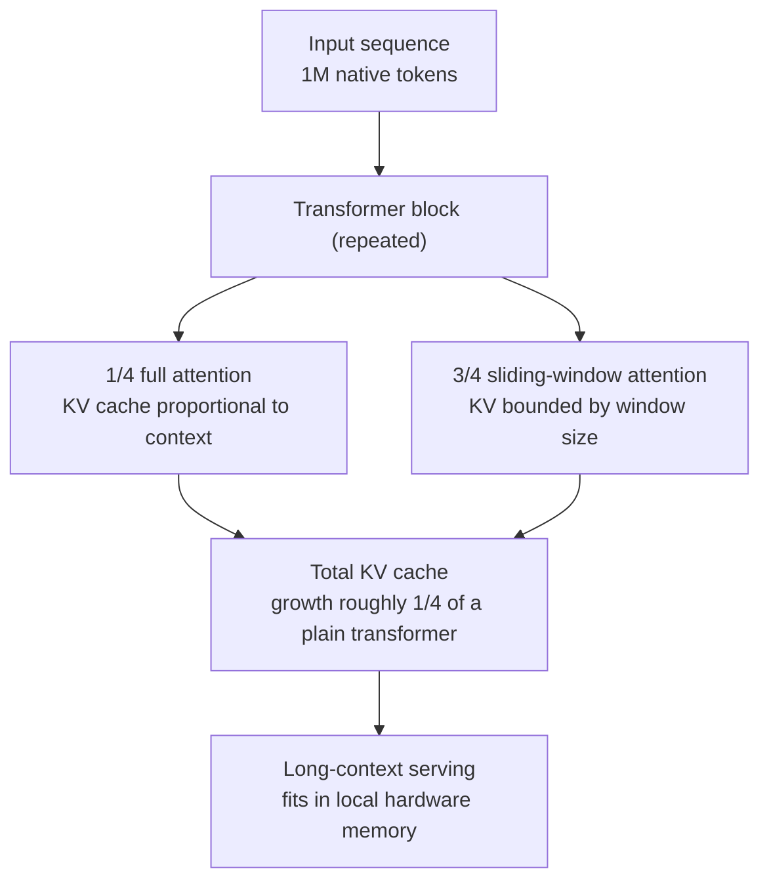

## Why Read This

This is for developers choosing a local inference path on CPUs or a single GPU, without a cluster or a data center. The up-front conclusion: Spark-X2.5 shows that pairing 4B parameters with a 1-million-token native context is no longer a compromise that "runs but is useless," and the structure that makes it possible is hybrid attention, which cuts the layers whose KV cache grows with context down to one quarter. If you are deciding what to run in an offline environment or on a consumer machine, this model's specs, its license, and its position in the local ecosystem are worth putting on your shortlist.

## What Happened

iFlytek's model team XHToken open-sourced two models, Spark-X2.5-4B and Spark-X2.5-1.7B, around September 1, 2026 (official repository [XHToken/Spark-X2.5](https://github.com/XHToken/Spark-X2.5)). The license is Apache 2.0, with no revenue threshold for commercial use. On September 7, the official @SparkLLM account posted a real Windows CPU demo under the line "Spark-X2.5 now runs locally," and the official GGUF packages plus llama.cpp support became the story. The demo: take a community GGUF on a GPU-less Windows machine and use it through a local API.

The differentiator versus a typical small-model release is the context. A 1-million-token native context is not an extrapolated number stretched out of an existing model with long-context training; it is a number the model claims from the start. The attention structure below is what carries it.

## What This Is

Spark-X2.5 is a dense model with hybrid attention, not a MoE. Inside each transformer block, one of the four attention layers is full attention and the other three are sliding-window attention. Full-attention KV cache grows linearly as context gets longer. Sliding-window attention keeps only the KV inside its window, so its memory stays fixed no matter how long the sequence gets.



Capping the share of "context-growing" layers at one quarter is the essence of the design. A plain transformer of the same depth grows KV in every layer as context grows; in Spark-X2.5 only the full-attention layers do. For a 4B-class model, that decides whether the KV of a million-token sequence fits in one consumer GPU or spills into CPU memory.

The architecture is named Spark2_5ForCausalLM, and its tokenizer and inference interface follow the standard CausalLM shape. The 1.7B version is the same structure with fewer layers.

## Install and Integration

There are two execution paths: the official GGUF with the llama.cpp fork, and community prebuilt packages. At the moment, mainline llama.cpp does not yet include the Spark2_5 architecture; support is in flight as a pending pull request (ggml-org/llama.cpp #27868), so until it merges the fork XHToken shipped alongside the models is the official route.

Community repositories host 4B quants at several levels; Q4_K_M and Q8_0 are the representative ones.

```bash
pip install -U "huggingface_hub[cli]"
hf download stornic56/Spark-X2.5-4B-GGUF --include "Spark-X2.5-4B-Q4_K_M.gguf" --local-dir ./
```

The llama.cpp build is a CMake run over the fork (or a mainline tree with #27868 applied), with the CUDA option on if you have a GPU, off if you do not.

```bash
git clone <the llama.cpp fork provided by XHToken> llama.cpp
cmake -B build -DLLAMA_CUDA=OFF
cmake --build build -j --config Release
```

Then start llama-server and talk to it through the OpenAI-compatible interface.

```bash
./build/bin/llama-server -m Spark-X2.5-4B-Q4_K_M.gguf -ngl 0
```

`-ngl 0` runs with no GPU offload, on CPU only, the same path the Windows demo followed. The community repository gasschina/Spark-X2.5-4B-build-cpp bundles a CUDA binary prebuilt for Colab T4 along with a script that starts the local API, so if you want a quick look, that is the fastest route.

## Demo and Benchmark Results

The numbers below are per iFlytek's official release and the community packages; they are not values we re-measured. Treat this set as a baseline for relative comparison until it is independently reproduced.

| Area | Benchmark | 4B score |
|---|---|---|
| Agentic | MCP-Atlas | 54.6 |
| Agentic | τ³-bench | 30.4 |
| Agentic | BrowseComp | 40.9 |
| Coding | SWE-Bench Multilingual | 53.3 |
| Coding | SWE-Bench Verified | 41.6 |
| Coding | SWE-Bench Pro | 44.4 |
| Math | AIME 2026 | 90.7 |
| Math | HMMT Feb 2026 | 81.2 |
| Knowledge | GPQA | 67.4 |

Given the 4B class, SWE-Bench Verified at 41.6 and GPQA at 67.4 are numbers that do not trail the previous generation's 8 to 12B class by much. The score that catches the eye for a local-execution positioning is the agentic one: MCP-Atlas at 54.6 comes from workloads that actually attach and use tools, and since the use case of a local model is the execution body of an agent loop rather than answer generation, this axis is what decides whether the combination works.

Memory usage is where the hybrid attention structure translates into numbers. The 4B weights load in the neighborhood of 9GB, but the KV cache is a separate axis. Per a reported SGLang-side measurement, capping context at 65k adds on the order of 41GB of KV. "1M native" does not mean "1M fits in 9GB." The KV is the value you compute separately for whatever context length you will actually serve.

## Why This Combination Matters Locally

The value of local execution is sovereignty, not speed. Offline environments, data-residency requirements, the economics of per-token billing. In those situations the question is not "what is the best model in the world" but "does a model good enough for this job run on my hardware?" Three axes answer that question: parameter count, license, and ecosystem.

Spark-X2.5 sits cleanly on all three. Apache 2.0 is a permissive license with no revenue threshold, the 4B class fits into a 16GB consumer GPU or a CPU-plus-memory configuration, and GGUF with llama.cpp is the widest-reach distribution path in local. Hybrid attention adds "1M context" on top, a value that previously presupposed data-center-grade memory.

The Windows CPU demo carries meaning on this axis too. It is not the fastest path; it is the path with the least infrastructure: no GPU, no container, no account, just download, build, run. The fact that iFlytek, a team known for cloud GPU inference, treats this as an official route reads as a signal that the center of gravity of the local market is moving toward "any OS, any hardware."

## Implications for ThakiCloud Products

Two points from the ThakiCloud platform side.

First, the KV economics are the same variable that decides data-center serving cost. In our Metis serverless endpoint tuning work, serving-side knobs (torch compile, max-num-seqs) moved single-stream throughput by 18.8x, but the decisive variable on top of them was the model's KV cache size, because it owns the batch ceiling. Spark-X2.5 shows a structure that lowers the KV growth rate through architecture rather than through operating knobs. For endpoint selection and pricing on 1M-context-class workloads, "KV growth per token" belongs in the first-class spec next to parameter count.

Second, local execution is the bottom tier of agent economics. In Paxis workloads, an agent's long context and memory are costs that accumulate with task length. A combination where 4B runs with 1M context under Apache 2.0 on the customer's own hardware is a candidate for the low-cost tier that handles "routine work with long context." If routine workloads go to a local small model and high-value judgment goes to a large model, the unit economics of the whole agent pipeline changes. The portability of GGUF and llama.cpp is the condition that lets that tier fit into on-prem (Aegis) and air-gapped environments.

## Limits and Counterarguments

First, the structural premise: the llama.cpp support that makes local execution possible is a fork plus a pending PR, not mainline. Until the merge, build reproducibility and upstream bug fixes ride on the fork, and the community quant packages come from different sources. If you take this into production, verify it at the dependency-management stage.

Second, the benchmarks are vendor self-reports. The score set from τ³-bench to AIME 2026 is per the official release; speed, memory, and post-quant quality on local serving are not independently verified. In particular, a Q4_K_M-class quant comes with no guarantee of zero quality loss, and if the post-quant score drop decides "usable locally" on tool-calling agent workloads, the answer has to come from re-measuring on your own workload, not from the official benchmarks.

Third, 1M context is the native training value and the serving KV is a separate axis. The reported SGLang measurement, 65k adding 41GB of KV, is the evidence. If you will actually use long context, you need the calculation of which memory class you land in for your context-cap setting.

## Wrap-up

The message Spark-X2.5 sends is that the era when local execution meant giving up on context is over. Hybrid attention, capping KV growth at one quarter, gives a 4B model a 1M native context, and Apache 2.0 with GGUF puts it on the widest local distribution path. If you are choosing a local path, start with the experiment of running Q4_K_M on your own hardware and re-measuring speed and quality on your own workload. Whether a 1M context is worth it locally is answered by the numbers of that experiment, not by the official benchmarks.

The numbers in this post are per iFlytek's official release and the community demo on the @SparkLLM account; none of them are values ThakiCloud re-measured.
