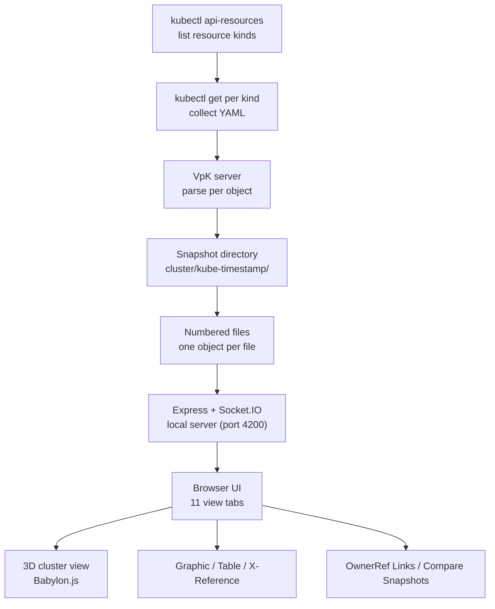

## Why Read This

If you are a developer or platform operator who has to show, in three seconds, what is running in a cluster to people who do not use Kubernetes (investors, clients, new hires), this post is for you. Instead of throwing dashboard numbers or `kubectl get` tables, it walks through VpK, an open-source tool that renders a Kubernetes cluster as a physical server rack in 3D, with a full hands-on experiment.

The core claim up front: VpK's essence is not live monitoring, it is a photograph of a moment. It takes a kubectl snapshot of every resource kind in the cluster, parses that photo into per-object files, and serves eleven different cross-sections of the same state in a browser. That read-only, snapshot-based design is what makes it safe against production clusters, and a single Docker volume is what makes it run offline. Every number below comes from that design being verified by hand.


*Server racks with translucent cubes above them, a conceptual shape of how VpK shows a cluster.*

## Overview

On September 9, 2026, a tweet by Shanghai indie developer Viking (@vikingmute) made the rounds: "the most beautiful website I have seen today." The attached page, kubernetes3d.com/rack, renders a Kubernetes cluster as a physical server rack in 3D. The tweet's point was not just that it looks good. It showed the same cluster from three faces (front, back, side), and it is fully interactive. Eye candy, but a tool.

VpK (Visual parsed Kubernetes) is the open-source project behind that page. The official repository is k8debug/vpk on GitHub, licensed under MIT. It is a Node.js server plus a browser client, and it is also published as the k8debug/vpk container on DockerHub. K8Debug is a long-running developer brand for Kubernetes content, and VpK's own README describes the project as a tool made to help people understand what is defined in Kubernetes. Learning, design review, explanation.

The difference from monitoring tools (the Grafana, Headlamp family) is one word: photograph. VpK does not keep watching a live cluster. It takes a scene with kubectl (a snapshot), analyzes the photo files, and renders them. The README is explicit about this. After the per-resource files are built from kubectl get output, "VpK no longer communicates with the K8 instance."

## What This Tool Is

The internal flow is simple. The server first runs kubectl api-resources to list every resource kind the cluster knows. Then it runs kubectl get per kind, parses the YAML into individual objects, and stores them as numbered files under a snapshot directory named after its moment (for example, kube-2026-09-10-13h-50m-13s inside cluster/).



The UI has eleven tabs: Overview, Cluster (3D), Schematics, Graphic View, Storage, Security, Table View, X-Reference, OwnerRef Links, Compare Snapshots, plus a timeline-style view. Each one is a different cross-section of the same cluster. That is exactly the principle the tweet described as front, back, and side.

The 3D cluster view (the Cluster tab) is rendered with Babylon.js. The actual code (vpkCluster3D.js, 2,269 lines) draws nodes as cubes, pods as small cubes, the control plane as arcs, and endpoint links as tubes (CreateTube). The Graphic View tab shows a kind-to-object hierarchy tree and a circle packing of the same data. The Table View is a sortable table of namespace, kind, and name columns.

The X-Reference tab is owned by the xrefRules in vpkconfig.json. The rules visible in this experiment link a Pod's env and volumes to the ConfigMaps and Secrets they reference, a ServiceAccount to its secrets and imagePullSecrets, and a Route to its host. Ask "which secret does this pod actually use" and it draws the link. That is the question operational data visualization most often gets stuck on.

The OwnerRef Links tab follows ownerReference chains from Deployment to ReplicaSet to Pod. Compare Snapshots takes two snapshot directories and shows what changed. Because snapshots are moment-named directories, this turns into a time-lapse of "what was different an hour ago."

Cluster connections are abstracted as providers. vpkconfig.json defines nine of them: Existing kubectl connection (usekubeconn), oc, minikube, microk8s, IBM IKS, CRC, and the OKD family. Each provider carries its own getCmd, authCmd, stopCmd and auth parameters, which is why environments reached through oc or microk8s kubectl work as-is.

## Install and Run

You only need Node.js and npm. The commands used in this experiment:

```bash
# Get the source
git clone https://github.com/k8debug/vpk.git
cd vpk

# Install dependencies (package.json: v5.0.0, express + socket.io + ejs)
npm install

# Start the server (default port 4200)
npm start
# Server log on startup:
#   Visual parsed Kubernetes  Version: 5.2.0  Server Port: 4200
#   vpkMNL105 - Vpk running locally
```

Open http://127.0.0.1:4200 in a browser. Pick "Existing kubectl connection" in the provider dropdown ("Select option") at the top, and the server starts a kubectl snapshot cycle against your current kubeconfig context. This experiment used the minikube context (v1.32.0).

Docker is also first-class. The k8debug/vpk container serves the web app on port 4200 and takes the snapshot directory as a volume:

```bash
docker run -v /data/snapshot:/vpk/cluster -p 4200:4200 k8debug/vpk
```

The whole trick is that one -v flag. Feed it a snapshot directory and VpK renders every view from the photo alone. No kubectl, no cluster API server, no network. That is a design for offline documentation, investor demos, and security audit material, cases where "the cluster on that day" must be fixed in place. The snapshots themselves can also be produced by k8debug/snapshot, a separate tool from the same account.

## Hands-On: A 100-Second Snapshot of a minikube Cluster

The experiment ran on an Apple Silicon MacBook (darwin arm64) with a minikube cluster: Kubernetes v1.32.0, docker driver (4 CPUs, 7.5GB). On top of the kube-system defaults (kube-proxy, coreDNS, etcd, and friends), two deployments (demo-web and demo-api, nginx with 2 replicas each) and the demo-web service were added, for four user pods in total.

Instead of a browser, the UI's real event flow was driven by a Socket.IO client script. One connectK8 event makes the server run the kubectl snapshot cycle, and the getKStatus event reports progress from "Processed count 1 of 50" up to "Processed count 50 of 50 - Resource kind: volumeattachments." In other words, this minikube cluster exposed 50 resource kinds to kubectl, and VpK queried and parsed all 50.

The result: the first snapshot directory (kube-2026-09-10-13h-34m-12s) contained 315 numbered YAML files. After adding the four workloads, the second snapshot (kube-2026-09-10-13h-50m-13s) grew to 352 files. One file per Kubernetes object: Pod, Deployment, Service, ConfigMap, Secret, Role, RoleBinding, EndpointSlice, and so on, split into per-object files. By the server log timestamps, the snapshot cycle (start at 22:50:18, directory query at 22:51:51) took about 100 seconds to query all 50 kinds.

The 3D view (Cluster tab) was verified all the way to headless rendering with SwiftShader software WebGL. The screenshot below is a real minikube cluster snapshot drawn in 3D by VpK. The brown cube in the center is the node, the green cubes above it are pods, the purple arc is the control plane, and the vertical lines are endpoint links.


*Cluster tab, 3D view. Node, pods, and control plane rendered with Babylon.js from a real experiment.*

The interesting part is that the entire flow worked without a browser at all. VpK's UI is Express plus Socket.IO, so a client script can send connectK8, clusterDir, and schematic events, and the server answers with getKStatus (progress), clusterDirResult (snapshot directory), and schematicResult (parsed data). The experiment finished snapshot creation through view-data retrieval with just those three events, and the 3D screenshot was taken by a headless browser opening the Cluster tab and clicking "Refresh 3D View." An event sequence driving the UI in place of a person is a structure an agent can use directly.

The Graphic View tab shows the same snapshot as a hierarchy tree and a circle pack. The left tree expands resource kinds (Event, Pod, ReplicaSet, Role, Secret, ServiceAccount, Service, Deployment, Endpoint, EndpointSlice) into object names, and the right circle pack compresses the same data into density. "The same data in two shapes" is the principle shared by all eleven tabs.


*Graphic View tab. The same snapshot rendered as Hierarchy (tree) and Circle Pack (circles) at once.*

An honest limit: minikube is a single node, so the 3D scene is sparse. The rack page on kubernetes3d.com that the tweet called "the most beautiful" (multi-node racks, front/back/side) only shows its full face on a multi-node cluster. Running it against a real multi-node GPU cluster is left for the next session, where the network (VPN) is available.

## ThakiCloud Product Implications

From the ai-platform (Metis) side, VpK is a tool that makes the "three seconds to explain a cluster." In a Metis demo or an investor briefing, showing what runs in the cluster by opening one 3D snapshot beats flipping through thirty dashboard slides. The snapshot-based read-only design means there is no burden on the production cluster, which fits the use case of fixing "the cluster on that day" as material for demo clusters (the B200/H200 family). MIT licensing makes adoption cost zero, and a single Docker volume mount makes it run on air-gapped networks. That connects naturally to the "how to document cluster state" topic in on-prem and sovereign deployments (the Telox and Aegis story).

From the Paxis side, the front/back/side principle is the point. The same cluster state reads as an entirely different shape depending on the view: 3D is the physical cross-section, Table is the resource cross-section, X-Reference is the relationship cross-section, Compare is the time cross-section. That "one state, many cross-sections" principle sits in the same family as how Paxis operations UX shows agent execution state (schedule cross-section, cost cross-section, audit cross-section). The positioning should stay clear, though: VpK is a learning and explanation tool, not a real-time observability tool. Grafana-family remains the source of truth for operations, and VpK is the layer that shows that data to people.

## Limitations and Counterarguments

The biggest limitation is the essence itself: it is a photograph. If live monitoring is the goal, VpK is not the answer. Until you take another snapshot the screen stays still, and change appears only as "the difference between the last photo and this one" in the Compare tab. Second, the UI is dense: eleven tabs mixing tables, trees, and 3D feels awkward at first. The "eye candy" verdict is completed by the rack page's multi-node rendering, while the local UI's 3D view prioritizes information density.

Third, security. Since xrefNames includes secrets, the snapshot directory contains the cluster's Secret YAML as-is. A snapshot is "a photograph of whatever kubectl can see." If you took a snapshot with production credentials, handle that directory at credential-file grade: be deliberate about the Docker volume mount path and sharing permissions. Fourth, the number 50 is the count of kinds kubectl api-resources recognizes; it varies by cluster and by admission and CRD configuration. Fifth, the headless 3D verification used software WebGL (SwiftShader), which is separate from real GPU-accelerated rendering quality.

The counterargument is worth hearing too. "Isn't kubectl explain or Headlamp enough?" The answer is that the goal is different. VpK is a tool that turns an interactive 3D space, snapshot comparison, and automatic xref links into explanation artifacts. It is not a real-time console. The moment the requirement is "show that day's cluster later, to a person," it does things Headlamp cannot.

## Summary

When you have to explain a cluster, make the photograph first, not the dashboard numbers. VpK takes a kubectl snapshot of 50 resource kinds, splits 352 objects into numbered files, and shows eleven cross-sections of that photo in a browser. Read-only, offline, MIT licensed: those three conditions make it safe for production and viable on air-gapped networks.

The next action is one thing. On any demo cluster you have kubectl access to, finish git clone, npm install, npm start inside ten minutes, and open your first snapshot in 3D. Those three seconds are your first explanation material. Then take VpK's "one state, many cross-sections" principle and apply it to your own operational data visualization, whether that is clusters or agent runs. That is everything this experiment left behind.

## Sources

- VpK GitHub: https://github.com/k8debug/vpk (MIT, K8Debug)
- Official demo (rack page): https://kubernetes3d.com/rack
- Original tweet: https://x.com/hjguyhan/status/2098019711086919723 (@vikingmute, 2026-09-09)
- Snapshot tool: https://github.com/k8debug/snapshot
- All numbers in this post (50 kinds, 315/352 files, ~100 seconds, v1.32.0, port 4200, Version 5.2.0) come from experiments reproduced directly on a MacBook (minikube docker driver) on 2026-09-10.
