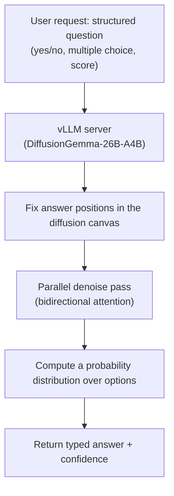

*A visual metaphor for the article's key idea.*

## Why read this

This post is for platform engineers and developers who serve LLMs and run vLLM. By the end you will understand what a diffusion LLM is, where it differs from the autoregressive LLMs we have used until now, and whether a "System-1 decision API" that used to be a proprietary commercial model can be self-hosted on open weights.

Let me state the conclusion up front. vLLM now serves Google's diffusion LLM DiffusionGemma natively, and a structured-reads (Jev-like) mode on top reproduces the capability of TypeSafe's commercial System-1 decision model, Jev, on open weights. Yes/no, multiple-choice, and scored questions get typed answers with per-option confidence, computed in a single parallel diffusion pass.

*The core concept of the post, rendered abstractly: a noise-covered token canvas denoised in parallel, converging to a probability distribution in fixed answer slots.*

## Overview

This post covers three things in order. First, what a diffusion LLM is and how it differs from an autoregressive LLM. Second, how vLLM supports DiffusionGemma and what the structured-reads mode adds on top. Third, what this means for ThakiCloud, which serves inference over vLLM.

## What is a diffusion LLM

Until now the mainstream of LLMs has been autoregressive. A token is generated one at a time, in order; at each step the model looks at the tokens produced so far and predicts the next one. Because of this structure, generation length is essentially coupled to latency. To get structured output, we either had the model write JSON directly and parse it later, or we bolted on constrained decoding.

A diffusion LLM takes a different approach. Instead of "writing out" a sentence in order, it starts with a whole canvas of tokens covered in noise and iteratively cleans (denoises) that canvas. In a single step it does not add one token; it refines the token positions across the canvas in parallel. Because attention is bidirectional, the model can see both left and right, so it is not forced to move while looking only at the past. Generation is not a process of going left to right, but a process in which the whole resolves at once.

This design is the basis of the speed claims. Benchmarks cited in the guides report handling 256 tokens in parallel per step and on the order of 1,000 tokens/second on a single H100. [estimate] We have not independently verified these figures, but the point that the parallel denoising structure targets a throughput regime that autoregressive decoding cannot reach is readable from the structure itself.

## What is DiffusionGemma

DiffusionGemma is a text diffusion LLM that Google released on open weights. It is roughly 26 billion parameters in a Mixture-of-Experts (MoE) configuration, and the checkpoint name is `diffusiongemma-26B-A4B-it`. It sits on the Gemma backbone and, through a vision tower, handles text, image, and video inputs together.

The key point is that this is no longer an experimental model that only the research community can run. vLLM added native support for DiffusionGemma, and this is the first diffusion LLM integrated directly into vLLM. It was a joint effort with the Google team. The vLLM docs describe it as running a single Gemma4 backbone in two modes: an encoder mode that writes the KV cache with causal attention, and a decoder mode that reads that encoder KV with bidirectional attention. A shape close to YOCO.

In other words, the LLM serving engine we already use in production has learned to execute a diffusion model's unfamiliar decoding structure (bidirectional attention, iterative refinement, block-based generation). The diffusion LLM has been promoted from "a special case to run separately" to "a model class the serving platform supports."

## What is Jev, and what is structured-reads

Now let us look at the "Jev" side. Jev is a System-1 decision model from TypeSafe AI. System 1 is the term for fast, intuitive decisions, in contrast to the slow, deliberative System 2. Jev does not write prose. It only judges, classifies, routes, and scores. Given the state of a program and a typed question, it returns a typed answer carrying a probability. The crux is that the probability is calibrated to actual accuracy.

TypeSafe's Jev is a commercial, proprietary model, accessed via API, and trained with RLCD. Its own marketing puts latency in the tens-to-hundreds of milliseconds range and emphasizes that it is far faster and cheaper than a general LLM approach.

vLLM's new structured-reads mode (Jev-like; vLLM PR #57250, `siliconflow/vllm-structured-reads`) reproduces this capability on DiffusionGemma as an open patch. The mechanism is this. First, it fixes the positions where the answer tokens will go in the diffusion canvas. Next, it puts the structured question (yes/no, multiple choice with options, scoring by ordered levels) into the system prompt. Then DiffusionGemma fills those fixed slots in a single parallel diffusion pass, producing a probability distribution over the options.

In other words, rather than having the model write the words "yes" or "no" and then parsing them, it computes which option the answer is and how confident it is in a single forward pass. The patch is a pure-Python overlay on top of vLLM 0.29.0 plus a regeneration script, and since it exposes the same HTTP shape, you can self-host without calling the TypeSafe API.

The patch author ran a live comparison of commercial Jev against DiffusionGemma-as-Jev, and argues that the DiffusionGemma side comes out ahead, and that Jev is not necessarily faster either (API vs DGX Spark). This is a self-report, so it should be read as a claim, not as a verified conclusion.

*Data flow of structured-reads (Jev-like). Instead of generating a sentence and parsing it, the answer and the confidence are computed together in a single parallel pass.*

## ThakiCloud product implications

ThakiCloud's ai-platform serves models with vLLM as its core serving engine. So diffusion LLMs and structured-reads are not "someone else's feature" but a new capability axis that sits on top of the serving we already run.

First, serving capability. vLLM had been specialized in autoregressive models, but the moment it supports diffusion models natively, it can offer customers a new model class. structured-reads (serving typed decisions plus confidence) is a capability that goes beyond "returning text" to "returning a decision." It has value in use cases where software, not a human, consumes the output.

Second, economics. The fact that a System-1 decision API that was a commercial proprietary model can be reproduced on open weights and self-hosted means a change in cost and sovereignty. For customers who cannot send data out because of closed-network or data-sovereignty requirements, being able to run the same-shape decision API inside their own environment is a substantive differentiator.

The Paxis perspective is the same. An agent harness makes many fast decisions. Routing, classification, scoring, policy checks. A System-1 decision that returns a typed answer with confidence is exactly the shape an agent orchestration wants to consume. If low-cost, low-latency structured decision serving becomes possible on ai-platform, it becomes infrastructure that raises the execution economics of the Paxis agent loop.

## Limitations and counterarguments

First, it is a self-reported benchmark. The claim that DiffusionGemma-as-Jev is on par with or better than commercial Jev was made by the patch author. There is no independent benchmark yet. Commercial Jev is a model trained with RLCD and specialized for decision tasks, whereas DiffusionGemma-as-Jev is a patch that puts structure on top of a general diffusion model. How far the two actually differ in accuracy is an open question.

Second, diffusion is not always faster. Parallel denoising is advantageous for structured output with a fixed answer space (yes/no, multiple choice, scoring). For long free-text generation, it cannot be assumed to beat a well-tuned autoregressive engine. The "it is fast" reputation must not be extended to all generation.

Third, structured-reads fixes the answer space. It only chooses among the options the question defined. It is not suited to "creating a new answer." For tasks that genuinely need open-ended generation, the conventional route is still the right one.

Fourth, the hardware and memory figures (roughly 18 GB VRAM, throughput) come from secondary guides and are not independently verified values. Re-measurement in your own environment is required before a production deployment.

## Summary

The diffusion LLM is no longer a research curiosity. Because vLLM supports DiffusionGemma natively, it has become a model class that a serving platform can run. The structured-reads (Jev-like) mode on top of it is a demonstration that a System-1 decision API that was a commercial proprietary model can be reproduced on open weights and self-hosted. Yes/no, multiple choice, scoring, and per-option confidence are computed in a single parallel pass.

For platform engineers, the next action is simple. If you have a use case where software consumes decisions (routing, classification, scoring, policy checks), it is worth running the DiffusionGemma structured-reads mode in your own environment and re-measuring cost and accuracy against the commercial Jev API. Those figures should come from your own measurement, not from the author's claim.

For ThakiCloud, this is a new capability axis on top of the vLLM serving we already run, and infrastructure that raises the execution economics of the Paxis agent loop.

## Sources

- vLLM docs · structured reads: https://docs.vllm.ai/en/latest/examples/features/structured_diffusion/
- vLLM announcement · DiffusionGemma: https://vllm-project.github.io/2026-06-10/diffusion-gemma.html
- Open patch (PR #57250): https://github.com/siliconflow/vllm-structured-reads
- Google DeepMind · DiffusionGemma: https://deepmind.google/models/gemma/diffusiongemma/
- TypeSafe AI · Introducing System One Models & Jev: https://typesafe.ai/blog/introducing-system-one-models-and-jev
- explainx.ai · DiffusionGemma as Jev: https://explainx.ai/blog/diffusiongemma-jev-vllm-open-source-2026
