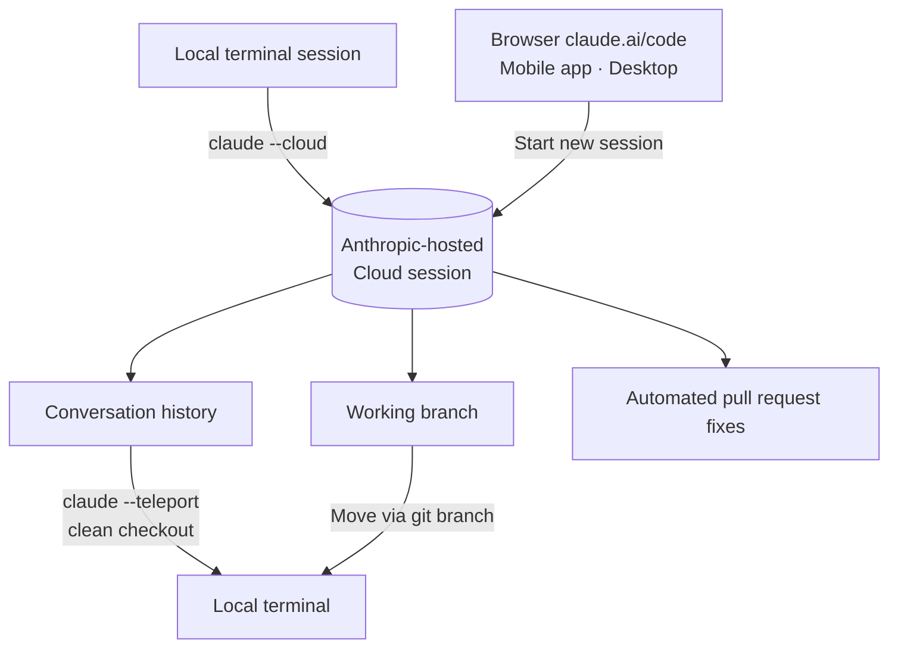

## Why you should read this

If you use coding agents every day, or you run agent workloads in production, read this. The conclusion in one sentence: Cloud Sessions GA turned the "session" into a unit that outlives the machine that started it, the handoff between local and cloud is one-way (cloud to local), and the cost model is bundled at the plan level. Those three things are now a reference shape for agent platform design, and that is the point of today.

*Visualizing a session moving between a local machine and cloud infrastructure.*

## Overview

Claude Code is a terminal-first tool. Sessions were local processes that existed only while the terminal was open. On top of that, "Claude Code on the web" began as a research preview, and around September 23-24 (per reports) cloud sessions left the preview. The official message: close your laptop, and Claude Code keeps working.

This launch connects to the announcement from the previous week. The redesigned Claude Code Projects, which went to beta on September 17, was a "conductor" structure coordinating multiple parallel cloud sessions from a single conversation, and [a previous post](/en/agentops/claude-code-projects-parallel-agent-threads/) analyzed its parallel sessions and shared memory structure. Immediately after Projects defined "how to run many sessions," cloud sessions GA defined "where those sessions live and how they move." Read the two announcements together and you get Anthropic's full picture of the execution environment for coding agents.

## What Cloud Sessions Are

A cloud session is a Claude Code session running on infrastructure hosted by Anthropic. It is physically separated from your machine, and the session's state, the conversation history and the working branch, resides on that infrastructure. In ClaudeDevs' words, "close your laptop and Claude Code keeps working."

There are four entry points: the browser at claude.ai/code, the Code tab in the Claude mobile app, the desktop app, and the terminal. The first three start new cloud sessions; the terminal is the path that lifts an existing local session into the cloud.

The distinction that matters here is between "remote control" and "session movement." It is not just viewing a screen remotely; the session itself moves. Conversation context, history, and the working branch travel together into a different execution environment. In the published structure, the session is no longer a process. It is closer to a workload with state and an execution environment.

## How to use: --cloud and --teleport

It comes down to two commands.

To push a local session to the cloud, run `claude --cloud` in the terminal. It hands the current session's state to Anthropic's infrastructure, and you continue the work from the browser or mobile.

To pull a cloud session back to local, run `claude --teleport`. From a clean checkout of the same repository, it brings the cloud session's working branch and the full conversation history into your local terminal. One condition: the local checkout must match the repository the cloud session was working in. Branches and history are git-based, so the handoff is only complete when that condition holds.

Mid-flight movement is also reported. Multiple third-party reports say that since v2.1.0, the in-session slash command `/teleport` (shorthand `/tp`) moves the session between the local terminal and the web interface. Official documentation notes, alongside the two documented commands (--cloud, --teleport), that cloud sessions perform automated fixes on pull requests.

Plan coverage spans Pro, Max, Team, and Enterprise. Enterprise requires a Premium seat or a Chat + Claude Code seat. The structure is organized so it scales from personal plans straight into teams and enterprises.

GA also came with one-time credits: existing subscribers get $100 on Pro and $250 on Max, usable through October 7 (per reports). Credits are the onboarding device for the launch.

A practical scenario. In the morning, you assign a cloud session, from the browser, the task "find the log rotation bug and open a PR." On the way to the office, you check progress in the mobile app and add a one-line instruction. At the office, you bring the session down into the local terminal with `claude --teleport` and continue the detailed work against local tools, a debugger, a profiler. The session has moved across three machines and the conversation context has not broken anywhere. The conditions that make this flow work are the ones seen above: clean checkout, one-way teleport, plan limits.

## What GA Changed

Three things changed compared to the research preview stage.

First, the promise on validity and stability changes. The preview said "try it out"; GA says "this is the service." Session persistence, handoff behavior, and plan coverage become part of the product contract.

Second, the cost model is fixed at the plan level. The infrastructure cost of running cloud sessions is not itemized and billed like token pricing; it is consumed within Pro/Max/Team/Enterprise plans. The cost the user feels becomes "how much of my plan limit did this session use?"

Third, the scope extends to teams and enterprises. The door opens from personal productivity tooling into team-level coding agent workloads. Combined with Projects' parallel sessions, one conductor running many cloud sessions operates on team infrastructure.

## ThakiCloud Product Implications

**Paxis lens.** Paxis is a control plane that treats agent execution as a first-class resource, with skills, tools, policies, and audit logs all lifted into individually managed objects. Cloud sessions GA is a signal that the "session" object climbed one more step: the session is independent of the machine, it is a workload with state (history, branch), and it is tied to a cost unit, the plan. Three correspondences from the Paxis view.

First, a session is a workload. On ThakiCloud's internal platform, coding agents run headless around the clock. A launchd runner fleet executes experiment, report, and deployment tasks at fixed times every day, and the engine those runners invoke is an in-house model. If cloud sessions productized "session = resident workload" on Anthropic's infrastructure, that shape already exists as an operational pattern inside ThakiCloud. The difference, if there is one, is the ownership structure: whose infrastructure, and which engine.

Second, a handoff is a state-transfer contract. `--teleport` moving the branch and history under the clean-checkout condition is, from the platform's perspective, a publication of the "session state transfer protocol." The repository of state (git branch, conversation log), the transfer condition (a matching checkout), and the transfer direction (cloud to local) are explicitly defined. The lesson for an agent platform building session movement: capture those three as the contract.

Third, cost is bundled at the plan level. Unlike Metis' token-pricing serving economics, cloud sessions consume cost inside subscription plans. The two models coexist rather than conflict. A sensible placement: bulk, steady workloads run on token-pricing economics (Metis), while interactive, semi-persistent sessions run on plan economics.

## Limitations and Counterarguments

It is one-way. Multiple reports say teleport effectively works only from cloud to local. `--cloud` exists for local to cloud, but the two directions are not a symmetric handoff. As long as the session's "stop" is fixed on Anthropic's infrastructure, local is always the side that stays put.

The clean-checkout condition. Teleport requires a clean checkout of the same repository on local. If the repository structure has changed or branches are tangled, the handoff is impossible. It is a natural consequence of git-based state transfer, but in practice it is the number one cause of "why doesn't this work?"

Cost opacity. Because cost is bundled at the plan level, it is hard for a user to compute exactly how much of the limit a single cloud session consumed. The GA credits ($100 on Pro, $250 on Max) partly mitigate that opacity. Watching the credit burn rate gives a rough per-session cost feel. The more you run at volume, the blurrier the boundary between the token-pricing model and the plan model becomes, and that is where the motivation to switch to an in-house engine emerges.

Vendor lock-in. Session state residing on Anthropic's infrastructure means the execution environment, the cost, and the policy all fall under one vendor's jurisdiction. The enterprise seat condition relaxes this partially, but ownership of the data and workload still sits on the other side's infrastructure.

As a counterargument, there is the view that "isn't this just expected?" CI already runs code remotely, and cloud development environments of that kind already exist, so session cloudification is a natural extension rather than the emergence of a new category. The answer lies in what moved before: the session's state, the conversation history, moved bound to the workload. Moving code alone, and moving the conversation context along with it, are different problems in agent operations.

## Takeaways

If you use coding agents every day, there is one thing to try right now: bring work in progress down to local with `claude --teleport` and experience the flow. Check whether the loop of starting a session in the cloud and picking it up in the terminal when you arrive holds for you, and whether the clean-checkout condition fits your repository.

If you design agent platforms, three things become the textbook. A session is a workload, not a machine. State transfer requires an explicit contract (repository, condition, direction). And cost: the workload-bundled model and the token-pricing model coexist. ThakiCloud's internal fleet already holds all three as operational patterns, and Paxis is the control plane that surfaces those patterns as first-class resources.

In one line: the session has become a deployable unit, and the remaining question is where you deploy it.

## Sources

- [ClaudeDevs official announcement (X)](https://x.com/ClaudeDevs/status/2102871550974427462)
- [Claude Code docs: Claude Code on the web](https://code.claude.com/docs/en/claude-code-on-the-web)
- [Claude Code docs: web-quickstart](https://code.claude.com/docs/en/web-quickstart)
- [Anthropic blog: Claude Code on the web (research preview launch)](https://claude.com/blog/claude-code-on-the-web)
- [MarkTechPost: Claude Code Projects beta (2026-09-17)](https://www.marktechpost.com/2026-09-17/anthropic-launches-claude-code-projects-in-beta-parallel-cloud-sessions-that-keep-running-after-you-close-your-laptop/)
- [PromptShelf: --teleport flag guide](https://thepromptshelf.dev/blog/claude-code-teleport-flag-guide-2026/)
- [aq.dev: Moving Claude Code between laptop and cloud](https://aq.dev/guides/move-claude-code-between-laptop-and-cloud/)
- [ClaudeLog: Remote usage FAQ](https://claudelog.com/faqs/how-to-use-claude-code-remotely/)
