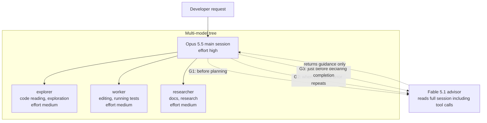

## Why Read This

If you use Claude Code daily or run a fleet of headless agents, you keep facing the decision of which model to place at which point in a session. Bottom line first. The advisor pattern (a strong model reads the whole session and speaks only at three moments: before planning, on error repetition, and just before declaring completion) stops design mistakes before code is written, but on a simple task it costs roughly 5x model time and roughly 3x tokens. And in this reproduction, what I learned before the pattern itself was a readback habit: reading who actually served it out of the transcript.


*An image depicting the executor role assembling the amber-colored scaffold below, and the indigo-colored advisor watching over it.*

## Overview

On September 28, thedelost's tweet made this proposal. "If Opus 5.5 is your main model, do not keep Fable 5.1 sitting in reserve as a heavy weapon. Put it on call with `/advisor fable`." The picture in the tweet is this. If Opus 5.5 keeps writing code, Fable 5.1 reads the entire session (including tool calls) and speaks at only three places.

- **Before planning**: "Is this approach right?"
- **When the same error repeats**: "Are you digging in the wrong place?"
- **Just before declaring "done"**: "What did you miss?"

The one line that is the core is "Fable 5.1 reviews, and Opus 5.5 ships." The back half of the tweet presents a multi-model tree one level down. Opus 5.5 runs the main session at high effort, three subagents split the work at medium effort, explorer (reading code), worker (editing and running tests), and researcher (collecting docs), and Fable 5.1 waits on call as the advisor. The same tweet also places a low-latency decision engine called Jev one level further down, with the line "forks that require no reasoning (which file, which tool, retry or abort) go to Jev within 0.5 seconds, and the large model only looks at forks where the tree actually branches."

This pattern is an embedded mechanism, not a prompt trick. The Claude Code official docs (the advisor entry) document the `/advisor` command, the `advisorModel` setting, the `--advisor` flag, model pairing, and how Fable advisor usage is credited. The platform docs define it as "a tool that lets a fast, low-cost executor model ask a higher-intelligence advisor model for strategic guidance during generation." The advisor reads the whole conversation and produces a plan.

## What Is This Technique

### The Advisor Mechanism

According to the docs, there are three entry paths. Within a session, you switch with `/advisor fable`, and this value is saved as the default. Putting `advisorModel` in `settings.json` makes it a persistent setting, and the `--advisor` flag applies to a single session only. Fable 5.1's model ID is `claude-fable-5-1` (confirmed in the settings notation of a community issue). Conversely, the places where it can be turned off also need to be confirmed in the code. The representative ones are the `CLAUDE_CODE_DISABLE_ADVISOR_TOOL` environment variable and `CLAUDE_CODE_EFFORT_LEVEL`, which overrides subagent effort.

The tweet even attaches an "install prompt" that creates this setup. Its rough content is this. (1) Check `~/.claude/agents` and `.claude/agents` to find existing subagents that fit explorer, worker, and researcher, and only draft new definitions for roles that are missing. For each subagent, specify opus with medium effort, and list any that have other models pinned without touching them. (2) Set the main session to high via `effortLevel` in `settings.json`, and `advisorModel` to fable. (3) Find the environment variables that disable the advisor and `CLAUDE_CODE_EFFORT_LEVEL`, and only look at them without changing them. (4) Add one line to CLAUDE.md: "consult the advisor before a big plan, on error repetition, and before declaring a long task complete." And it asks to see all changes as a diff first.

### The Multi-Model Tree



The division-of-labor logic is simple. Repetitive work like exploration and editing is faster on a cheap model, judgment is more accurate on an expensive model, and the strongest model consumes the full context only at "the moments that require judgment." The fact that the advisor reads the entire session (including tool calls) is the core of the cost structure. At each of the three gates, the advisor re-reads all the context the executor has built up, so the longer the session, the higher the per-gate cost.

The community is reported to be spreading and using this pairing as "Fable advisor + Sonnet executor." Third-party estimates like "completes 93% of the work for a fraction of the cost" or "cuts token costs by about 60%" are circulating, but since these are not official benchmarks, I treat them only as [estimate].

## Installation and Integration

These are the actual commands confirmed from the docs and the tweet.

```bash
# Set the advisor inside a session (saved as the default)
/advisor fable

# Persistent setting: settings.json
# {
#   "advisorModel": "claude-fable-5-1",
#   "effortLevel": "high"
# }

# Apply to a single session only
claude --advisor fable
```

The procedure to confirm that gates actually fire (step 3 of the tweet's install prompt) is this.

```bash
# Check for environment variables that disable the advisor
env | grep -i "CLAUDE_CODE_DISABLE_ADVISOR_TOOL\|CLAUDE_CODE_EFFORT_LEVEL"
```

If `CLAUDE_CODE_EFFORT_LEVEL` is set, it ignores subagent effort and applies that value across the board, so the tree picture comes back at a different cost than intended. The tweet's instruction is to check but not change it. That means to report and let a human decide.

The one line added to CLAUDE.md (tweet step 4):

> Ask the advisor first, before a big plan, when errors repeat, and before declaring a long task complete.

This one line makes the difference between a "gate that depends on the prompt" and a "gate that depends on a setting value." In the former, if the model does not honor it, nothing happens. In the latter, the structure of the session itself guarantees the three question points.

## Actual Experiment Results

### Reproduction Design

In this session, I could not run the built-in `/advisor` headless directly (this session's approval gate blocked running the `claude` binary). So I reproduced the "3-gate pattern" with subagent orchestration. The experiment has two arms.

- **Arm A (solo)**: a sonnet-requested executor produces the plan and code in one pass. No gates.
- **Arm B (3-gate)**: a sonnet-requested executor first produces only the plan, a fable-requested advisor reviews the plan (G1), the executor produces the code, then a final reviewer gate (G3, shared by both arms).

The task was identical for both arms. A sliding-window rate limiter (`ratelimit.py`) and a pytest suite (`test_ratelimit.py`), written with only the standard library, as deterministic code that takes `now` explicitly. At least 8 test cases (boundary value, denied requests not recorded, partial expiration, non-consumption of current, etc.).

### The Most Important Readback: Who Served It

First, an environmental fact I discovered during the experiment. This session's gateway rewrote the requested model name to a local engine. Reading the `message.model` field of the four subagents and the main session transcript (185 assistant messages), they were all the same engine.

```
thakicloud/Qwen3.8-27B-NVFP4-GPTQ-txt-1m-cache
```

In other words, the executor that requested sonnet and the advisor that requested fable were both actually served by the same local engine. What this A/B measured was not a "tier difference (strong model versus weak model)" but a "role difference (solo versus 3-gate)." Without this distinction, I would have written a misreport like "the Fable advisor beat Opus."

### Measured Numbers

All numbers were read from the agent usage field and the sandbox run logs (run-2 through run-14).

| Stage | Model time | Tokens (incl. context) | Result |
|---|---|---|---|
| A executor (single-pass plan + code) | 70.1s | 108,750 | 11/11 first pass |
| B plan | 38.2s | 105,084 | 5-item plan |
| B G1 advisor | 66.8s | 108,380 | REVISE, 3 required changes |
| B code | 251s | 117,993 | 9/9 first pass |
| G3 final review (shared) | 139.8s | 133,388 | 1 defect found (A code) |


*Per-stage model time (left) and tokens (right). Gray is the G3 final review shared by both arms.*

### What G1 Caught Before Code

The G1 advisor, which received only Arm B's plan, pronounced REVISE and issued 3 required changes.

1. **Floating-point boundary precision.** The predicate the implementation uses (`ts > now - W`) and the predicate the tests assume (`now - ts < W`) can diverge where a value is only approximated in floating point. Pin the boundary tests to exactly representable values (ts=0.0, W=10.0, now=10.0, and just-before at 9.999).
2. **A shared predicate and a documented boundary.** State the exclusive boundary decision "age == W means expired" in the docstring, and make `allow()` and `current()` use the same predicate so the two methods cannot return different answers at the boundary.
3. **A monotonic now contract.** All tests advance now only in the non-decreasing (monotonically increasing) direction. The behavior of a now that goes backward is outside the contract, so tests do not define it.

Arm A's code actually carried the risk of "the two predicates diverging" among these three. A's evict computed `t <= now - W` and current computed `now - t < W` each on its own, and in this test data they happened to all agree. G1's point was not "what is wrong right now" but "what could split at the same value."

### What G3 Caught Hiding Behind the Green Suite

The G3 final reviewer reviewed both arms' final code via static tracing (execution was blocked by the approval gate in this session). As a result, it flagged a real defect in the armA code. An evict that pops only the head of the deque never sees an expired entry sitting behind a newer timestamp. In a non-monotonic now sequence (`allow(100)` → `allow(0)` → `allow(15)`, limit=2, W=10), `ts=0` is 15 seconds old but is not evicted, and `allow(15)` returns `False` even though `current(15) == 1` is below the limit.

We actually ran and confirmed this flag (run-10/11). armA gives `allow(15)=False`, armB (full-filter approach) gives `allow(15)=True`. The code with an all-passing 11/11 suite carried a defect that had never manifested, because every test in the suite used a monotonic now. After fixing armA to a shared predicate + order-independent evict and adding a regression test, we confirmed 12/12 (run-12).

In one line: **G1 fixed the design before code, and G3 (after the code, after passing the green suite) found a defect the suite had not seen.** All the "value" of this experiment comes from these two moments.

## Implications for ThakiCloud Product Application

**Paxis lens**: ThakiCloud's Paxis already routes models by role in agent orchestration (haiku for exploration, sonnet for implementation, opus for architecture, fable for conductor). This experiment is a pattern that, on top of that separation, reduces the question "when should the strong model speak" to three decision points (before planning, on error repetition, just before completion). This has the same shape as Paxis's verification stage (verifier). A structure with adversarial prompts, fresh context, and a verdict on the output by code (test exit code). This A/B is the first measured evidence on our infrastructure that "green tests are not everything; a gate can actually catch what tests missed."

**ai-platform lens**: "The model you requested is not the model that served it." If the gateway rewrites the model name, a fleet operator's cost and quality assumptions quietly break down. This is the same structure as what ThakiCloud's GPU job operating rule (job parameter provenance) says. That you must read from the artifact whether a knob actually reached the job, and not trust the request. In a fleet where a local engine serves under a frontier model's name, the transcript's `model` field and usage are the only ground truth. If you introduce the advisor tree, introduce a readback step that writes "which model served the gate" to the run log alongside it.

## Limitations and Counterarguments

- **n=1 per arm, a single small task.** In this task, solo was 5x faster and one-third the tokens. The value of gates is a structure recovered only in long sessions where "errors are expensive," multi-file refactors, and security-sensitive changes. This experiment does not prove the reverse (the other case).
- **No tier contrast.** Since every role was served by the same engine, the claim "Fable saw better than Opus" is not supported by this experiment. Only the role (gate) effect was measured.
- **G3 reviewer's execution limit.** G3 verified by static tracing only (execution was blocked by the approval gate). The defect it found, we confirmed with a separate run, but the gate's own verdict confidence was lower than code verification in this experiment.
- **Feature availability is tied to version and plan.** The advisor entry is used in specific Claude Code versions and plans, and there is a known issue (a community GitHub issue) that Fable advisor usage does not show on the Fable weekly meter. That means cost observation can be incomplete.
- **Community claims like "4x faster" point the opposite direction from this measurement.** Gates cost money on a simple task. What is being bought is safety, not speed.

## Summary

The advisor tree is a division of labor where "a fast model works, and a strong model speaks only at the gates." In this reproduction, the 3 gates actually did two things. They blocked the dual-predicate risk at the floating-point boundary before code was written, and found the order-dependent evict defect hidden behind the all-passing 11/11 suite. The price was roughly 5x model time on a simple task (356s versus 70s, excluding the shared G3), and roughly 3x tokens (331k versus 109k).

So the recommendation is conditional. Turn gates on for long sessions, high-risk changes, and the moment repetitive errors begin; for deterministic small tasks, solo is the right answer. And in every fleet where the gateway rewrites model names, experiments and operations alike should first do the readback of reading "who served it" from the transcript. That readback is why, in this experiment, it became the lesson before the pattern itself.

---

*Sources: [thedelost tweet (2026-09-28)](https://x.com/thedelost/status/2104677530825634273), [Claude Code advisor docs](https://code.claude.com/docs/en/advisor), [Claude Platform advisor tool docs](https://platform.claude.com/docs/en/agents-and-tools/tool-use/advisor-tool). The community cost estimates are third-party reports and are marked as [estimate].*
