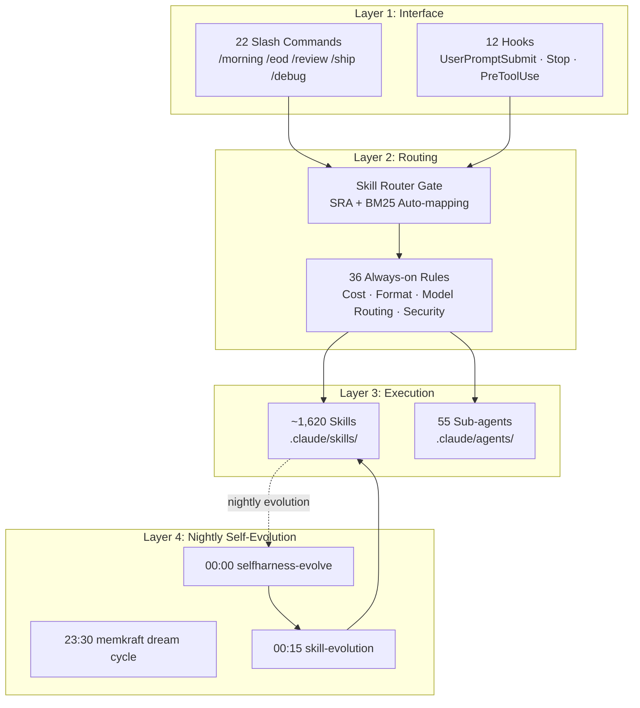

## Overview: How Can One Person Handle This Scale?

I get asked this question a lot. Roughly 1,620 skills, 55 sub-agents, 36 always-on rules, 22 slash commands, 12 hooks. At night, unmanned launchd jobs run their own evolution loops. Two machines -- home PC and office PC -- stay in sync through a single main branch. A single engineer runs all of this alone.

The numbers look impossible at a glance. But these numbers are not things to manage. Most of them, the system uses on its own. While the engineer writes code, the skill router picks the right skill; while they sleep, the evolution loop refines the skills; and cost guardrails keep the budget in check.

The secret is not managing scale -- it is **designing scale to manage itself**. Skills evolve skills, agents route agents, and retro loops optimize model selection. The human's job is only to set direction, notice anomalous signals, and make key judgment calls.

This post is the first time the full operational system is laid out in one place. It explains how skill routing, nightly evolution, and cost control interlock as a single operating system -- and how this experience became the source material for the ThakiCloud Paxis product.

---

## Stack Overview: The Automation Architecture in 4 Layers

The full stack is divided into four layers.

**Layer 1 (Interface)** is where humans directly interact. Slash commands like `/morning`, `/eod`, `/review`, `/ship`, and `/debug` create the rhythm of the day. Hooks operate quietly in between. The `UserPromptSubmit` hook runs before every prompt; the `Stop` hook checks flag files when a task ends.

**Layer 2 (Routing)** is the brain of this stack. Out of 1,620 skills, it must find the right one for the current request. The skill router gate automates that task. The underlying principles are covered in detail in [Skill Routing SRA](/en/dev/skill-ecosystem-routing-sra/).

**Layer 3 (Execution)** is where actual work happens. Skills encapsulate repeatable workflows; sub-agents handle parallel execution and role separation. The 55 sub-agents are organized into 8 hub-and-spoke teams: Research, Content, Strategic Intel, Incident, Code Ship, Knowledge, Meeting, and Sales. Each team has an orchestrator with specialized sub-agents underneath.

**Layer 4 (Nightly Self-Evolution)** is the system's key differentiator. While the engineer sleeps, the stack improves itself.

---

## Routing at Every Moment: What the Skill Gate Does

All 1,620 skills exist under `.claude/skills/`, but not all are loaded every turn. Doing so would burn the entire budget on context cost alone. Assuming a skill description averages 300-500 tokens [estimate], loading all of them would consume hundreds of thousands of tokens per turn. Instead, `skill-router-gate.py` -- wired to the `UserPromptSubmit` hook -- narrows candidates via BM25 search and injects them into context.

The gate serves three roles.

First, **pre-filtering**. Turns that need no skill -- greetings, confirmations, pure commands -- pass through instantly with zero token cost. Running BM25 on every request would itself become an expense.

Second, **candidate injection**. When a turn is judged as task-oriented, a `🧭 Skill Router Candidates` block is added to context. The model sees this hint and selects the appropriate skill. Candidates are capped at 5, and if 2 or more tie, the user is asked to confirm.

Third, **preventing forced matching**. A skill is not selected just because its name partially overlaps. If the top score falls below a threshold, execution falls through to native. In an environment with 1,620 skills, the most common failure mode is an unrelated skill intruding like noise. The detailed design principles of this router are covered in [Skill Routing SRA](/en/dev/skill-ecosystem-routing-sra/).

The 36 always-on rules apply to all tasks independently of this routing. Cost control, Slack format determinism, the model routing table, output token discipline -- these are not "requested" of the model but enforced by code.

For example, the `quality_gate` field in a batch content skill once came back three different ways: `"passed"`, `True`, `{...}`. Give a model freedom and Sonnet will output differently on every call. Now code directly measures with `len()` and checks thresholds. The model's self-reported numbers are not trusted.

The 22 slash commands are a kind of macro running on top of this routing. `/morning` runs SOD git sync, Google Workspace briefing, and the stock pipeline in order. `/eod` bundles Cursor sync, release ship, and Slack summary. The human never has to remember the sequence.

---

## Every Night's Evolution: The Nightly launchd Loop

This is the part that surprises people most. While the engineer sleeps, three launchd jobs run in sequence.

**23:30 memkraft dream cycle.** Extracts insights, lessons, and patterns from the day's conversations and reflects them into the memory structure. Without the engineer manually recording anything, the system converts today's experience into tomorrow's context.

**00:00 selfharness-evolve.** Analyzes performance metrics for current skills and evaluates description quality, trigger conflicts, and usage frequency. Identifies skills needing improvement and generates improvement proposals. This job always runs on local launchd, never a cloud routine. In cloud sandboxes, bash cannot boot properly and gates can be fabricated.

**00:15 skill-evolution.** Applies what selfharness proposed. Refines skill descriptions, generates new skills when new patterns are found, and cleans up content that is no longer valid.

The detailed principles of the self-evolution loop are covered separately in [Self-Evolving Harness Nightly](/en/research/self-evolving-harness-nightly/).

There is an important design principle here. These nightly jobs are creative about skill content, but code owns the format. The model does not hand-write JSON or self-report quality judgments. Code measures with `len()`, validates with regex, and re-dispatches anything below threshold. The only way to keep a Sonnet-tier model producing consistent format across repeated batch tasks is to remove freedom.

---

## Preventing Cost Leaks: 4-Layer Guardrails

There was a day when daily AI costs reached $705. A single monitor session (9.4 hours, 1,145 turns) accounted for 54% of the total. The 4-layer guardrails in use today came out of that incident. The detailed figures are published in [LLM Cost Routing Guardrails](/en/llmops/llm-cost-routing-guardrails/).

**Layer 1: Model routing table.** Exploration, file reading, grep use haiku (~1x). Coding, review, test writing use sonnet (~4x). Architecture and complex multi-step reasoning use opus (~19x). The `model` parameter must always be specified when calling the Agent tool. Omitting it runs on the session default model (maximum cost). haiku sub-agents never spawn additional sub-agents. If a task cannot be resolved by haiku, the task was mis-classified.

**Layer 2: 2K token rule.** Any tool call expected to return more than 2K tokens is delegated to a sub-agent. The sub-agent reads, processes, and returns only a summary. The main context retains only the summary and a file path. Large JSON arrays are compressed 50%+ with headroom SmartCrusher before being fed in. MCP tool responses are the largest hidden source of context cost. Playwright page reads, GitHub API responses, and Notion thread reads can each dump thousands of tokens at once. Anything over 200 lines gets saved to `/tmp/ctx-{task-id}.json`, and only the schema and a sample reach the main context.

**Layer 3: No polling.** Running 24-hour monitoring as a Claude hot loop is prohibited. Polling tasks like price snapshots, state comparisons, and health checks run as launchd cron jobs and send a Slack alert only when anomalies are detected. This achieves the same effect at $0 Claude cost. The principle was established after a 9.4-hour monitor session consumed $381.

**Layer 4: Retro escalation.** Scheduled skills start on sonnet by default. `skill_model_policy.json` tracks the model and failure streak for each skill. If a skill fails consecutively `max_fail_streak` times, that skill alone is automatically promoted to opus and a notification is sent to Slack `#h-report`. A clean run resets the streak. Rather than promoting everything to opus, only skills that actually have a quality problem receive a targeted upgrade.

With all four layers interlocking, a typical day now stays sonnet-dominant. The same output volume is produced at significantly lower cost. The full figures for the cost control design are published in [LLM Cost Routing Guardrails](/en/llmops/llm-cost-routing-guardrails/).

Context hygiene also matters. Reading the same file repeatedly within a session accumulates `cache_read` tokens. Adding an unnecessary `cd` prefix to absolute-path commands does the same. `git` commands operate directly on the current working tree, so `cd` is never needed. Small habits like these stack up to meaningfully lower session cost [estimate].

---

## This Is the Product: Paxis and the AI Platform

This solo operational approach is exactly what ThakiCloud is productizing as Paxis. The goal is to make the autonomous agent runtime, skill ecosystem, self-evolution, governance, and cost control available to any engineer.

The operational system described so far proves two things.

The first is **that this operational approach actually works**. Not a concept or a paper -- a system used daily by a real solo engineer. The nightly evolution loop runs, cost guardrails control spending, and slash commands create the rhythm of the day.

The second is **that this approach is scalable**. A solo engineer managing 1,620 skills does not happen by manually touching each one. The system evolves itself, the router finds the right skill, and guardrails protect the budget. This structure works identically when scaled to a team.

Paxis is the work of turning this experience into a platform. Operators define skills, configure agents, and set cost policy -- then the runtime handles the rest. The AI Platform adds K8s-based workload orchestration (Kueue, ArgoCD) on top of that.

---

## Limitations and Lessons

To speak honestly.

**1,620 skills are also debt.** Well-crafted skills are assets, but neglected skills are ghosts consuming context tokens. When skill descriptions are too similar, the router gets confused. The nightly evolution loop cleans up this debt, but fundamentally, skills must have a clearly defined intent and boundary at creation time.

**Nightly self-evolution is slow.** It takes weeks for meaningful change to accumulate over a single night. Radical direction shifts require direct human intervention. Self-evolution improves incrementally in the current direction -- it does not change the direction.

**Cost guardrails are not perfect either.** If an MCP tool dumps thousands of tokens in a single response, context gets polluted immediately without a sandbox rule. Guardrails thicken not at the moment of design, but by extracting lessons after a problem occurs and embedding them.

**Multi-machine sync requires discipline.** If the home PC and office PC diverge on a feature branch, yesterday's home updates do not appear in today's office session. In practice, a session ran on a feature branch 25 commits behind origin/main, and a strategy directive applied the day before had not propagated -- leading to incorrect judgments. All work happens on main, and every completed task must be pushed. Simple, but ignoring it creates situations where decisions are made on stale code. Running `git log --oneline HEAD..origin/main` before starting a session has become habit.

**The opportunity cost of skills is easy to underestimate.** Creating a skill immediately feels like adding an asset. But the moment a skill enters the index, it pays context cost on every session. Two similar skills confuse the router. Before creating a skill, the first question should be: "Would an agent actually get this wrong without it?" If the answer is no, a single rule line is sufficient.

---

The operational system described in this post was not built in a day. It is the accumulation of encountering a problem, extracting a lesson, and embedding it in a rule or skill. Lessons recorded in the format `2026-XX-XX incident:` are scattered across all 36 rule files. Reading each rule's header immediately reveals which failure it came from.

If you want to run a solo AI team, the first investment should be skill quality and cost guardrails. Not flashy features -- the real leverage is routing that works quietly and an evolution loop that improves itself at night. I hope this post is useful as a reference for anyone thinking through automation at a similar scale.

In the next post, I plan to cover the design principles of the Paxis skill ecosystem -- particularly why the distinction between a thin harness and a fat skill matters.
