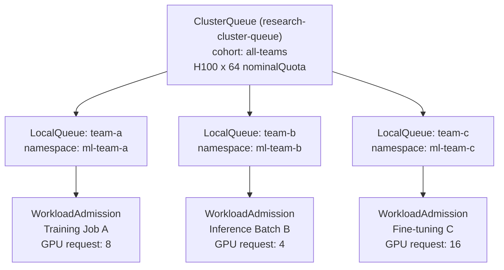

## Overview

Every organization running an enterprise GPU cluster faces the same uncomfortable truth: the gap between the scale of hardware investment and actual utilization. When GPU idle rates reach 30-50% across a 1,000-GPU cluster, that translates to tens of millions of dollars in annual waste [estimate/pitch-deck figures]. This is not the hardware cost -- it is the cost of paying for power and cooling while nothing is being computed.

The root of the problem is that humans cannot optimize workload scheduling at machine speed. Distributed training jobs waste partially acquired resources when they cannot simultaneously secure all the GPU pods they need. Multiple teams competing for the same cluster queue leads to priority contention and delays for critical training jobs. Inference services hold GPUs overnight with zero traffic.

ThakiCloud AI Platform addresses these three bottlenecks with a combination of Kueue + the KAI custom scheduler and vLLM + KEDA Scale-to-Zero. This article explains how each mechanism actually works and what architectural decisions make cost reclamation possible.

---

## 3 Points Where GPU Costs Leak

### Point 1: GPU Idling Without Scheduling

When multiple teams share a K8s cluster without queue management, fairness is not guaranteed. The team that runs `kubectl apply` first claims the GPUs, and later requests queue up in a waiting state. When the first team's job finishes, GPUs are released -- but if no job is immediately waiting, they idle briefly. These gaps accumulate across the entire cluster and significantly depress effective utilization.

### Point 2: Delayed Distributed Training Due to Missing Gang Scheduling

Distributed training jobs (DDP, Megatron, DeepSpeed, etc.) can only begin meaningful computation when all worker pods start simultaneously. Without Gang Scheduling, the following happens:

- A job requiring 8 GPUs starts 6 pods but 2 remain Pending due to insufficient nodes
- The 6 running pods hold their GPUs waiting for the 2 Pending pods but perform no computation
- This partial-occupancy state persists for tens of minutes -- sometimes hours

When another team's smaller job enters the cluster in this state, remaining resources fragment further, causing the larger job to wait even longer.

### Point 3: Always-On GPU Occupation by Inference Endpoints

Model-serving endpoints allocate GPU memory when they first start. Inference services deployed without KEDA or a similar autoscaler hold GPUs at 2 AM when there are no requests. For small organizations, occupying 1-2 GPUs unnecessarily may seem minor, but for organizations running dozens of model endpoints the waste grows exponentially.

---

## Kueue Fair-Share + Gang Scheduling

### ClusterQueue and LocalQueue Hierarchy

Kueue is a Kubernetes-native workload queue management system composed of two layers: `ClusterQueue` and `LocalQueue`. `ClusterQueue` defines the GPU allocation policy across the entire cluster; `LocalQueue` is the queue visible to individual namespaces (teams/projects).

```yaml
# Conceptual example -- not a captured execution
apiVersion: kueue.x-k8s.io/v1beta1
kind: ClusterQueue
metadata:
  name: research-cluster-queue
spec:
  namespaceSelector: {}
  resourceGroups:
    - coveredResources: ["cpu", "memory", "nvidia.com/gpu"]
      flavors:
        - name: "h100-flavor"
          resources:
            - name: "nvidia.com/gpu"
              nominalQuota: 64      # Default allocation per team
              borrowingLimit: 32    # Upper limit for borrowing unused quota from other teams
              lendingLimit: 16      # Upper limit for lending to other teams
  cohort: "all-teams"              # Fair-share cohort group
```

The `cohort` field is the heart of fair-share. `ClusterQueue` resources belonging to the same cohort can borrow each other's unused `nominalQuota` within their `borrowingLimit`. If team A is not using its GPUs at night, team B can temporarily borrow them; when team A submits requests again, priority is returned to it.



In this structure, Kueue tracks each team's `nominalQuota` consumption rate and makes admission decisions to ensure fair distribution within the cohort. When one team is borrowing beyond its `nominalQuota` and another team submits a request, the priority of the borrowing workload is automatically lowered.

### KAI Scheduler and Gang Scheduling

The default Kubernetes scheduler places pods individually. Gang Scheduling is required for workloads like distributed training where all pods must start simultaneously. ThakiCloud implements this through the KAI (Kubernetes AI) custom scheduler plugin.

The core principle of Gang Scheduling is "all-or-nothing." A distributed training job requesting 16 GPUs will not place a single pod on any node until all 16 can be secured simultaneously. This eliminates resource waste from partial occupancy.

```yaml
# Conceptual example -- not a captured execution
apiVersion: batch/v1
kind: Job
metadata:
  name: distributed-training-llama3
spec:
  parallelism: 16   # 16 worker pods running concurrently
  completions: 16
  template:
    metadata:
      annotations:
        kueue.x-k8s.io/queue-name: "team-a-local-queue"
    spec:
      schedulingGates:
        - name: "kueue.x-k8s.io/admission"   # Scheduling gate until Kueue grants admission
      containers:
        - name: trainer
          resources:
            limits:
              nvidia.com/gpu: "1"
```

Through `schedulingGates`, the Kubernetes scheduler does not touch this job's pods until Kueue grants admission. Once Kueue confirms that space for 16 GPUs is available in the cluster and removes the gate, the KAI scheduler simultaneously places all 16 pods on optimal nodes.

The KAI scheduler also performs topology-aware GPU placement. It preferentially selects nodes within the same InfiniBand-connected rack to minimize communication overhead for distributed training. This directly affects not only GPU utilization but also training speed.

### ResourceFlavor and Heterogeneous Node Handling

Real production environments have a mix of GPU types -- H100, A100, MIG instances, and more. Kueue's `ResourceFlavor` abstracts this heterogeneity.

```yaml
# Conceptual example -- not a captured execution
apiVersion: kueue.x-k8s.io/v1beta1
kind: ResourceFlavor
metadata:
  name: h100-full
spec:
  nodeLabels:
    nvidia.com/gpu.product: "NVIDIA-H100-80GB-HBM3"
---
apiVersion: kueue.x-k8s.io/v1beta1
kind: ResourceFlavor
metadata:
  name: h100-mig-3g
spec:
  nodeLabels:
    nvidia.com/gpu.product: "NVIDIA-H100-80GB-HBM3"
    nvidia.com/mig.profile: "3g.40gb"
```

`ClusterQueue` automatically routes jobs to the appropriate `ResourceFlavor` based on workload characteristics. Small fine-tuning jobs are routed to MIG slices; large pre-training jobs are placed on full GPUs. There is no need to manually write node affinity rules each time.

---

## Inference Costs: vLLM Scale-to-Zero

### KEDA HTTP-Based Autoscaling

Inference services have different characteristics from training workloads. Training continuously consumes GPUs from start to finish, but inference does not need GPUs during periods with no requests.

ThakiCloud operates inference endpoints in a serverless fashion using the vLLM + KEDA combination. KEDA's HTTP adapter monitors incoming requests to the endpoint and automatically adjusts the number of vLLM replicas based on request volume.

```yaml
# Conceptual example -- not a captured execution
apiVersion: keda.sh/v1alpha1
kind: ScaledObject
metadata:
  name: llm-inference-scaler
spec:
  scaleTargetRef:
    name: vllm-llama3-deployment
  minReplicaCount: 0      # Scale-to-Zero allowed
  maxReplicaCount: 8
  cooldownPeriod: 300     # Wait 5 minutes after last request before scaling to 0
  triggers:
    - type: prometheus
      metadata:
        serverAddress: http://victoria-metrics:8428
        metricName: http_requests_per_second
        threshold: "10"   # 10 requests per second per replica
        query: sum(rate(vllm_request_success_total[1m]))
```

`minReplicaCount: 0` is the key to Scale-to-Zero. When there are no requests at 2 AM, the vLLM pod scales to zero and returns the GPU. When the first request arrives at the start of business, KEDA starts the pod, vLLM loads the model into GPU memory, and the response is returned.

### Cold Start Latency Trade-off

The obvious downside of Scale-to-Zero is cold start latency. Loading a 7B parameter model into vLLM can take tens of seconds. This is addressed with one of three strategies depending on SLA requirements.

First, setting `minReplicaCount: 1` to always maintain at least one replica. This trades the cost of permanently occupying one GPU for responsiveness without cold starts.

Second, setting up a business-hours-based pre-warm schedule. A CronJob or external scheduler raises the replica count to 1 thirty minutes before business starts, then scales to zero after business ends.

Third, using vLLM's quantization to reduce load time itself. Models in AWQ or GPTQ format have significantly shorter load times compared to FP16.

To maximize cost savings while maintaining responsiveness, the practical approach is to check actual traffic patterns for the endpoint in VictoriaMetrics, then tune the `cooldownPeriod` and `minReplicaCount` combination to match usage patterns.

---

## Cost Visibility: DCGM/VictoriaMetrics

### GPU Telemetry Collection Structure

To optimize costs, you must know precisely what is being consumed and how much. ThakiCloud uses the NVIDIA DCGM Exporter to collect fine-grained GPU-level telemetry and stores it long-term in VictoriaMetrics.

The key metrics exposed by DCGM Exporter are as follows.

| Metric | Description | Cost Analysis Use |
|--------|-------------|-------------------|
| `DCGM_FI_DEV_GPU_UTIL` | GPU compute unit utilization (%) | Effective utilization baseline |
| `DCGM_FI_DEV_MEM_COPY_UTIL` | GPU memory bandwidth utilization | Memory-bound bottleneck diagnosis |
| `DCGM_FI_DEV_FB_USED` | GPU framebuffer usage (MiB) | Model load state verification |
| `DCGM_FI_PROF_PIPE_TENSOR_ACTIVE` | Tensor core active ratio | Whether actual AI computation is occurring |

When `DCGM_FI_DEV_GPU_UTIL` is low but `DCGM_FI_DEV_FB_USED` is high, the GPU is occupying memory but not computing. This is the direct target of Scale-to-Zero.

### Per-Team GPU Cost Attribution

Combining telemetry stored in VictoriaMetrics with Kubernetes labels enables tracking GPU consumption by team and project. Since Kueue's `LocalQueue` maps 1:1 to namespaces, aggregating GPU usage by namespace labels reveals each team's actual consumption.

```
# VictoriaMetrics query example (MetricsQL)
# Average GPU utilization by namespace (last 24 hours)
avg by (namespace) (
  avg_over_time(DCGM_FI_DEV_GPU_UTIL{kubernetes_namespace!=""}[24h])
)
```

Visualizing this data on a dashboard allows administrators to see which teams use their allocated GPUs efficiently and which jobs occupy GPUs for long periods with low utilization.

---

## ThakiCloud Implementation Implications

ThakiCloud AI Platform's data plane logically separates inference clusters, training clusters, and development clusters, while deploying the same Kueue + KAI + KEDA stack to each cluster. The Multi-Cluster Control (MCC) management layer provides integrated visibility into queue status across all clusters from a single control plane.

Through ArgoCD GitOps, scheduling policies such as `ClusterQueue`, `ResourceFlavor`, and `ScaledObject` are managed declaratively from a Git repository. When onboarding a new team or adjusting `nominalQuota`, changes are proposed via PR and reviewed before being applied to the cluster -- rather than using `kubectl apply` directly. This guarantees an audit trail for policy changes and prevents accidental resource over-allocation.

Cluster scaling triggers can also be automated based on metrics. When Kueue queue wait times in VictoriaMetrics continuously exceed 30 minutes, an alert is generated and used as a signal for adding new GPU nodes. When GPU utilization maintains a cluster average of 80% for more than 30 days, a review of the next 72-GPU unit expansion is initiated.

---

## Limitations and Considerations

### Kueue Maturity and Ecosystem Dependencies

Kueue is a CNCF project but still relatively young. Major workload types including Kubeflow, Ray, and standard Jobs are supported, but some custom CRD-based frameworks may require additional integration work. Before adoption, it is important to verify that your ML frameworks are compatible with Kueue.

### Gang Scheduling and Cluster Fragmentation

Gang Scheduling resolves fragmentation but simultaneously creates new trade-offs. When a cluster has 8 GPUs spread 4 per node across 2 nodes, a job requesting all 8 simultaneously may wait a long time due to Gang Scheduling. In such cases, bin-packing and Gang Scheduling policies must be combined and tuned to the situation.

### Operational Complexity of Scale-to-Zero

As the number of inference endpoints grows, so does the number of KEDA ScaledObjects. Setting and maintaining appropriate `cooldownPeriod`, `threshold`, and `minReplicaCount` for each endpoint becomes an operational burden. To reduce this, the practical approach is to classify endpoints by SLA tier and manage standardized templates per tier.

### Prerequisite for GPU Cost Reduction: Accurate Metrics

The `GPU_UTIL` value collected by DCGM Exporter represents the SM (Streaming Multiprocessor) active ratio. A low value does not unconditionally mean idle state. Low SM utilization due to memory copies or communication waits is a workload optimization problem, not a scheduling problem. For accurate diagnosis when interpreting telemetry, composite analysis of SM utilization, memory bandwidth, and tensor core active rate is required -- not a single metric.

---

A GPU cluster is itself a vast resource, but without scheduling policy its potential goes unfulfilled. The three-way combination of Kueue fair-share to resolve queue contention, Gang Scheduling to eliminate distributed training wait time, and Scale-to-Zero to block idle inference costs is the practical starting point for Kubernetes-native GPU cost optimization.
