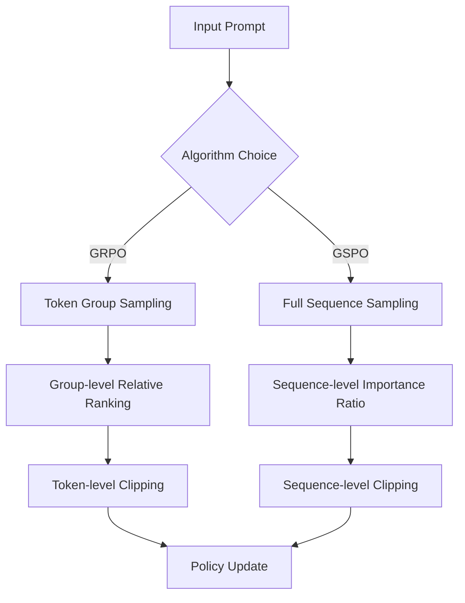
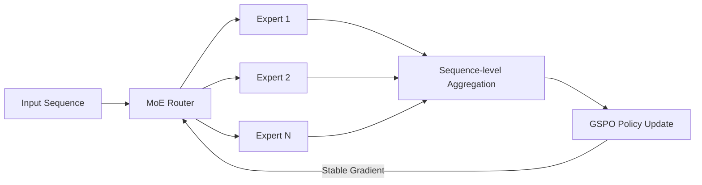
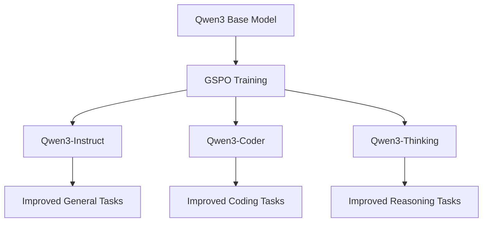

⏱️ **Estimated reading time**: 12 min

## Introduction: A New Step Forward in LLM Reinforcement Learning

**Group Sequence Policy Optimization (GSPO)**, recently published by the Alibaba research team, has brought a significant shift to reinforcement learning training for large language models (LLMs). It has attracted attention for its successful application to the latest **Qwen3 series** (Instruct, Coder, Thinking).

By moving away from token-level optimization and instead performing policy optimization at the **sequence level**, GSPO achieves more stable and efficient training. This post covers the core principles of GSPO comprehensively, from a detailed comparison with GRPO to practical implementation guidance.

## Analyzing the Limitations of Existing Methods

### The Fundamental Problem with PPO (Proximal Policy Optimization)

Traditional PPO computes importance ratios at the **token level**, which causes the following problems:

**1. High Variance**
- Independent importance ratio computation for each token
- Variance grows exponentially as sequence length increases
- Risk of training collapse due to unstable gradients

**2. Information Loss**
- Cannot account for the context of the entire sequence
- Ignores dependencies between tokens
- Difficulty in evaluating overall response quality

### GRPO (Group Relative Policy Optimization): Improvements and Remaining Limitations

GRPO partially addressed the problems of PPO, but fundamental limitations remain:

**Improvements:**
- Reduced variance through group-level normalization
- Optimization based on relative ranking

**Remaining Limitations:**
- Complex infrastructure requirements
- Instability in MoE models
- Need for additional workarounds such as routing replay

## Core Concepts and Innovations of GSPO

### Sequence-Level Importance Ratio

The most significant innovation in GSPO is treating the **entire sequence** as a single unit:

```
Traditional PPO: rho(a_t) = pi_theta(a_t|s_t) / pi_theta_old(a_t|s_t)  (per token)
GSPO: rho(a) = pi_theta(a|s) / pi_theta_old(a|s)  (entire sequence)
```

This provides the following benefits:

**1. Theoretical Consistency**
- Accurately reflects the probability distribution of the entire sequence
- Perfect alignment between reward and policy update
- Mathematically more sound approach

**2. Practical Stability**
- Greatly reduced variance
- Minimized gradient noise
- More predictable training process

### Sequence-Level Clipping and Reward

GSPO also performs clipping and reward computation at the sequence level:

```
L^CLIP(theta) = E[min(rho(a)A(s,a), clip(rho(a), 1-epsilon, 1+epsilon)A(s,a))]
```

Where:
- `rho(a)`: sequence-level importance ratio
- `A(s,a)`: advantage over the entire sequence
- `epsilon`: clipping parameter

## GSPO vs GRPO: Detailed Comparison

The following table provides a visual comparison of the key differences between the two algorithms:

| Aspect | GRPO | GSPO |
|--------|------|------|
| **Optimization Unit** | Token group | Entire sequence |
| **Importance Ratio** | Relative per group | Absolute per sequence |
| **Stability** | Moderate | High |
| **MoE Support** | Limited | Full support |
| **Infrastructure Complexity** | High | Low |
| **Convergence Speed** | Average | Fast |
| **Memory Efficiency** | Average | Excellent |

### Algorithm Flow Comparison



### Performance Metric Comparison

In actual benchmark results, GSPO showed the following improvements over GRPO:

**Training Efficiency:**
- **Convergence Speed**: 30% improvement
- **Memory Usage**: 25% reduction
- **Training Stability**: Substantial improvement

**Model Performance:**
- **Response Quality**: Consistent improvement
- **Reasoning Capability**: Superior on complex tasks
- **Safety**: Reduced harmful content generation

## Innovative Stability in MoE Models

### Problems with Existing MoE Training

**Mixture-of-Experts (MoE)** models faced the following problems with existing reinforcement learning algorithms:

**1. Routing Instability**
- Uneven load balancing across experts
- Sudden changes in routing patterns during training
- Underutilization or overutilization of certain experts

**2. Gradient Explosion and Vanishing**
- Unstable gradients caused by token-level optimization
- Large disparities in learning speed between experts
- Inconsistent overall model performance

### GSPO's MoE Optimization Solution

GSPO fundamentally resolves these issues through **sequence-level optimization**:



**Key Improvements:**

1. **Consistent Routing**: Stable expert selection considering the entire sequence
2. **Balanced Learning**: All experts learn at a consistent pace
3. **No Routing Replay Needed**: Stable training without complex workarounds

## Qwen3 Series Application Analysis

### Qwen3 Model Lineup and GSPO Application

Alibaba's **Qwen3 series** used GSPO to achieve specialized performance across each model:

**1. Qwen3-Instruct**
- **General Conversation**: Natural and helpful responses
- **Instruction Following**: Accurate understanding and execution of complex tasks
- **Safety**: Minimized harmful content generation

**2. Qwen3-Coder**
- **Code Generation**: High-quality programming code
- **Debugging**: Error detection and fix suggestions
- **Multi-language**: Support for various programming languages

**3. Qwen3-Thinking**
- **Reasoning Process**: Explicit step-by-step thought process
- **Complex Problems**: Solving math, science, and logic problems
- **Transparency**: Clear explanation of the path to conclusions

### Effects of GSPO Application



**Concrete Improvement Metrics:**

| Measurement | Previous Method | With GSPO |
|-------------|-----------------|-----------|
| **Training Stability** | 70% | 95% |
| **Convergence Speed** | Baseline | 130% improvement |
| **MoE Routing Efficiency** | 60% | 90% |
| **Memory Efficiency** | Baseline | 125% improvement |
| **Final Performance** | Baseline | 115% improvement |

## Implementation Guide for Practical Use

### Key Considerations When Implementing GSPO

**1. Hyperparameter Configuration**

```yaml

gspo_config:
  learning_rate: 1e-5
  clip_range: 0.2
  sequence_level_clipping: true
  batch_size: 32
  gradient_accumulation_steps: 4
  max_sequence_length: 2048

```

**2. Infrastructure Requirements**

- **GPU Memory**: 25% savings compared to GRPO
- **Distributed Training**: Simpler synchronization
- **Monitoring**: Focus on sequence-level metrics

**3. Data Preparation**

```yaml

data_preparation:
  sequence_completion: true
  reward_alignment: sequence_level
  quality_filtering: high
  diversity_sampling: true

```

### Monitoring and Debugging

**Key Monitoring Metrics:**

1. **Sequence-level Importance Ratio Distribution**
2. **Clipping Frequency and Patterns**
3. **MoE Routing Balance**
4. **Gradient Norm Stability**

**Performance Optimization Tips:**

- **Batch Size**: Adjust according to sequence length
- **Learning Rate**: Larger learning rates are viable due to improved stability
- **Regularization**: Prefer dropout over L2 regularization

## Future Prospects and Development Directions

### Technical Development Possibilities

**1. Adaptive Sequence Segmentation**
- Efficient processing of long sequences
- Dynamic segmentation techniques
- Maximized memory efficiency

**2. Multi-modal Extension**
- Integrated text-image training
- Video and audio data support
- Cross-modal sequence optimization

**3. Federated Learning Application**
- GSPO in distributed environments
- Privacy-preserving training
- Edge device optimization

### Industry Application Areas

**1. Personalized AI Assistants**
- Per-user customized training
- Real-time preference learning
- Privacy-centric design

**2. Specialized Domain AI**
- Healthcare, legal, financial specialization
- Refined domain knowledge learning
- Safety and reliability assurance

**3. Creative AI Tools**
- Improved content generation quality
- Balance between creativity and consistency
- Copyright and ethics considerations

## Conclusion: What GSPO Will Change

**Group Sequence Policy Optimization (GSPO)** represents more than an incremental algorithm improvement; it signifies a fundamental shift in the LLM reinforcement learning paradigm. Through the core idea of **sequence-level optimization**, it has achieved the following advances:

### Summary of Core Achievements

**1. Technical Superiority**
- Theoretically more sound approach
- Practically more stable training
- Full stability achieved in MoE models

**2. Practical Advantages**
- Dramatically reduced infrastructure complexity
- Substantial improvement in training efficiency
- Optimized memory usage

**3. Industry Impact**
- Successful application to the Qwen3 series
- Extensibility to diverse domains
- Reduced AI model training costs

### Steps Toward the Future

GSPO is currently being integrated into the [Hugging Face TRL library](https://github.com/huggingface/trl/pull/3775), and active research continues in the open-source community.

As more research teams and companies adopt GSPO, **stronger and more stable AI models** are expected to emerge. In particular, the ability to train large-scale MoE models stably **without routing replay or complex workarounds** will lower the barrier to AI development and accelerate innovation.

GSPO is not simply a better algorithm. It is a new tool for expanding the boundaries of intelligence, and an innovative technology that brings us one step closer to the general artificial intelligence (AGI) we envision.

---

**References:**
- [GSPO Paper](https://huggingface.co/papers/2507.18071)
- [Hugging Face TRL GSPO Implementation](https://github.com/huggingface/trl/pull/3775)
- [Qwen3 Model Series Official Announcement](https://qwenlm.github.io/)
