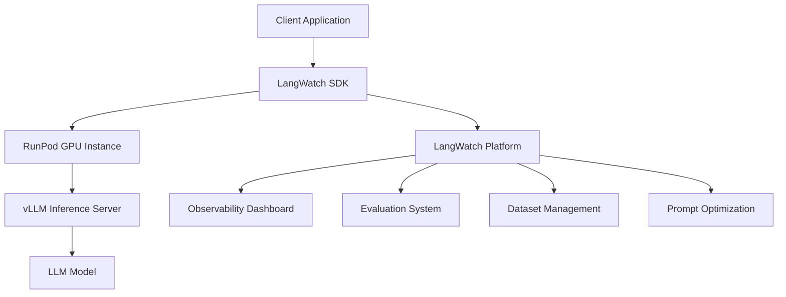

⏱️ **Estimated reading time**: 12 min

## Introduction

Running LLM (Large Language Model) applications reliably in production requires systematic observability, evaluation, and optimization. [LangWatch](https://github.com/langwatch/langwatch) is an open-source platform that meets these LLMOps requirements. Built on the OpenTelemetry standard, it enables management of the full lifecycle of LLM applications.

### Core Value of LangWatch

**Limitations of conventional monitoring tools**:
- General-purpose APM tools lack LLM-specific metrics
- Tracking prompt quality and response accuracy is difficult
- Cost optimization and performance analysis are complex

**What LangWatch provides**:
- Observability and tracing designed specifically for LLMs
- Real-time and offline evaluation frameworks
- Prompt version control and optimization tools
- Native integration with various LLM frameworks

## LangWatch Core Feature Analysis

### 1. Observability

LangWatch tracks every interaction in an LLM application using the OpenTelemetry standard.

**Key tracing elements**:
- **Request/Response tracing**: Full flow of input prompts and model responses
- **Latency analysis**: Token generation speed and time to first token (TTFT)
- **Cost tracking**: Token usage and cost calculation per API call
- **Error monitoring**: Analysis of failed requests and exception cases

```python
import langwatch
from openai import OpenAI

client = OpenAI()

@langwatch.trace()
def chat_completion(messages):
    """OpenAI API call tracked by LangWatch"""
    langwatch.get_current_trace().autotrack_openai_calls(client)
    
    response = client.chat.completions.create(
        model="gpt-4",
        messages=messages,
        temperature=0.7
    )
    
    return response.choices[0].message.content
```

### 2. Evaluation System

**Real-time evaluation**:
- Real-time monitoring of response quality in production
- Combination of user feedback and automated evaluation metrics
- Early detection of performance degradation

**Offline evaluation**:
- Batch evaluation using datasets
- Model performance comparison through A/B testing
- Impact analysis of prompt changes

**Evaluation metrics**:
- **Relevance**: The degree of connection between question and answer
- **Accuracy**: Fact-checking and information correctness
- **Consistency**: Uniformity of responses to identical questions
- **Safety**: Harmful content detection and filtering

### 3. Dataset Management

**Automatic dataset creation**:
- Automatic dataset construction from traced messages
- Analysis of user interaction patterns
- Extraction of test cases based on real usage

**Manual dataset upload**:
- Upload custom datasets for evaluation
- Management of domain-specific test cases
- Construction of golden datasets for continuous evaluation

### 4. Prompt Optimization

**Version control**:
- Tracking prompt changes
- Performance impact analysis
- Support for rollback and A/B testing

**Automatic optimization**:
- Uses the MIPROv2 algorithm from DSPy
- Automatic generation of few-shot examples
- Optimization of prompt templates

```python
# Prompt version control example
from langwatch import prompt_manager

# Register a prompt version
prompt_v1 = prompt_manager.create_prompt(
    name="customer_support",
    version="1.0",
    template="You are a customer support agent. Question: {question}",
    parameters=["question"]
)

# Test new version alongside performance evaluation
prompt_v2 = prompt_manager.test_prompt(
    base_prompt=prompt_v1,
    modifications={"add_examples": True, "tone": "friendly"},
    evaluation_dataset="customer_queries_100"
)
```

## Integration with AI Platforms

### Integration with RunPod

RunPod is a GPU cloud infrastructure platform. Used together with LangWatch, it enables a powerful LLMOps environment.

**Integration architecture**:



**RunPod + LangWatch setup**:

```python
# Running a vLLM server on RunPod
import requests
import langwatch

# RunPod endpoint configuration
RUNPOD_ENDPOINT = "https://api.runpod.ai/v2/your-endpoint-id"
RUNPOD_API_KEY = "your-runpod-api-key"

@langwatch.trace()
def call_runpod_llm(prompt, model="meta-llama/Llama-2-7b-chat-hf"):
    """Call an LLM hosted on RunPod"""
    
    headers = {
        "Authorization": f"Bearer {RUNPOD_API_KEY}",
        "Content-Type": "application/json"
    }
    
    payload = {
        "input": {
            "prompt": prompt,
            "model": model,
            "max_tokens": 512,
            "temperature": 0.7
        }
    }
    
    # Track the request in LangWatch
    with langwatch.trace_span("runpod_inference") as span:
        span.set_attribute("model", model)
        span.set_attribute("prompt_length", len(prompt))
        
        response = requests.post(
            f"{RUNPOD_ENDPOINT}/run",
            headers=headers,
            json=payload
        )
        
        result = response.json()
        
        # Record response metrics
        span.set_attribute("response_length", len(result.get("output", "")))
        span.set_attribute("inference_time", result.get("execution_time", 0))
        
        return result["output"]
```

### Optimization Integration with vLLM

vLLM is an LLM inference library that provides high throughput and efficient memory usage.

**vLLM + LangWatch integration**:

```python
from vllm import LLM, SamplingParams
import langwatch

class OptimizedLLMService:
    def __init__(self, model_name="meta-llama/Llama-2-7b-chat-hf"):
        self.llm = LLM(
            model=model_name,
            tensor_parallel_size=2,  # GPU parallel processing
            max_model_len=4096,
            trust_remote_code=True
        )
        
        self.sampling_params = SamplingParams(
            temperature=0.7,
            top_p=0.95,
            max_tokens=512
        )
    
    @langwatch.trace()
    def generate(self, prompts, batch_size=8):
        """Batch-optimized generation"""
        
        with langwatch.trace_span("vllm_batch_inference") as span:
            span.set_attribute("batch_size", len(prompts))
            span.set_attribute("model", self.llm.llm_engine.model_config.model)
            
            # vLLM batch inference
            outputs = self.llm.generate(prompts, self.sampling_params)
            
            # Calculate throughput metrics
            total_tokens = sum(len(output.outputs[0].token_ids) for output in outputs)
            span.set_attribute("total_output_tokens", total_tokens)
            span.set_attribute("throughput_tokens_per_second", 
                             total_tokens / span.duration if span.duration > 0 else 0)
            
            return [output.outputs[0].text for output in outputs]

# Usage example
llm_service = OptimizedLLMService()

prompts = [
    "Explain the future of AI.",
    "What are solutions to climate change?",
    "Briefly explain the principles of quantum computing."
]

responses = llm_service.generate(prompts)
```

### TensorRT-LLM Acceleration

NVIDIA TensorRT-LLM can be used to maximize inference performance.

```python
import tensorrt_llm
import langwatch

class TensorRTLLMService:
    def __init__(self, engine_path):
        self.engine = tensorrt_llm.LLMEngine(engine_path)
        
    @langwatch.trace()
    def optimized_inference(self, prompt):
        """TensorRT-optimized inference"""
        
        with langwatch.trace_span("tensorrt_inference") as span:
            # Collect inference performance metrics
            start_time = time.time()
            
            result = self.engine.generate(
                prompt,
                max_new_tokens=512,
                temperature=0.7
            )
            
            inference_time = time.time() - start_time
            
            # Record performance data in LangWatch
            span.set_attribute("inference_time_ms", inference_time * 1000)
            span.set_attribute("tokens_per_second", 
                             len(result.split()) / inference_time)
            
            return result
```

## Practical LLMOps Workflow

### 1. Development Stage

```python
# LangWatch configuration in the development environment
import langwatch

# Development mode configuration
langwatch.init(
    api_key="your-dev-api-key",
    endpoint="http://localhost:5560",  # Local LangWatch instance
    environment="development"
)

@langwatch.trace()
def prototype_chatbot(user_input):
    """Prototype chatbot function"""
    
    # Testing a prompt template
    system_prompt = """You are a helpful AI assistant.
    Please answer user questions accurately and kindly."""
    
    response = call_llm(system_prompt, user_input)
    
    # Immediate evaluation during development
    evaluation_score = langwatch.evaluate_response(
        prompt=user_input,
        response=response,
        criteria=["relevance", "helpfulness", "safety"]
    )
    
    return response, evaluation_score
```

### 2. Staging Stage

```python
# Automatic evaluation configuration in the staging environment
@langwatch.trace()
def staging_deployment():
    """Comprehensive testing in the staging environment"""
    
    # Load test dataset
    test_dataset = langwatch.load_dataset("customer_support_test_100")
    
    results = []
    for test_case in test_dataset:
        response = production_chatbot(test_case.input)
        
        # Run automatic evaluation
        evaluation = langwatch.auto_evaluate(
            input=test_case.input,
            output=response,
            expected=test_case.expected,
            metrics=["accuracy", "relevance", "safety"]
        )
        
        results.append({
            "input": test_case.input,
            "output": response,
            "scores": evaluation.scores,
            "passed": evaluation.overall_score > 0.8
        })
    
    # Staging results report
    langwatch.create_evaluation_report(
        results=results,
        environment="staging",
        deployment_version="v1.2.0"
    )
    
    return results
```

### 3. Production Stage

```python
# Real-time monitoring in the production environment
@langwatch.trace()
def production_chatbot(user_input, user_id=None):
    """Production chatbot with real-time monitoring"""
    
    with langwatch.trace_span("production_inference") as span:
        # Add user context
        span.set_attribute("user_id", user_id)
        span.set_attribute("input_length", len(user_input))
        
        # Safety pre-check
        safety_check = langwatch.safety_filter(user_input)
        if not safety_check.is_safe:
            span.set_attribute("safety_blocked", True)
            return "Sorry. We cannot process this request."
        
        # LLM inference
        response = optimized_llm_call(user_input)
        
        # Real-time quality evaluation
        quality_score = langwatch.real_time_evaluate(
            input=user_input,
            output=response,
            metrics=["relevance", "coherence"]
        )
        
        span.set_attribute("quality_score", quality_score.overall)
        span.set_attribute("response_length", len(response))
        
        # Alert on detection of low-quality responses
        if quality_score.overall < 0.7:
            langwatch.alert(
                type="low_quality_response",
                severity="warning",
                details={
                    "user_id": user_id,
                    "score": quality_score.overall,
                    "input": user_input[:100] + "..."
                }
            )
        
        return response

# Production metrics dashboard configuration
langwatch.setup_dashboard(
    metrics=[
        "requests_per_minute",
        "average_response_time",
        "quality_score_distribution",
        "error_rate",
        "cost_per_token"
    ],
    alerts=[
        {"metric": "error_rate", "threshold": 0.05, "action": "email"},
        {"metric": "avg_quality_score", "threshold": 0.8, "action": "slack"},
        {"metric": "cost_per_hour", "threshold": 100, "action": "email"}
    ]
)
```

## Setting Up a Local Development Environment on macOS

### Docker Compose Configuration

Let us run LangWatch locally to build a development environment.

```bash
# Clone and run LangWatch
git clone https://github.com/langwatch/langwatch.git
cd langwatch

# Copy environment configuration file
cp langwatch/.env.example langwatch/.env

# Run with Docker Compose (for ARM Mac)
docker compose -f compose.yml -f docker-compose.arm64.override.yml up -d --wait --build

# Open in browser
open http://localhost:5560
```

### Development Environment SDK Setup

```bash
# Create Python virtual environment
python3 -m venv langwatch-dev
source langwatch-dev/bin/activate

# Install LangWatch SDK
pip install langwatch

# Install development dependencies
pip install openai python-dotenv jupyter
```

### Environment Variable Configuration

```bash
# Add to ~/.zshrc
export LANGWATCH_API_KEY="lw-your-local-dev-key"
export LANGWATCH_ENDPOINT="http://localhost:5560"
export OPENAI_API_KEY="your-openai-api-key"

# Add aliases
alias langwatch-local="docker compose -f ~/langwatch/compose.yml up -d"
alias langwatch-stop="docker compose -f ~/langwatch/compose.yml down"
alias langwatch-logs="docker compose -f ~/langwatch/compose.yml logs -f"

# Apply changes
source ~/.zshrc
```

### Writing a Test Script

```python
# test_langwatch_integration.py
import os
import langwatch
from openai import OpenAI

# Initialize LangWatch
langwatch.init(
    api_key=os.getenv("LANGWATCH_API_KEY"),
    endpoint=os.getenv("LANGWATCH_ENDPOINT")
)

client = OpenAI()

@langwatch.trace()
def test_basic_integration():
    """Basic integration test"""
    
    # Configure automatic OpenAI tracking
    langwatch.get_current_trace().autotrack_openai_calls(client)
    
    # Test request
    response = client.chat.completions.create(
        model="gpt-3.5-turbo",
        messages=[
            {"role": "system", "content": "You are a helpful AI assistant."},
            {"role": "user", "content": "List three advantages of Python."}
        ],
        temperature=0.7,
        max_tokens=200
    )
    
    result = response.choices[0].message.content
    print(f"Response: {result}")
    
    # Run evaluation
    evaluation = langwatch.evaluate_response(
        prompt="List three advantages of Python.",
        response=result,
        criteria=["relevance", "accuracy", "completeness"]
    )
    
    print(f"Evaluation score: {evaluation}")
    
    return result, evaluation

if __name__ == "__main__":
    result, evaluation = test_basic_integration()
    print("\n LangWatch integration test complete!")
    print(f"LangWatch dashboard: http://localhost:5560")
```

### Running and Verifying

```bash
# Run test
python test_langwatch_integration.py

# View results in browser
open http://localhost:5560

# Check logs
langwatch-logs
```

## Advanced Use Cases

### 1. Multi-Model A/B Testing

```python
import random
import langwatch

@langwatch.trace()
def multi_model_ab_test(user_input):
    """Test multiple models simultaneously"""
    
    models = [
        {"name": "gpt-4", "weight": 0.3},
        {"name": "gpt-3.5-turbo", "weight": 0.5},
        {"name": "claude-3-sonnet", "weight": 0.2}
    ]
    
    # Select model based on weights
    selected_model = random.choices(
        models, 
        weights=[m["weight"] for m in models]
    )[0]
    
    with langwatch.trace_span("model_selection") as span:
        span.set_attribute("selected_model", selected_model["name"])
        span.set_attribute("selection_weight", selected_model["weight"])
        
        response = call_model(selected_model["name"], user_input)
        
        # Collect per-model performance metrics
        langwatch.record_metric(
            name=f"response_quality_{selected_model['name']}",
            value=evaluate_response_quality(response),
            tags={"model": selected_model["name"]}
        )
        
        return response
```

### 2. Automatic Prompt Optimization

```python
from langwatch.optimization import DSPyOptimizer

class AutoPromptOptimizer:
    def __init__(self):
        self.optimizer = DSPyOptimizer()
        
    def optimize_prompt(self, base_prompt, training_data, metrics):
        """Automatic prompt optimization"""
        
        optimization_run = langwatch.start_optimization(
            name="customer_support_prompt_v2",
            base_prompt=base_prompt,
            training_data=training_data
        )
        
        # Optimization using DSPy MIPROv2
        optimized_prompt = self.optimizer.optimize(
            prompt_template=base_prompt,
            training_examples=training_data,
            eval_metrics=metrics,
            iterations=50
        )
        
        # Evaluate optimization results
        evaluation_results = langwatch.evaluate_prompt(
            original_prompt=base_prompt,
            optimized_prompt=optimized_prompt,
            test_dataset=training_data,
            metrics=metrics
        )
        
        langwatch.complete_optimization(
            run_id=optimization_run.id,
            results=evaluation_results,
            optimized_prompt=optimized_prompt
        )
        
        return optimized_prompt, evaluation_results

# Usage example
optimizer = AutoPromptOptimizer()

base_prompt = """You are a customer support agent.
Please respond to customer inquiries kindly and accurately.

Customer inquiry: {question}
Response:"""

training_data = [
    {"question": "What is the refund policy?", "expected": "Full refund within 14 days..."},
    {"question": "How long does shipping take?", "expected": "Standard shipping is 2-3 days..."},
    # ... more examples
]

optimized_prompt, results = optimizer.optimize_prompt(
    base_prompt=base_prompt,
    training_data=training_data,
    metrics=["accuracy", "helpfulness", "response_time"]
)
```

### 3. Cost Optimization Monitoring

```python
class CostOptimizedLLMService:
    def __init__(self):
        self.cost_thresholds = {
            "hourly": 50,    # $50/hour
            "daily": 500,    # $500/day
            "monthly": 10000 # $10,000/month
        }
        
    @langwatch.trace()
    def cost_aware_inference(self, prompt, priority="normal"):
        """Inference execution with cost awareness"""
        
        # Check current cost usage
        current_costs = langwatch.get_cost_metrics()
        
        with langwatch.trace_span("cost_check") as span:
            span.set_attribute("hourly_cost", current_costs.hourly)
            span.set_attribute("daily_cost", current_costs.daily)
            span.set_attribute("priority", priority)
            
            # Check cost thresholds
            if current_costs.hourly > self.cost_thresholds["hourly"]:
                if priority == "low":
                    span.set_attribute("cost_limited", True)
                    return "Service is temporarily limited."
                elif priority == "normal":
                    # Fall back to a cheaper model
                    model = "gpt-3.5-turbo"  # instead of gpt-4
                else:
                    model = "gpt-4"  # high priority uses high-performance model
            else:
                model = "gpt-4"
            
            span.set_attribute("selected_model", model)
            
            response = call_model(model, prompt)
            
            # Calculate cost of this request
            estimated_cost = estimate_request_cost(prompt, response, model)
            span.set_attribute("request_cost", estimated_cost)
            
            # Check cost alerts
            if current_costs.daily + estimated_cost > self.cost_thresholds["daily"]:
                langwatch.alert(
                    type="cost_threshold_approached",
                    severity="warning",
                    details={"daily_cost": current_costs.daily + estimated_cost}
                )
            
            return response
```

## Conclusion

LangWatch is a comprehensive platform that meets modern LLMOps requirements. Through features such as OpenTelemetry-based observability, real-time and offline evaluation systems, and automated prompt optimization, it enables effective management of the full lifecycle of LLM applications.

### Summary of Key Advantages

1. **Standardized observability**: Compatible with various LLM frameworks through OpenTelemetry
2. **Comprehensive evaluation**: Combination of real-time monitoring and offline evaluation
3. **Automated optimization**: Automatic prompt optimization using DSPy MIPROv2
4. **Cost efficiency**: Detailed cost tracking and optimization features
5. **Extensibility**: Integration with various infrastructures such as RunPod and vLLM

### Recommended Next Steps

1. **Set up local environment**: Configure the development environment with Docker Compose
2. **Phased adoption**: Apply in the order of development, staging, then production
3. **Define metrics**: Set evaluation indicators aligned with business objectives
4. **Build automation**: Integrate the evaluation process into CI/CD pipelines
5. **Team collaboration**: Build a collaboration process between domain experts and the development team

An LLMOps framework built with LangWatch significantly improves the quality and stability of AI applications, enabling continuous improvement and optimization. Combined with modern AI infrastructure such as RunPod and vLLM, it enables an even more powerful and efficient LLM operations environment.
