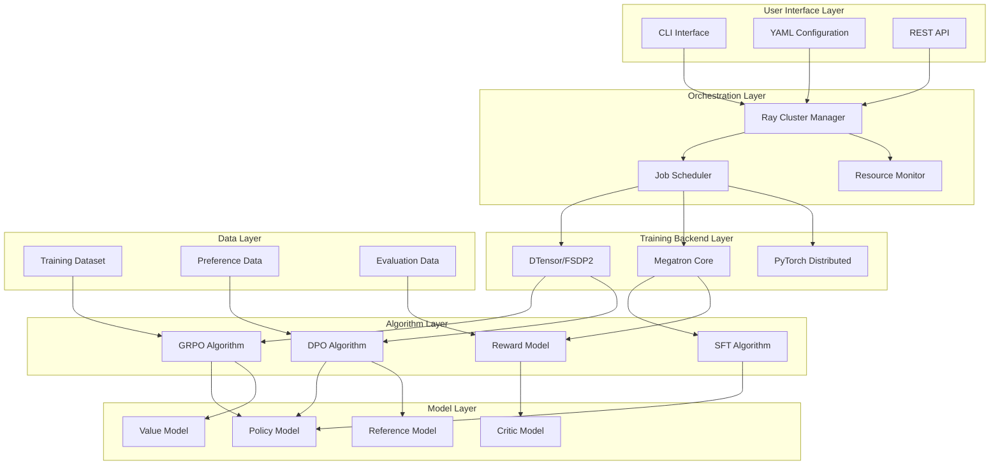
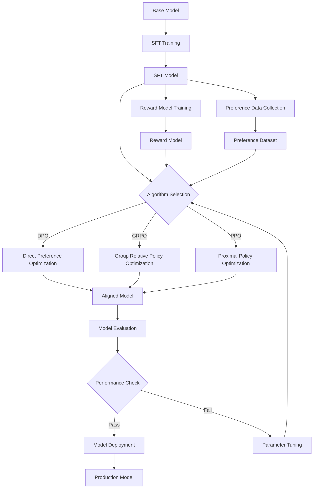

⏱️ **Estimated reading time**: 15 min

## Introduction

Post-training is central to maximizing the performance of large language models (LLMs). NVIDIA NeMo RL is a reinforcement learning framework that brings a well-engineered approach to this post-training domain, offering an architecture that scales from a single GPU to thousands of GPUs.

The [NVIDIA NeMo RL GitHub repository](https://github.com/NVIDIA-NeMo/RL) has accumulated 662 stars and 104 forks, reflecting active ongoing development. This article provides a comprehensive analysis of NeMo RL, covering its architecture, key algorithms, and practical deployment guidance.

## NVIDIA NeMo RL Overview

### Core Characteristics

NVIDIA NeMo RL is positioned as a **"Scalable toolkit for efficient model reinforcement"** and offers the following defining characteristics:

- **Scalability**: Linear scaling from 1 GPU to thousands of GPUs
- **Modularity**: Plugin-based component architecture
- **Efficiency**: Memory-optimized distributed processing
- **Versatility**: Support for a wide range of reinforcement learning algorithms

### Differences from NeMo Aligner

NeMo RL represents an advancement over the earlier NeMo Aligner, with improvements in the following areas:

| Dimension | NeMo Aligner | NeMo RL |
|-----------|-------------|---------|
| **Architecture** | Monolithic structure | Modular microservices |
| **Scalability** | Limited scaling | Unrestricted horizontal scaling |
| **Backend** | Megatron-centric | DTensor + Megatron multi-backend |
| **Algorithms** | RLHF, DPO | GRPO, DPO, SFT, RM + extensions |

## In-Depth Architecture Analysis

### Overall System Architecture

NeMo RL's architecture is designed as a layered structure where each layer has clearly defined roles and responsibilities:

#### Key Architecture Layers

1. **User Interface Layer**
   - CLI Interface: Command-line execution interface
   - YAML Configuration: Declarative configuration management
   - REST API: Programmatic access API

2. **Orchestration Layer**
   - Ray Cluster Manager: Distributed computing resource management
   - Job Scheduler: Training job scheduling and management
   - Resource Monitor: Real-time resource monitoring

3. **Training Backend Layer**
   - DTensor/FSDP2: PyTorch's next-generation distributed training technology
   - Megatron Core: NVIDIA's parallel processing engine for large-scale models
   - PyTorch Distributed: Foundation distributed training backend

### Core Component Analysis

#### Ray-Based Distributed Processing Architecture

NeMo RL achieves scalability through a distributed processing system built on Ray:

- **Automatic resource management**: Ray automatically manages GPU, CPU, and memory resources
- **Dynamic scaling**: Automatic scale-up and scale-down based on workload
- **Fault tolerance**: Automatic recovery mechanisms on node failure
- **Multi-cluster support**: Compatibility with Kubernetes, Slurm, and other cluster environments

#### Multi-Backend Training System

One of NeMo RL's distinguishing features is its support for multiple training backends:

| Backend | Optimal Use Case | Memory Efficiency | Scalability |
|---------|-----------------|-------------------|-------------|
| **DTensor/FSDP2** | Small to mid-size models (less than 100B) | Very high | Moderate |
| **Megatron Core** | Large models (greater than 100B) | High | Very high |
| **PyTorch Distributed** | Prototyping and small-scale experiments | Moderate | Low |

#### Automatic Backend Selection Mechanism

NeMo RL automatically selects the optimal backend based on YAML configuration:

- **Model size-based**: Automatic backend selection according to parameter count
- **Hardware configuration-based**: Optimization based on GPU count and memory
- **Task type-based**: Per-algorithm optimization for SFT, DPO, GRPO, and others

## Technology Stack and Library Ecosystem

### Core Technology Stack

NeMo RL's technology stack is built on the following modern technologies:

#### Languages and Frameworks
- **Python 95.1%**: Primary development language
- **Shell Scripts 4.7%**: Automation and deployment scripts
- **Docker 0.2%**: Containerization and deployment

#### Deep Learning Frameworks
- **PyTorch**: Core deep learning framework
- **PyTorch Lightning**: High-level training abstraction
- **Hugging Face Transformers**: Pre-trained model ecosystem

#### Distributed Processing and Parallelization
- **Ray**: Distributed computing orchestration
- **NVIDIA Megatron**: Large-scale model parallelism
- **PyTorch FSDP2**: Next-generation fully sharded data parallelism

#### Package Management and Development Tools
- **UV**: High-performance Python package manager
- **Pre-commit**: Code quality management
- **Docker**: Containerization and deployment environment

### External Library Dependencies

NeMo RL integrates with the following major external libraries:

- **vLLM**: High-performance inference engine
- **TensorBoard/WandB**: Experiment tracking and monitoring
- **Hydra**: Configuration management framework
- **APEX**: NVIDIA's mixed-precision training library

## Reinforcement Learning Algorithm Deep Dive

### GRPO (Group Relative Policy Optimization)

GRPO is one of NeMo RL's core algorithms, designed to improve mathematical reasoning capabilities:

#### GRPO Key Characteristics
- **Group-based optimization**: Groups multiple responses for relative performance comparison
- **Improved stability**: Better training stability compared to conventional PPO
- **Efficiency**: Optimized memory usage
- **Mathematical reasoning**: Leverages the OpenInstructMath2 dataset

### DPO (Direct Preference Optimization)

DPO is an algorithm that directly models human preferences:

#### DPO Advantages
- **Simplicity**: Reduced implementation complexity compared to PPO
- **Stability**: Direct optimization without a reward model
- **Efficiency**: Shorter training time
- **Scalability**: Applicable to large-scale models

### SFT (Supervised Fine-Tuning)

SFT is a supervised learning-based fine-tuning methodology:

#### SFT Characteristics
- **Foundational fine-tuning**: Basic fine-tuning stage preceding RLHF
- **Diverse dataset support**: Easy integration of custom datasets
- **Efficient training**: Support from single GPU to multi-node setups

### RM (Reward Model)

The reward model is a core component that learns human preferences:

#### RM Role
- **Preference modeling**: Learning a reward function from human feedback
- **Quality assessment**: Evaluating the quality of generated responses
- **Reinforcement learning signal**: Providing reward signals for RLHF

## Training Workflow and Pipeline

### End-to-End Training Pipeline

NeMo RL's training pipeline follows a structured and modular approach:

#### Pipeline Stage Descriptions

1. **Base Model**: Pre-trained foundation model (Llama, Mistral, etc.)
2. **SFT Training**: Initial supervised fine-tuning
3. **Reward Model Training**: Training a reward model on human preference data
4. **Algorithm Selection**: Choosing the optimal algorithm among DPO, GRPO, and PPO
5. **Model Evaluation**: Performance assessment across various benchmarks
6. **Production Deployment**: Deployment to production environment

### Multi-Node Distributed Training Workflow

NeMo RL supports efficient distributed training in large-scale cluster environments:

#### Cluster Environment Support
- **Slurm**: Job scheduling in HPC environments
- **Kubernetes**: Container-based orchestration
- **Ray Cluster**: Automatic resource management and scaling

#### Distributed Training Optimizations
- **Gradient Accumulation**: Memory-efficient gradient updates
- **Mixed Precision**: Memory and speed optimization via FP16/BF16
- **Pipeline Parallelism**: Pipeline-level parallelism across model layers
- **Tensor Parallelism**: Tensor-level distributed computation

## Enterprise Deployment Guidance

### Adoption Strategy

#### Phase 1: Environment Setup and Validation
- **Hardware requirements analysis**: Evaluating GPU memory and network bandwidth
- **Software stack configuration**: Setting up CUDA, PyTorch, and Ray environments
- **Small-scale experiment**: Proof of concept on a single GPU

#### Phase 2: Pilot Project
- **Dataset preparation**: Domain-specific data collection and preprocessing
- **Model selection**: Choosing a base model aligned with enterprise requirements
- **Initial fine-tuning**: Establishing baseline performance through SFT

#### Phase 3: Production Scaling
- **Multi-node expansion**: Scaling to large cluster environments
- **Monitoring setup**: Experiment tracking via WandB and TensorBoard
- **CI/CD pipeline**: Automated training and deployment pipelines

### Cost Optimization Strategies

#### Resource Optimization
- **Dynamic scaling**: Automatic resource adjustment based on workload
- **Spot instance usage**: Cost reduction in cloud environments
- **Checkpointing**: Minimizing restart costs when training is interrupted

#### Efficiency Improvements
- **PEFT techniques**: Maximizing parameter efficiency with LoRA, AdaLoRA, and similar methods
- **Data parallelism**: Efficient data loading and preprocessing
- **Memory optimization**: Leveraging Gradient Checkpointing and Activation Checkpointing

### Security and Governance

#### Data Security
- **Data encryption**: Encrypting training data and model weights
- **Access control**: Implementing Role-Based Access Control (RBAC)
- **Audit logs**: Ensuring traceability for all training activities

#### Model Governance
- **Version management**: Systematic management of model and experiment versions
- **Performance monitoring**: Continuous tracking of model performance
- **Responsible AI**: Bias detection and fairness evaluation

## Performance Benchmarks and Evaluation

### Evaluation Metrics

NeMo RL measures model performance using a range of evaluation indicators:

#### General Performance Metrics
- **MATH-500**: Assessment of mathematical reasoning ability
- **HumanEval**: Assessment of coding capability
- **HellaSwag**: Assessment of commonsense reasoning
- **MMLU**: Assessment of multi-domain language understanding

#### Alignment Performance Metrics
- **Reward Model Accuracy**: Accuracy of the reward model in predicting human preferences
- **Win Rate**: Win rate against human evaluators
- **Safety Score**: Safety and harmlessness evaluation

### Performance Optimization Strategies

#### Hyperparameter Tuning
- **Learning Rate Scheduling**: Adaptive learning rate adjustment
- **Batch Size Optimization**: Finding the balance between memory and performance
- **Regularization**: Techniques to prevent overfitting

#### Algorithm Selection Guide
- **GRPO**: Tasks where mathematical reasoning and logical thinking are critical
- **DPO**: General conversational performance improvement or when fast training is needed
- **SFT**: When the primary goal is basic fine-tuning or domain adaptation

## Future Outlook and Roadmap

### Technical Development Directions

#### Algorithm Advances
- **New RL Algorithms**: Development of more efficient reinforcement learning algorithms
- **Multi-Agent Training**: Collaborative multi-agent learning
- **Continual Learning**: Ongoing learning and adaptive capability

#### Platform Expansion
- **Edge Deployment**: Inference optimization for edge devices
- **Federated Learning**: Support for distributed learning environments
- **AutoML Integration**: Automated hyperparameter optimization

### Ecosystem Growth

#### Community Contributions
- **Open-source ecosystem**: Active community contributions and extensions
- **Research collaboration**: Strengthened partnerships with academia
- **Tool integrations**: Integration with diverse MLOps tools

#### Commercial Applications
- **Enterprise Solutions**: Enterprise-grade solution offerings
- **Cloud Integration**: Deep integration with major cloud platforms
- **Managed Services**: Managed service offerings

## Conclusion

NVIDIA NeMo RL presents a capable solution for reinforcement learning-based post-training of large language models. Its Ray-based scalable architecture, multi-backend training support, and modern algorithms such as GRPO and DPO position it as a practically deployable framework for enterprise environments.

### Summary of Core Strengths

1. **Scalability**: Linear scaling from a single GPU to thousands of GPUs
2. **Modularity**: Flexible plugin-based architecture
3. **Efficiency**: Memory-optimized distributed processing
4. **Versatility**: Support for a wide range of reinforcement learning algorithms
5. **Productivity**: Toolchain optimized for enterprise environments

### Adoption Recommendations

- **Research institutions**: Experimentation and research with the latest reinforcement learning algorithms
- **Large enterprises**: Domain-specific fine-tuning of large-scale language models
- **Startups**: Efficient model alignment and performance optimization
- **Cloud providers**: Building managed AI service platforms

NVIDIA NeMo RL sets a new reference point in the LLMOps space and is positioned to accelerate the industrial adoption of large language models going forward. Through continued community contributions and technical progress, it is on track to become a core infrastructure component of the AI ecosystem.
