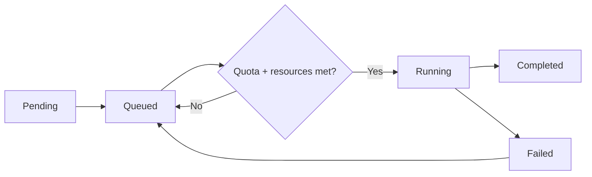
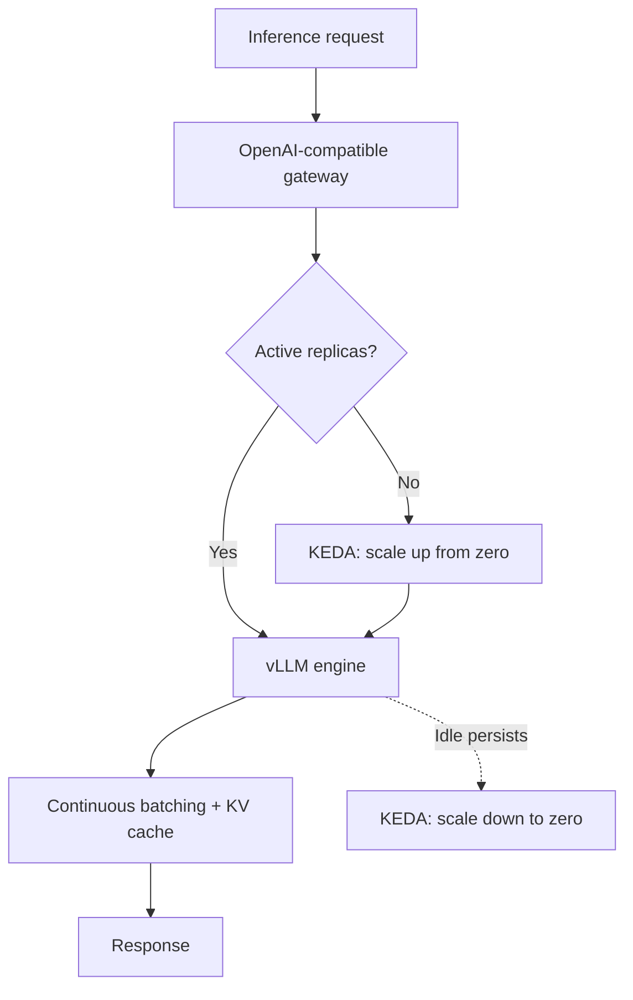
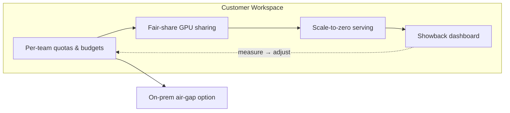

## You Cannot Cut What You Cannot See

The conversation about reducing AI inference costs usually starts with "let's buy cheaper GPUs" -- and that is almost always the wrong starting point. Even with identical H100s, cost per token can vary by several times depending on how you schedule workloads, which serving engine you use, and which model tier handles each request. Hardware is the floor of your cost structure; the real waste seeps out quietly from the operational layers above it.

At ThakiCloud, we run a Kubernetes-based AI/ML platform, and this problem is something we deal with every day. This post lays out how we reduce inference costs internally and how customers can pull the same levers on top of our platform -- with real formulas and actual configuration, not marketing slides.

The central claim is simple: **costs only come down after you pin them to measurable units.** That means starting with a precise formula for GPU cost.

## 1. Pinning GPU Hourly Cost to a Formula

"How much does one H100 cost?" is only half the question. The purchase price is a capital expenditure (CapEx), while power, colocation, and staffing are recurring operational expenses (OpEx). You need to combine them into a single per-hour number before you can calculate cost per token.

Our internal cost calculator (`scripts/gen_model_token_cost_xlsx.py`) encodes this formula:

```text
Monthly depreciation = Purchase price / 48 months
Hourly GPU cost = (Monthly depreciation + Monthly OpEx) / 730 hours
Token cost ($/1K) = Hourly GPU cost / (Throughput tok/s x 3.6)
```

The 48-month (4-year) depreciation period is a conservative assumption for data center GPUs. 730 is the average number of hours in a month (24 x 365 / 12). The key discipline here is **breaking OpEx into line items** rather than lumping it together.

| OpEx Item | Monthly Cost (USD) | Basis |
|---|---|---|
| Power | $58 | TDP x PUE 1.3 x $0.08/kWh x 730h |
| Colocation (rack space) | $312 | Rack space and cooling |
| Network | $150 | Bandwidth and transit |
| Staff allocation | $100 | Prorated operations headcount |
| Software licenses | $52 | Monitoring and orchestration |
| **Total** | **$672/month** | Same regardless of GPU model |

It is worth noting that colocation ($312) is more than five times the power cost ($58). The common assumption that "GPUs are expensive because they use so much electricity" is only partially true -- in practice, OpEx is dominated by rack space and networking. Cost optimization efforts focused purely on power efficiency tend to miss the bigger levers.

There is one more adjustment specific to the Korean market: import duties, logistics, and distributor margins add roughly **30% on top of list price**. Our calculator accounts for this explicitly. The H100 base price of $32,500 becomes $42,250 for Korean procurement; the B200 at $20,000 becomes $26,000.

Once you run this formula, you get a single hourly cost per GPU. From there, "what does it cost per token to serve this model at this throughput?" becomes arithmetic rather than guesswork. That is what makes optimization concrete.


## 2. Self-Hosted vs. API: Anatomy of the Gap

Once you have a formula for your own cost, the next question becomes obvious: is it cheaper to buy tokens from an external API or to generate them on your own hardware?

Our calculator's API comparison sheet shows a gap of **50x to 100x** between commercial API pricing and self-hosted token costs. But that gap only holds at adequate utilization. If your GPU is running at 50% utilization, your effective self-hosted token cost doubles -- so the economics of self-hosting are entirely a function of your ability to keep GPUs busy. That means scheduling and serving efficiency carry the weight.

External API unit prices are baked into our daily cost audit script (`scripts/cost_audit.py`) using official pricing:

```python
# Unit price table in scripts/cost_audit.py (USD / MTok, input/output)
PRICING = {
    "opus":   {"in": 15.0, "out": 75.0},
    "sonnet": {"in": 3.0,  "out": 15.0},
    "haiku":  {"in": 0.80, "out": 4.0},
}
```

Opus output tokens cost roughly 19x what Haiku costs. Internalizing that single table explains most of "why does cost explode when we route everything through Opus?" Whether you are self-hosting or calling an API, half of cost optimization is **routing each request to the right model tier for the job**. We come back to this in section 5.

> To share one internal data point: there was a period when we were running a substantial portion of our agent workloads through the external Claude API and spending over 40M KRW per month (~$30K). [estimate] Nearly half of that spend was on Opus. That observation is what directly pushed us toward self-hosting and model-tier routing.

## 3. Scheduling: Keeping GPUs Busy

If self-hosting economics depend on utilization, the scheduler is the heart of cost optimization. ThakiCloud uses **Kueue + KAI Scheduler** on Kubernetes to queue GPU workloads.

There are three core mechanisms.

**Gang scheduling.** Distributed training jobs only start when all required GPUs are available simultaneously. This eliminates the waste of a job claiming half its GPUs and holding them idle while waiting for the rest.

**Per-team fair-share queues.** When multiple teams share a cluster, fair-share allocation prevents any one team from monopolizing resources. Idle quota automatically lends to other teams and is reclaimed on demand.

**LocalQueue + ClusterQueue quotas.** Hard GPU limits are enforced per workspace. This is also the foundation for the customer-facing budget controls described later.

Workloads follow a well-defined lifecycle:



The efficiency goal of this structure is **bin packing** -- fitting smaller jobs densely onto GPUs to minimize fragmentation. The tighter the packing, the more work a fixed hardware budget produces, and the lower the cost per token. The 50x self-hosting advantage is only real when your scheduler is filling GPUs well.


## 4. Squeezing More from the Serving Layer

Scheduling keeps GPUs from sitting idle. The serving engine is where you extract as many tokens as possible from the GPUs you have. We use **vLLM + KEDA** for inference serving.



Three levers drive cost down here.

**Scale-to-zero.** KEDA brings model endpoints with no traffic down to zero replicas and scales them back up on demand. For overnight periods or low-frequency models, this eliminates the single biggest waste in self-hosting: GPUs running idle with no work to do. The cost is structurally removed rather than just reduced.

**Continuous batching.** vLLM dynamically groups incoming requests to keep GPUs fully occupied. Higher requests-per-second throughput increases the denominator in the formula from section 1, directly lowering cost per token.

**KV cache reuse and quantization.** Requests that share a common prompt prefix can reuse KV cache, cutting redundant computation. Quantization lets you serve larger models or achieve higher throughput on the same GPU. (Quantization benchmarks are on our roadmap.)

There is one more layer that cuts external API calls themselves. Our **Agent Tool Gateway (ATG)** applies caching, deduplication, and compression to outbound tool calls. When an agent repeats the same external call, the result is reused -- reducing not just token spend but the external API charges themselves.


## 5. Routing and Observability: The Last 30% of Spend

Even with optimized hardware and serving, routing work to the wrong model will cause costs to leak. ThakiCloud's internal policy routes **requests to model tiers based on task type**. This is literally encoded in our agent operating rules.

| Task Type | Model Tier | Relative Cost |
|---|---|---|
| Exploration, file reading, search, grep | haiku | ~1x |
| Implementation, review, testing, summarization | sonnet | ~4x |
| Architecture, complex multi-step reasoning | opus | ~19x |

The principle is straightforward: **workers cheap, gates expensive.** Exploration goes to haiku; only the steps that genuinely require complex judgment use opus. When output quality falls short, adding a verification step is usually cheaper and more accurate than upgrading the model tier across the board.

And we **measure all of this daily**. `cost_audit.py` parses session transcripts and aggregates cost by model tier, cache hit rate, and tool/command usage.

```python
# Cache hit ratio = how much expensive reprocessing we avoided
cache_hit_ratio = cache_read / (cache_read + cache_write + input_tokens)
```

One audit gave us the most expensive lesson of all: the majority of a day's spend was coming from a single large monitoring session, billed at Opus rates. Without measurement, we would never have found that leak. **Cost optimization is a habit, not a dashboard** -- and that habit starts with running an audit every day.

## 6. How Customers Pull the Same Levers

Everything above describes "how we do it." The same mechanisms are available to customers as product features. On the ThakiCloud platform, you can access these controls without a dedicated infrastructure team.

**Workspace quotas and budgets.** The ClusterQueue/LocalQueue structure from section 3 surfaces to customers as "per-team GPU budgets." Each department gets a hard cap; unused quota is automatically borrowed by other teams. Budget overruns become structurally impossible.

**GPU sharing and fair-share.** Multiple small inference jobs share a GPU equitably. This replaces the "one GPU per team" over-provisioning pattern and runs more workloads on the same hardware.

**Scale-to-zero serving.** Customer model endpoints also drop to zero when traffic stops. No one pays to keep an internal demo or low-frequency model running around the clock. You pay for what you use.

**Showback and chargeback visibility.** The billing and job orchestration APIs in our backend (`ai-platform-backend`) aggregate usage per workspace. When you can see which team used which model for how much spend, you can actually reduce it. The "measure first" principle from section 5 applies equally to customers.

**On-premises deployment.** Regulated-industry customers can deploy the entire platform in an air-gapped `k0s` environment. Instead of sending tokens to an external API, they generate them on their own GPUs -- capturing both data sovereignty and the cost advantage of self-hosting in a single architecture.



## The ThakiCloud View: A Cost Structure That Gets Cheaper as You Scale

Let us close by looking at what all of these levers add up to.

Commercial API costs are variable: every token you send is billed linearly, so more usage means more spend. When you shift to self-hosted or on-premises infrastructure, the cost structure flips to **fixed (CapEx + marginal power)**. Once the hardware is purchased, the marginal cost of additional tokens is essentially just electricity. The average cost per token **falls as usage grows**. This is what we mean by a cost moat.

Layered on top of that is a self-reinforcing loop. When you fine-tune open-weight models (such as the Kimi K2.5 family) on customer data to build domain-specific agents, you simultaneously reduce dependency on external APIs and eliminate the risk of sensitive data leaving the organization. The model that trains its own successor runs on your GPUs, so token cost continues to fall as scale increases.

Our internal 12-month target trajectory is to bring per-task cost down by roughly 83% -- from the current baseline to roughly $0.041 per task today down to $0.007 per task. [estimate] That number assumes scheduling, serving, and routing optimizations compound together; no single lever gets you there. It requires the full stack described in this post.

The Korean market context connects directly to this architecture. On-premises and air-gapped deployments for public-sector and financial customers must meet certification requirements including the National Intelligence Service's N2SF (National Network Security Framework) and security function verification. We have these as core targets for our 2026 release. Cost efficiency and security compliance are not separate problems -- they are both solved by the same on-premises architecture.

## Closing

Inference cost optimization is not a single fix. It is a matter of sealing leaks at every layer: anchor GPU cost in a formula, keep GPUs busy with a scheduler, extract throughput from the serving engine, match requests to the right model tier, and measure every day to catch what slips through. ThakiCloud runs this stack internally and opens the same levers to customers as product features.

Costs only fall as far as you can see. That is why we always start with measurement.

---

*ThakiCloud is a Kubernetes-based AI/ML platform that provides cost optimization through GPU scheduling, efficient inference serving, and on-premises deployment. If you are interested in the platform or open roles, visit [ThakiCloud](https://thakicloud.github.io).*
