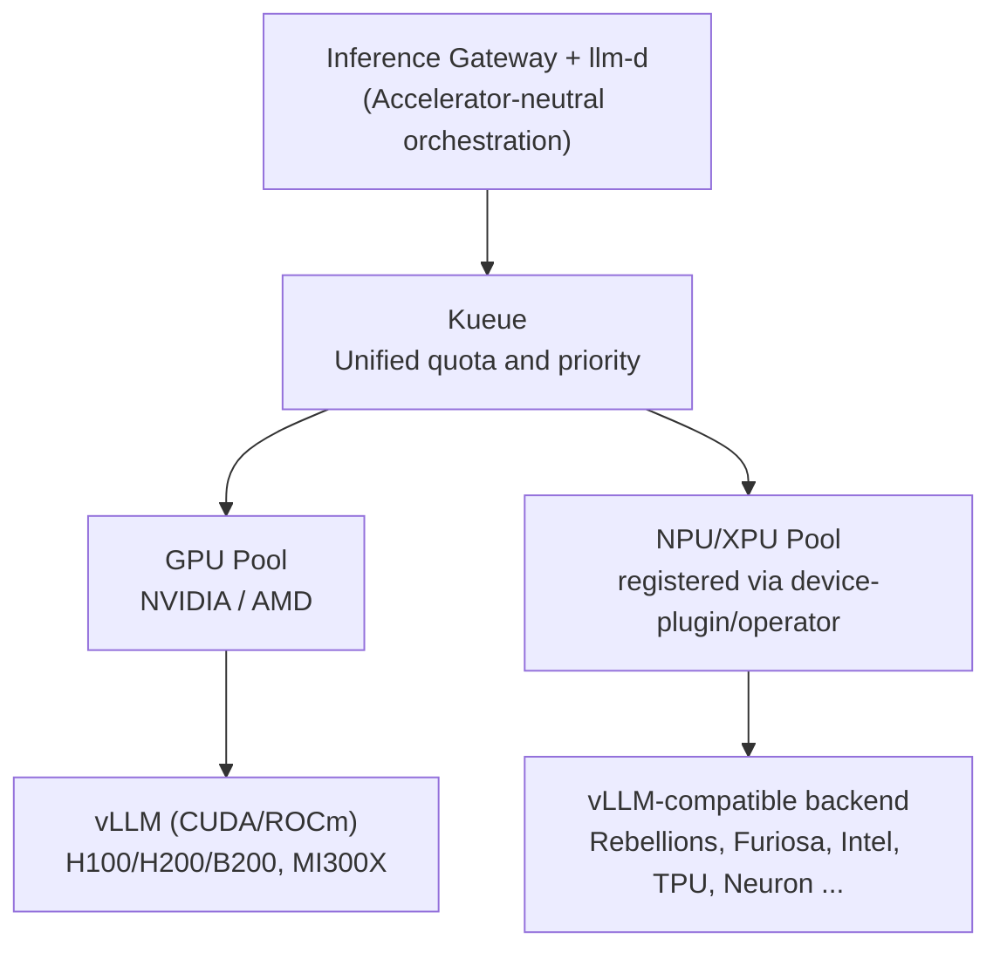

## Buying More GPUs Won't Speed Up Inference

Running LLM inference in production means hitting a wall that feels counterintuitive: adding more GPUs does not proportionally increase throughput. The root cause is that inference splits into two phases with fundamentally opposite characteristics.

The prefill phase, which computes the full prompt in one shot, is compute-bound and keeps GPU utilization above 90%. The decode phase, which generates one token at a time, is memory-bound and can drop utilization below 30%. When a single GPU handles both phases, utilization swings wildly, and requests that share a system prompt or common prefix cannot reuse cached KV state. Horizontal scale-up by replicating GPUs is therefore expensive and inefficient. What you actually need is scheduling that extracts more requests from the same GPUs.

That is the one-sentence pitch for llm-d: an inference scheduler that solves what buying more GPUs cannot. This post shares the operating principles of llm-d as we have worked through them in internal seminars and architecture reports, together with the heterogeneous design we are building on top of it, combining GPUs and domestic NPUs in a single cluster. This is the reference design we intend to validate, not a marketing slide.

## What llm-d Is: Built on Three Proven Foundations

llm-d is a Kubernetes-native, high-performance, distributed LLM inference framework. Crucially, it does not start from scratch; it assembles three components that are already proven.

First is vLLM, the actual inference engine providing PagedAttention, continuous batching, and speculative decoding. Second is Kubernetes, the foundation for deployment, scheduling, autoscaling, and fault recovery. Third is the Inference Gateway (GAIE), a Gateway API extension for state-aware routing.

On top of these, llm-d contributes two core capabilities: KV-cache aware routing and prefill/decode disaggregation. On the governance side, it has earned institutional trust: llm-d was adopted into the CNCF Sandbox in 2026, sponsored by IBM, Red Hat, Google, CoreWeave, and NVIDIA.

## Weapon 1: KV-Cache Aware Routing

The first lever is not sending requests to an arbitrary pod. Instead, requests are routed to the pod that already holds the KV cache for the incoming prompt's prefix in GPU memory, even when those requests come from different users.

The payoff is eliminating redundant prefill computation. The gains are especially large for workloads with overlapping prefixes: multi-turn conversations, RAG pipelines, and shared system prompts. Latency drops and throughput rises.

Two routing modes are available. Approximate mode infers cache locality from traffic patterns: lightweight but imprecise. Precise mode subscribes directly to vLLM's KV-Events to read actual KV block state: accurate. Both modes are backed by the KV-Cache Indexer, a high-performance library that maintains a near-real-time global view of KV block locality across all vLLM pods.

## Weapon 2: Prefill / Decode Disaggregation

The second lever is physically separating the two phases that have opposite characteristics. Prefill and decode are split into distinct pod pools, letting each phase be tuned independently. The utilization swings that come from one GPU alternating between both phases disappear.

The key is how the KV cache is transferred. It moves directly from the prefill engine's VRAM to the decode engine's VRAM via NIXL, and because the transfer is non-blocking the GPU continues processing other requests during transit. This lets us optimize Time to First Token (TTFT) and Inter-Token Latency (ITL) independently, without interference.

An honest caveat: at small scale and low concurrency, KV transfer overhead can actually slow things down by 20 to 30%. Disaggregation only pays off when traffic volume supports it.

## Components and Performance Evidence

The full data path, broken down by component, looks like this.

| Component | Role |
|---|---|
| Inference Gateway (GAIE) + EPP | EPP scores per-pod cache hit rates and routes to the optimal pod |
| KV-Cache Indexer | Maintains a global view of KV block locality across all vLLM pods (approximate / precise) |
| Prefill/Decode Disaggregation | Separate pools for compute-bound prefill and memory-bound decode; KV transferred via NIXL |
| vLLM (backend) | Actual inference engine: PagedAttention, continuous batching |
| K8s Operator / CRD | Declarative deployment and autoscaling; versioned via ArgoCD GitOps |

Published numbers back up the performance claims. On a 16x16 B200 topology, roughly 50,000 output tok/s and an order-of-magnitude reduction in TTFT have been reported. On the AMD side, a 4x MI300X cluster serving Llama-3.1-70B showed 3x output throughput and 2x TTFT improvement after enabling prefix-cache aware routing.

These numbers depend heavily on topology, model, and precision, however. Whether "N tok/s" refers to single-stream or aggregate throughput, and what input length, batch size, and precision were used, can shift the meaning by an order of magnitude. We treat benchmark figures without full labels as untrustworthy.

The relationship to alternatives is also clear. If a model fits on a single-node GPU, standalone vLLM is the simplest answer. llm-d enters the picture when you need to go beyond a single node and require multi-model serving at Kubernetes scale. NVIDIA Dynamo targets datacenter-scale orchestration; SGLang targets MoE-EP and bleeding-edge PD separation performance. llm-d and Dynamo are not mutually exclusive: Dynamo can handle orchestration while vLLM and llm-d act as the engine layer.

## Heterogeneous: Adding Any NPU/XPU on Top of GPUs

This is the core of our architecture report. And the first point to lock in is that this design is not tied to any specific accelerator vendor. The orchestration layer of llm-d and vLLM is independent of accelerator type. You can swap out the accelerator pool while leaving the routing and disaggregation logic untouched.

This is not a hypothesis: vLLM already officially supports a wide range of backends. Beyond NVIDIA and AMD GPUs, it covers Intel CPU/XPU/Gaudi (HPU), Google TPU, AWS Neuron, and via plugins, IBM Spyre, Huawei Ascend, and domestic NPUs including Rebellions and Furiosa, all behind the same vLLM interface. In other words, the NPU/XPU slot in a "GPU pool + NPU/XPU pool" configuration accepts any vLLM-compatible accelerator.

| Accelerator | vLLM Backend | Notes |
|---|---|---|
| NVIDIA GPU | CUDA (native) | Highest ecosystem and kernel maturity |
| AMD GPU | ROCm | MI300X and others; officially supported |
| Intel Gaudi / XPU | HPU / XPU backend | Datacenter accelerators |
| Google TPU / AWS Neuron | Dedicated backends | Cloud accelerators |
| Rebellions NPU | vLLM-RBLN (plugin) | Domestic; optimum-rbln / RSD |
| Furiosa NPU | Furiosa-LLM (vLLM-compatible) | Domestic; RNGD / TCP |

We mention both domestic NPUs together to make one point: there is more than one option. The key is that the vLLM abstraction lets you swap vendors rather than lock in.

Rebellions connects via the vLLM-RBLN plugin. A model is compiled with optimum-rbln and then referenced by vLLM-RBLN, which ports FlashAttention and PagedAttention to the NPU memory hierarchy and ties them into a single execution graph. Scale-out uses RSD (Rebellions Scalable Design), which handles prefill/decode separation and MoE routing. In Kubernetes, NFD detects the NPU by PCI vendor ID, the Rebellions NPU Operator registers it as a device-plugin, and environment variables such as `VLLM_TARGET_DEVICE=rbln` govern selection. The current lineup includes the ATOM-Max dual-server with 8 NPUs and 128GB for 70B-class models, with the production REBEL Quad targeting MoE optimization.

Furiosa connects via Furiosa-LLM, a vLLM-compatible serving framework. The flagship chip RNGD uses a TCP (Tensor Contraction Processor) architecture with 48GB HBM3 at 1.5TB/s bandwidth and 180W TDP, delivering 512 TFLOPS at FP8. The NXT RNGD server packs 8 cards for 384GB HBM3 and 4 petaFLOPS (FP8) within a 3kW TDP envelope, with volume production beginning in January 2026. Its primary differentiator is power efficiency, which places it in a different category from GPUs.

The commonality between the two NPUs is the general principle. As long as each vendor provides a device-plugin/operator and a vLLM backend, the llm-d orchestration layer above needs no changes: you simply add an accelerator pool.

Comparing the two pool types side by side in one cluster shows their complementary roles. Note that the right column represents NPUs and XPUs in general, not any single vendor.

| | GPU Pool | NPU/XPU Pool (e.g., Rebellions, Furiosa, Intel, TPU) |
|---|---|---|
| Serving engine | vLLM (CUDA/ROCm) | vLLM-compatible backend (vLLM-RBLN, Furiosa-LLM, HPU/XPU, etc.) |
| K8s device exposure | NVIDIA/AMD GPU Operator | Vendor NPU Operator + NFD / device-plugin |
| Disagg/MoE | Mature via llm-d | Vendor-specific (e.g., RSD) + llm-d integration to be validated |
| Strengths | Ecosystem and kernel maturity, peak throughput | Power efficiency, sovereign supply chain diversification, claimed MoE advantage |
| Caveats | Power, supply, cost | Maturity of distributed disagg/KV routing; fewer large-model references |

## ThakiCloud Adoption and Deployment Roadmap

The biggest advantage of this architecture for us is that it layers onto our existing stack without new infrastructure. It runs on top of the Kubernetes, Kueue, and ArgoCD we already use. Kueue gang-schedules prefill and decode worker pools with quota management; ArgoCD manages CRDs via GitOps. Observability covers TTFT, ITL, tok/s, and KV hit rate via Prometheus and Grafana, with per-model-tier SLOs tracked via SRE rules.

Adoption proceeds in phases, each gated on quantitative measurements. Phase 0 establishes a GPU-pool llm-d baseline and measures the effect of KV routing and PD disaggregation. Phase 1 tunes prefix-cache routing, establishes multi-model serving, and defines SLOs. Phase 2 adds one node of an NPU candidate (Rebellions, Furiosa, or another) to Kubernetes and benchmarks the same model under identical conditions. Accelerator selection will be evaluated on power efficiency, supply chain, and model fit, with no prior commitment to a specific vendor. Phase 3 establishes heterogeneous routing policy and re-evaluates MoE workloads as each vendor reaches volume production. Before each phase, we lock in measurement definitions: single-stream vs. aggregate throughput, input length, batch size, and precision.

## Risks and the Opposing Conclusion

A good design document must attack its own arguments. Here are the weaknesses of this architecture, stated plainly.

The maturity of the NPU/XPU path is the biggest unknown. Single-node serving is becoming solid for any vendor, but whether llm-d's distributed disaggregation and precise KV routing work end-to-end on NPU/XPU hardware is still to be validated. Some vendors provide their own disaggregation (Rebellions RSD, for example), so a "vendor-native stack standalone" configuration may be more realistic than "NPU on top of llm-d." Large-model references are also sparse compared to GPUs. A single server's memory fits 70B-class models, but 744B-class MoE requires multiple nodes and public references are thin. These limits reflect the current state of the NPU/XPU ecosystem as a whole, not any single vendor; that our PoC will become a reference is both an opportunity and a risk.

The opposing conclusion: if the goal is purely maximum throughput in the shortest time, adding NPU/XPU only increases complexity. In that case, GPUs and llm-d are sufficient. The value of alternative accelerators materializes only when separate strategic objectives exist: power efficiency, supply chain diversification, and sovereignty. By the same token, if the model fits on a single node and traffic is low, llm-d itself is overengineering and standalone vLLM is the right answer.

## The ThakiCloud Perspective: Inference That Is Not Locked to an Accelerator

The reason we are focused on this architecture is simple. The single property that makes llm-d's orchestration accelerator-independent is what makes it architecturally possible to run GPU pools and diverse NPU/XPU pools in the same cluster without vendor lock-in, creating a sovereign AI inference setup by design.

This matters strategically for us as an on-premises AI platform provider. Customers must be able to choose accelerators freely based on power budget, supply chain, and domestication requirements, and that choice must not translate into the cost of re-engineering the entire inference stack. Locking into one specific NPU simply swaps GPU lock-in for a different lock-in. The vLLM abstraction and llm-d's accelerator independence eliminate both that cost and that lock-in together. A heterogeneous policy that sends large or latency-critical workloads to GPUs and medium or power-sensitive workloads to NPUs/XPUs can be implemented on the same routing logic regardless of which vendor combination is chosen.

All of this is a reference design and pre-PoC validation, of course. That is why we are locking in measurement definitions first and taking the staged path: GPU baseline, quantitative gates, then NPU expansion.

## Closing

The lesson from llm-d is that inference efficiency is a scheduling problem, not a hardware purchasing problem. Eliminating redundant computation with KV-cache aware routing and stabilizing utilization by separating prefill from decode let you handle more requests from the same GPUs. And because that orchestration is accelerator-independent, the path opens to extending it with any NPU/XPU on top of GPUs (Rebellions, Furiosa, and any vLLM-compatible accelerator) to build sovereign inference that is not locked to any vendor.

ThakiCloud is validating this heterogeneous inference architecture on top of Kubernetes, Kueue, and ArgoCD. Learn more on our homepage.

## Sources

- Red Hat Developer, Master KV cache aware routing with llm-d: [https://developers.redhat.com/articles/2025/10/07/master-kv-cache-aware-routing-llm-d-efficient-ai-inference](https://developers.redhat.com/articles/2025/10/07/master-kv-cache-aware-routing-llm-d-efficient-ai-inference)
- llm-d official site: [https://llm-d.ai/](https://llm-d.ai/)
- llm-d + KServe + vLLM in production: [https://llm-d.ai/blog/production-grade-llm-inference-at-scale-kserve-llm-d-vllm](https://llm-d.ai/blog/production-grade-llm-inference-at-scale-kserve-llm-d-vllm)
- llm-d GitHub: [https://github.com/llm-d/llm-d](https://github.com/llm-d/llm-d)
- Rebellions, LLM Serving with NPU: [https://rebellions.ai/llm-serving-with-npu/](https://rebellions.ai/llm-serving-with-npu/)
- Red Hat Developer, Running AI inference on Rebellions ATOM NPU: [https://developers.redhat.com/articles/2026/05/27/running-ai-inference-rebellions-atom-npu-red-hat-ai](https://developers.redhat.com/articles/2026/05/27/running-ai-inference-rebellions-atom-npu-red-hat-ai)
- vLLM-RBLN plugin: [https://github.com/rebellions-sw/vllm-rbln](https://github.com/rebellions-sw/vllm-rbln)
- FuriosaAI RNGD specifications and NXT RNGD server: [https://furiosa.ai/rngd](https://furiosa.ai/rngd)
- FuriosaAI Developer Center (Furiosa-LLM, vLLM-compatible): [https://developer.furiosa.ai/](https://developer.furiosa.ai/)
- vLLM supported hardware (backend matrix): [https://docs.vllm.ai/](https://docs.vllm.ai/)
- PyTorch Foundation, vLLM multiple backends: [https://pytorch.org/blog/pytorch-foundation-welcomes-vllm/](https://pytorch.org/blog/pytorch-foundation-welcomes-vllm/)

Note: The architecture diagrams are reference designs based on public sources and do not constitute a recommendation of any specific accelerator vendor. Rebellions and Furiosa are two examples of vLLM-compatible NPUs; the same principles apply to other NPUs/XPUs supported by vLLM (Intel Gaudi/XPU, Google TPU, AWS Neuron, IBM Spyre, Huawei Ascend, etc.). Some chip specifications were absent from public datasheets and have been left blank. NPU/XPU integration on top of llm-d is a design hypothesis contingent on each vendor's vLLM backend and has not yet been PoC-validated. Performance figures are environment-dependent; always distinguish single-stream from aggregate throughput when interpreting them.
