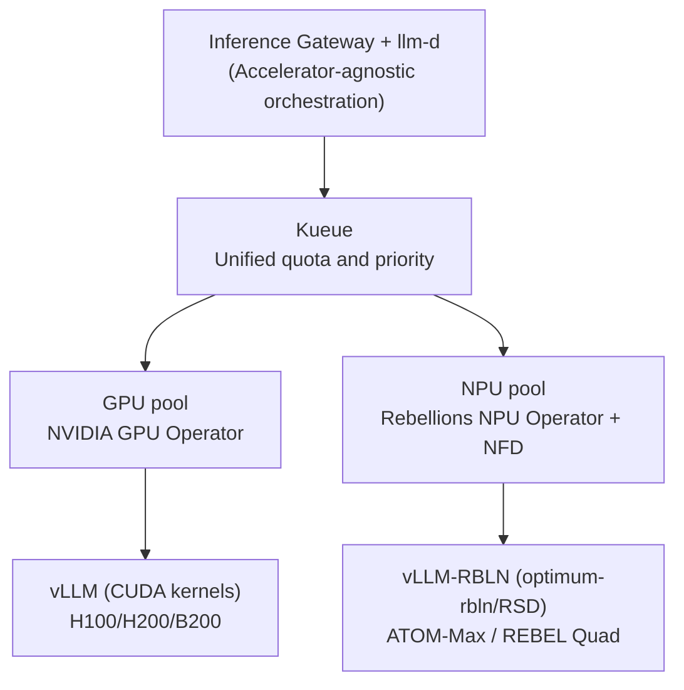

## Buying More GPUs Does Not Speed Up Inference

Anyone who has operated LLM inference at scale eventually hits a counterintuitive wall: adding more GPUs does not increase throughput proportionally. The root cause is that inference consists of two phases with opposing characteristics.

The prefill phase, which processes the entire prompt in one pass, is compute-bound and keeps GPU utilization above 90%. The decode phase, which generates one token at a time, is memory-bound and lets utilization drop below 30%. When a single GPU handles both phases, utilization swings wildly, and requests that share a common system prompt or common prefix cannot share KV cache entries. Horizontal scale-up by replicating GPUs is therefore expensive and inefficient. What we actually need is better scheduling that squeezes more requests through the same GPUs.

That is the one-line thesis of llm-d: an inference scheduler that solves the problem that buying more GPUs cannot. This post shares the operating principles of llm-d that we have compiled through internal seminars and architecture reports, together with our heterogeneous architecture design that adds domestic NPUs alongside GPUs. This is not a marketing slide deck; it is our reference design, exactly as we intend to validate it.

## What llm-d Is: Built on Three Proven Foundations

llm-d is a Kubernetes-native high-performance distributed LLM inference framework. The key point is that it does not build from scratch; it assembles three already-proven pieces.

First is vLLM, the actual inference engine that provides PagedAttention, continuous batching, and speculative decoding. Second is Kubernetes, the foundation for deployment, scheduling, autoscaling, and fault recovery. Third is Inference Gateway (GAIE), a Gateway API extension that enables stateful routing.

On top of these, llm-d adds two core capabilities: KV-cache aware routing and prefill/decode disaggregation. From a governance standpoint, llm-d has also earned institutional trust. It was accepted into the CNCF Sandbox in 2026 and is sponsored by IBM, Red Hat, Google, CoreWeave, and NVIDIA.

## Weapon 1: KV-Cache Aware Routing

The first capability is not sending requests to arbitrary pods. Instead, incoming requests are routed to the pod that already holds the KV cache for that prompt's prefix in GPU memory. This applies across different users as well.

The effect is eliminating redundant prefill computation. The benefit is especially large for workloads with overlapping prefixes: multi-turn conversations, RAG pipelines, and shared system prompts. Latency drops and throughput rises.

Two modes are available. Approximate mode estimates cache locality from traffic patterns. It is lightweight but imprecise. Precise mode subscribes directly to vLLM's KV-Events to read actual KV block state. It is accurate. Both modes are backed by the KV-Cache Indexer, a high-performance library that maintains a near-real-time global view of KV block locality across all vLLM pods.

## Weapon 2: Prefill / Decode Disaggregation

The second capability is physically separating the two phases that have opposite characteristics. Prefill and decode are split into separate pod pools and tuned independently. The utilization swings caused by a single GPU alternating between both phases disappear.

The critical mechanism is KV cache transfer. KV blocks are sent directly from the prefill engine's VRAM to the decode engine's VRAM via NIXL, and this transfer is non-blocking, so the GPU continues handling other requests while the transfer is in flight. This lets us optimize time-to-first-token (TTFT) and inter-token latency (ITL) independently without interference.

A candid caveat applies here. In small-scale, low-concurrency environments, KV transfer overhead can actually make things 20~30% slower. Disaggregation only pays off when the scale justifies it.

## Components and Performance Evidence

The full data path broken down by component is as follows.

| Component | Role |
|---|---|
| Inference Gateway (GAIE) + EPP | EPP scores cache hit rates per pod and routes to the optimal pod |
| KV-Cache Indexer | Maintains a global view of KV block locality across all vLLM pods (approximate / precise) |
| Prefill/Decode disaggregation | Separate pools for compute-bound prefill and memory-bound decode; KV transferred via NIXL directly |
| vLLM (backend) | Actual inference engine: PagedAttention, continuous batching |
| K8s Operator / CRD | Declarative deployment and autoscaling; version-controlled via ArgoCD GitOps |

Performance evidence is available from published numbers. On a 16×16 B200 topology, approximately 50,000 output tok/s and an order-of-magnitude reduction in TTFT have been reported. On the AMD side, serving Llama-3.1-70B on 4×MI300X with prefix-cache aware routing applied showed 3x throughput improvement and 2x TTFT improvement.

These numbers, however, depend strongly on topology, model, and precision. The same "N tok/s" figure can mean ten times different things depending on whether it is single-request or aggregate throughput, and what the input length, batch size, and precision are. We treat benchmark numbers without clear labels as untrustworthy.

The relationship to alternatives is also worth stating clearly. If a model fits on a single-node GPU, vLLM alone is the simplest correct answer. When we cross the single-node boundary and need multi-model serving at Kubernetes scale, llm-d enters the picture. NVIDIA Dynamo targets data-center-scale orchestration, and SGLang targets MoE-EP and the latest PD disaggregation performance. llm-d and Dynamo are not mutually exclusive: Dynamo can serve as the orchestration layer while vLLM and llm-d handle the engine layer.

## Heterogeneous: Adding Domestic NPUs on Top of GPUs

This is the core of our architecture report. The orchestration layer of llm-d and vLLM is independent of accelerator type. We can keep the routing and disaggregation logic in place and simply swap the accelerator pool from GPU to NPU.

Rebellions, a domestic AI semiconductor company, connects its NPUs directly into the vLLM ecosystem via the vLLM-RBLN plugin. Models are compiled with optimum-rbln and referenced by vLLM-RBLN, which ports FlashAttention, PagedAttention, and Sliding Window Attention to the NPU memory hierarchy and binds them into a single execution graph. For scale-out, RSD (Rebellions Scalable Design) handles prefill/decode disaggregation, multi-node operation, and MoE routing. This means RSD natively provides some of what llm-d does, at the NPU level.

| Chip | Configuration | Memory | Use case |
|---|---|---|---|
| ATOM+ (RBLN-CA22) | Single NPU | 16GB on-chip | Inference, vLLM-RBLN supported |
| ATOM-Max (RBLN-CA25) | Dual-server 8 NPU | 128GB total | Capable of running 70B-class models |
| REBEL / Rebel100 | 4 chiplets + HBM3E | HBM3E large capacity | PetaFLOPS-class, MoE-optimized |
| REBEL Quad | 4 REBEL combined | HBM3E | Mass production scheduled H1 2026 |

Kubernetes integration is symmetric with GPU integration. Following the Red Hat AI reference, on OpenShift, NFD detects ATOM via PCI vendor ID 1eff, and the Rebellions NPU Operator manages the driver, device-plugin, and monitoring to register NPUs as allocatable resources. vLLM configuration is controlled via the environment variables `VLLM_TARGET_DEVICE=rbln`, `VLLM_USE_V1=1`, and `RBLN_KERNEL_MODE=triton`, with power, temperature, and memory metrics exposed via Prometheus.

Comparing the two pools in a single cluster reveals their distinct roles.

| Dimension | GPU pool | Rebellions NPU pool |
|---|---|---|
| Representative hardware | H100/H200/B200 + NVLink | ATOM-Max (8 NPU, 128GB) / REBEL Quad |
| Serving engine | vLLM (CUDA kernels) | vLLM-RBLN (optimum-rbln/RSD) |
| Disaggregation / MoE | Mature via llm-d | RSD provides natively; llm-d integration is pending validation |
| Strengths | Ecosystem and kernel maturity, peak throughput | Power efficiency, sovereign (domestic), claimed MoE optimization |
| Caveats | Power, supply, cost | Distributed disaggregation/KV routing, fewer large-model references |

## ThakiCloud Adoption and Deployment Roadmap

The biggest advantage of this architecture for us is that it fits directly on our existing stack without new infrastructure. It runs on the Kubernetes, Kueue, and ArgoCD we already use. Kueue gang-schedules prefill and decode worker pools with quota management, and ArgoCD manages CRDs via GitOps. Observability covers TTFT, ITL, tok/s, and KV hit rate via Prometheus and Grafana, with per-model-tier SLOs enforced as SRE rules.

Adoption proceeds in phases, each gated by quantitative criteria. In Phase 0, we establish an llm-d baseline on the GPU pool and measure the effect of KV routing and PD disaggregation. In Phase 1, we tune prefix-cache routing, set up multi-model serving, and establish SLOs. In Phase 2, we bring one Rebellions ATOM-Max node into the Kubernetes cluster and benchmark the same model on NPU. In Phase 3, we define heterogeneous routing policies and re-evaluate MoE workloads in line with the REBEL Quad production schedule. Before each phase, we fix measurement definitions first: single versus aggregate throughput, input length, batch size, and precision.

## Risks and the Opposing Conclusion

A good design document must attack its own claims. We state the weaknesses of this architecture honestly.

NPU path maturity is the largest unknown. vLLM-RBLN is solid for single-node serving, but whether llm-d's distributed disaggregation and precise KV routing work on NPU has not yet been validated. Because RSD provides its own disaggregation, an "RSD standalone" configuration without llm-d may be more realistic than "NPU under llm-d." Large-model references are also sparse compared with GPU. ATOM-Max at 128GB can run 70B models, but 744B-class MoE requires multiple nodes and large-scale RSD, and public references are scarce. Our PoC will soon be the reference, which is simultaneously an opportunity and a risk.

And the opposing conclusion: if the sole goal is maximum throughput in the shortest time, adding NPUs only adds complexity. In that case, GPU with llm-d is sufficient. The value of NPUs only materializes when there are separate strategic goals around power efficiency, domestic sourcing, and supply-chain diversification. Likewise, if a model fits on a single node and traffic is light, llm-d itself is over-engineering, and standalone vLLM is the right answer.

## The ThakiCloud Perspective: Inference Not Locked to an Accelerator

The reason we focus on this architecture is simple. The single property that llm-d's orchestration is accelerator-agnostic makes it architecturally possible to run a GPU pool and a domestic NPU pool together in a single cluster for sovereign AI inference.

This is strategically important for us as a provider of on-premises AI platforms. Customers need to be able to choose their accelerators based on power budget, supply chain constraints, and domestic sourcing requirements, and that choice should not force them to rebuild the entire inference stack. The vLLM abstraction and llm-d's accelerator independence eliminate that cost. A heterogeneous policy, routing large, latency-sensitive workloads to GPU and medium, power-efficient workloads to NPU, can be implemented on top of the same routing logic.

Of course, all of this is a reference design and has not yet been validated through a PoC. That is exactly why we fix measurement definitions first and follow a phased path, starting from a GPU baseline that clears quantitative gates before extending to NPU.

## Closing

The lesson from llm-d is that inference efficiency is a scheduling problem, not a hardware purchasing problem. By eliminating redundant computation through KV-cache aware routing and stabilizing utilization through prefill/decode disaggregation, we can serve more requests through the same GPUs. And because that orchestration is accelerator-agnostic, the path opens up to extend to sovereign inference by adding domestic NPUs on top of GPU.

ThakiCloud is validating this heterogeneous inference architecture on Kubernetes, Kueue, and ArgoCD. More details are available on our website.

## Sources

- Red Hat Developer, Master KV cache aware routing with llm-d: [https://developers.redhat.com/articles/2025/10/07/master-kv-cache-aware-routing-llm-d-efficient-ai-inference](https://developers.redhat.com/articles/2025/10/07/master-kv-cache-aware-routing-llm-d-efficient-ai-inference)
- llm-d official site: [https://llm-d.ai/](https://llm-d.ai/)
- llm-d + KServe + vLLM production: [https://llm-d.ai/blog/production-grade-llm-inference-at-scale-kserve-llm-d-vllm](https://llm-d.ai/blog/production-grade-llm-inference-at-scale-kserve-llm-d-vllm)
- llm-d GitHub: [https://github.com/llm-d/llm-d](https://github.com/llm-d/llm-d)
- Rebellions, LLM Serving with NPU: [https://rebellions.ai/llm-serving-with-npu/](https://rebellions.ai/llm-serving-with-npu/)
- Red Hat Developer, Running AI inference on Rebellions ATOM NPU: [https://developers.redhat.com/articles/2026/05/27/running-ai-inference-rebellions-atom-npu-red-hat-ai](https://developers.redhat.com/articles/2026/05/27/running-ai-inference-rebellions-atom-npu-red-hat-ai)
- vLLM-RBLN plugin: [https://github.com/rebellions-sw/vllm-rbln](https://github.com/rebellions-sw/vllm-rbln)

Note: The architecture diagrams are reference designs based on public materials. Some chip specifications are omitted because they are not published in public whitepapers. The integration of Rebellions NPUs under llm-d is a design hypothesis predicated on vLLM-RBLN and has not yet been validated through a PoC. Performance figures are environment-dependent; single-request and aggregate throughput must be interpreted separately.
