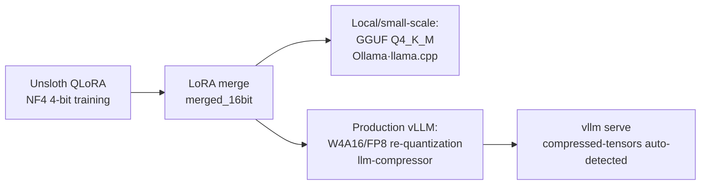

## Why Quantization Again

The bulk of serving cost comes from GPU memory and throughput. Compressing a model to 4 bits lets you load a larger model onto the same card and serve the same model to more concurrent users. The question is: which quantization format actually works well with vLLM in production?

The [NVFP4 quantization](https://github.com/ThakiCloud/praxis) we covered earlier is the cutting-edge path for running W4A4 on Blackwell (B200) tensor cores. But NVFP4 tensor cores exist only on Blackwell. For older generations like H100 and A100, or for mixed clusters, you need different techniques. This post sets NVFP4 aside and catalogues the methods you can use right now with the hardware you have -- including Unsloth Dynamic 2.0 -- complete with real recipes.

## The vLLM Quantization Landscape

| Method | Bit-width | vLLM Load | GPU | Notes |
|---|---|---|---|---|
| AWQ + Marlin | W4A16 | `--quantization awq` (Marlin auto) | Turing+ | Production 4-bit standard |
| GPTQ / GPTQModel | W4A16, W3 | `--quantization gptq` | Volta+ | Broadest compatibility |
| compressed-tensors | W4A16 / W8A8 / FP8 | Auto-detected (no flag needed) | Turing+ ~ Blackwell | Official llm-compressor format |
| FP8 (E4M3) | W8A8 FP8 | `--quantization fp8` or auto | Ada (cc>=8.9), Hopper, Blackwell | Top choice for MoE |
| INT8 W8A8 | W8A8 INT8 | compressed-tensors auto | Turing+ | SmoothQuant family |
| AutoRound | W4A16, INT2-4 | compressed-tensors auto | CUDA, CPU, Intel | Excellent accuracy at very low bit-widths |
| bitsandbytes NF4 | W4A16 | `--quantization bitsandbytes` | Volta-Hopper | Memory-focused, low throughput |
| GGUF | Q4-Q8 | `repo:quant` (plugin) | Experimental | For llama.cpp ecosystem |

Two points stand out. First, vLLM's production 4-bit standard is W4A16 via AWQ or GPTQ running on the **Marlin kernel**. In JarvisLabs benchmarks on Qwen2.5-32B, Marlin-AWQ reached 741 tok/s versus 68 tok/s for the baseline AWQ kernel -- a dramatic difference ([source](https://jarvislabs.ai/blog/vllm-quantization-complete-guide-benchmarks)). Second, the **compressed-tensors** format -- developed jointly by neuralmagic (Red Hat) and the vLLM project -- stores quantization metadata in `quantization_config`, which vLLM reads and loads automatically without any extra flags.

## compressed-tensors and llm-compressor: The Recommended Path

Quantizing with `llm-compressor` produces output in compressed-tensors format, which vLLM detects automatically. W4A16, W8A8-INT8, and FP8 are all handled by a single tool ([llm-compressor](https://github.com/vllm-project/llm-compressor)).

```python
# W4A16 (AWQ-style) llm-compressor recipe
from llmcompressor.transformers import oneshot
from llmcompressor.modifiers.quantization import GPTQModifier

recipe = GPTQModifier(scheme="W4A16", targets="Linear", ignore=["lm_head"])
oneshot(
    model="Qwen/Qwen3-30B-A3B",
    dataset="open_platypus",   # calibration set
    recipe=recipe,
    output_dir="Qwen3-30B-A3B-W4A16",
    max_seq_length=2048, num_calibration_samples=512,
)
```

Serving requires almost no extra flags.

```bash
# compressed-tensors is auto-detected; --quantization can be omitted
vllm serve ./Qwen3-30B-A3B-W4A16 --served-model-name qwen3-w4a16
# Serving an AWQ checkpoint directly
vllm serve TheBloke/...-AWQ --quantization awq
```

FP8 can be created dynamically without calibration data, making it the lowest-friction option.

```python
from llmcompressor.modifiers.quantization import QuantizationModifier
recipe = QuantizationModifier(targets="Linear", scheme="FP8_DYNAMIC", ignore=["lm_head"])
```

## MoE Models (Qwen3-MoE): FP8 Block-Wise First

Our primary serving targets are Qwen3-MoE family models. MoE architectures are tricky to quantize. The short answer: on GPUs with cc>=8.9 (Ada, Hopper, Blackwell), **FP8 block-wise** is the top choice. It needs no calibration data and has official vLLM support. If memory is tighter, fall back to W4A16. Note that FP8 per-tensor has a reported dimension-mismatch bug on Qwen3-MoE, so block-wise is the safer route ([issue](https://github.com/vllm-project/llm-compressor/issues/2043)).

## Unsloth: Fine-Tuning and Dynamic 2.0 Quantization

Unsloth is useful in two ways: QLoRA fine-tuning and Dynamic 2.0 quantization.

**Dynamic 2.0 (UD)** does not apply a uniform bit-width across all layers. Instead, it evaluates per-layer sensitivity and assigns higher precision to critical layers while compressing less important ones further. The result is a model-specific quantization map. In benchmarks published by Unsloth, Gemma 3 27B with Dynamic Q4_K_XL scored 71.47% on MMLU 5-shot -- higher than the Google QAT baseline of 70.64% -- while the file size was only 15.64GB (Unsloth-reported, [blog](https://unsloth.ai/blog/dynamic-v2)). Unlike the original Dynamic release which worked mainly for MoE, version 2.0 extends to dense models as well.

`unsloth/...-bnb-4bit` checkpoints are pre-quantized to NF4 4-bit and serve mainly as starting points for QLoRA fine-tuning. After training, a single call to `save_pretrained_gguf()` produces a GGUF file for llama.cpp.

### The Realistic Path from Unsloth to vLLM Serving

Honesty matters here. Of the formats Unsloth produces, relatively few are immediately suitable for vLLM production serving. bitsandbytes NF4 can be loaded in vLLM but delivers low throughput (shape errors have been reported on some models). Dynamic UD-GGUF is a llama.cpp-only format not covered in vLLM's official documentation, and vLLM's GGUF support itself is explicitly marked "highly experimental" ([vLLM GGUF](https://docs.vllm.ai/en/latest/features/quantization/gguf/)).

The practical production path is therefore: **fine-tune with Unsloth, re-quantize for serving**.



```python
# Unsloth: merge LoRA to 16-bit after QLoRA training
model.save_pretrained_merged("merged_model", tokenizer, save_method="merged_16bit")
# Then re-quantize with the llm-compressor W4A16/FP8 recipe above and serve with vLLM
```

For local or experimental serving, using Unsloth's Dynamic GGUF with Ollama or llama.cpp is perfectly reasonable -- the accuracy and convenience are both solid. For multi-user production serving, merging first and re-quantizing to W4A16 or FP8 gives you better throughput with vLLM.

## Cost and Observability

Quantization reduces cost but it is not free. Three things must be tracked together: memory savings (fitting a larger model or longer context on the same card), throughput (whether the Marlin kernel is active determines tokens per second), and accuracy (per-task regression must be measured). After deployment, monitor token throughput, TTFT, and per-card memory usage via vLLM metrics, and run your core evaluation sets before and after quantization to catch regression.

## ThakiCloud's Perspective: Why This Summary Was Needed

ThakiCloud's AI platform runs on Kubernetes, schedules GPU workloads with Kueue, and serves models with vLLM. Our agent platform Paxis calls a self-hosted vLLM backend (codename Metis) through an OpenAI-compatible API. Quantization choices directly affect our per-token serving cost.

The operational reality is a heterogeneous hardware fleet. NVFP4 is optimal on Blackwell (B200), but that path is closed on Hopper and Ampere nodes. So we route quantization by hardware tier: Blackwell gets NVFP4 or FP8 block-wise; Hopper gets FP8 and W4A16; Ampere gets AWQ/GPTQ W4A16. Unifying everything under compressed-tensors means vLLM auto-detects the format, so serving code barely changes across tiers. Domain fine-tuning is done cheaply with Unsloth, then merged and re-quantized to W4A16 or FP8 for production serving -- that is our standard path.

The advantage is clear. In on-premises and self-hosting environments, data never leaves the cluster, and we can extract the lowest possible serving cost for whatever GPU generation a customer happens to own. Quantization is not just compression -- it is the central lever for the cost efficiency we offer.

## Summary

- The vLLM production 4-bit standard is W4A16 (AWQ/GPTQ) running on the Marlin kernel.
- For a single unified toolchain, llm-compressor + compressed-tensors is the smoothest option (auto-detected).
- For MoE models, FP8 block-wise is the first choice; fall back to W4A16 if memory is constrained.
- Unsloth excels at fine-tuning and high-accuracy Dynamic quantization, but the realistic path to vLLM production serving is to merge first and re-quantize to W4A16 or FP8.

## Further Reading

- vLLM quantization docs: [docs.vllm.ai](https://docs.vllm.ai/en/latest/features/quantization/)
- llm-compressor: [github.com/vllm-project/llm-compressor](https://github.com/vllm-project/llm-compressor)
- Unsloth Dynamic 2.0: [unsloth.ai/blog/dynamic-v2](https://unsloth.ai/blog/dynamic-v2)
- ThakiCloud Paxis: [github.com/ThakiCloud/praxis](https://github.com/ThakiCloud/praxis)
