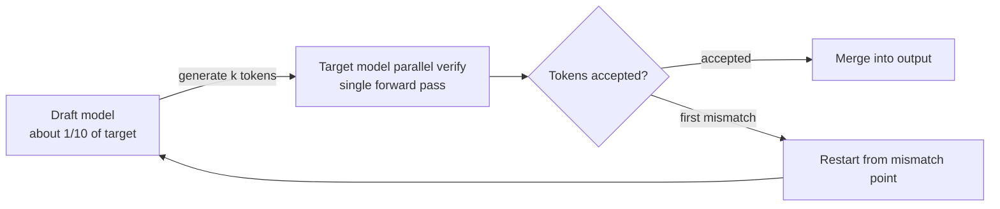

⏱️ **Estimated reading time**: 9 min


*An abstract depiction of speculative decoding, where a draft model generates tokens ahead of time and the target model verifies them in parallel.*

Speculative decoding reduces latency by having a draft model generate tokens quickly while the target model verifies them in parallel. The idea has existed since 2022, but several barriers slowed production adoption: draft model management overhead, gains that disappeared at large batch sizes, and inadequate framework support. EAGLE 3.1 merging into the vLLM main branch in May 2026 changed that picture.

## Why Speculative Decoding Is Getting Renewed Attention

Standard autoregressive decoding generates tokens one at a time. GPU memory bandwidth is the bottleneck, so GPU utilization drops as batch size shrinks. Speculative decoding targets exactly that gap.

A draft model (typically 1/10 the size of the target) generates k tokens first. The target model then verifies them in a single forward pass. Only tokens that pass verification enter the output; the first mismatch triggers a restart from that point. Mathematically, the output distribution remains identical to the target model alone. Speed improves without any quality degradation.



EAGLE (Extrapolation Algorithm for Greater Language-model Efficiency) dramatically improves draft quality. Instead of a simple small language model, it uses an autoregressive draft head that leverages the target model's feature layer to predict the next token.

## EAGLE 3.1: Official vLLM Integration, May 2026

According to the vLLM team's blog post dated May 26, 2026, EAGLE 3.1 includes additional improvements over EAGLE-3. The key numbers: at concurrency 1, output throughput is 2.03x higher than baseline. At concurrency 4, the gain is 1.71x; at 16, it is 1.66x. Gains holding up as batch size grows is the main difference from earlier generations.

AWS-contributed P-EAGLE was also included in vLLM main at this time. On coding task benchmarks it shows 20-30% additional improvement over EAGLE-3 alone.

## Configuration: Enabling EAGLE 3.1 in vLLM

Enable it on vLLM v0.22.0 or later (or any nightly build from May 2026 onward):

```bash
vllm serve meta-llama/Llama-3.1-70B-Instruct \
  --speculative-model lmsys/eagle3-llama3.1-instruct-70b \
  --num-speculative-tokens 5 \
  --speculative-disable-by-batch-size 8 \
  --gpu-memory-utilization 0.92
```

`--speculative-disable-by-batch-size 8` automatically disables speculative decoding when concurrent requests exceed 8. Above that batch size, draft overhead outweighs the gain, so this parameter is mandatory.

The EAGLE draft head shares the same GPU as the target model; no separate server is needed. Memory overhead depends on draft head size and is roughly 2-4 GB for a 70B target.

## Deployment Strategy for K8s Multi-Tenant Environments

In environments like ThakiCloud that use Kueue to manage GPU workloads, several factors need attention.

**Workload separation**: Speculative decoding is most effective for single-user interactions (low batch). Workloads with many concurrent requests, such as RAG pipelines or batch inference, benefit more from standard decoding. Use Kueue LocalQueues to separate an interactive serving queue from a batch inference queue, and enable EAGLE only on vLLM instances deployed to the interactive queue.

**ArgoCD deployment management**: EAGLE draft heads are coupled to the target model version. Upgrading Llama-3.1-70B requires updating eagle3-llama3.1-70b at the same time. Specify both model versions in Helm values and use an ArgoCD ApplicationSet to deploy the target-draft pair atomically, preventing version mismatches.

```yaml
# values.yaml example
serving:
  targetModel: "meta-llama/Llama-3.1-70B-Instruct"
  targetModelVersion: "v3.1"
  speculativeModel: "lmsys/eagle3-llama3.1-instruct-70b"
  speculativeModelVersion: "v3.1"
  numSpeculativeTokens: 5
  disableBatchSize: 8
```

**MIG compatibility**: When using MIG partitioning on A100 or H100, EAGLE runs within a single MIG instance. The draft head and target model share the same GPU memory, so MIG slice size planning must account for the additional memory.

## Key Metrics to Monitor

vLLM exposes Prometheus metrics at `/metrics`. The most important indicators for EAGLE operation are:

```
# speculative decoding acceptance rate (higher means better draft quality)
vllm:spec_decode_accepted_tokens_total
vllm:spec_decode_draft_tokens_total

# KV cache utilization (draft tokens can increase cache pressure)
vllm:gpu_cache_usage_perc

# throughput per batch
vllm:generation_tokens_total
```

If acceptance rate drops below 60%, suspect a draft model mismatch or a shift in input distribution. Above 70% indicates speculative decoding is operating effectively.

## When to Use It and When to Skip It

The scenarios where speculative decoding helps are clear. Low-batch (1-4 concurrent requests) interactive chat, tasks with predictable output distributions like coding assistants, and situations where GPU memory has room for the draft head.

Conversely, standard decoding is better for large-batch inference, multimodal pipelines with highly varied input distributions, and workloads where the goal is maximum throughput rather than minimizing TTFT (Time to First Token).

EAGLE 3.1's integration into vLLM has significantly reduced draft model management burden. If your use case involves interactive serving where lower latency matters, this is the right time to evaluate adoption.

## Sources

- vLLM Blog, "EAGLE 3.1: Advancing Speculative Decoding Through Collaboration Between the EAGLE Team, vLLM, and TorchSpec" (2026-05-26): <https://vllm.ai/blog/2026-05-26-eagle-3-1>
- Li et al., "EAGLE-3: Scaling up Inference Acceleration of Large Language Models via Training-Time Test" (arXiv:2503.01840): <https://arxiv.org/abs/2503.01840>
- AWS Machine Learning Blog, "P-EAGLE: Faster LLM inference with Parallel Speculative Decoding in vLLM": <https://aws.amazon.com/blogs/machine-learning/p-eagle-faster-llm-inference-with-parallel-speculative-decoding-in-vllm/>
- Red Hat Developer, "Fly Eagle(3) fly: Faster inference with vLLM & speculative decoding" (2025-07-01): <https://developers.redhat.com/articles/2025/07/01/fly-eagle3-fly-faster-inference-vllm-speculative-decoding>
