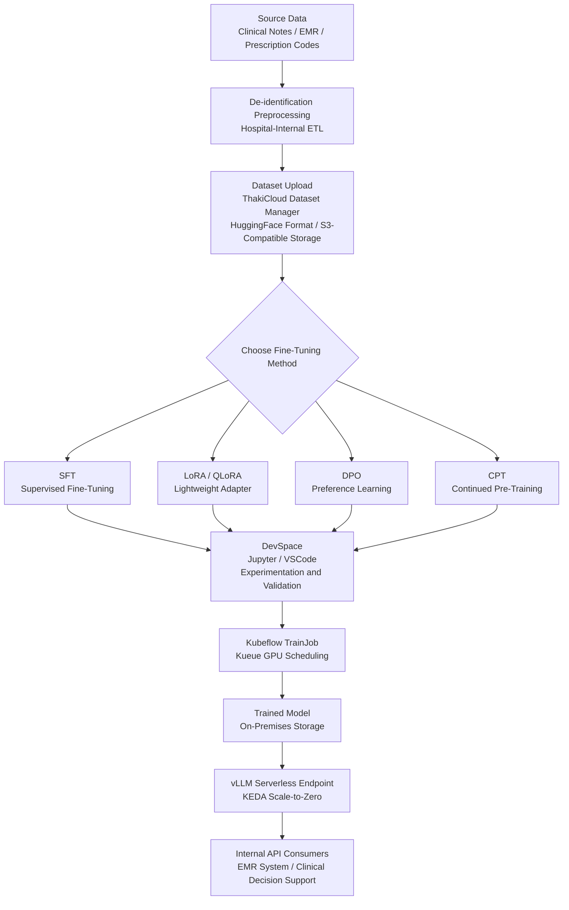

## Overview

LLM adoption in the healthcare and biomedical sector is accelerating rapidly. As use cases expand -- clinical note summarization, diagnostic assistance, pharmaceutical literature analysis, and prescription code automation -- hospitals, pharmaceutical companies, and research institutions are beginning to evaluate domain-specific model development.

Yet the biggest barrier to healthcare AI is not technology. It is data governance. Domestic medical law, personal information protection regulations, bioethics legislation, and National Intelligence Service (NIS) security requirements effectively prohibit or severely restrict the transmission of patient information to external servers. In this environment, the approach of "uploading data to a cloud API for fine-tuning" is neither legally nor practically viable.

This article uses hypothetical cases of a large general hospital and a pharmaceutical research institute to explain the full workflow for fine-tuning and serving a domain LLM inside an on-premises Kubernetes cluster without exporting data. The workflow is built on ThakiCloud AI Platform, and each stage describes which components are actually at work.

---

## Why Healthcare Data Cannot Go to the Cloud

### The Regulatory Environment

Domestic healthcare data is bound by multiple layers of regulation.

**Article 21 of the Medical Service Act** prohibits the external provision of medical records without patient consent. The **Personal Information Protection Act** imposes explicit consent requirements and security obligations for third-party transfers of sensitive information (diagnoses, prescription histories, genetic data, and so on). The **Act on Bioethics and Safety** treats the overseas transfer of human-derived materials and genetic information as a separately approved matter. Public healthcare institutions and defense-related research institutes must also pass NIS security suitability reviews, and they frequently operate in air-gapped environments where external API connectivity is entirely blocked.

### Practical Risks

Beyond regulation, there are operational risks. Cases have already been reported abroad where clinical notes were sent to external AI APIs without de-identification, resulting in privacy-violation lawsuits. Even the claim "de-identification makes it acceptable" is legally tenuous due to the possibility of re-identification through quasi-identifier linkage.

The conclusion is clear. Healthcare AI models must be trained and served where the data lives -- inside the on-premises cluster.

---

## On-Premises Fine-Tuning Workflow

ThakiCloud AI Platform is built on Kubernetes, and all training and inference is completed entirely within the on-premises cluster. Data does not leave the internal network. The pipeline below walks through each stage.



*The diagram above represents a conceptual flow. Actual configuration parameters may vary by environment.*

### Stage 1: Dataset Preparation and Upload

Medical data cannot be used for fine-tuning in its raw form. The hospital-internal ETL pipeline must perform de-identification (removing names, national ID numbers, and hospital registration numbers), format conversion (converting FHIR JSON or free text into instruction-response pairs), and quality filtering (deduplication and removal of abnormal-length records).

The preprocessed data is then uploaded to on-premises storage through ThakiCloud's dataset manager. Because the platform supports HuggingFace dataset format and S3-compatible object storage, integration with existing data pipelines is straightforward. Volume and snapshot features allow dataset versioning, with rollback to previous versions when needed.

```python
# Conceptual example - placeholder, not the actual API specification
dataset_config = {
    "name": "clinical-notes-sft-v1",
    "format": "jsonl",
    "schema": {
        "instruction": "string",   # e.g., "Summarize the following clinical note."
        "input": "string",         # Clinical note body
        "output": "string"         # Specialist-authored summary
    },
    "storage": "s3://internal-bucket/datasets/clinical-notes/",
    "privacy_level": "restricted"  # Access restricted via RBAC
}
```

Keycloak-based RBAC controls dataset access permissions at the organization, project, and role level. Research teams can see only the datasets belonging to their own projects, and cross-organizational data mixing is blocked at the system level.

### Stage 2: Selecting a Fine-Tuning Method

ThakiCloud AI Platform supports six fine-tuning methods. The right choice depends on the characteristics of the healthcare domain.

**SFT (Supervised Fine-Tuning)**: The most intuitive approach. It is suited for situations where sufficient instruction-response pair data is available. Ideal for tasks with clear correct answers, such as clinical note summarization, prescription code classification, and lab result interpretation. Data quality matters greatly; a small set of high-quality, specialist-reviewed data typically outperforms a large volume of unreviewed data.

**LoRA / QLoRA (Low-Rank Adaptation)**: Enables efficient fine-tuning of large base models in GPU-memory-constrained environments. Because only adapter layers are trained, [estimate] only 1-5% of parameters relative to the total are updated. This is a realistic choice for small and mid-sized hospitals or research institutes with limited A100 GPUs that need to fine-tune models on the scale of Llama-3 70B or Qwen-2.5 72B.

**DPO (Direct Preference Optimization)**: Trains on preference data where a preferred response is chosen from two options. This is well suited to encoding healthcare domain requirements such as "the diagnostic assistance system should give safer, more conservative answers." It is primarily used as an alignment stage following SFT.

**CPT (Continued Pre-Training)**: Used to inject domain knowledge into the base model using large volumes of unstructured text such as medical papers, pharmacology textbooks, and clinical guidelines. The data volume is large and training time is long, but the model gains a deeper understanding of medical terminology and concepts.

**GKD (Generalized Knowledge Distillation)**: Transfers knowledge from a larger teacher model (one already validated internally) to a smaller student model. Useful when serving cost must be reduced while maintaining quality. Appropriate when the actual serving model must be small and fast but should retain as much of the teacher's expertise as possible.

**GRPO (Group Relative Policy Optimization)**: A reinforcement-learning-based approach that uses group-relative rewards. Used for complex medical diagnostic reasoning tasks or to reinforce specific safety guidelines.

### Stage 3: Experimentation and Validation in DevSpace

Before launching a full fine-tuning run, small-scale experiments are conducted in DevSpace. DevSpace is a Jupyter Notebook or VS Code environment running on a Kubernetes Pod that has direct access to in-cluster GPUs.

Researchers connect to the DevSpace environment via Pod SSH and test training scripts on a small subset of data. Completing hyperparameter tuning (learning rate, batch size, LoRA rank, and so on) and data format validation at this stage reduces wasted GPU time in subsequent full training jobs.

```bash
# Example DevSpace Pod connection (placeholder - actual commands depend on platform configuration)
# ssh <devspace-pod-name>.<namespace>.svc.cluster.local

# Small-scale LoRA experiment example
python train.py \
  --model_name_or_path /mnt/models/llama3-8b \
  --data_path /mnt/datasets/clinical-notes-sample \
  --method lora \
  --lora_r 16 \
  --lora_alpha 32 \
  --num_train_epochs 3 \
  --per_device_train_batch_size 4 \
  --output_dir /mnt/checkpoints/exp-001
```

### Stage 4: Full Training with Kubeflow TrainJob

Once experimental results are satisfactory, a full training run against the complete dataset is launched through a Kubeflow TrainJob. Kueue and the KAI scheduler share GPU resources with other hospital workloads while allocating the required GPUs to training jobs according to priority.

Multi-GPU distributed training (such as PyTorch DDP or DeepSpeed ZeRO) can also be declared declaratively in the Kubeflow TrainJob spec.

```yaml
# Conceptual TrainJob example - placeholder
apiVersion: kubeflow.org/v1
kind: PyTorchJob
metadata:
  name: clinical-notes-sft-run1
  namespace: hospital-ai
spec:
  pytorchReplicaSpecs:
    Master:
      replicas: 1
      template:
        spec:
          containers:
          - name: trainer
            image: registry.internal/thakicloud/trainer:v1.2
            args:
            - "--method=sft"
            - "--data=/mnt/datasets/clinical-notes-v1"
            - "--model=/mnt/models/qwen2.5-7b"
            - "--output=/mnt/checkpoints/clinical-qwen-v1"
            resources:
              limits:
                nvidia.com/gpu: "4"
    Worker:
      replicas: 3
      # ...
```

DCGM GPU telemetry provides real-time monitoring of GPU utilization, memory usage, and temperature during training. Anomalies trigger alerts, and checkpoint-based safe restarts are available.

Trained models are stored in on-premises storage (including volume and snapshot management). Data never leaves the internal cluster from start to finish.

---

## Serving and Operations

### vLLM Serverless Endpoint

Trained domain models are served via a vLLM-based serverless inference endpoint. vLLM uses PagedAttention to manage GPU memory efficiently and achieves high throughput through continuous batching.

Integration with KEDA (Kubernetes Event-Driven Autoscaling) implements Scale-to-Zero functionality. When there are no requests, the inference server scales down to zero; it scales back up automatically when requests arrive. Because hospital LLM usage patterns tend to be concentrated during daytime hours, GPUs need not be left idle overnight.

```yaml
# Conceptual KEDA ScaledObject example - placeholder
apiVersion: keda.sh/v1alpha1
kind: ScaledObject
metadata:
  name: clinical-llm-endpoint
  namespace: hospital-ai
spec:
  scaleTargetRef:
    name: clinical-llm-deployment
  minReplicaCount: 0      # Scale-to-Zero
  maxReplicaCount: 4
  triggers:
  - type: prometheus
    metadata:
      serverAddress: http://prometheus:9090
      metricName: vllm_requests_pending
      threshold: "5"      # Scale up when 5 or more requests are pending
```

### Inference Cost Structure

External LLM APIs (such as the GPT-4 API) charge per token. For high-volume tasks with long input contexts, such as clinical note summarization, monthly bills can grow rapidly. Transmitting clinical data through an API also introduces the regulatory risks described above.

An on-premises vLLM endpoint requires upfront GPU infrastructure investment, but there are no additional per-token costs thereafter. If a hospital can reuse GPU servers it already owns or HPC infrastructure procured for clinical research, marginal costs reduce to electricity and operational personnel expenses.

### RBAC and Multi-Tenant Isolation

Large healthcare organizations require different departments, research teams, and administrative units to access different data and models. ThakiCloud's Keycloak-based RBAC manages permissions at the organization, project, and role levels (Admin / Developer / Viewer). Group information is embedded in JWT tokens for real-time access validation.

The endocrinology team's fine-tuned diabetes diagnostic assistance model can be scoped to its project so that the cardiology team cannot access it. This limits not only internal data isolation but also the risk of model misuse (the wrong model in the wrong context).

### lm-eval Benchmarking

To quantify model quality before serving, the lm-eval benchmarking feature is used. Internally built healthcare domain evaluation datasets (QA sets reviewed by specialists) are registered, and the degree of improvement of the trained model over the base model is measured.

---

## ThakiCloud Application Insights

### Hypothetical Case: Clinical Note Summarization at a Tertiary General Hospital

Consider a hypothetical Hospital A. Hospital A faced the problem that writing discharge summaries for inpatient encounters consumed significant physician time. Introducing an external AI API was difficult to execute due to complex procedures including personal information processing entrustment agreements, security reviews, and information protection committee approvals.

If an on-premises approach were chosen, the process would proceed as follows.

1. De-identified historical discharge summary data (pairs of original clinical notes and specialist-authored summaries) is processed by an internal ETL pipeline.
2. The data is uploaded to the ThakiCloud dataset manager and access permissions are granted to the clinical informatics team's project.
3. Small-scale SFT experiments in DevSpace are used to explore an appropriate base model (such as Llama-3 8B or Qwen2.5 7B) and hyperparameters.
4. Full training is launched via a Kubeflow TrainJob, using distributed training across 8 in-hospital GPU nodes.
5. Once ROUGE and domain QA scores measured with lm-eval meet quality thresholds, the model is deployed as a vLLM endpoint.
6. The EMR system calls the internal API to receive summarization results and provide draft summaries to physicians.

Data never leaves Hospital A's data center.

### Hypothetical Case: Clinical Trial Literature Analysis at a Pharmaceutical Research Institute

A hypothetical Institute B sought to automate the extraction of safety signals from clinical trial protocol documents and adverse drug reaction reports. This data contained research subject information and unpublished clinical results, making external transfer impossible.

A two-stage approach is effective: use CPT (Continued Pre-Training) on hundreds of thousands of internally acquired medical literature records to strengthen the base model's domain knowledge, then use SFT to specialize it for the safety signal extraction task. With Scale-to-Zero configuration, GPUs are allocated only when the research team is using the system, and other computational workloads can utilize the GPUs overnight and on weekends.

---

## Limitations and Considerations

### Operational Capability Requirements

An on-premises LLM platform, unlike external SaaS, requires internal operational capabilities. MLOps engineers are needed to handle Kubernetes cluster management, GPU driver maintenance, model version management, and security patch application. For small hospitals or research institutes, internalizing these capabilities may be challenging.

### Data Quality Determines Performance

Fine-tuning results are absolutely dependent on data quality. Running SFT on clinical notes that have not been reviewed by specialists can result in training on errors. The physician time and annotation process costs required to secure high-quality labeled data must be planned for in advance.

### Verify Base Model Licenses

Even when applying LoRA or SFT, the license terms of the base model must be verified. Permissions for commercial use and clauses restricting use for medical purposes vary by model. Major open-source models such as Llama-3, Qwen, and Gemma each have different terms of use, so legal team review should precede any deployment.

### Managing Inference Latency

With Scale-to-Zero configuration, model loading time (cold start) occurs on the first request. Even a 7B-scale model can take tens of seconds to load onto a GPU. For latency-sensitive applications such as real-time clinical decision support, the minimum replica count should be kept at 1, or another pre-warming strategy should be applied.

### Model Validation and Regulatory Compliance

AI-based clinical decision support systems may be subject to the Ministry of Food and Drug Safety's medical device approval process. If a model is used in a way that renders "diagnoses," the Software as a Medical Device (SaMD) regulations must be reviewed. lm-eval benchmarking results and internal validation data serve as supporting evidence in this process. However, regulatory compliance goes beyond the scope of platform features and requires specialized regulatory consulting.

---

In healthcare and biomedical LLM adoption, the question of "how to leverage AI while protecting data" is a governance problem before it is a technology problem. An on-premises fine-tuning platform is one practical answer to that question. The approach of keeping data in-house without sacrificing model quality has now matured to an operationally viable level within a Kubernetes environment.

*The hypothetical cases in this document are written for illustrative purposes and do not refer to actual institutions. Review with legal and regulatory experts is recommended before building a healthcare AI system.*
