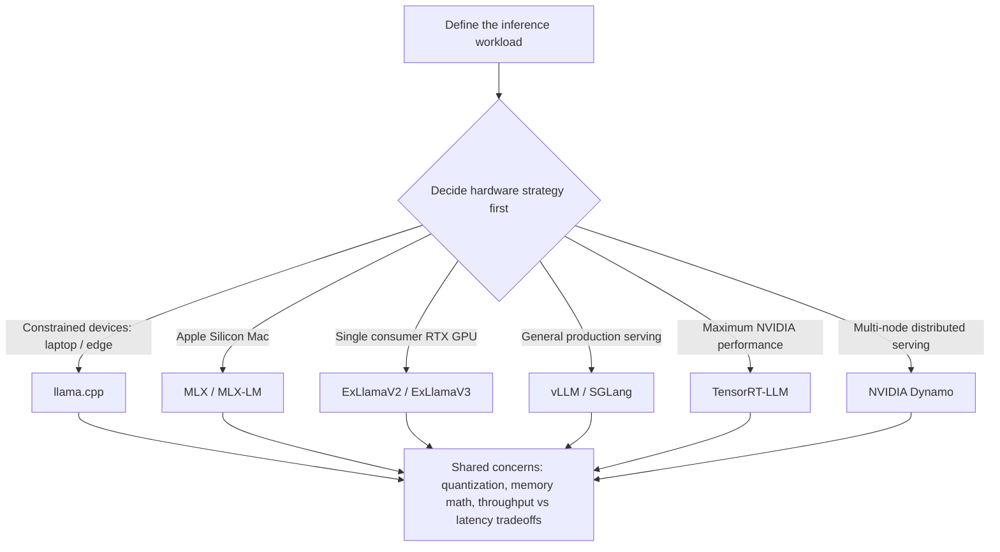

The first question anyone hits when starting with local LLM inference is "which engine should I use?" Names like llama.cpp, vLLM, SGLang, and TensorRT-LLM pour in, but there is little clear guidance on what to base the choice on. Ahmad Osman (@TheAhmadOsman), the GPU moderator of r/LocalLLaMA, recently published a free comprehensive guide that fills this gap.

At ThakiCloud, we handle model serving on a K8s-based AI/ML SaaS platform. Here is what the guide's core message means for GPU cloud and on-premise AI providers like us.

## What This Guide Is

Ahmad Osman's guide is not a simple install tutorial. It is a kind of reference book that organizes local LLM inference from start to finish. Its core message is clear. You do not pick the inference engine first; you decide the hardware strategy first, and the right engine follows.

This perspective matters because picking the engine first leads you to ignore the constraints of the hardware you actually own. The model you can run on a single laptop and the model you can run on a four-GPU server are simply different choices from the start. The guide accepts this and splits the discussion across multiple execution environments: constrained devices like laptops and edge, Mac-centric workflows, a single RTX GPU, two to four or more NVIDIA CUDA multi-GPU setups, general production serving, long-context and MoE routing, maximum NVIDIA performance extraction, and finally cluster orchestration. For each scenario, it points to which tools fit.

The diagram below organizes the guide's core logic as a mapping between hardware scenarios and inference engines.

The engines differ by scenario, but the practical concerns of quantization, memory math, and the balance between throughput and latency hit you the same way regardless of the path you take. The fact that the guide explains these shared concerns adds to its value as a reference.

## The Inference Engine Landscape

On the software side, the guide covers nearly all the major stacks in today's local inference ecosystem. Each engine is good at something different.

- **llama.cpp**: Its strength is versatility, running on both CPU and GPU when VRAM is tight and RAM is ample. It is the lowest-barrier starting point.
- **MLX and MLX-LM**: Stacks optimized for Apple Silicon. They fit users who want to run inference on a MacBook or Mac Studio using unified memory.
- **ExLlamaV2 and ExLlamaV3**: They aim for fast quantized inference on consumer-grade GPUs, fitting cases where you want maximum speed from a single RTX card.
- **vLLM and SGLang**: The de facto standard for production serving. PagedAttention and continuous batching push up multi-request throughput.
- **TensorRT-LLM**: An engine that extracts extreme performance from NVIDIA hardware. Kernel-level optimization lowers latency, but build and operations difficulty is higher.
- **NVIDIA Dynamo**: Targets distributed serving across multiple nodes, used when you distribute inference beyond a single server.

One thing becomes clear from this list. There is no such thing as "the best inference engine." llama.cpp may be the right answer on a constrained device, while vLLM or TensorRT-LLM may be the right answer for a service taking thousands of concurrent requests. The criterion is not the superiority of the engine but the combination of workload and hardware.

## Why Local Inference Now

The reasons interest in local inference is rising are clear. The guide and community discussions commonly cite four motivations.

First, data sovereignty and privacy. The demand to process sensitive data in-house rather than sending it to external APIs is especially strong in healthcare, finance, and the public sector. Second, cost structure. Moving away from per-token billing to fixed hardware costs flips the economics in favor of high-usage organizations. Third, latency. Local inference that does not cross the network can reduce response latency. Fourth, control. Holding the model and infrastructure directly lets you tune version, quantization, and routing to your organization's needs.

As the center of gravity shifts from total reliance on cloud APIs toward on-prem and edge, the demand for material that lets you compare which engine to put on which hardware at a glance keeps growing. This is the backdrop for the attention Ahmad Osman's guide has drawn.

## Applying This to the ThakiCloud K8s AI/ML SaaS Platform

The local and on-prem LLM serving this guide covers sits at the dead center of ThakiCloud's business. Our positioning as a K8s-based AI/ML SaaS platform, sovereign and on-prem AI, GPU cloud, MSP, and Enterprise AI is precisely the work of solving the problems this material describes.

The guide's core logic, "hardware strategy first and the engine follows," is a frame we can use directly when proposing GPU resources and inference stacks to customers. The spectrum from a single RTX to multi-GPU and cluster orchestration overlaps exactly with the area our Kueue-based workload scheduling and GPU lifecycle management actually cover. Identifying the customer's hardware tier first and matching the right serving configuration to it is what we do every day.

On the opportunity side, if we bundle production serving stacks like vLLM, SGLang, TensorRT-LLM, and NVIDIA Dynamo into managed offerings on K8s, we can absorb the burden of customers selecting and tuning engines themselves. Reading one guide and building an engine by hand is operationally very different from receiving a validated serving stack with an SLA. For enterprises and public-sector customers who want data sovereignty and cost control, such a guide can also serve as evidence for quantitatively presenting the TCO advantage of on-prem inference over cloud APIs.

The real challenge we deal with is growing a single-machine demo into multi-tenant production serving. Cluster orchestration, which the guide places at the end of its scenarios, is exactly that point, and from there it becomes a question of resource isolation, GPU efficiency, and operations automation beyond engine selection.

## Limitations and Counterarguments

That said, we must also look at the threat. Bible-grade free guides like this and the maturity of tools like llama.cpp and MLX lower the barrier to entry, making it easy for customers to go straight to self-hosting. When the inference engine itself is open source and the material organizing how to install it is published for free, simply offering "we will install the engine for you" is no differentiation.

So our differentiation must lie not in the engine itself but in multi-tenant isolation, maximizing GPU efficiency, operations automation, and SLA. We must prove value not by what you run but by how stably we operate it for you. What the guide teaches goes up to "which engine fits which hardware," and "what more you need to serve it stably to many tenants around the clock" is the territory beyond the guide. That territory is where we take responsibility.

One more point worth noting is that the throughput and performance figures the guide presents come from the author's specific hardware environment. In an actual deployment, you must re-measure the tradeoffs of model size, hardware, and throughput against your own workload. The guide is a map, not a guarantee.

## Closing

Ahmad Osman's local LLM inference guide presents a simple but practical frame: "hardware before the engine." By laying out the landscape from llama.cpp to NVIDIA Dynamo at a glance, it becomes a good starting point for anyone beginning local inference. For serving providers like us, this material is both a frame for customer proposals and a reminder of the competitive pressure of self-hosting. For engineers interested in proving value through operations beyond the engine, this is a place where such problems are the daily task.

---

Sources: The comprehensive local LLM inference guide by Ahmad Osman (@TheAhmadOsman, r/LocalLLaMA GPU moderator). Author site [ahmadosman.com](https://ahmadosman.com), original [tweet](https://x.com/hjguyhan/status/2068706994480115949), inference engine comparison reference [2026 local inference engine comparison](https://www.local-llm.net/compare/inference-engines-2026/). Performance figures are based on the author's environment and require re-validation in practice.
