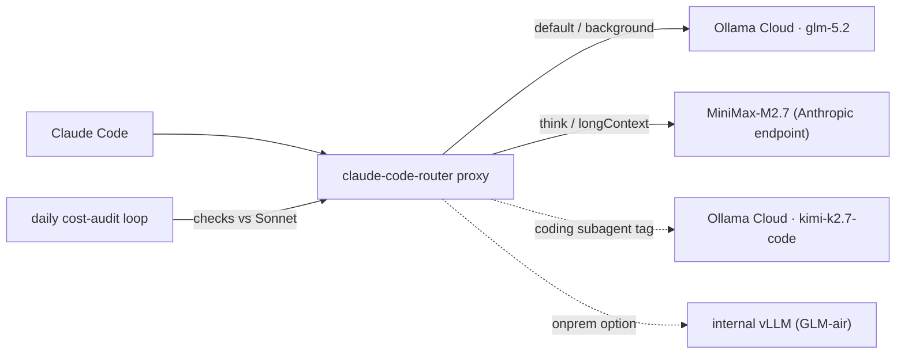

## Overview

Claude Code is a terminal-based agentic coding tool. By default it sends requests to the Anthropic API, but not every request carries the same weight. Background summaries, short completions, long-context analysis, and deep refactoring reasoning all demand different model tiers. Push everything to the most expensive model and cost piles up; push everything to the cheapest and quality collapses.

`claude-code-router` (CCR) solves this with a routing layer. It sits as a proxy between Claude Code and the model backends and forks traffic by request type. This post is not just a concept tour. It is a record of calling three external models to verify behavior, fixing the problems found along the way (a dead API key, thinking-tag leakage), and finally attaching a loop that continuously measures whether the routing is actually cheaper than Anthropic Sonnet.

The governing principle, stated up front: **every model routed through CCR is only worthwhile if it is more cost-efficient than Claude Sonnet.** Otherwise you lower quality while the money still flows. So we don't assert. We measure.

---


*Concept diagram*

## What claude-code-router is

CCR is a proxy that receives Anthropic-format requests, converts them to OpenAI-compatible (or other) formats, and forwards them to the configured provider. It does not modify the Claude Code client. Launch a session with `ccr code` and that session's traffic routes through the `localhost:3456` proxy.

Key features:

- **Per-request-type routing**: `default`, `background`, `think`, `longContext`, `webSearch`, each mapped to a different model.
- **Multi-provider**: any OpenAI-compatible endpoint can be registered. Here we use Ollama Cloud and MiniMax.
- **Transformers**: a converter absorbs each provider's API quirks. The `Anthropic` passthrough transformer for native Anthropic endpoints is the key tool in this post.
- **Dynamic switching**: change models mid-session with `/model provider,model`.

The verified CCR version is `1.0.62`. The config lives at `~/.claude-code-router/config.json`, centered on a `Providers` array and a `Router` object.

---

## What gets routed - fixed to three models

The model pool is exactly three. Adding more models complicates the routing table and inflates verification cost, so we deliberately narrowed it.

| Role | Model | Provider | Note |
|------|-------|----------|------|
| Primary (default/background) | `glm-5.2` | Ollama Cloud | everyday coding, strong and cheap |
| Reasoning (think/longContext) | `MiniMax-M2.7` | MiniMax | thinking separated, very low per-token cost |
| Coding subagent | `kimi-k2.7-code` | Ollama Cloud | hard coding turns only |

`glm-5.2` is the workhorse; only deep reasoning and long context go to MiniMax, and a tough coding turn goes to Kimi.

---

## Verification - we called, we didn't assume

Before writing any config, we called all three models directly. To avoid inventing numbers we inspected real responses, and three facts surfaced.

**First, one Ollama Cloud key covers both GLM and Kimi.** Both `glm-5.2` and `kimi-k2.7-code` returned HTTP 200 from `https://ollama.com/v1`. Ollama Cloud bundles the GLM, Kimi, DeepSeek, and Qwen families behind a single key.

**Second, the standalone Kimi key was dead.** The standalone Moonshot key in `.env` returned 401 (Invalid Authentication) against moonshot.ai, moonshot.cn, and the Anthropic-compatible endpoint alike. Fortunately Kimi K2 is reachable as Ollama Cloud's `kimi-k2.7-code`, so the dead key was not a dead end.

**Third, MiniMax's endpoint choice decides quality.** Called through the OpenAI-compatible endpoint (`/v1/chat/completions`), the model inlines its reasoning as `<think>...</think>` tags in the body, and CCR's conversion layer fails to strip them, so they leak to the user (musistudio/claude-code-router#964). Called through the native Anthropic endpoint (`/anthropic/v1/messages`), the same model returns clean `thinking` and `text` blocks.

That last item was a bug to fix, not a reason to drop MiniMax. The fix is in the config below.

---

## Configuration - secrets out of the repo, config as code

Keys are not hardcoded into the config file. A generator script reads the repo's `.env` and writes `~/.claude-code-router/config.json`. No keys remain in the repo, and rotating a key just means re-running the script.

The core generated config:

```json
{
  "LOG": true,
  "HOST": "127.0.0.1",
  "PORT": 3456,
  "API_TIMEOUT_MS": 1800000,
  "Providers": [
    {
      "name": "ollama",
      "api_base_url": "https://ollama.com/v1/chat/completions",
      "api_key": "<OLLAMA_GLM_API_KEY>",
      "models": ["glm-5.2", "kimi-k2.7-code"],
      "transformer": { "use": [["maxtoken", { "max_tokens": 16000 }]] }
    },
    {
      "name": "minimax",
      "api_base_url": "https://api.minimax.io/anthropic/v1/messages",
      "api_key": "<MINIMAX_API_KEY>",
      "models": ["MiniMax-M2.7"],
      "transformer": { "use": ["Anthropic"] }
    }
  ],
  "Router": {
    "default": "ollama,glm-5.2",
    "background": "ollama,glm-5.2",
    "think": "minimax,MiniMax-M2.7",
    "longContext": "minimax,MiniMax-M2.7",
    "longContextThreshold": 60000,
    "webSearch": "ollama,glm-5.2"
  }
}
```

The two lines in the MiniMax provider are what fix the thinking leak. Point `api_base_url` at the native Anthropic path and use the `Anthropic` passthrough transformer, and MiniMax responds in Anthropic message format (`thinking` + `text` blocks) from the start. Re-checked through the proxy, the response blocks were `["thinking", "text"]` with zero `<think>` leakage.

Reasoning models are slow to emit, so the timeout is generous (`1800000ms`), and `maxtoken` reserves output headroom so models like GLM and Kimi, which emit reasoning first, don't burn the budget before the answer.

Subagents are routed not by config but by a prompt-leading tag. To delegate a hard coding task, prepend `<CCR-SUBAGENT-MODEL>ollama,kimi-k2.7-code</CCR-SUBAGENT-MODEL>` to the prompt.

---

## Where and how to connect

There is a single connection point. Start a session with `ccr code` in your working repo, and that session's main and subagent traffic all route through the proxy per the table above. Native `claude` still connects directly to Anthropic, so it is unaffected.

```bash
# generate config, then start the router
python3 scripts/ccr/gen_ccr_config.py && ccr restart

# start the cost-routed session (this is the connection point)
ccr code

# switch models per task inside the session
/model ollama,kimi-k2.7-code     # hard coding turn
/model minimax,MiniMax-M2.7      # deep reasoning turn
/model ollama,glm-5.2            # everyday coding
```

For cost efficiency, the recommended pattern is hybrid. Run bulk, repetitive, AFK-style work (test generation, mass refactors, log analysis, translation, code exploration) under `ccr code` to cut cost, and keep judgment-heavy work (architecture decisions, subtle debugging) on the native `claude` subscription session. Moving everything to the routed session makes GLM your main loop, which can drop quality on hard tasks.

---

## Cost efficiency - measured against Sonnet, continuously

The reason this setup exists is cost. So instead of claiming "it's cheaper," we measure.

Rates verified on 2026-06-24 (USD per 1M tokens):

| Model | Input | Output | Billing | vs Sonnet |
|-------|-------|--------|---------|-----------|
| Claude Sonnet 4.6 (baseline) | $3.00 | $15.00 | per-token | 1.0x |
| MiniMax-M2.7 | $0.24 | $0.96 | per-token | ~0.07x |
| glm-5.2 / kimi-k2.7-code | - | - | subscription $20/mo (Pro) | usage-dependent |

MiniMax-M2.7 is about 7-8% of Sonnet's per-token rate, so it is always dramatically cheaper. Ollama Cloud, by contrast, is a flat monthly subscription rather than per-token. Its effective rate is `monthly fee / monthly tokens used`, and at low volume the $20 flat fee is actually a loss. Using a blended $9/M, you must push **roughly 2.2M tokens per month** before it beats Sonnet.

That break-even is a measurement target, not a guess. CCR logs record the routed model and input/output tokens per request. A measurement script aggregates these, computing the ratio of actual cost to Sonnet-equivalent cost for per-token models, and projected-monthly Sonnet cost versus the subscription fee for subscription models. Results accumulate in a history file to track the trend, where improvement means the ratio falling over time.

The loop runs once a day via launchd. Claude is not in the loop; only a plain script runs on cron, so the measurement itself costs nothing. If a per-token model is ever found to be more expensive than Sonnet, a Slack alert fires. A subscription model below break-even (under-utilized) is reported but not alerted, to avoid noise during ramp-up.

The action rules are tied to the measurement. If a per-token model's ratio is 1.0 or higher (more expensive than Sonnet), it comes off the routing immediately. If a subscription model stays under-utilized for months, downgrade the plan or move that route to a cheap per-token model. When prices change, updating the pricing-table file is enough to reflect it in the next run.

---

## ThakiCloud platform perspective

This routing model fits naturally with the infrastructure ThakiCloud already runs.

**Code security.** In environments where source code cannot leave the building (finance, public sector, healthcare), you only need to switch `default` in the config above to an internal vLLM endpoint. You keep Claude Code's usability while prompts and code never leave. The external-model setup here is for cost verification; drop in-house GPU serving into the same skeleton and you have the on-premise version.

**Cost control.** Per-task routing is per-cost routing. Send high-frequency, low-difficulty requests to cheap models and reserve top-tier models for hard reasoning, and you narrow expensive usage to where it's truly needed, with the measurement loop proving the effect in numbers.

**Policy as code.** Providers, routing rules, the pricing table, and the measurement criteria are all managed as text files committed to the repo. Only keys live in `.env` and the config is reproduced by a generator, so the same setup restores on any machine.

---

## Limits and counterarguments

A router does not solve everything. Several points deserve a cold look.

- **Quality gap**: routing value depends on backend model quality. Open models do not always match top closed models on complex multi-step refactors or subtle debugging. Hence the hybrid recommendation.
- **Tool-call reliability**: Claude Code leans heavily on tool calls. The OpenAI-compatible conversion layer can wobble tool-call formats, so it is safe for exploration/summary subagents but warrants gradual rollout for edit/implementation subagents.
- **Subscription trap**: Ollama Cloud is flat-rate, so low usage is a loss. Below break-even, Sonnet is simply cheaper. The measurement loop watches exactly this point.
- **Proxy is a single point of failure**: main traffic also passes through CCR, so if the proxy dies the session stalls. The fallback is native `claude`.
- **The "free" framing trap**: some forks tout removing telemetry or safety guards as "free." That is a direction a company cannot endorse. The value we take is not free but control - we decide which request goes to which model, and we measure the cost.

CCR is not a cost-cutting magic trick but a routing control device. Combined with a verified model pool, fixes for real bugs like thinking leakage, and continuous measurement against Sonnet, it becomes a meaningful gain on both security and cost.

---

## Sources

- claude-code-router (musistudio): [https://github.com/musistudio/claude-code-router](https://github.com/musistudio/claude-code-router)
- MiniMax thinking-leak issue: [claude-code-router#964](https://github.com/musistudio/claude-code-router/issues/964)
- MiniMax M2.7 pricing: [openrouter.ai/minimax/minimax-m2.7](https://openrouter.ai/minimax/minimax-m2.7)
- Ollama Cloud pricing: [ollama.com/pricing](https://ollama.com/pricing)
- Claude API pricing: [platform.claude.com/docs pricing](https://platform.claude.com/docs/en/about-claude/pricing)
