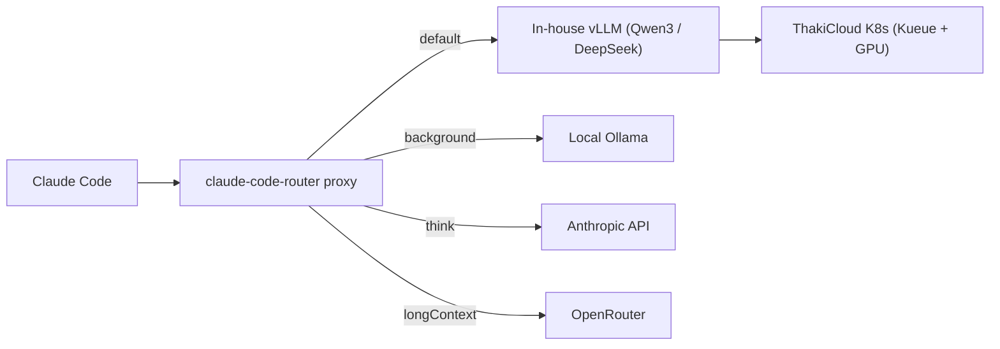

## Overview

Claude Code is an agentic coding tool that runs in the terminal. By default it sends every request to Anthropic's API, but not all requests carry the same weight. Background summarization, short autocompletion, long-context analysis, and deep-reasoning refactoring each call for a different model tier. Sending every request through the most expensive model causes costs to spiral; sending everything through a cheap model destroys quality.

`claude-code-router` (CCR) solves this with a routing layer. It places a proxy between Claude Code and its model backends, splitting traffic across different providers and models based on request type. The tool recently circulated on social media under the inflammatory framing of "how to use Claude Code free forever," but this post strips away the hype and focuses on the real value: model routing and self-hosting.

From ThakiCloud's perspective, the appeal of CCR is straightforward. We queue GPUs with Kueue on Kubernetes and serve open models with vLLM. CCR lets us direct Claude Code requests to internal vLLM endpoints, which aligns precisely with the security requirement of running developer-productivity tooling without shipping source code outside the organization.

---

## What claude-code-router Does

CCR is a proxy server that receives requests in Anthropic message format, optionally converts them to OpenAI-compatible format or another target format, and forwards them to a configured provider. It does not modify the Claude Code client itself. You point Claude Code at CCR via environment variables, and CCR takes over all routing from there.

Core capabilities:

- **Model routing**: Assigns different models to request types, `default`, `background`, `think`, `longContext`, `webSearch`, `image`, and others.
- **Multi-provider support**: Registers multiple backends simultaneously, OpenRouter, DeepSeek, Ollama, Gemini, Volcengine, SiliconFlow, and more.
- **Request/response transformers**: Each provider has its own API spec; transformers absorb the differences. Built-in transformers include `openrouter`, `deepseek`, `gemini`, and `tooluse`.
- **Dynamic model switching**: Change the active model on the fly inside Claude Code with `/model`.
- **CLI model management**: Manage models and providers from the terminal with `ccr model`.
- **Presets and plugins**: Export configurations as presets, install them from a marketplace, and extend functionality with custom transformers.

The diagram above illustrates the routing flow for a ThakiCloud environment. Routine coding (`default`) goes to Qwen3 or DeepSeek served by the internal vLLM cluster; lightweight background tasks go to a local Ollama instance; deep-reasoning tasks go to the Anthropic API only when necessary; long-context requests go through OpenRouter. This aligns request nature with model cost.

---

## Installation and Integration

CCR is distributed as a global npm package. The actual installation command and output:

```bash
npm install -g @musistudio/claude-code-router
```

Version check after installation:

```bash
$ ccr version
claude-code-router version: 2.0.0
```

Available commands are listed with `ccr -h`. A portion of the actual output:

```text
Usage: ccr [command] [preset-name]

Commands:
  start         Start server
  stop          Stop server
  restart       Restart server
  status        Show server status
  code          Execute claude command
  model         Interactive model selection and configuration
  preset        Manage presets (export, install, list, delete)
  install       Install preset from GitHub marketplace
  activate      Output environment variables for shell integration
  ui            Open the web UI in browser
  -v, version   Show version information
```

The configuration file lives at `~/.claude-code-router/config.json`. The key sections are the `Providers` array and the `Router` object. Below is an example configuration that registers both ThakiCloud's internal vLLM and a local Ollama instance:

```json
{
  "LOG": true,
  "API_TIMEOUT_MS": 600000,
  "Providers": [
    {
      "name": "thaki-vllm",
      "api_base_url": "http://vllm.internal.thaki:8000/v1/chat/completions",
      "api_key": "internal",
      "models": ["Qwen3-32B", "deepseek-v3"]
    },
    {
      "name": "ollama",
      "api_base_url": "http://localhost:11434/v1/chat/completions",
      "api_key": "ollama",
      "models": ["qwen2.5-coder:latest"]
    }
  ],
  "Router": {
    "default": "thaki-vllm,Qwen3-32B",
    "background": "ollama,qwen2.5-coder:latest",
    "longContext": "thaki-vllm,deepseek-v3"
  }
}
```

Starting the server and routing Claude Code through CCR:

```bash
ccr start            # Start the router server
ccr code "..."       # Run Claude Code via CCR
# Or apply environment variables globally for the shell
eval "$(ccr activate)"
```

The moment `api_base_url` points to an internal endpoint, that traffic flows to the vLLM instance in our cluster rather than to Anthropic. Code and prompts do not leave the organization.

---

## Verifying Actual Behavior

This post verifies the router through installation and startup. The npm global install completed in under a second; the version is 2.0.0; and the CLI exposes exactly the commands documented, `start`, `stop`, `code`, `model`, `preset`, `ui`, and others. All output quoted above was captured locally.

That said, live inference round-trips to an internal vLLM endpoint were not measured in this environment. A valid GPU-serving endpoint and API key are required for that, and no latency or throughput figures were invented to fill the gap. Routing quality and tool-call reliability depend heavily on the backend model, so anyone adopting CCR in production must benchmark it against their own workloads directly.

---

## Implications for ThakiCloud's K8s AI/ML SaaS Platform

CCR's routing model fits naturally with the infrastructure ThakiCloud already operates.

**Code security.** In regulated environments, financial services, public sector, healthcare, where source code and internal data cannot leave the organization, CCR lets you bind developer coding-agent traffic to an internal vLLM instance. Keeping the usability of Claude Code while ensuring prompts and code never reach an external API is a concrete differentiator for an on-premises AI platform.

**Cost control.** Per-task routing is per-cost routing. High-frequency but low-complexity tasks, autocompletion and background summarization, go to a small, self-hosted coder model; high-stakes reasoning such as architecture decisions goes to a premium model. GPU queuing through Kueue and vLLM's scaling behavior reduce idle-time costs as well.

**Multi-tenant operational alignment.** CCR's provider and router configuration is managed in text files and presets. Deploying per-tenant presets that bind different teams to different allowed backends enforces different model policies as code, consistent with ThakiCloud's policy-as-code direction.

In summary, CCR is not a product in itself, but when combined with a self-hosted backend it creates a concrete value: a coding agent that never sends code outside the organization. That maps exactly to the on-premises, cost-efficient, self-hosting message ThakiCloud has consistently emphasized.

---

## Limitations and Counterarguments

A routing layer does not solve every problem. Several points deserve honest scrutiny.

- **Quality gap.** The value of routing depends on backend model quality. For complex multi-step refactoring or subtle debugging, open models do not always match top closed models. Where you draw the boundary of what goes where determines the quality of the result.
- **Tool-call reliability.** Claude Code relies heavily on tool calls. Some open models do not consistently follow tool-call formats and require transformer correction; when that breaks, the entire agent loop can fail.
- **Operational overhead.** Providers, transformers, and routing rules are maintenance targets. When a backend API spec changes, the router configuration must follow.
- **The "free" framing trap.** Some variants of CCR emphasize telemetry removal or safety-guard removal as part of a "free" pitch. That direction is not something an organization can endorse from a security or terms-of-service standpoint. What we take from this tool is not free usage but control, the ability to decide which requests go to which models.

CCR is not a cost-elimination magic trick; it is a routing control mechanism. When that control is combined with self-hosted infrastructure, meaningful gains on two axes, security and cost, become achievable.

---

## Sources

- claude-code-router (musistudio): [https://github.com/musistudio/claude-code-router](https://github.com/musistudio/claude-code-router)
- npm package: `@musistudio/claude-code-router` (installation-verified version 2.0.0)
- Original tweet (RT): [https://x.com/hjguyhan/status/2069431792688660982](https://x.com/hjguyhan/status/2069431792688660982)
